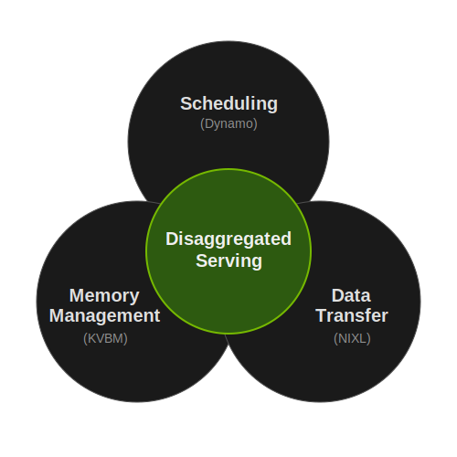

# Introduction

Dynamo is NVIDIA's high-throughput, low-latency inference framework, designed to serve generative AI in distributed environments. This page provides an overview of design principles, performance benefits, and production-grade features of Dynamo.

> [!TIP]
> Looking to get started right away? See the [Quickstart](quickstart.md) to install and run Dynamo in minutes.


## Why Dynamo?

Inference engines optimize the GPU. Dynamo optimizes the system around them.

- **System-level optimization on top of any engine** -- Engines optimize the single-GPU forward pass. Dynamo adds the distributed layer: disaggregated serving, smart routing, KV cache management across memory tiers, and auto-scaling.
- **Composable performance techniques** -- Three techniques (disaggregated serving, KV-aware routing, KV cache offloading) each deliver significant improvements on their own and compound when composed together.
- **Engine-agnostic** -- Works with SGLang, TensorRT-LLM, and vLLM. Swap engines without changing serving infrastructure. Extending to Intel XPU and AMD hardware.
- **Production-ready at scale** -- Full lifecycle beyond serving: automatic configuration (AIConfigurator), runtime auto-scaling (Planner), topology-aware gang scheduling (Grove), fault tolerance, and observability.
- **Modular adoption** -- Start with one component (e.g., just the Router for KV-aware routing on top of your existing engine). Adopt more as needed. Each component is independently installable via pip.

# Design Principles

## Systematic Approach to AI Inference

Dynamo takes a systematic approach to maximizing inference performance. Instead of leveraging only performance optimization from inference engines, Dynamo aims to augment macro system-level optimization to inference engines. To provide such optimizations, Dynamo took the approach from operating systems to lay down foundations for scheduling, memory management, and data transfer. Once these building blocks are in place, Dynamo can readily support any future technology that unlocks performance at the system level.

One of the motivations for creating an operating system for inference was to support disaggregated serving. Disaggregated serving is a simple yet powerful technique to separate prefill and decode phases of LLMs to assign them on different devices. Disaggregated prefill and decode phases can be scaled independently with appropriate parallelism to unlock significant performance gains as LLM deployment scales to multi-node.



To facilitate disaggregated serving, developers need a reliable way to 1) schedule prefill and decode to avoid interference, 2) manage KV cache offloading and onboarding, and 3) transfer KV cache between multiple nodes and across the memory hierarchy with low latency. Dynamo's effort to unlock disaggregated serving led to this system design thinking, and the three foundations will be further leveraged to support the latest innovations such as diffusion, RL, and agents.

## Modular but Well-Integrated Ecosystem

Another key design principle of Dynamo is modularity. Dynamo aims to lessen the burden of replacing an existing stack in production. It offers modular and standalone components as Rust crates and pip wheels. For example, the three foundations of Dynamo for scheduling (Dynamo), memory management (KV Block Manager), and data transfer (NIXL) are independently pip installable:

```bash
pip install ai-dynamo
pip install kvbm
pip install nixl
```

> [!NOTE]
> Pre-built containers with all dependencies are also available. See [Release Artifacts](../reference/release-artifacts.md) for container images.

Additional modular components of Dynamo are the following, and the ecosystem will continue to grow in the future:

| Category | Products | Description |
| :--- | :--- | :--- |
| **Scheduling** | Dynamo | Inference serving for GenAI workloads |
| **Routing** | Router | Smart routing leveraging KV cache hit rate and KV cache load. More algorithms will be added (e.g., agentic routing) |
| **Data Transfer** | NIXL | Point-to-point data transfer between GPUs and tiered storage (G1: GPU, G2: CPU, G3: SSD, G4: remote) |
| **Memory** | KVBM (KV Block Manager) | Manage KV cache across memory tiers (G1-G4) with customizable eviction policy |
| **Scaling / Cloud** | Planner | Automatically tune performance in real time for prefill and decode given SLA constraints (TTFT and TPOT) |
| | Grove | Enables gang scheduling and topology awareness required for Kubernetes multi-node disaggregated serving |
| | [Model Express](https://github.com/ai-dynamo/model-express) | Load model weights fast by caching and transferring them via NIXL to other GPUs. Will also be leveraged for fault tolerance |
| **Perf** | AIConfigurator | Estimate performance for aggregated vs. disaggregated serving based on model, ISL/OSL, HW, etc. Formerly known as LLMPet |
| | [AIPerf](https://github.com/ai-dynamo/aiperf) | Re-architected GenAI-Perf written in Python for maximum extensibility; supports distributed benchmarking |
| | AITune | Given a model or pipeline, searches for best backend to deploy with (e.g., TensorRT, Torch.compile, etc.) (coming soon) |
| | Flex Tensor | Stream weights to GPUs from host memory to run very large language models in GPUs with limited memory capacity (coming soon) |

These components are modular, but they are designed to integrate well together as a unified product family. Any future product components will follow the same design principle.

## Vendor-Agnostic Ecosystem Enablement

The last design principle is vendor agnosticism. Dynamo is ***not designed to vendor lock-in***. Dynamo will always strive to enable the entire AI ecosystem and provide functionalities required from developers even if they require integration with 3rd party components.

From the beginning, Dynamo is designed to support all LLM inference engines (SGLang, TRT-LLM, and vLLM). Support for additional engines is planned to enable more developer use cases.

Non-NVIDIA hardware support is also available. Dynamo partners with HW vendors such as Intel to extend HW support coverage as well as enabling HW support for AMD.

The full list of supported ecosystem components:

| **Product Areas** | **Supported Ecosystem Components** |
| :--- | :--- |
| Inference engines | SGLang, TensorRT-LLM, vLLM |
| Kubernetes | Inference gateway |
| Memory management | Dynamo KV Block Manager, [LMCache](https://docs.nvidia.com/dynamo/dev/integrations/lmcache), [SGLang HiCache](https://docs.nvidia.com/dynamo/dev/integrations/sglang-hicache), [FlexKV](https://docs.nvidia.com/dynamo/dev/integrations/flexkv) |
| Networking and storage | Mooncake, DOCA NetIO, GDS, POSIX, S3, 3FS ([supported via NIXL](https://docs.nvidia.com/dynamo/dev/design-docs/component-design/kvbm-design)) |
| Multi-HW | Intel XPU, AMD |

# Performance

Currently for LLMs, Dynamo offers composability of three powerful techniques: disaggregated serving, KV cache aware routing, and KV cache offloading. NIXL provides the low-latency data transfer layer that enables KV cache movement between nodes for disaggregated serving at scale.

[KV cache aware routing](../design-docs/router-design.md) leverages KV cache hit rate and KV load of workers to smartly route the request for best performance. Because KV cache aware routing leverages KV cache already present in a worker, it saves computing KV cache from prefill and can start decoding for a request right away. This usually results in acceleration of Time To First Token (TTFT) but can also have benefits in end-to-end latency and sometimes throughput. For example, when serving Qwen3 Coder 480B A35B, applying Dynamo's KV cache aware routing yielded 2x faster TTFT and 1.6x throughput for [Baseten](https://www.baseten.co/blog/how-baseten-achieved-2x-faster-inference-with-nvidia-dynamo/#how-baseten-uses-nvidia-dynamo).

[KV cache offloading](../design-docs/kvbm-design.md) can expedite TTFT, reduce Total Cost of Ownership (TCO), and allows for longer context processing. By offloading KV cache from HBM to host memory then further down to local disk and remote storage, developers can expand the amount of KV cache stored and reuse precomputed KV cache for faster decoding. Developers have an option to leverage cheaper storage instead of using expensive GPU for LLM inference, resulting in TCO savings.

In the Design Principles section, we introduced the concept of disaggregated serving, and its performance has been showcased by [InferenceX](https://newsletter.semianalysis.com/p/inferencex-v2-nvidia-blackwell-vs). DeepSeek V3 can be served with ~7x throughput/GPU, applying disaggregated serving and large-scale expert parallelism.

Furthermore, when these three techniques are composed together, they yield compounding benefits as shown in the following diagram.


- **Disaggregated serving + KV cache aware routing** -- KV cache aware routing can load balance for compute on prefill and memory on decode, which can lead to optimizing for latency and throughput simultaneously.
- **Disaggregated serving + KV cache offloading** -- KV cache offloading results in faster TTFT as mentioned, and prefill workers can be reduced to save TCO.
- **KV cache aware routing + KV cache offloading** -- Offloading KV cache to memory with larger capacity yields higher KV cache hit rate which can be leveraged by KV cache aware routing to expedite TTFT.

> [!TIP]
> Ready to try these techniques? See [Dynamo recipes](https://github.com/ai-dynamo/dynamo/tree/main/recipes) for step-by-step deployment examples that compose disaggregated serving, routing, and offloading.

# From Configuration to Production-Grade Deployment


## Finding Best Configurations Under 30 Seconds with AIConfigurator

In addition to the strong performance benefits, Dynamo strives to ease the pain of configuration to production. Finding best-performing prefill and decode parallelism configuration for disaggregated serving will take days when determined by sweeping configs on the target GPU. This problem is intensified as the deployment scales.

Dynamo offers [AIConfigurator](https://github.com/ai-dynamo/aiconfigurator/), which can provide the best disaggregated serving configurations in less than 30 seconds and show the projected performance benefit compared to aggregated serving. Dynamo now uses AIConfigurator in its Kubernetes Custom Resource Definition (CRD), Dynamo Graph Deployment Request (DGDR), to allow users to select best deployment options leveraging automatically generated configs via AIConfigurator.

## Auto-Adjusting Deployment Based on SLA with Planner

Once the offline configuration is found with AIConfigurator or DGDR, developers can deploy their desired model into production. However, the production traffic can vary greatly online, and static configuration determined offline will not be able to adequately handle spikes in traffic.

Dynamo offers [Planner](../design-docs/planner-design.md) to circumvent this problem. Developers can simply set their SLA in terms of TTFT and Time Per Output Token (TPOT). Planner examines online traffic and automatically makes decisions to scale prefill and decode workers to effectively deal with traffic spikes while maintaining the specified SLA.

Recently, Planner was expanded to deal with even more sophisticated scenarios such as drastically varying Input Sequence Length (ISL) given the same SLA. See the [Planner documentation](../components/planner/planner-guide.md) for more details.

## Applying Topology-Aware Hierarchical Gang Scheduling with Grove

When Planner decides to autoscale, developers need a way to effectively scale workers independently and hierarchically. Especially for prefill/decode disaggregation, prefill and decode workers need to be scaled independently to meet the specified SLA, and they need to be scheduled in physical proximity to each other for best performance.

Dynamo offers [Grove](https://github.com/ai-dynamo/grove) which is a Kubernetes operator that provides a single declarative API for orchestrating any AI inference workload from simple single-pod deployments to complex multi-node, disaggregated systems.

Grove enables:

- Hierarchical gang scheduling
- Topology-aware placement
- Multi-level horizontal autoscaling
- Explicit startup ordering
- Rolling updates with configurable replacement strategies

These features are crucial for deploying and scaling inference at data center scale for optimal performance.

## Ensuring Fault Tolerance for LLMs

Kubernetes comes with some fault tolerance functionalities, but LLM deployment requires specialized fault tolerance and resiliency. Dynamo provides comprehensive fault tolerance mechanisms across multiple layers to ensure reliable LLM inference in production deployments:

- **Router and Frontend** -- Dynamo supports launching multiple frontend + router replicas for improved fault tolerance by sharing router states.
- **Request Migration** -- When a worker fails during request processing, Dynamo can migrate in-progress requests to healthy workers while preserving partial generation state and maintaining seamless token flow to clients.
- **Request Cancellation** -- Dynamo supports canceling in-flight requests through the AsyncEngineContext trait, which provides graceful stop signals and hierarchical cancellation propagation through request chains.
- **Request Rejection (Load Shedding)** -- When workers are overloaded, Dynamo rejects new requests with HTTP 503 responses based on configurable thresholds for KV cache utilization and prefill tokens.

## Observability

Dynamo provides built-in metrics, distributed tracing, and logging for monitoring inference deployments. See the [Observability Guide](../observability/README.md) for setup details.

# What's Next?

Explore the following resources to go deeper:

- [Recipes](https://github.com/ai-dynamo/dynamo/tree/main/recipes) -- Compose disaggregated serving, routing, and offloading
- [KV Cache Aware Routing](../components/router/router-guide.md) -- Configure smart request routing
- [KV Cache Offloading](../components/kvbm/kvbm-guide.md) -- Set up multi-tier memory management
- [Planner](../components/planner/planner-guide.md) -- Configure SLA-based autoscaling
- [Kubernetes Deployment](../kubernetes/README.md) -- Deploy at scale with Grove
- [Overall Architecture](../design-docs/architecture.md) -- Full technical design
- [Support Matrix](../reference/support-matrix.md) -- Check hardware and engine compatibility
