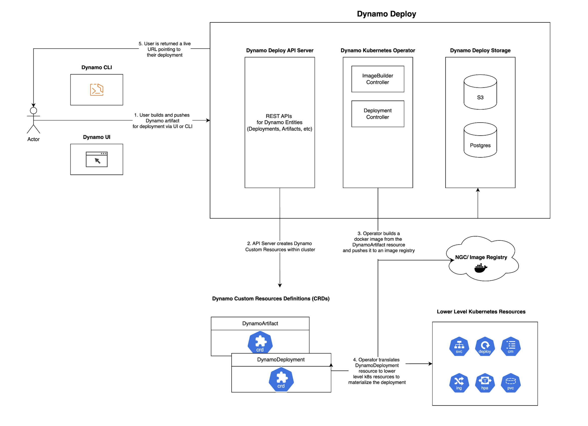

<!--
SPDX-FileCopyrightText: Copyright (c) 2025 NVIDIA CORPORATION & AFFILIATES. All rights reserved.
SPDX-License-Identifier: Apache-2.0

Licensed under the Apache License, Version 2.0 (the "License");
you may not use this file except in compliance with the License.
You may obtain a copy of the License at

http://www.apache.org/licenses/LICENSE-2.0

Unless required by applicable law or agreed to in writing, software
distributed under the License is distributed on an "AS IS" BASIS,
WITHOUT WARRANTIES OR CONDITIONS OF ANY KIND, either express or implied.
See the License for the specific language governing permissions and
limitations under the License.
-->

# Dynamo Cloud Kubernetes Platform (Dynamo Deploy)

The Dynamo Cloud platform is a comprehensive solution for deploying and managing Dynamo inference graphs (also referred to as pipelines) in Kubernetes environments. It provides a streamlined experience for deploying, scaling, and monitoring your inference services. You can interface with Dynamo Cloud using the `deploy` subcommand available in the Dynamo CLI (for example, `dynamo deploy`)

## Overview

The Dynamo cloud platform consists of several key components:

- **Dynamo Operator**: A Kubernetes operator that manages the lifecycle of Dynamo inference graphs from build ➡️ deploy. For more information on the operator, see [Dynamo Kubernetes Operator Documentation](../dynamo_deploy/dynamo_operator.md)
- **API Store**: Stores and manages service configurations and metadata related to Dynamo deployments. Needs to be exposed externally.
- **Custom Resources**: Kubernetes custom resources for defining and managing Dynamo services

These components work together to provide a seamless deployment experience, handling everything from containerization to scaling and monitoring.



## Prerequisites

Before getting started with the Dynamo cloud platform, ensure you have:

- A Kubernetes cluster (version 1.24 or later)
- [Earthly](https://earthly.dev/) installed for building components
- Docker installed and running
- Access to a container registry (e.g., Docker Hub, NVIDIA NGC, etc.)
- `kubectl` configured to access your cluster
- Helm installed (version 3.0 or later)

```{tip}
Don't have a Kubernetes cluster? Check out our [Minikube setup guide](./minikube.md) to set up a local environment!
```

## Building Docker Images for Dynamo Cloud Components

The Dynamo cloud platform components need to be built and pushed to a container registry before deployment. You can build these components individually or all at once.

### Setting Up Environment Variables

First, set the required environment variables for building and pushing images:

```bash
# Set your container registry
export DOCKER_SERVER=<CONTAINER_REGISTRY>
# Set the image tag (e.g., latest, 0.0.1, etc.)
export IMAGE_TAG=<TAG>
```

Where:
- `<CONTAINER_REGISTRY>`: Your container registry (e.g., `nvcr.io`, `docker.io/<your-username>`, etc.)
- `<TAG>`: The version tag for your images (e.g., `latest`, `0.0.1`, `v1.0.0`)

```{important}
Make sure you're logged in to your container registry before pushing images:
```bash
docker login <CONTAINER_REGISTRY>
```

### Building Components

You can build and push all platform components at once:

```bash
earthly --push +all-docker --DOCKER_SERVER=$DOCKER_SERVER --IMAGE_TAG=$IMAGE_TAG
```

## Deploying the Dynamo Cloud Platform

Once you've built and pushed the components, you can deploy the platform to your Kubernetes cluster.

### Prerequisites

Before deploying Dynamo Cloud, ensure your Kubernetes cluster meets the following requirements:

#### PVC Support with Default Storage Class
Dynamo Cloud requires Persistent Volume Claim (PVC) support with a default storage class. Verify your cluster configuration:

```bash
# Check if default storage class exists
kubectl get storageclass

# Expected output should show at least one storage class marked as (default)
# Example:
# NAME                 PROVISIONER             RECLAIMPOLICY   VOLUMEBINDINGMODE      ALLOWVOLUMEEXPANSION   AGE
# standard (default)   kubernetes.io/gce-pd    Delete          Immediate              true                   1d
```

### Cloud Provider-Specific deployment

#### Google Kubernetes Engine (GKE) deployment

You can find detailed instructions for deployment in GKE [here](../dynamo_deploy/gke_setup.md)

### Installation

1. Set the required environment variables:
```bash
export DOCKER_USERNAME=<your-docker-username>
export DOCKER_PASSWORD=<your-docker-password>
export DOCKER_SERVER=<your-docker-server>
export IMAGE_TAG=<TAG>  # Use the same tag you used when building the images
export NAMESPACE=dynamo-cloud    # change this to whatever you want!
```

``` {note}
DOCKER_USERNAME and DOCKER_PASSWORD are optional and only needed if you want to pull docker images from a private registry.
A docker image pull secret is created automatically if these variables are set. Its name is `docker-imagepullsecret` unless overridden by the `DOCKER_SECRET_NAME` environment variable.
```

The Dynamo Cloud Platform auto-generates docker images for pipelines and pushes them to a container registry.
By default, the platform uses the same container registry as the platform components (specified by `DOCKER_SERVER`).
However, you can specify a different container registry for pipelines by additionally setting the following environment variables:

```bash
export PIPELINES_DOCKER_SERVER=<your-docker-server>
export PIPELINES_DOCKER_USERNAME=<your-docker-username>
export PIPELINES_DOCKER_PASSWORD=<your-docker-password>
```

If you wish to expose your Dynamo Cloud Platform externally, you can setup the following environment variables:

```bash
# if using ingress
export INGRESS_ENABLED="true"
export INGRESS_CLASS="nginx" # or whatever ingress class you have configured

# if using istio
export ISTIO_ENABLED="true"
export ISTIO_GATEWAY="istio-system/istio-ingressgateway" # or whatever istio gateway you have configured
```

Running the installation script with `--interactive` guides you through the process of exposing your Dynamo Cloud Platform externally if you don't want to set these environment variables manually.

2. [One-time Action] Create a new kubernetes namespace and set it as your default.

```bash
cd deploy/cloud/helm
kubectl create namespace $NAMESPACE
kubectl config set-context --current --namespace=$NAMESPACE
```

3. Deploy the Helm charts (install CRDs first, then platform) using the deployment script:

```bash
./deploy.sh --crds
```

if you want guidance during the process, run the deployment script with the `--interactive` flag:

```bash
./deploy.sh --crds --interactive
```

omitting `--crds` will skip the CRDs installation/upgrade. This is useful when installing on a shared cluster as CRDs are cluster-scoped resources.

4. **Expose Dynamo Cloud Externally**

``` {note}
The script automatically displays information about the endpoint that you can use to access Dynamo Cloud. We refer to this externally available endpoint as `DYNAMO_CLOUD`.
```

The simplest way to expose the `dynamo-store` service within the namespace externally is to use a port-forward:

```bash
kubectl port-forward svc/dynamo-store <local-port>:80 -n $NAMESPACE
export DYNAMO_CLOUD=http://localhost:<local-port>
```

## Next Steps

After deploying the Dynamo cloud platform, you can:

1. Deploy your first inference graph using the [Dynamo CLI](operator_deployment.md)
2. Deploy Dynamo LLM pipelines to Kubernetes using the [Dynamo CLI](../../examples/llm_deployment.md)
3. Manage your deployments using the Dynamo CLI

For more detailed information about deploying inference graphs, see the [Dynamo Deploy Guide](README.md).
