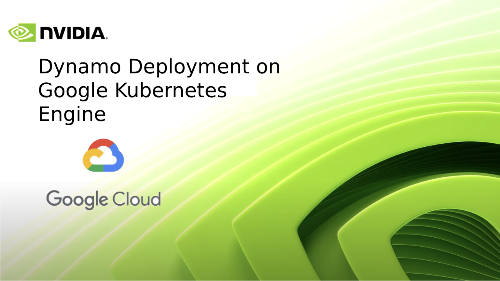

<!--
SPDX-FileCopyrightText: Copyright (c) 2025 NVIDIA CORPORATION & AFFILIATES. All rights reserved.
SPDX-License-Identifier: Apache-2.0

Licensed under the Apache License, Version 2.0 (the "License");
you may not use this file except in compliance with the License.
You may obtain a copy of the License at

http://www.apache.org/licenses/LICENSE-2.0

Unless required by applicable law or agreed to in writing, software
distributed under the License is distributed on an "AS IS" BASIS,
WITHOUT WARRANTIES OR CONDITIONS OF ANY KIND, either express or implied.
See the License for the specific language governing permissions and
limitations under the License.
-->

# Deploying Dynamo on Google Kubernetes Engine (GKE)

[Link to walkthrough video](https://youtu.be/Pym5VHIPWaI)



## 1. Prerequisites
Before you begin, ensure that you have the following:

* A Google Cloud account with billing enabled.
* `gcloud` CLI
* A Docker Hub account (or compatible registry).
* Local tooling:
  * Docker Desktop
  * Earthly
  * Helm

### Install local tooling on macOS
```bash
brew install --cask docker        # Docker Desktop
brew install earthly              # Earthly build tool
brew install helm                 # Helm package manager
```

---

## 2. Set up a Google Cloud project
Create and activate a new project for the deployment.
```bash
# Create a new project named "Dynamo Cloud"
gcloud projects create dynamo-gke --name="Dynamo Cloud"

# Set the newly-created project as the active context
gcloud config set project dynamo-gke
```

---

## 3. Provision a GKE cluster
Dynamo requires at least **3 vCPU** and **8 GiB RAM** per node because BuildKit is CPU / memory intensive.
```bash
# Create a 2-node e2-standard-4 cluster with auto-scaling enabled
# Adjust the zone to your preference.
gcloud container clusters create dynamo-cluster \
  --zone us-central1-a \
  --machine-type e2-standard-4 \
  --num-nodes 2 \
  --enable-autoscaling --min-nodes 2 --max-nodes 4 \
  --disk-type pd-standard --disk-size 50GB \
  --image-type COS_CONTAINERD \
  --enable-ip-alias --enable-network-policy \
  --no-enable-basic-auth --no-enable-legacy-authorization
```

Fetch cluster credentials so that `kubectl` talks to the right cluster:
```bash
gcloud container clusters get-credentials dynamo-cluster --zone us-central1-a --project dynamo-gke
kubectl get nodes   # quick verification
```

---

## 4. Build & push Docker images
Authenticate to Docker Hub and push all images using Earthly.
```bash
docker login docker.io

export DOCKER_SERVER=docker.io/<your-username>
export IMAGE_TAG=latest

# Run from the repository root (where the Earthfile lives)
earthly --push +all-docker \
  --DOCKER_SERVER=$DOCKER_SERVER \
  --IMAGE_TAG=$IMAGE_TAG
```

---

## 5. Prepare Kubernetes namespace & values
```bash
export DOCKER_USERNAME=<your-username>
export DOCKER_SERVER=docker.io/<your-username>
export IMAGE_TAG=latest
export NAMESPACE=dynamo-cloud

# Switch to the helm chart directory
cd deploy/cloud/helm

# Create and target the namespace
kubectl create namespace $NAMESPACE
kubectl config set-context --current --namespace=$NAMESPACE
```

---

## 6. Deploy Dynamo via Helm
Run the bundled deployment script which wires up all services, deployments, and CRDs.
```bash
./deploy
```

You can track progress with:
```bash
kubectl get pods -w
```

---

## 7. (Optional) Install an NGINX Ingress controller
If you need external HTTP(S) access to Dynamo services, install the community NGINX controller in its own namespace.
```bash
kubectl create namespace ingress-nginx

helm repo add ingress-nginx https://kubernetes.github.io/ingress-nginx
helm repo update

helm install ingress-nginx ingress-nginx/ingress-nginx \
  --namespace ingress-nginx \
  --set controller.publishService.enabled=true
```

> ⚠️  Helm 3.18.0 has a known issue with the NGINX chart. Stick to **v3.17.3** (or newer once patched) if you encounter errors.

---

## 8. Troubleshooting
* **`dynamo-cloud-dynamo-operator-buildkitd-0` stuck in `Pending`** – Scale your nodes up (≥ 8 vCPU / 30 GiB) or increase the cluster size.
* **Helm install fails on `ingress-nginx`** – Downgrade to Helm 3.17.3 as noted above.

---

## 9. Next steps
After deploying the Dynamo cloud platform, you can:

1. Deploy your first inference graph using the [Dynamo CLI](operator_deployment.md)
2. Deploy Dynamo LLM pipelines to Kubernetes using the [Dynamo CLI](../../examples/llm_deployment.md)!
3. Manage your deployments using the Dynamo CLI
