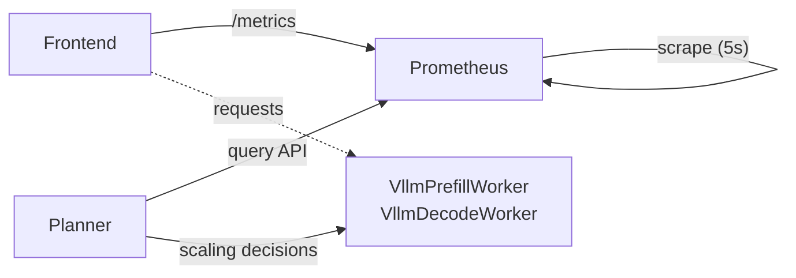

# SLA Planner Deployment Guide

Quick deployment guide for the vLLM disaggregated planner with automatic scaling.

## Architecture Overview

**Components:**
- **Frontend**: Serves requests and exposes `/metrics`
- **Prometheus**: Scrapes frontend metrics every 5 seconds
- **Planner**: Queries Prometheus and adjusts worker scaling every 60 seconds
- **Workers**: VllmDecodeWorker and VllmPrefillWorker handle inference



## Prerequisites
- Kubernetes cluster with GPU nodes
- `hf-token-secret` created in target namespace

```bash
export NAMESPACE=your-namespace
```

## 1. Deploy the System

```bash
# Apply the disaggregated planner deployment
kubectl apply -f components/backends/vllm/deploy/disagg_planner.yaml -n $NAMESPACE

# Check deployment status
kubectl get pods -n $NAMESPACE
```

Expected pods (all should be `1/1 Running`):
```
vllm-disagg-planner-frontend-*        1/1 Running
vllm-disagg-planner-prometheus-*      1/1 Running
vllm-disagg-planner-planner-*         1/1 Running
vllm-disagg-planner-vllmdecodeworker-*    1/1 Running
vllm-disagg-planner-vllmprefillworker-*   1/1 Running
```

## 2. Apply Prometheus Port Fix (Required)

Due to a current operator limitation, manually patch the Prometheus deployment:

```bash
# Fix container port
kubectl patch deployment vllm-disagg-planner-prometheus -n $NAMESPACE \
  --type='json' -p='[{"op": "replace", "path": "/spec/template/spec/containers/0/ports/0/containerPort", "value": 9090}]'

# Fix environment variable
kubectl patch deployment vllm-disagg-planner-prometheus -n $NAMESPACE \
  --type='json' -p='[{"op": "replace", "path": "/spec/template/spec/containers/0/env/0/value", "value": "9090"}]'

# Fix port name
kubectl patch deployment vllm-disagg-planner-prometheus -n $NAMESPACE \
  --type='json' -p='[{"op": "replace", "path": "/spec/template/spec/containers/0/ports/0/name", "value": "prometheus"}]'

# Wait for rollout
kubectl rollout status deployment/vllm-disagg-planner-prometheus -n $NAMESPACE
```

## 3. Test the System

```bash
# Port forward to frontend
kubectl port-forward -n $NAMESPACE deployment/vllm-disagg-planner-frontend 8000:8000

# Send a streaming request (required for full metrics)
curl http://localhost:8000/v1/chat/completions \
  -H "Content-Type: application/json" \
  -d '{
    "model": "Qwen/Qwen3-0.6B",
    "messages": [
    {
        "role": "user",
        "content": "In the heart of Eldoria, an ancient land of boundless magic and mysterious creatures, lies the long-forgotten city of Aeloria. Once a beacon of knowledge and power, Aeloria was buried beneath the shifting sands of time, lost to the world for centuries. You are an intrepid explorer, known for your unparalleled curiosity and courage, who has stumbled upon an ancient map hinting at ests that Aeloria holds a secret so profound that it has the potential to reshape the very fabric of reality. Your journey will take you through treacherous deserts, enchanted forests, and across perilous mountain ranges. Your Task: Character Background: Develop a detailed background for your character. Describe their motivations for seeking out Aeloria, their skills and weaknesses, and any personal connections to the ancient city or its legends. Are they driven by a quest for knowledge, a search for lost familt clue is hidden."
    }
    ],
    "stream":true,
    "max_tokens": 30
  }' | jq
```

## 4. Monitor Scaling

```bash
# Check planner logs for scaling decisions
kubectl logs -n $NAMESPACE deployment/vllm-disagg-planner-planner --tail=10

# Expected successful output:
# "Number of prefill workers: 1, number of decode workers: 1"
# "Observed ttft: X.XXXs itl: X.XXXs" (after streaming requests)
```

## 5. Key Notes

### Metrics Requirements
- **Basic metrics** (request count): Available with any request type
- **Latency metrics** (TTFT/ITL): Only available with `"stream": true` requests
- **Scaling decisions**: Require sufficient request volume and streaming requests

### Current Status
✅ **Working**: All core functionality, worker discovery, Prometheus connectivity
🔧 **Manual Fix Required**: Prometheus port configuration (until operator fix)
📊 **Expected**: Some warnings until metrics accumulate from streaming requests

## 6. Troubleshooting

**Connection Issues:**
```bash
# Verify Prometheus is listening on 9090
kubectl exec -n $NAMESPACE deployment/vllm-disagg-planner-prometheus -- netstat -tlnp | grep 9090

# Test Prometheus API
kubectl port-forward -n $NAMESPACE deployment/vllm-disagg-planner-prometheus 9090:9090
curl "http://localhost:9090/api/v1/query?query=up"
```

**Missing Metrics:**
```bash
# Check frontend metrics
kubectl port-forward -n $NAMESPACE deployment/vllm-disagg-planner-frontend 8000:8000
curl http://localhost:8000/metrics | grep nv_llm_http_service
```

**Worker Issues:**
- Large models can take 10+ minutes to initialize
- Check worker logs: `kubectl logs -n $NAMESPACE deployment/vllm-disagg-planner-vllmdecodeworker`
