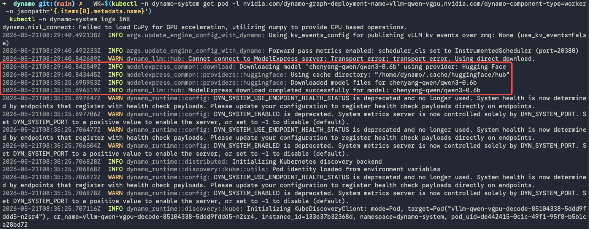
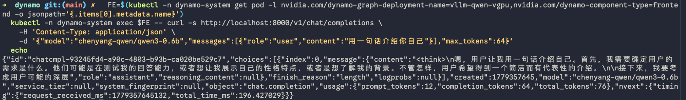
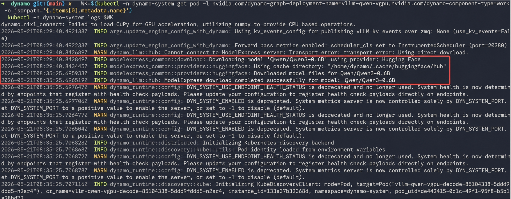

## Introduction

MatrixHub is a model registry that can make model weights available inside your network. Pointing the Hugging Face client at an in-cluster MatrixHub endpoint lets Dynamo download a pre-cached model without retrieving the weights from the public Hugging Face service.

This guide deploys an OpenAI-compatible Dynamo service for `Qwen/Qwen3-0.6B` on Kubernetes. It also describes an optional comparison against a public Hugging Face download.

> [!NOTE]
> **Scope of the timing results**
>
> The times in this guide were measured for one environment, model, and warm container-image cache. They measure the initial model-weight download only; they are not a general performance benchmark for MatrixHub or Dynamo.

<!-- truncate -->

## Prerequisites

Before you begin, make sure that the following are available:

- A Kubernetes cluster with the Dynamo Operator installed.
- A GPU node. This example uses one NVIDIA A800 80 GB GPU partitioned by [HAMi](https://github.com/Project-HAMi/HAMi) into vGPUs.
- An in-cluster MatrixHub registry reachable at `http://matrixhub.example.com:30001`.
- The `Qwen/Qwen3-0.6B` repository pre-cached in MatrixHub.
- Network access from the GPU node to `nvcr.io` and to the MatrixHub endpoint.
- A machine with `kubectl` and a kubeconfig for the cluster.

The vGPU resource names in the manifest below are specific to the HAMi installation used for this example. Adjust them for your GPU scheduler and capacity.

To cache the model in MatrixHub, run the following command from a host that can reach MatrixHub:

```bash
HF_ENDPOINT="http://matrixhub.example.com:30001" hf download Qwen/Qwen3-0.6B
```

Replace `http://matrixhub.example.com:30001` with your MatrixHub endpoint.

## Deploy Dynamo with MatrixHub

### Connect to the cluster

Set the kubeconfig in each new terminal, then verify that the cluster is reachable:

```bash
# Replace with the path to your kubeconfig file.
export KUBECONFIG="/path/to/kubeconfig"

kubectl get nodes
```

### Create the deployment manifest

Save the following manifest as `dgd-vllm-vgpu.yaml`. Replace `matrixhub.example.com:30001` and the model name as needed. If you change the model, update both `--model` and `--served-model-name`, and ensure that the repository is available in MatrixHub.

```yaml
apiVersion: nvidia.com/v1alpha1
kind: DynamoGraphDeployment
metadata:
  name: vllm-qwen-vgpu
  namespace: dynamo-system
spec:
  services:
    Frontend:
      componentType: frontend
      replicas: 1
      resources:
        requests:
          cpu: "2"
          memory: "4Gi"
        limits:
          cpu: "2"
          memory: "4Gi"
      extraPodSpec:
        mainContainer:
          image: nvcr.io/nvidia/ai-dynamo/vllm-runtime:1.1.1
          workingDir: /workspace
          env:
            - name: HF_ENDPOINT
              value: http://matrixhub.example.com:30001
          command: ["python3", "-m", "dynamo.frontend"]
          args: ["--http-port", "8000"]

    decode:
      componentType: worker
      subComponentType: decode
      replicas: 1
      resources:
        requests:
          cpu: "4"
          memory: "16Gi"
          custom:
            nvidia.com/vgpu: "1"       # One vGPU slice
            nvidia.com/gpumem: "10000" # MB (about 10 GB)
            nvidia.com/gpucores: "30"  # Percentage, 0-100
        limits:
          cpu: "4"
          memory: "16Gi"
          custom:
            nvidia.com/vgpu: "1"
            nvidia.com/gpumem: "10000"
            nvidia.com/gpucores: "30"
      extraPodSpec:
        mainContainer:
          image: nvcr.io/nvidia/ai-dynamo/vllm-runtime:1.1.1
          workingDir: /workspace
          env:
            - name: HF_ENDPOINT
              value: http://matrixhub.example.com:30001
          command: ["python3", "-m", "dynamo.vllm"]
          args:
            - --model
            - Qwen/Qwen3-0.6B
            - --served-model-name
            - Qwen/Qwen3-0.6B
            - --tensor-parallel-size
            - "1"
            - --gpu-memory-utilization
            - "0.85"
            - --max-model-len
            - "8192"
            - --no-enable-log-requests
```

`HF_ENDPOINT` directs the Hugging Face client used by the frontend and worker to MatrixHub. The model repository and file layout must be compatible with Hugging Face Hub requests.

### Apply and monitor the deployment

```bash
kubectl apply -f dgd-vllm-vgpu.yaml

kubectl -n dynamo-system get pods \
  -l nvidia.com/dynamo-graph-deployment-name=vllm-qwen-vgpu -w
```

Wait for both pods to report `1/1 Running`. The first deployment can take several minutes while Kubernetes pulls the runtime image and starts vLLM.

To inspect the model download, first identify the decode pod, then view its logs:

```bash
DECODE_POD="$(kubectl -n dynamo-system get pods \
  -l nvidia.com/dynamo-graph-deployment-name=vllm-qwen-vgpu \
  -o name | grep decode)"

kubectl -n dynamo-system logs "$DECODE_POD" --tail=100
```

In the test environment, downloading the pre-cached model from MatrixHub took approximately 10 seconds.



## Verify the service

Find the frontend pod and send an OpenAI-compatible chat-completions request from inside it:

```bash
FRONTEND_POD="$(kubectl -n dynamo-system get pods \
  -l nvidia.com/dynamo-graph-deployment-name=vllm-qwen-vgpu \
  -o name | grep frontend)"

kubectl -n dynamo-system exec "$FRONTEND_POD" -- \
  curl -s http://localhost:8000/v1/chat/completions \
    -H 'Content-Type: application/json' \
    -d '{"model":"Qwen/Qwen3-0.6B","messages":[{"role":"user","content":"Introduce yourself in one sentence."}],"max_tokens":64}'
```

A JSON response containing the model output confirms that the deployment is serving requests.



## Optional: compare with public Hugging Face

To measure the same deployment without MatrixHub, remove the `HF_ENDPOINT` environment-variable block from both the `Frontend` and `decode` containers, then redeploy:

```bash
kubectl apply -f dgd-vllm-vgpu.yaml
```

Without `HF_ENDPOINT`, the Hugging Face client uses its normal public endpoint. In the test environment, downloading this model from public Hugging Face took approximately six minutes.



| Stage | MatrixHub (model pre-cached) | Public Hugging Face |
|---|---:|---:|
| Container image pull | Seconds (cached on node) | Seconds (cached on node) |
| Model-weight download | **~10 seconds** | **~6 minutes** |
| vLLM startup and model load | 1-2 minutes | 1-2 minutes |

The comparison indicates that a nearby MatrixHub cache can substantially reduce the initial model-weight download time. Actual results depend on model size, cache state, network bandwidth, and the container-image cache.
