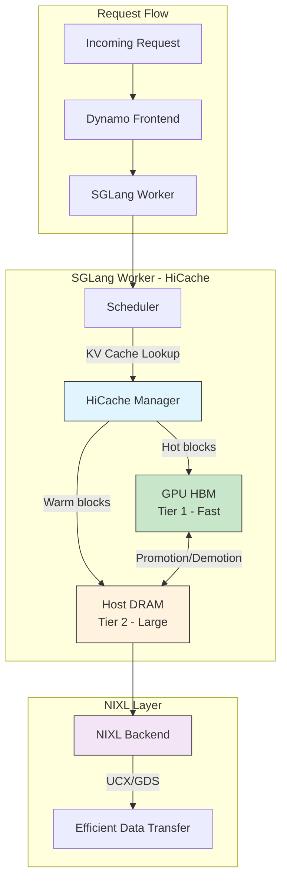

<!--
SPDX-FileCopyrightText: Copyright (c) 2025-2026 NVIDIA CORPORATION & AFFILIATES. All rights reserved.
SPDX-License-Identifier: Apache-2.0
-->

# SGLang Hierarchical Cache (HiCache) User Guide

HiCache (Hierarchical Cache) is SGLang's memory tiering technology that extends KV cache storage beyond GPU memory (HBM) to include host CPU memory (DRAM). 
This guide provides comprehensive instructions for enabling and configuring SGLang's Hierarchical Cache (HiCache) within Dynamo to optimize KV cache memory management for LLM inference workloads.

## Table of Contents

- [Overview](#overview)
- [Prerequisites](#prerequisites)
- [Quick Start](#quick-start)
- [Configuration Reference](#configuration-reference)
- [Architecture](#architecture)
- [Deployment Examples](#deployment-examples)
- [Benchmarking](#benchmarking)
- [Troubleshooting](#troubleshooting)
- [Related Documentation](#related-documentation)

> [!NOTE]
> HiCache introduces a tradeoff between cache capacity and access latency. Blocks stored in host memory have higher access latency than GPU memory. The `--hicache-write-policy` controls how this tradeoff is managed.

## Prerequisites

Before enabling HiCache, ensure you have:

1. **Dynamo installed** with SGLang support:
   ```bash
   uv pip install "ai-dynamo[sglang]"
   ```

2. **Infrastructure services running** (for local development):
   ```bash
   docker compose -f deploy/docker-compose.yml up -d
   ```

3. **Sufficient host memory**: HiCache uses CPU memory as a secondary tier. Ensure your system has adequate DRAM relative to GPU memory. The `--hicache-ratio` parameter controls the host-to-device memory ratio.

4. **NIXL support** (optional but recommended): For optimal performance, NIXL provides efficient data transfer between GPU and host memory tiers.

## Quick Start

### Step 1: Start the SGLang Worker with HiCache

Launch the SGLang backend with HiCache enabled:

```bash
python -m dynamo.sglang \
  --model-path Qwen/Qwen3-0.6B \
  --host 0.0.0.0 --port 8000 \
  --page-size 64 \
  --enable-hierarchical-cache \
  --hicache-ratio 2 \
  --hicache-write-policy write_through \
  --hicache-storage-backend nixl \
  --log-level debug \
  --skip-tokenizer-init
```

### Step 2: Start the Frontend

In a separate terminal, launch the Dynamo frontend:

```bash
python -m dynamo.frontend --http-port 8000
```

### Step 3: Send a Test Request

Verify the deployment is working:

```bash
curl localhost:8000/v1/chat/completions \
  -H "Content-Type: application/json" \
  -d '{
    "model": "Qwen/Qwen3-0.6B",
    "messages": [
      {
        "role": "user",
        "content": "Explain why Roger Federer is considered one of the greatest tennis players of all time"
      }
    ],
    "stream": false,
    "max_tokens": 30
  }'
```

## Configuration Reference

### HiCache Arguments

| Argument | Type | Default | Description |
|----------|------|---------|-------------|
| `--enable-hierarchical-cache` | Flag | `false` | Enables hierarchical KV cache/offload to host memory |
| `--hicache-ratio` | Float | `2.0` | Ratio of host KV cache pool size to device pool size. Lower this if your machine has limited CPU memory |
| `--hicache-write-policy` | String | `write_through` | Write policy for host memory writes. Options: `write_through` (synchronous), `write_back` (asynchronous) |
| `--hicache-storage-backend` | String | - | Host storage backend for HiCache. Use `nixl` for NIXL integration which auto-selects the optimal concrete store |

### Write Policy Options

| Policy | Behavior | Use Case |
|--------|----------|----------|
| `write_through` | Synchronous writes to host memory. Ensures consistency but adds latency | Production deployments requiring data consistency |
| `write_back` | Asynchronous writes to host memory. Lower latency but potential data loss on failure | Development/testing or latency-sensitive workloads |

### Storage Backend Options

| Backend | Description |
|---------|-------------|
| `nixl` | NVIDIA's communication library for efficient GPU-host transfers. Automatically selects the optimal concrete store based on system configuration |

> [!TIP]
> When using `--hicache-storage-backend nixl`, NIXL automatically selects the best available transport (UCX, GDS, etc.) based on your system configuration. See [NIXL documentation](https://github.com/ai-dynamo/nixl/blob/main/docs/nixl.md) for details.

### Tuning `hicache-ratio`

The `--hicache-ratio` parameter controls how much host memory is allocated relative to GPU memory for KV cache:

```text
Host KV Cache Size = Device KV Cache Size × hicache-ratio
```

**Guidelines for setting `hicache-ratio`:**

| System Configuration | Recommended Ratio | Notes |
|---------------------|-------------------|-------|
| High CPU memory (512GB+ DRAM, 80GB GPU) | `4-8` | Maximize cache capacity |
| Balanced (256GB DRAM, 80GB GPU) | `2-4` | Good balance of capacity and host resources |
| Limited CPU memory (128GB DRAM, 80GB GPU) | `1-2` | Conserve host memory for other processes |
| Development/Testing | `1-2` | Lower resource footprint |

> [!IMPORTANT]
> Setting `hicache-ratio` too high may cause memory pressure on the host system, affecting overall performance. Monitor host memory usage when tuning this parameter.

## Architecture

HiCache implements a two-tier memory hierarchy for KV cache storage:



### Memory Tier Behavior

1. **Tier 1 (GPU HBM)**: Primary storage for actively used KV cache blocks. Provides lowest latency access.

2. **Tier 2 (Host DRAM)**: Secondary storage for less frequently accessed blocks. Larger capacity but higher access latency.

3. **Block Migration**: The HiCache manager automatically promotes (host → GPU) and demotes (GPU → host) blocks based on access patterns and memory pressure.

### Integration with Dynamo KVBM

When using NIXL as the storage backend, HiCache integrates with Dynamo's KV Block Manager (KVBM) architecture:

- **NIXL** provides unified data transfer support across different backends (UCX, GDS, etc.)
- **Block registration** and metadata exchange are handled automatically
- **Memory tiering** decisions are managed by SGLang's HiCache, while data movement is optimized by NIXL

## Deployment Examples

### Basic Single-Node Deployment

```bash
# Terminal 1: Start SGLang worker with HiCache
python -m dynamo.sglang \
  --model-path meta-llama/Llama-3.1-8B-Instruct \
  --enable-hierarchical-cache \
  --hicache-ratio 2 \
  --hicache-write-policy write_through \
  --hicache-storage-backend nixl

# Terminal 2: Start frontend
python -m dynamo.frontend --http-port 8000
```

### Multi-GPU Deployment with Tensor Parallelism

```bash
# Terminal 1: Start SGLang worker with TP=2 and HiCache
python -m dynamo.sglang \
  --model-path meta-llama/Llama-3.1-70B-Instruct \
  --tp 2 \
  --enable-hierarchical-cache \
  --hicache-ratio 4 \
  --hicache-write-policy write_through \
  --hicache-storage-backend nixl

# Terminal 2: Start frontend
python -m dynamo.frontend --http-port 8000
```

### HiCache with KV-Aware Routing

For deployments with multiple workers, combine HiCache with KV-aware routing to maximize cache reuse:

```bash
# Terminal 1: Start first SGLang worker
python -m dynamo.sglang \
  --model-path Qwen/Qwen3-0.6B \
  --enable-hierarchical-cache \
  --hicache-ratio 2 \
  --hicache-storage-backend nixl

# Terminal 2: Start second SGLang worker
python -m dynamo.sglang \
  --model-path Qwen/Qwen3-0.6B \
  --enable-hierarchical-cache \
  --hicache-ratio 2 \
  --hicache-storage-backend nixl

# Terminal 3: Start frontend with KV routing
python -m dynamo.frontend --http-port 8000 --router-mode kv
```

> [!TIP]
> KV-aware routing directs requests to workers with the best cache overlap, while HiCache ensures each worker has expanded cache capacity. This combination maximizes both cache reuse and capacity.

### Production Configuration Example

For production deployments with optimized settings:

```bash
python -m dynamo.sglang \
  --model-path meta-llama/Llama-3.1-8B-Instruct \
  --enable-hierarchical-cache \
  --hicache-ratio 3 \
  --hicache-write-policy write_through \
  --hicache-storage-backend nixl \
  --page-size 64 \
  --max-num-seqs 256 \
  --mem-fraction-static 0.85
```

## Benchmarking

### Running Performance Benchmarks

Use the Dynamo performance script to evaluate HiCache effectiveness:

```bash
bash -x $DYNAMO_ROOT/benchmarks/llm/perf.sh \
  --model Qwen/Qwen3-0.6B \
  --tensor-parallelism 1 \
  --data-parallelism 1 \
  --concurrency "2,4,8,16" \
  --input-sequence-length 2048 \
  --output-sequence-length 256
```

### Comparing With and Without HiCache

To measure the impact of HiCache, run benchmarks with and without the feature:

<details>
<summary>Benchmark comparison script</summary>

```bash
#!/bin/bash

MODEL="Qwen/Qwen3-0.6B"
CONCURRENCY="4,8,16"
INPUT_LEN=2048
OUTPUT_LEN=256

echo "=== Running WITHOUT HiCache ==="
# Start worker without HiCache
python -m dynamo.sglang \
  --model-path $MODEL &
WORKER_PID=$!
sleep 30

python -m dynamo.frontend --http-port 8000 &
FE_PID=$!
sleep 10

bash $DYNAMO_ROOT/benchmarks/llm/perf.sh \
  --model $MODEL \
  --concurrency "$CONCURRENCY" \
  --input-sequence-length $INPUT_LEN \
  --output-sequence-length $OUTPUT_LEN \
  > results_no_hicache.txt

kill $WORKER_PID $FE_PID
sleep 5

echo "=== Running WITH HiCache ==="
# Start worker with HiCache
python -m dynamo.sglang \
  --model-path $MODEL \
  --enable-hierarchical-cache \
  --hicache-ratio 2 \
  --hicache-storage-backend nixl &
WORKER_PID=$!
sleep 30

python -m dynamo.frontend --http-port 8000 &
FE_PID=$!
sleep 10

bash $DYNAMO_ROOT/benchmarks/llm/perf.sh \
  --model $MODEL \
  --concurrency "$CONCURRENCY" \
  --input-sequence-length $INPUT_LEN \
  --output-sequence-length $OUTPUT_LEN \
  > results_with_hicache.txt

kill $WORKER_PID $FE_PID

echo "=== Results ==="
echo "Without HiCache:"
cat results_no_hicache.txt
echo ""
echo "With HiCache:"
cat results_with_hicache.txt
```

</details>

### Key Metrics to Monitor

| Metric | Description | Expected Impact with HiCache |
|--------|-------------|------------------------------|
| TTFT (Time To First Token) | Latency until first generated token | ↓ Lower (better cache hit rates) |
| ITL (Inter-Token Latency) | Latency between generated tokens | → Similar or slightly higher |
| Throughput | Tokens per second | ↑ Higher (less recomputation) |
| Cache Hit Rate | Percentage of requests with cache hits | ↑ Higher (larger cache capacity) |

## Troubleshooting

### Common Issues

<details>
<summary><strong>Out of Memory (OOM) on Host</strong></summary>

**Symptom**: Host system runs out of memory, causing swap usage or process termination.

**Solution**: Reduce `--hicache-ratio`:
```bash
# Lower the ratio to reduce host memory usage
--hicache-ratio 1
```

Also ensure other memory-intensive processes are not competing for resources.

</details>

<details>
<summary><strong>HiCache Not Activating</strong></summary>

**Symptom**: HiCache flags are set but no tiered caching behavior observed.

**Checklist**:
1. Ensure `--enable-hierarchical-cache` flag is present
2. Check SGLang version supports HiCache (v0.5.3+ recommended)
3. Verify NIXL is properly installed if using `--hicache-storage-backend nixl`
4. Check logs for HiCache initialization messages with `--log-level debug`

</details>

<details>
<summary><strong>Slow Performance with HiCache</strong></summary>

**Symptom**: Performance is worse with HiCache enabled.

**Possible causes and solutions**:

1. **High host-to-GPU transfer latency**:
   - Ensure NIXL is configured with optimal backends
   - Check PCIe bandwidth and configuration

2. **Inappropriate hicache-ratio**:
   - If ratio is too high, frequent evictions may occur
   - Try reducing `--hicache-ratio`

3. **Write policy mismatch**:
   - `write_through` adds synchronous latency
   - Consider `write_back` for latency-sensitive workloads (with caveats)

</details>

<details>
<summary><strong>NIXL Backend Errors</strong></summary>

**Symptom**: Errors related to NIXL when using `--hicache-storage-backend nixl`.

**Solutions**:
1. Verify NIXL is installed: `python -c "import nixl; print(nixl.__version__)"`
2. Check NIXL backend availability with environment variables:
   ```bash
   export DYN_KVBM_NIXL_BACKEND_UCX=true
   ```
3. Review NIXL documentation for system-specific configuration

</details>

### Debug Mode

Enable detailed logging to diagnose issues:

```bash
python -m dynamo.sglang \
  --model-path Qwen/Qwen3-0.6B \
  --enable-hierarchical-cache \
  --hicache-ratio 2 \
  --hicache-storage-backend nixl \
  --log-level debug
```

Look for HiCache-related log messages indicating:
- Initialization success/failure
- Block promotion/demotion events
- Memory tier utilization

## Related Documentation

- **[SGLang Backend Guide](../backends/sglang/README.md)**: Complete guide for running SGLang with Dynamo
- **[KV Cache Routing](../router/router_guide.md)**: Understanding KV-aware routing for multi-worker deployments
- **[KVBM Design](../kvbm/kvbm_design.md)**: Dynamo's KV Block Manager architecture and NIXL integration
- **[Disaggregated Serving](../backends/sglang/sglang-disaggregation.md)**: Prefill/decode separation with SGLang
- **[NIXL Documentation](https://github.com/ai-dynamo/nixl/blob/main/docs/nixl.md)**: NIXL communication library details
- **[SGLang HiCache Benchmarks](https://github.com/sgl-project/sglang/tree/main/benchmark/hicache)**: Upstream SGLang HiCache benchmark results

## See Also

- [KVBM Overview](../kvbm/README.md)
- [LMCache Integration](lmcache_integration.md)
- [FlexKV Integration](flexkv_integration.md)
