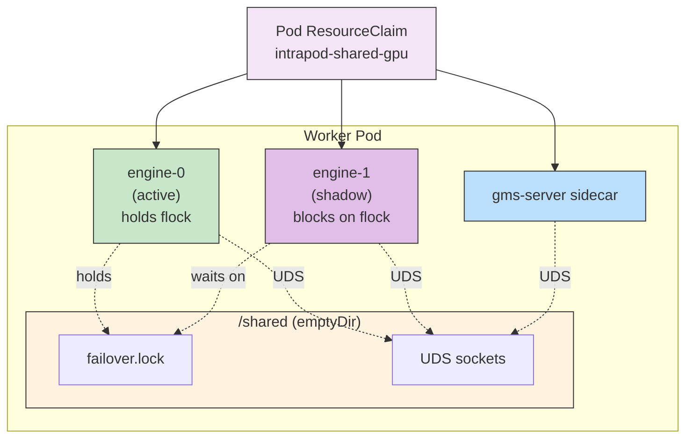
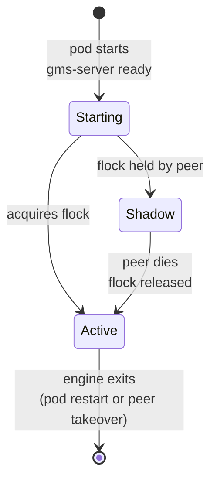

Engine failover gives a Dynamo worker pod a hot standby engine that shares the same GPUs as the active engine. When the active engine dies, the standby takes over without reloading weights, dramatically reducing recovery time compared to a full pod restart.

This feature builds on:

- [GPU Memory Service](gpu-memory-service.md) for GPU sharing via DRA.
- [Container-mode service discovery](service-discovery.md#discovery-granularity-pod-vs-container) so each engine container has its own identity.

Failover is currently supported on the **vLLM** backend only.

## Pod layout

With failover enabled, the operator clones the worker's `main` container into two engine containers (`engine-0` and `engine-1`) and places them alongside the `gms-server` sidecar. All three containers share the same DRA `ResourceClaim` and the same `/shared` volume.



Each engine is a full clone of the main container, with:

- A distinct name: `engine-0` or `engine-1`.
- A staggered system port and named port: `system-0` on `9090`, `system-1` on `9091`.
- HTTP probes retargeted to its own named port.
- A starting health status of `notready` — engines register to discovery as not-ready until they become active.
- Failover-specific env vars (see [Injected environment](#injected-environment)).
- All sidecars from the original pod (e.g., `frontend-sidecar`) are preserved behind the engines.

## Lifecycle

Engines coordinate using an exclusive `flock` on `/shared/failover.lock`. Exactly one engine at a time can hold the lock; the holder is the active engine.



A typical sequence:

1. `gms-server` starts, opens its UDS sockets, and signals readiness.
2. Both engines start. `engine-0` wins the race for the flock and transitions to **active**; its system health flips to `ready` and it appears in the service's `EndpointSlice`.
3. `engine-1` blocks on the flock in **shadow** mode. It stays registered as `notready`, so the frontend does not route traffic to it.
4. If `engine-0` crashes or is killed, the kernel releases the flock. `engine-1` wakes, becomes active, flips to `ready`, and begins serving.
5. Kubernetes restarts `engine-0`; it now starts as the shadow.

## Prerequisites

Failover requires a DRA-capable cluster and several cooperating features. Every one of these is enforced by the validating webhook — the DGD is rejected at admission time if any are missing.

| Requirement | Why |
| --- | --- |
| DRA-capable cluster (K8s 1.32+, NVIDIA GPU DRA driver) | Engines share GPUs through a pod-level `ResourceClaim`. See [GPU Memory Service requirements](gpu-memory-service.md#requirements). |
| `gpuMemoryService.enabled: true` on the same service | Engines rely on the `gms-server` sidecar and the shared `/shared` volume. |
| `failover.mode` matches `gpuMemoryService.mode` | Mismatch produces an inconsistent pod layout. |
| `nvidia.com/dynamo-kube-discovery-mode: container` annotation on the DGD | Each engine needs its own discovery CR; pod-mode discovery cannot represent two ready endpoints in the same pod. |
| vLLM backend with `--load-format gms` | Failover is gated to vLLM today. Other backends return an admission error. |

## Configuration

```yaml
apiVersion: nvidia.com/v1alpha1
kind: DynamoGraphDeployment
metadata:
  name: vllm-agg-failover
  annotations:
    nvidia.com/dynamo-kube-discovery-mode: container
spec:
  services:
    VllmWorker:
      componentType: worker
      resources:
        limits:
          gpu: "2"
      gpuMemoryService:
        enabled: true
      failover:
        enabled: true
      extraPodSpec:
        mainContainer:
          image: nvcr.io/nvidia/ai-dynamo/vllm-runtime:<tag>
          command: ["python3", "-m", "dynamo.vllm"]
          args:
            - --model
            - Qwen/Qwen3-0.6B
            - --tensor-parallel-size
            - "2"
            - --load-format
            - gms
```

See [`examples/backends/vllm/deploy/agg_failover.yaml`](https://github.com/ai-dynamo/dynamo/blob/main/examples/backends/vllm/deploy/agg_failover.yaml) for a complete example.

### Fields

| Field | Type | Default | Description |
| --- | --- | --- | --- |
| `enabled` | `boolean` | — | Activates failover mode. |
| `mode` | `intraPod` \| `interPod` | `intraPod` | Failover topology. Must match `gpuMemoryService.mode`. Only `intraPod` is implemented today. |
| `numShadows` | `int32` | `1` | Reserved for future use. The operator currently creates exactly one shadow engine. |

See the [API reference](api-reference.md#failoverspec) for the full generated schema.

### Injected environment

The operator injects the following variables on each engine container. These drive the lock handshake and port staggering; most users do not need to set or read them directly.

| Variable | Value | Purpose |
| --- | --- | --- |
| `ENGINE_ID` | `0` or `1` | Engine index. |
| `CONTAINER_NAME` | `engine-0` / `engine-1` | Container identity for discovery. |
| `FAILOVER_LOCK_PATH` | `/shared/failover.lock` | Path of the coordination flock. |
| `DYN_SYSTEM_STARTING_HEALTH_STATUS` | `notready` | Engines start not-ready until they acquire the lock. |
| `DYN_SYSTEM_PORT` | `9090` / `9091` | System server port (staggered by `ENGINE_ID`). |
| `DYN_SYSTEM_ENABLED` | `true` | Forces the system health server on per engine. |
| `DYN_VLLM_GMS_SHADOW_MODE` | `true` | vLLM shadow-mode bootstrap. |
| `VLLM_NIXL_SIDE_CHANNEL_PORT` | `5600` / `5601` | vLLM NIXL side channel, staggered. |
| `DYN_VLLM_KV_EVENT_PORT` | `20080` / `20081` | KV event channel, staggered. |
| `NNODES` | multinode only | TP group size, staggered from the original deployment. |

The operator also **removes** a small set of envs from each engine clone so that failover's own health handshake is authoritative: `DYN_SYSTEM_USE_ENDPOINT_HEALTH_STATUS`, `DYN_SYSTEM_PORT`, `DYN_SYSTEM_ENABLED`, `DYN_HEALTH_CHECK_ENABLED`, and any inherited `CONTAINER_NAME`. They are re-added with failover-specific values.

For multinode TP deployments, the operator also staggers `--master-port` (default base `29500`, stride `100`) so each engine group has its own `torch.distributed` TCP store.

## Operational notes

### Triggering a failover for testing

```bash
# From outside the pod
kubectl exec <worker-pod> -c engine-0 -- kill 1

# Watch engine-1 acquire the lock and transition to ready
kubectl logs -f <worker-pod> -c engine-1
```

A coordinated in-cluster validation loop is available via the `/validate-failover` skill, which runs shadow-mode checks, kills the active engine, and probes inference on the new active.

### Observability

- `kubectl get endpointslices -l nvidia.com/dynamo-component=<service>` shows which engine is currently receiving traffic (only the active engine appears `ready`).
- Each engine runs its own system server on `system-0` / `system-1`. You can probe them directly:
  ```bash
  kubectl port-forward <worker-pod> 9090:9090 9091:9091
  curl localhost:9090/health   # engine-0
  curl localhost:9091/health   # engine-1
  ```
- Standard pod-level metrics and logs are unchanged; filter by container name (`-c engine-0` / `-c engine-1`).

## Limitations

- **Backend coverage.** Only vLLM is supported. The operator rejects failover on sglang and TensorRT-LLM.
- **Topology.** Only `intraPod` failover is implemented. `interPod` (failover across pods) is part of the API but not wired up.
- **Shadow count.** Exactly one shadow per rank today. `numShadows` is reserved for future expansion.
- **Multinode.** Per-engine port staggering and `NNODES` propagation are in place, but full coordinated multinode restart of the engine group is still being designed.

## Related

- [GPU Memory Service](gpu-memory-service.md) — required dependency; explains the DRA and sidecar foundation.
- [Service Discovery → Discovery Granularity](service-discovery.md#discovery-granularity-pod-vs-container) — why container-mode discovery is required.
- [Fault Tolerance overview](../fault-tolerance/README.md) — how engine failover fits alongside request migration, graceful shutdown, and health checks.
- [API reference: `FailoverSpec`](api-reference.md#failoverspec)
