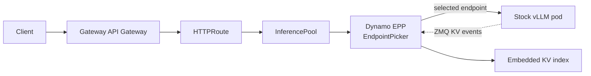
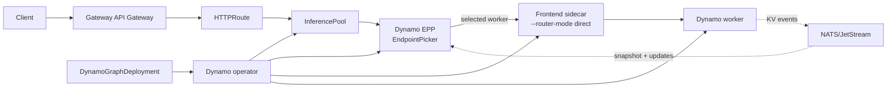
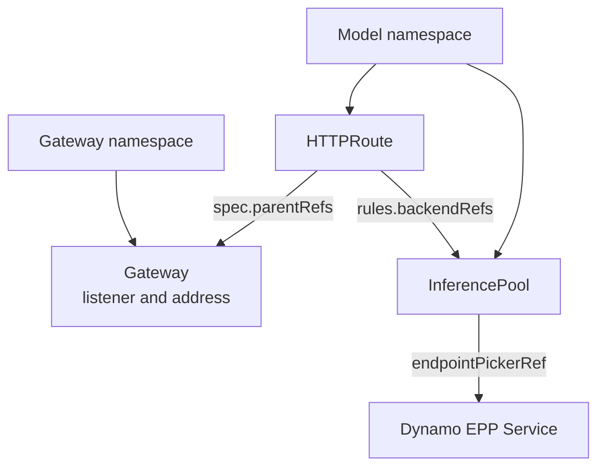

Use Gateway API Inference Extension (GAIE) when the Kubernetes Gateway should select the
serving endpoint before the request reaches a model server. Dynamo integrates with GAIE through
an Endpoint Picker Plugin (EPP) that performs KV cache aware routing at the gateway layer.

## Choose Your Path

<CardGroup cols={2}>
  <Card title="Vanilla vLLM On-ramp" icon="regular route" href="./vanilla-vllm-onramp.mdx">
    Keep stock `vLLM serve` pods. Add Dynamo's EPP as the GAIE EndpointPicker.
  </Card>
  <Card title="Full Dynamo" icon="regular cubes" href="./full-dynamo.mdx">
    Use the Dynamo operator, DynamoGraphDeployment, generated InferencePools, and Dynamo workers.
  </Card>
</CardGroup>

<Info>
Pick the on-ramp path when you already operate GAIE and vLLM and want to add Dynamo routing with
minimal control-plane change. Pick the full Dynamo path when you want the operator, Dynamo discovery,
the NATS-backed event plane, generated Kubernetes resources, and full lifecycle management.
</Info>

## What You Get

| Capability | Vanilla vLLM On-ramp | Full Dynamo |
|---|---|---|
| Model servers | Stock `vLLM serve` pods.  **You miss:** Dynamo-managed worker lifecycle, backend abstraction, and SGLang or TensorRT-LLM workers. | Dynamo workers for vLLM, SGLang, or TensorRT-LLM.  **You gain:** One Dynamo deployment model across supported backends. |
| Routing location | Dynamo routing logic is embedded in the EPP.  **You miss:** The normal Dynamo Frontend as the request-routing owner. | EPP selects workers; Dynamo Frontend sidecars forward in direct mode.  **You gain:** Gateway-level worker selection while keeping Dynamo request handling on the selected worker path. |
| Worker discovery | EPP watches vLLM pods by label selector.  **You miss:** Dynamo discovery metadata and operator-managed component identity. | Dynamo discovery through the operator-managed runtime.  **You gain:** Workers, services, EPP resources, and InferencePools stay aligned through the Dynamo control plane. |
| KV events | EPP subscribes to per-pod vLLM ZMQ events.  **You miss:** Durable delivery, replay, and gap recovery through the Dynamo event plane. | Dynamo event plane with NATS/JetStream for durable routing state.  **You gain:** Routing state can survive EPP restarts and temporary disconnects. |
| Startup state | EPP warms its KV index from live traffic after startup.  **You miss:** There is no startup snapshot; the EPP index starts empty on every start. | Dynamo initializes routing state from worker cache state.  **You gain:** The EPP receives a full index snapshot immediately on every start. |
| Kubernetes resources | You create Deployments, RBAC, Services, InferencePools, and HTTPRoutes.  **You miss:** Operator-generated resources and reconciliation for the serving graph. | You apply a DynamoGraphDeployment and an HTTPRoute; the operator generates the rest.  **You gain:** One Dynamo API owns the graph and generated Kubernetes resources. |
| Best fit | Adopt Dynamo EPP in an existing GAIE + vLLM stack.  **You miss:** Full Dynamo lifecycle management and richer routing-state recovery. | Run production Dynamo with operator-managed lifecycle and richer routing state.  **You gain:** The production Dynamo path with GAIE as the external entry point. |

## Request Flow

Both paths put the routing decision in the EPP. The difference is what the EPP discovers, how it
builds routing state, and what receives the request after the gateway selects an endpoint.

### Vanilla vLLM On-ramp

The on-ramp EPP watches stock vLLM pods, consumes live ZMQ KV events, and warms its local index from
traffic observed after startup.

### Full Dynamo

Full Dynamo uses the operator-managed runtime. The EPP receives routing state from the Dynamo event
plane, including the startup snapshot and subsequent updates.

## Shared Prerequisites

- Kubernetes cluster with GPU nodes. For the baseline Gateway API environment, start with the
  upstream [Gateway API getting started guide](https://gateway-api.sigs.k8s.io/guides/getting-started/introduction/)
  and [GAIE getting started guide](https://gateway-api-inference-extension.sigs.k8s.io/guides/).
- `kubectl`, [Helm](https://helm.sh/docs/intro/install/), and
  [jq](https://jqlang.org/download/) configured for the cluster.
- Gateway API and GAIE CRDs installed. The upstream Gateway API guide covers
  [Gateway API CRD installation](https://gateway-api.sigs.k8s.io/guides/getting-started/introduction/#installing-gateway-api);
  the GAIE guide covers
  [Inference Extension CRD installation](https://gateway-api-inference-extension.sigs.k8s.io/guides/#install-the-inference-extension-crds).
- An Inference Gateway implementation. See the upstream
  [GAIE gateway implementation list](https://gateway-api-inference-extension.sigs.k8s.io/implementations/gateways/).
  These quick starts show [agentgateway](https://agentgateway.dev/docs/) and
  [Istio Gateway API](https://istio.io/latest/docs/tasks/traffic-management/ingress/gateway-api/)
  where setup differs.
- Model credentials required by the workload, such as `hf-token-secret` for gated Hugging Face
  models. For Hugging Face models, see the
  [user access token documentation](https://huggingface.co/docs/hub/security-tokens).

Install the shared Gateway API layer once per cluster or environment. The two quick starts show the
same setup explicitly so the commands remain auditable.

## Gateway Implementation

GAIE needs a Gateway API implementation that understands the inference extension and can call an
Endpoint Picker Plugin. Dynamo is independent of the Gateway implementation; choose the gateway that
matches your platform, then point its `HTTPRoute` and `InferencePool` at the Dynamo EPP. The quick
starts below show the two implementations most useful for Dynamo users today.

| | agentgateway | Istio |
|---|---|---|
| Good fit | New clusters or clusters without a mesh standard | Clusters that already standardize on Istio |
| Install footprint | agentgateway CRDs and controller in `agentgateway-system` | Istio control plane in `istio-system` or your chosen namespace |
| GatewayClass | `agentgateway` | `istio` |
| GAIE support | Enable `inferenceExtension.enabled=true` on the chart | Install Istio with `ENABLE_GATEWAY_API_INFERENCE_EXTENSION=true` |
| Mesh interaction | Add `AgentgatewayParameters` to keep `agentgateway-proxy` out of sidecar injection | Native Gateway implementation; configure EPP TLS with `DestinationRule` when using the mesh |

## Gateway API Concepts

`HTTPRoute.spec.parentRefs` attaches a route to a `Gateway`. If the `HTTPRoute` and `Gateway` live
in different namespaces, set `parentRefs[].namespace` to the Gateway namespace. `rules[].backendRefs`
points at the `InferencePool`; the pool points at the EPP service through `endpointPickerRef`.

For the upstream API model, see the
[Gateway API HTTPRoute documentation](https://gateway-api.sigs.k8s.io/api-types/httproute/) and the
[cross-namespace routing guide](https://gateway-api.sigs.k8s.io/guides/user-guides/multiple-ns/).

## Next Steps

<CardGroup cols={2}>
  <Card title="Run the vanilla vLLM on-ramp" icon="regular route" href="./vanilla-vllm-onramp.mdx">
    Add Dynamo EPP routing to stock vLLM pods.
  </Card>
  <Card title="Run full Dynamo with GAIE" icon="regular cubes" href="./full-dynamo.mdx">
    Deploy a DynamoGraphDeployment behind an Inference Gateway.
  </Card>
</CardGroup>
