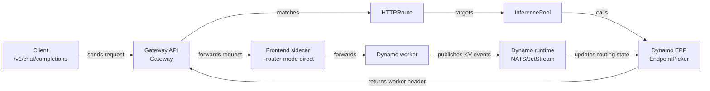
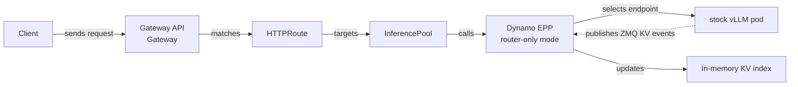
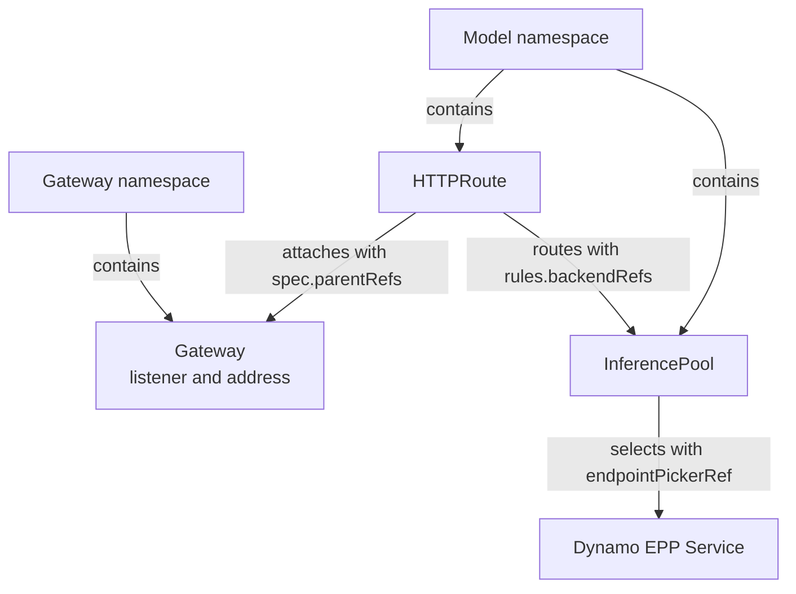

Dynamo supports two Kubernetes request routing topologies. Both expose the same OpenAI-compatible
API and backends; they differ in where traffic enters and where worker selection is integrated:

- **Dynamo-native Frontend routing.** The Dynamo Frontend receives HTTP requests and the integrated
  Dynamo Router selects workers.
- **Gateway API routing with GAIE.** A Kubernetes `Gateway` receives HTTP requests, the
  [Gateway API Inference Extension (GAIE)](https://github.com/kubernetes-sigs/gateway-api-inference-extension)
  calls the Dynamo Endpoint Picker Plugin (EPP) for endpoint selection, and the selected worker's
  Frontend sidecar forwards the request in direct mode.

Use GAIE when your platform wants Gateway API to own traffic entry, policy, and observability while
Dynamo supplies endpoint-selection logic through the EPP. This is an integration boundary choice,
not a claim that the GAIE path is better than the Dynamo-native Frontend path.

## Choose Your Path

<CardGroup cols={2}>
  <Card title="GAIE Quickstart" icon="regular cubes" href="./quickstart.mdx">
    Deploy a DynamoGraphDeployment with the Dynamo operator, generated InferencePools, Dynamo
    workers, and the Dynamo EPP.
  </Card>
  <Card title="Experimental: Vanilla vLLM On-ramp" icon="regular route" href="./vanilla-vllm-onramp.mdx">
    Keep existing stock vLLM pods and evaluate Dynamo EPP routing as the GAIE EndpointPicker.
  </Card>
</CardGroup>

Start with the GAIE Quickstart for the supported operator-managed path. Use the experimental
vanilla vLLM on-ramp only when you already operate a GAIE plus vLLM stack, or when you specifically
want to evaluate that shape without adopting the Dynamo operator first.

## What You Get

| Capability | GAIE Quickstart | Experimental: Vanilla vLLM On-ramp |
|---|---|---|
| Serving lifecycle | The Dynamo operator reconciles the `DynamoGraphDeployment`, workers, Services, EPP, and generated `InferencePool`.<br /><br />**You gain:** One Dynamo API owns the serving graph and generated Kubernetes resources. | You create Deployments, RBAC, Services, `InferencePool`, and `HTTPRoute` resources yourself.<br /><br />**You miss:** Operator reconciliation and lifecycle management for the serving graph. |
| Model servers | Dynamo workers run the backend selected by the DGD, such as vLLM, SGLang, or TensorRT-LLM.<br /><br />**You gain:** One deployment model across supported Dynamo backends. | Existing stock `vLLM serve` pods remain the model servers.<br /><br />**You miss:** Dynamo-managed worker lifecycle and non-vLLM backend abstraction. |
| Routing location | GAIE calls the EPP; selected worker Frontend sidecars forward in direct mode.<br /><br />**You gain:** Gateway-level endpoint selection while keeping Dynamo request handling on the selected worker path. | GAIE calls a Dynamo EPP that embeds router logic for stock vLLM endpoints.<br /><br />**You miss:** The Dynamo-native Frontend as the request-routing owner. |
| Worker discovery | The operator and Dynamo runtime provide component identity and discovery metadata.<br /><br />**You gain:** Workers, Services, EPP resources, and InferencePools stay aligned through the Dynamo control plane. | The EPP watches vLLM pods by label selector.<br /><br />**You miss:** Dynamo discovery metadata and operator-managed component identity. |
| KV events | Workers publish routing state through the Dynamo event plane.<br /><br />**You gain:** NATS/JetStream-backed delivery, replay, and recovery when routing events are missed. | The EPP subscribes directly to per-pod vLLM ZMQ events.<br /><br />**You miss:** Durable delivery, replay, and gap recovery through the Dynamo event plane. |
| Startup state | The EPP receives worker cache state through the Dynamo runtime on startup.<br /><br />**You gain:** The EPP gets a full index snapshot immediately on every start. | The EPP rebuilds its KV index from live traffic after startup.<br /><br />**You miss:** The EPP index starts empty, so cache-aware routing warms gradually from new events. |
| Best fit | Production Dynamo deployments that want Gateway API as the external entry point.<br /><br />**You gain:** Operator-managed lifecycle plus richer routing-state recovery with GAIE at the edge. | Existing GAIE plus vLLM deployments that want to try Dynamo EPP routing incrementally.<br /><br />**You miss:** The supported Dynamo operator path and full runtime event plane. |

## Components

The operator-managed GAIE path combines user-created Gateway API objects with resources created
from the `DynamoGraphDeployment`.

| Component | Role | Created by |
|---|---|---|
| `Gateway` | Receives external HTTP traffic for the namespace. | User or platform team |
| `HTTPRoute` | Attaches model traffic to the `Gateway` and points at the `InferencePool`. | User |
| `DynamoGraphDeployment` | Describes the serving graph, EPP component, workers, and Frontend sidecars. | User |
| Dynamo operator | Reconciles the DGD into Kubernetes resources. | Dynamo platform |
| `InferencePool` | Connects GAIE endpoint selection to the Dynamo EPP service. | Dynamo operator |
| Dynamo EPP | Scores endpoints and returns the selected worker to the gateway. | Dynamo operator |
| Frontend sidecar | Receives the already-selected request and forwards in direct mode. | Dynamo operator |
| Worker | Runs the model backend. | Dynamo operator |

## Request Flow

Both paths put the Gateway API routing decision in the EPP. They differ in what the EPP discovers,
how it builds routing state, and what receives the request after the gateway selects an endpoint.

### GAIE Quickstart



Gateway API owns the external request path. Dynamo still owns the serving graph: the operator
creates the EPP Service, worker pods, Frontend sidecars, and `InferencePool` that binds the route to
the EPP. The EPP receives Dynamo routing state from the runtime event plane and returns the selected
worker ID to the gateway. The gateway forwards the request to the selected worker's Frontend sidecar,
which runs in direct routing mode.

In this operator-managed path, the EPP consumes routing state through the Dynamo event plane using
NATS/JetStream. Direct vLLM ZMQ KV-event subscriptions are used by other integration shapes, but not
by this quickstart path.

### Experimental: Vanilla vLLM On-ramp



In the on-ramp path, the EPP watches stock vLLM pods and consumes live vLLM ZMQ KV events directly.
The local KV index starts empty and warms from traffic observed after the EPP starts.

## Shared Prerequisites

- A Kubernetes cluster with GPU nodes. For the baseline Gateway API environment, start with the
  upstream [Gateway API getting started guide](https://gateway-api.sigs.k8s.io/guides/getting-started/introduction/)
  and the upstream [GAIE guide](https://github.com/kubernetes-sigs/gateway-api-inference-extension/blob/main/site-src/guides/index.md).
- `kubectl`, [Helm](https://helm.sh/docs/intro/install/), and
  [jq](https://jqlang.org/download/) configured for the cluster.
- Gateway API and GAIE CRDs installed. The walkthroughs install them explicitly from pinned
  upstream release manifests.
- A Gateway API implementation that supports GAIE `InferencePool` resources and `endpointPickerRef`
  calls.
- Model credentials and storage needed by the selected model. Hugging Face token secrets are a
  Dynamo model-serving prerequisite, not a GAIE-specific resource; see the
  [Hugging Face token secret](../README.md#huggingface-token-secret) setup.

The GAIE Quickstart also requires the Dynamo platform and operator. See the
[Kubernetes Quickstart](../README.md) and [Installation Guide](../installation-guide.md). The
experimental vanilla vLLM on-ramp requires access to a Dynamo EPP image with router-only on-ramp
support.

## Gateway Implementation

GAIE requires a Gateway API implementation that can call an Endpoint Picker Plugin before forwarding
the request to a backend. Dynamo is independent of the Gateway implementation: pick the gateway that
matches your platform, then point its `HTTPRoute` and generated `InferencePool` at the Dynamo EPP.

The walkthroughs show two verified paths: agentgateway and Istio. Other Gateway API
implementations might work when they support the same GAIE `InferencePool` and `endpointPickerRef`
EPP path; check the upstream
[GAIE gateway implementation list](https://github.com/kubernetes-sigs/gateway-api-inference-extension/blob/main/site-src/implementations/gateways.md)
and your controller's documentation before choosing another implementation.

Istio uses Envoy in its data plane. agentgateway is a Rust-based AI gateway. The requirement for
this guide is not Envoy specifically; it is support for Gateway API plus the GAIE EndpointPicker
flow.

<Tabs>
  <Tab title="agentgateway">
    Use agentgateway for a small Gateway API footprint or when the cluster does not already
    standardize on a service mesh. Install the agentgateway chart with
    `inferenceExtension.enabled=true`; the GatewayClass is `agentgateway`.
  </Tab>
  <Tab title="Istio">
    Use Istio when the cluster already standardizes on Istio for ingress, mesh policy, or telemetry.
    Install Istio with `ENABLE_GATEWAY_API_INFERENCE_EXTENSION=true`; the GatewayClass is `istio`.
    Configure EPP TLS policy with a `DestinationRule` when mesh policy requires it.
  </Tab>
</Tabs>

The walkthroughs use the two verified implementation paths shown in this table:

| | agentgateway | Istio |
|---|---|---|
| Good fit | New clusters or clusters without a mesh standard | Clusters that already standardize on Istio |
| Install footprint | agentgateway CRDs and controller in `agentgateway-system` | Istio control plane in `istio-system` or your chosen namespace |
| GatewayClass | `agentgateway` | `istio` |
| GAIE support | Enable `inferenceExtension.enabled=true` on the chart | Install Istio with `ENABLE_GATEWAY_API_INFERENCE_EXTENSION=true` |
| Mesh interaction | Use `AgentgatewayParameters` to keep `agentgateway-proxy` out of sidecar injection | Configure EPP TLS with a `DestinationRule` when mesh policy applies |

## Gateway API Concepts



`HTTPRoute.spec.parentRefs` attaches a route to a `Gateway`. If the `HTTPRoute` and `Gateway` live
in different namespaces, set `parentRefs[].namespace` to the Gateway namespace. `rules[].backendRefs`
points at the `InferencePool`; the pool points at the EPP service through `endpointPickerRef`.

For the upstream API model, see the
[Gateway API HTTP routing guide](https://gateway-api.sigs.k8s.io/guides/user-guides/http-routing/) and the
[cross-namespace routing guide](https://gateway-api.sigs.k8s.io/guides/user-guides/multiple-ns/).

## Configure DynamoGraphDeployments for GAIE

In GAIE mode, the EPP chooses workers. The worker Frontend sidecar must run in direct routing mode so
it honors the EPP selection instead of choosing a worker again.

```yaml
frontendSidecar: sidecar-frontend
podTemplate:
  spec:
    containers:
      - name: sidecar-frontend
        args:
          - -m
          - dynamo.frontend
          - --router-mode
          - direct
```

The EPP component is part of the `DynamoGraphDeployment`. The operator creates the EPP Service and
the matching `InferencePool`, so users apply the DGD and the route instead of hand-crafting the pool.

### EPP Component Configuration

Start from the recipe EPP component and update the `DynamoGraphDeployment` for your cluster. Change
deployment-level settings such as replicas and resources to fit gateway traffic volume. Change
routing plugin settings only when you want different endpoint-selection behavior, then validate the
result with production-like traffic.

| Setting | When to change it | Rule |
|---|---|---|
| `replicas` and `podTemplate.spec.containers[].resources` | Scale or reserve capacity for EPP pods. | Keep EPP capacity aligned with gateway request volume. |
| `DYN_MODEL_NAME` | Change the served model. | Match the worker model name. |
| `DYN_KV_CACHE_BLOCK_SIZE` | Change the backend KV block size. | Match the backend `--block-size` value. |
| `DYN_ENFORCE_DISAGG` | Require strict prefill/decode routing separation. | Set `"true"` only for disaggregated deployments that should fail closed when topology labels are missing. |
| `label-filter` parameters | Change worker topology labels or component names. | Keep filter labels and values aligned with worker pod labels. |
| `schedulingProfiles[].plugins[].weight` | Adjust how much each scorer influences endpoint selection. | Tune scorer weights deliberately; keep required filters and the picker in the profile. |
| scorer and picker plugins | Change the routing strategy. | Treat this as advanced EPP tuning and validate with traffic. |

For upstream EPP configuration semantics, see the GAIE
[EPP YAML configuration guide](https://gateway-api-inference-extension.sigs.k8s.io/guides/epp-configuration/config-text/)
and its
[Scheduling Profiles](https://gateway-api-inference-extension.sigs.k8s.io/guides/epp-configuration/config-text/#scheduling-profiles)
section for plugin weights. For label-based endpoint selection, see the upstream
[InferencePool configuration guide](https://gateway-api-inference-extension.sigs.k8s.io/api-types/inferencepool/#how-to-configure-an-inferencepool).
The `label-filter` plugin shown here is Dynamo-specific; the component role label comes from the
Dynamo [ComponentType](../api-reference.md#componenttype) field.

The operator reconciles the EPP `Deployment`, EPP `Service`, and generated `InferencePool` from the
DGD. Tune the DGD first; patch generated resources only for short-lived debugging.

```yaml
- name: Epp
  type: epp
  replicas: 1
  eppConfig:
    config:
      plugins:
        - type: disagg-profile-handler
        - name: decode-filter
          type: label-filter
          parameters:
            label: nvidia.com/dynamo-component-type
            validValues: [decode]
            allowsNoLabel: true # Aggregated recipes can route unlabeled decode pods.
        - name: dyn-decode
          type: dyn-decode-scorer
        - name: picker
          type: max-score-picker
      schedulingProfiles:
        - name: decode
          plugins:
            - pluginRef: decode-filter
              weight: 1 # Keep topology filters aligned with the worker labels.
            - pluginRef: dyn-decode
              weight: 1 # Tune scorer weights to change endpoint scoring.
            - pluginRef: picker
              weight: 1
```

The `DYN_*` environment values are runtime contracts between the EPP router logic and the workers.
Update them when the worker backend changes; do not use them to tune scoring.

```yaml
- name: Epp
  type: epp
  podTemplate:
    spec:
      containers:
        - name: main
          env:
            - name: DYN_MODEL_NAME
              value: Qwen/Qwen3-0.6B # Match the worker model name.
            - name: DYN_KV_CACHE_BLOCK_SIZE
              value: "16" # Match the worker backend's --block-size.
            - name: DYN_ENFORCE_DISAGG
              value: "false" # Use "true" for disaggregated fail-closed behavior.
```

See the complete EPP examples in the source tree:
`recipes/qwen3-0.6b/vllm/agg/gaie/deploy.yaml` for the Qwen 0.6B aggregated recipe manifest and
`examples/backends/vllm/deploy/gaie/disagg.yaml` for the Qwen 0.6B disaggregated example manifest.

## Routing Behavior

GAIE does not require one scoring strategy. Choose the routing behavior based on the routing state
available to the EPP.

| Mode | What the EPP uses | When to use it |
|---|---|---|
| KV cache aware routing | Worker-published KV cache events delivered through the Dynamo event plane in the quickstart, or best-effort vLLM ZMQ events in the experimental on-ramp. | Default path when workers publish KV events and you want cache locality to influence endpoint selection. |
| Approximate routing | Endpoint availability plus local bookkeeping from tokenized requests and request lifecycle. | Fallback path when precise worker-published KV events are unavailable, disabled, or not yet supported by the chosen backend or deployment shape. |

With the GAIE Quickstart, NATS/JetStream backs routing-state delivery. The EPP can receive startup
state and subsequent updates through the Dynamo event plane. With the experimental on-ramp, the EPP
observes live vLLM ZMQ events directly and rebuilds its index from new traffic after restart.

## Compatibility and Defaults

The quickstart pins the Gateway API layer so manual setup is repeatable. Keep the Dynamo platform,
EPP, and runtime images on the same Dynamo release line.

| Component | Default shown here | Notes |
|---|---|---|
| Gateway API CRDs | `v1.5.1` | Installed from the upstream Gateway API release. |
| GAIE CRDs | `v1.2.1` | Installed from the upstream Gateway API Inference Extension release. |
| agentgateway | `v1.0.0` | Installed with `inferenceExtension.enabled=true`. |
| Istio | `1.29.2` | Install with `ENABLE_GATEWAY_API_INFERENCE_EXTENSION=true`. |
| Dynamo images | `1.2.1` | Use one Dynamo release line for the platform chart, EPP image, and runtime images. |
| On-ramp EPP image | `<router-only-epp-image>` | The experimental on-ramp requires an EPP image that includes router-only on-ramp support. |

## Troubleshooting Signals

| Symptom | Likely cause | Check |
|---|---|---|
| `HTTPRoute` is not accepted | `parentRefs` points at the wrong Gateway name or namespace. | `kubectl describe httproute -n <model-namespace>` and compare `spec.parentRefs` with the Gateway. |
| Requests reach a model but EPP logs stay quiet | The route bypasses the `InferencePool`, or the pool points at the wrong EPP service. | Verify `rules.backendRefs` points at the `InferencePool` and `endpointPickerRef` points at the Dynamo EPP service. |
| EPP does not receive routing state in the quickstart | Dynamo event-plane components are not ready, or image tags do not match. | Check Dynamo platform pods, DGD status, EPP logs, and image tags against the compatibility table. |
| On-ramp EPP starts with an empty KV index | This is expected after startup because the experimental on-ramp has no startup snapshot. | Send traffic, then inspect EPP logs for pod discovery, ZMQ event consumption, and endpoint selection. |
| Istio path cannot call the EPP | Istio was installed without GAIE enabled, or mesh TLS policy blocks the EPP call. | Confirm `ENABLE_GATEWAY_API_INFERENCE_EXTENSION=true` and configure the EPP `DestinationRule`. |

## Next Steps

Run the [GAIE Quickstart](./quickstart.mdx) to deploy a `DynamoGraphDeployment`, expose it through
Gateway API, and verify an end-to-end request through the Dynamo EPP.

Use [GAIE Reference](./reference.mdx) for resource contracts, routing knobs, and service mesh
settings.

For existing GAIE stacks that already run stock vLLM pods, try the experimental
[vanilla vLLM on-ramp](./vanilla-vllm-onramp.mdx) after you have confirmed that the router-only EPP
image you use includes on-ramp support.
