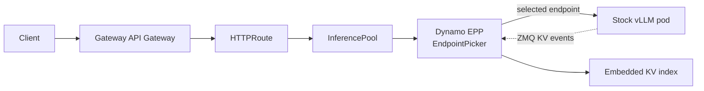
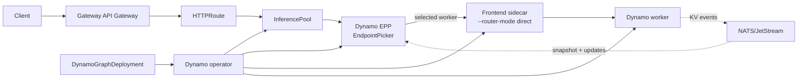
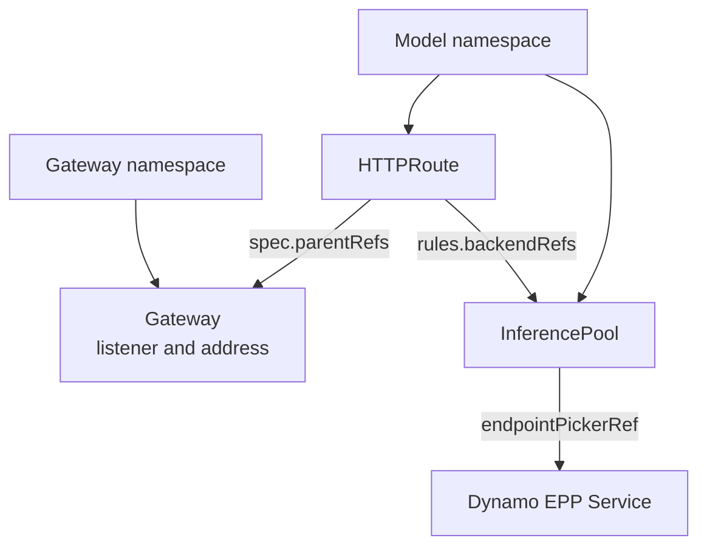

Dynamo supports two request-entry patterns for Kubernetes deployments. The Dynamo-native path routes
traffic through the Dynamo Frontend, where Dynamo selects a worker and forwards the request. The
Kubernetes-native path integrates with [Gateway API Inference Extension
(GAIE)](https://gateway-api-inference-extension.sigs.k8s.io/): Gateway API owns the request entry
point and asks Dynamo for endpoint selection before forwarding traffic to a model server. Dynamo
integrates with GAIE through an Endpoint Picker Plugin (EPP) that uses Dynamo routing logic,
including KV cache aware routing when KV events are available.

## How GAIE Fits

Gateway API gives Kubernetes a standard `Gateway` and `HTTPRoute` model for exposing traffic. GAIE
adds inference-specific endpoint selection to that model: the gateway calls an Endpoint Picker
Plugin before it forwards the request. With Dynamo, that moves the routing decision into the
Gateway API path instead of the Dynamo-native Frontend path. The choice is about integration
boundaries, not routing power.

Use GAIE when your platform wants the Kubernetes Gateway to be the entry point for inference traffic,
policy, and observability. Use the standard Dynamo Kubernetes quickstart when you want the Dynamo
Frontend to be the entry point and do not need Gateway API integration.

## Who Should Use This

- Platform teams that standardize on Gateway API and want inference requests to flow through a
  Kubernetes `Gateway`.
- Existing GAIE users who already run vLLM pods and want to try Dynamo's EPP without adopting the
  full Dynamo operator on day one.
- Dynamo users who want the operator-managed serving graph while keeping gateway-level routing,
  policy, and integration points at the cluster edge.

## Choose Your Path

<CardGroup cols={2}>
  <Card title="Vanilla vLLM On-ramp" icon="regular route" href="./vanilla-vllm-onramp.mdx">
    Keep stock `vLLM serve` pods. Add Dynamo's EPP as the GAIE EndpointPicker.
  </Card>
  <Card title="Full Dynamo" icon="regular cubes" href="./full-dynamo.mdx">
    Use the Dynamo operator, DynamoGraphDeployment, generated InferencePools, and Dynamo workers.
  </Card>
</CardGroup>

> [!IMPORTANT]
> Pick the on-ramp path when you already operate GAIE and vLLM and want to add Dynamo routing with
> minimal control-plane change. Pick the full Dynamo path when you want the operator, Dynamo
> discovery, the NATS-backed event plane, generated Kubernetes resources, and full lifecycle
> management.

## What You Get

| Capability | Vanilla vLLM On-ramp | Full Dynamo |
|---|---|---|
| Model servers | Stock `vLLM serve` pods.  **You miss:** Dynamo-managed worker lifecycle, backend abstraction, and SGLang or TensorRT-LLM workers. | Dynamo workers for vLLM, SGLang, or TensorRT-LLM.  **You gain:** One Dynamo deployment model across supported backends. |
| Routing location | Dynamo routing logic is embedded in the EPP.  **You miss:** The Dynamo-native Frontend as the request-routing owner. | EPP selects workers; Dynamo Frontend sidecars forward in direct mode.  **You gain:** Gateway-level worker selection while keeping Dynamo request handling on the selected worker path. |
| Worker discovery | EPP watches vLLM pods by label selector.  **You miss:** Dynamo discovery metadata and operator-managed component identity. | Dynamo discovery through the operator-managed runtime.  **You gain:** Workers, services, EPP resources, and InferencePools stay aligned through the Dynamo control plane. |
| KV events | EPP subscribes to per-pod vLLM ZMQ events.  **You miss:** Durable delivery, replay, and gap recovery through the Dynamo event plane. | Dynamo event plane with NATS/JetStream for durable routing state.  **You gain:** Routing state can survive EPP restarts and temporary disconnects. |
| Startup state | EPP warms its KV index from live traffic after startup.  **You miss:** There is no startup snapshot; the EPP index starts empty on every start. | Dynamo initializes routing state from worker cache state.  **You gain:** The EPP receives a full index snapshot immediately on every start. |
| Kubernetes resources | You create Deployments, RBAC, Services, InferencePools, and HTTPRoutes.  **You miss:** Operator-generated resources and reconciliation for the serving graph. | You apply a DynamoGraphDeployment and an HTTPRoute; the operator generates the rest.  **You gain:** One Dynamo API owns the graph and generated Kubernetes resources. |
| Best fit | Adopt Dynamo EPP in an existing GAIE + vLLM stack.  **You miss:** Full Dynamo lifecycle management and richer routing-state recovery. | Run production Dynamo with operator-managed lifecycle and richer routing state.  **You gain:** The production Dynamo path with GAIE as the external entry point. |

## Request Flow

Both paths put the routing decision in the EPP. The difference is what the EPP discovers, how it
builds routing state, and what receives the request after the gateway selects an endpoint.

### Vanilla vLLM On-ramp

The on-ramp EPP watches stock vLLM pods, consumes live ZMQ KV events, and warms its local index from
traffic observed after startup.

### Full Dynamo

Full Dynamo uses the operator-managed runtime. The EPP receives routing state from the Dynamo event
plane, including the startup snapshot and subsequent updates.

## Routing Modes

GAIE does not require one specific scoring strategy. Choose the routing behavior based on the routing
state available to the EPP.

| Mode | What the EPP uses | When to use it |
|---|---|---|
| KV cache aware routing | Live KV cache events from vLLM in the on-ramp path, or Dynamo's event plane in the full Dynamo path. | Default path when workers publish KV events and you want cache locality to influence endpoint selection. |
| Approximate routing | Endpoint availability and non-KV routing signals, without exact cached-prefix ownership. | Fallback path when KV events are unavailable, disabled, or not yet supported by the chosen backend or deployment shape. |

The on-ramp path reads best-effort vLLM ZMQ events directly. Full Dynamo adds NATS/JetStream-backed
event delivery, replay, gap recovery, and startup cache-state synchronization.

## Shared Prerequisites

- Kubernetes cluster with GPU nodes. For the baseline Gateway API environment, start with the
  upstream [Gateway API getting started guide](https://gateway-api.sigs.k8s.io/guides/getting-started/introduction/)
  and [GAIE getting started guide](https://gateway-api-inference-extension.sigs.k8s.io/guides/).
- `kubectl`, [Helm](https://helm.sh/docs/intro/install/), and
  [jq](https://jqlang.org/download/) configured for the cluster.
- Gateway API and GAIE CRDs installed. The upstream Gateway API guide covers
  [Gateway API CRD installation](https://gateway-api.sigs.k8s.io/guides/getting-started/introduction/#installing-gateway-api);
  the GAIE guide covers
  [Inference Extension CRD installation](https://gateway-api-inference-extension.sigs.k8s.io/guides/#install-the-inference-extension-crds).
- An Inference Gateway implementation. See the upstream
  [GAIE gateway implementation list](https://gateway-api-inference-extension.sigs.k8s.io/implementations/gateways/).
  These quick starts show [agentgateway](https://agentgateway.dev/docs/) and
  [Istio Gateway API](https://istio.io/latest/docs/tasks/traffic-management/ingress/gateway-api/)
  where setup differs.
- Model credentials required by the workload, such as `hf-token-secret` for gated Hugging Face
  models. For Hugging Face models, see the
  [user access token documentation](https://huggingface.co/docs/hub/security-tokens).

Install the shared Gateway API layer once per cluster or environment. The two quick starts show the
same setup explicitly so the commands remain auditable.

## Compatibility and Defaults

The quickstarts pin the Gateway API layer so manual setup is repeatable. Keep Dynamo component images
on the same Dynamo release line unless a recipe says otherwise.

| Component | Default shown here | Notes |
|---|---|---|
| Gateway API CRDs | `v1.5.1` | Installed from the upstream Gateway API release. |
| GAIE CRDs | `v1.2.1` | Installed from the upstream Gateway API Inference Extension release. |
| agentgateway | `v1.0.0` | Installed with `inferenceExtension.enabled=true`. |
| Istio | `1.29.2` | Install with `ENABLE_GATEWAY_API_INFERENCE_EXTENSION=true`. |
| Dynamo EPP image | `nvcr.io/nvidia/ai-dynamo/dynamo-frontend:<dynamo-version>` | The EPP is packaged in the public Dynamo Frontend image. Use a tag from the same Dynamo release as your runtime images. |
| Current 1.3 preview tag | `1.3.0-dev.1` | The current full-platform preview includes `dynamo-frontend:1.3.0-dev.1` and matching runtime images. See [Release Artifacts](../../reference/release-artifacts.md#v130-dev1). |
| On-ramp data plane | Gateway -> EPP -> stock vLLM pod | KV events flow directly from vLLM pods to the EPP over ZMQ. |
| Full Dynamo data plane | Gateway -> EPP -> Frontend sidecar -> Dynamo worker | KV events and startup snapshots flow through the Dynamo event plane. |

## Expected Gotchas

Most GAIE failures are wiring problems between Gateway API resources, the EPP service, and the model
namespace. Check these first before debugging model serving.

| Symptom | Likely cause | Check |
|---|---|---|
| `HTTPRoute` is not accepted | `parentRefs` points at the wrong Gateway name or namespace. | `kubectl describe httproute -n <model-namespace>` and compare `spec.parentRefs` with the Gateway. |
| Requests reach the model but EPP logs stay quiet | The route bypasses the `InferencePool`, or the pool points at the wrong EPP service. | Verify `rules.backendRefs` points at the `InferencePool` and `endpointPickerRef` points at the Dynamo EPP service. |
| EPP starts but routing state is empty | The vanilla vLLM on-ramp has no startup snapshot; its KV index warms from new ZMQ events only. | Send traffic after startup, then inspect EPP logs for pod discovery and endpoint selection. |
| Full Dynamo EPP does not receive immediate routing state | Dynamo event-plane components are not ready, or the EPP image tag does not match the runtime/operator line. | Check Dynamo platform pods, DGD status, and image tags against the compatibility table. |
| Istio path cannot call the EPP | Istio was installed without GAIE enabled, or mesh TLS policy blocks the EPP call. | Confirm `ENABLE_GATEWAY_API_INFERENCE_EXTENSION=true` and apply the Istio variant's `DestinationRule`. |

## Gateway Implementation

GAIE needs a Gateway API implementation that understands the inference extension and can call an
Endpoint Picker Plugin. Dynamo is independent of the Gateway implementation; choose the gateway that
matches your platform, then point its `HTTPRoute` and `InferencePool` at the Dynamo EPP. The quick
starts below show the two implementations most useful for Dynamo users today.

| | agentgateway | Istio |
|---|---|---|
| Good fit | New clusters or clusters without a mesh standard | Clusters that already standardize on Istio |
| Install footprint | agentgateway CRDs and controller in `agentgateway-system` | Istio control plane in `istio-system` or your chosen namespace |
| GatewayClass | `agentgateway` | `istio` |
| GAIE support | Enable `inferenceExtension.enabled=true` on the chart | Install Istio with `ENABLE_GATEWAY_API_INFERENCE_EXTENSION=true` |
| Mesh interaction | Add `AgentgatewayParameters` to keep `agentgateway-proxy` out of sidecar injection | Native Gateway implementation; configure EPP TLS with `DestinationRule` when using the mesh |

## Gateway API Concepts

`HTTPRoute.spec.parentRefs` attaches a route to a `Gateway`. If the `HTTPRoute` and `Gateway` live
in different namespaces, set `parentRefs[].namespace` to the Gateway namespace. `rules[].backendRefs`
points at the `InferencePool`; the pool points at the EPP service through `endpointPickerRef`.

For the upstream API model, see the
[Gateway API HTTPRoute documentation](https://gateway-api.sigs.k8s.io/api-types/httproute/) and the
[cross-namespace routing guide](https://gateway-api.sigs.k8s.io/guides/user-guides/multiple-ns/).

## Next Steps

<CardGroup cols={2}>
  <Card title="Run the vanilla vLLM on-ramp" icon="regular route" href="./vanilla-vllm-onramp.mdx">
    Add Dynamo EPP routing to stock vLLM pods.
  </Card>
  <Card title="Run full Dynamo with GAIE" icon="regular cubes" href="./full-dynamo.mdx">
    Deploy a DynamoGraphDeployment behind an Inference Gateway.
  </Card>
</CardGroup>
