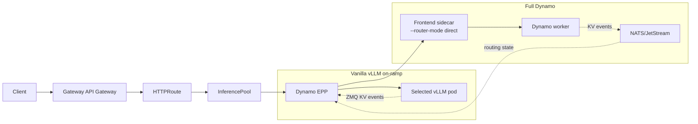
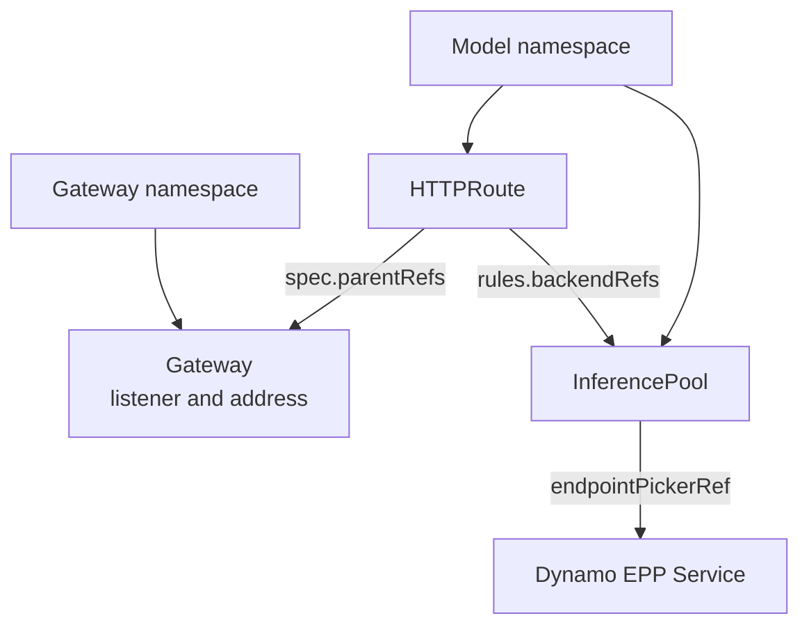

Use Gateway API Inference Extension (GAIE) when the Kubernetes Gateway should select the
serving endpoint before the request reaches a model server. Dynamo integrates with GAIE through
an Endpoint Picker Plugin (EPP) that performs KV cache aware routing at the gateway layer.

## Choose Your Path

<CardGroup cols={2}>
  <Card title="Vanilla vLLM On-ramp" icon="regular route" href="./vanilla-vllm-onramp.mdx">
    Keep stock `vLLM serve` pods. Add Dynamo's EPP as the GAIE EndpointPicker.
  </Card>
  <Card title="Full Dynamo" icon="regular cubes" href="./full-dynamo.mdx">
    Use the Dynamo operator, DynamoGraphDeployment, generated InferencePools, and Dynamo workers.
  </Card>
</CardGroup>

<Info>
Pick the on-ramp path when you already operate GAIE and vLLM and want to add Dynamo routing with
minimal control-plane change. Pick the full Dynamo path when you want the operator, Dynamo discovery,
the NATS-backed event plane, generated Kubernetes resources, and full lifecycle management.
</Info>

## What You Get

| Capability | Vanilla vLLM On-ramp | Full Dynamo |
|---|---|---|
| Model servers | Stock `vLLM serve` pods | Dynamo workers for vLLM, SGLang, or TensorRT-LLM |
| Routing location | Dynamo routing logic embedded in the EPP | EPP selects workers; Dynamo Frontend sidecars forward in direct mode |
| Worker discovery | EPP watches vLLM pods by label selector | Dynamo discovery through the operator-managed runtime |
| KV events | EPP subscribes to per-pod vLLM ZMQ events | Dynamo event plane with NATS/JetStream for durable routing state |
| Startup state | EPP starts with an empty KV index and warms from new traffic | Dynamo can initialize routing state from worker cache state |
| Kubernetes resources | You create Deployments, RBAC, Service, InferencePool, and HTTPRoute | You apply a DynamoGraphDeployment and an HTTPRoute; the operator generates the rest |
| Best fit | Adopt Dynamo EPP in an existing GAIE + vLLM stack | Run production Dynamo with operator-managed lifecycle and richer routing state |

## Request Flow

Both paths put the routing decision in the EPP. The difference is what the EPP discovers and how
the selected backend serves the request.

## Shared Prerequisites

- Kubernetes cluster with GPU nodes.
- `kubectl` and Helm configured for the cluster.
- Gateway API and GAIE CRDs installed.
- An Inference Gateway implementation. These quick starts show
  [agentgateway](https://agentgateway.dev/) and Istio where setup differs.
- Model credentials required by the workload, such as `hf-token-secret` for gated Hugging Face
  models.

Install the shared Gateway API layer once per cluster or environment. The two quick starts show the
same setup explicitly so the commands remain auditable.

## Gateway Implementation

| | agentgateway | Istio |
|---|---|---|
| Good fit | New clusters or clusters without a mesh standard | Clusters that already standardize on Istio |
| Install footprint | agentgateway CRDs and controller in `agentgateway-system` | Istio control plane in `istio-system` or your chosen namespace |
| GatewayClass | `agentgateway` | `istio` |
| GAIE support | Enable `inferenceExtension.enabled=true` on the chart | Install Istio with `ENABLE_GATEWAY_API_INFERENCE_EXTENSION=true` |
| Mesh interaction | Add `AgentgatewayParameters` to keep `agentgateway-proxy` out of sidecar injection | Native Gateway implementation; configure EPP TLS with `DestinationRule` when using the mesh |

## Gateway API Concepts

`HTTPRoute.spec.parentRefs` attaches a route to a `Gateway`. If the `HTTPRoute` and `Gateway` live
in different namespaces, set `parentRefs[].namespace` to the Gateway namespace. `rules[].backendRefs`
points at the `InferencePool`; the pool points at the EPP service through `endpointPickerRef`.

For the upstream API model, see the
[Gateway API HTTPRoute documentation](https://gateway-api.sigs.k8s.io/api-types/httproute/) and the
[cross-namespace routing guide](https://gateway-api.sigs.k8s.io/guides/user-guides/multiple-ns/).

## Next Steps

<CardGroup cols={2}>
  <Card title="Run the vanilla vLLM on-ramp" icon="regular route" href="./vanilla-vllm-onramp.mdx">
    Add Dynamo EPP routing to stock vLLM pods.
  </Card>
  <Card title="Run full Dynamo with GAIE" icon="regular cubes" href="./full-dynamo.mdx">
    Deploy a DynamoGraphDeployment behind an Inference Gateway.
  </Card>
</CardGroup>
