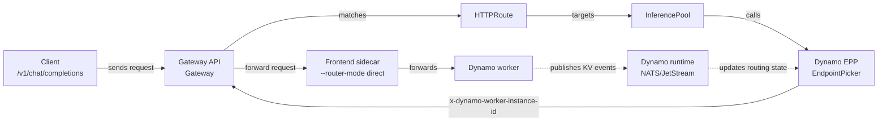
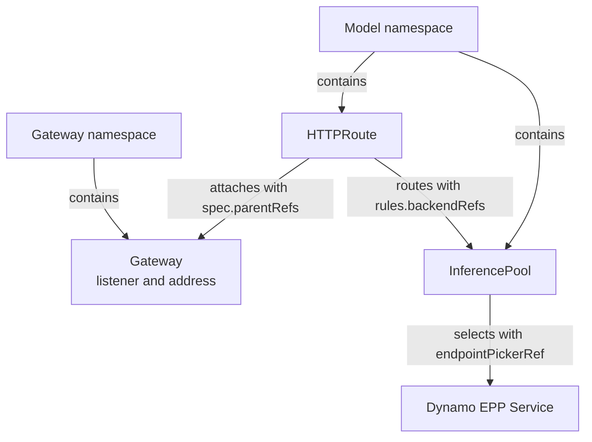

Dynamo supports two request-entry patterns on Kubernetes:

- **Dynamo-native Frontend routing.** The Dynamo Frontend receives HTTP requests and the integrated
  Dynamo Router selects workers.
- **Gateway API routing with GAIE.** A Kubernetes `Gateway` receives HTTP requests, the
  [Gateway API Inference Extension (GAIE)](https://gateway-api-inference-extension.sigs.k8s.io/)
  calls the Dynamo Endpoint Picker Plugin (EPP) for endpoint selection, and the selected worker's
  Frontend sidecar forwards the request in direct mode.

This guide covers the Gateway API path for `DynamoGraphDeployment` resources managed by the Dynamo
operator. Use it when your Kubernetes platform wants Gateway API to own traffic entry, policy, and
observability while Dynamo owns the serving graph, discovery, event plane, and routing logic inside
the EPP.

## Components

The operator-managed GAIE path combines user-created Gateway API objects with resources created
from the `DynamoGraphDeployment`.

| Component | Role | Created by |
|---|---|---|
| `Gateway` | Receives external HTTP traffic for the namespace. | User or platform team |
| `HTTPRoute` | Attaches model traffic to the `Gateway` and points at the `InferencePool`. | User |
| `DynamoGraphDeployment` | Describes the serving graph, EPP component, workers, and Frontend sidecars. | User |
| Dynamo operator | Reconciles the DGD into Kubernetes resources. | Dynamo platform |
| `InferencePool` | Connects GAIE endpoint selection to the Dynamo EPP service. | Dynamo operator |
| Dynamo EPP | Scores endpoints and returns the selected worker to the gateway. | Dynamo operator |
| Frontend sidecar | Receives the already-selected request and forwards in direct mode. | Dynamo operator |
| Worker | Runs the model backend. | Dynamo operator |

## Request Flow



Gateway API owns the external request path. Dynamo still owns the serving graph: the operator
creates the EPP Service, worker pods, Frontend sidecars, and `InferencePool` that binds the route to
the EPP. The EPP receives Dynamo routing state from the runtime event plane and returns the selected
worker ID to the gateway. The gateway forwards the request to the selected worker's Frontend sidecar,
which runs in direct routing mode.

In this operator-managed path, the EPP consumes routing state through the Dynamo event plane using
NATS/JetStream. Direct vLLM ZMQ KV-event subscriptions are used by other integration shapes, but not
by this quickstart path.

## Shared Prerequisites

- A Kubernetes cluster with GPU nodes. For the baseline Gateway API environment, start with the
  upstream [Gateway API getting started guide](https://gateway-api.sigs.k8s.io/guides/getting-started/introduction/)
  and the upstream [GAIE guide](https://gateway-api-inference-extension.sigs.k8s.io/guides/).
- `kubectl`, [Helm](https://helm.sh/docs/intro/install/), and
  [jq](https://jqlang.org/download/) configured for the cluster.
- Gateway API and GAIE CRDs installed. The quickstart installs them explicitly from pinned upstream
  release manifests.
- A Gateway API implementation that supports GAIE. The quickstart shows agentgateway and Istio. See
  the upstream [GAIE gateway implementation list](https://gateway-api-inference-extension.sigs.k8s.io/implementations/gateways/)
  for the broader ecosystem.
- Dynamo platform installed with the operator. See the [Kubernetes Quickstart](../README.md) and
  [Installation Guide](../installation-guide.md).
- Model credentials and storage needed by the selected model. Hugging Face token secrets are a
  Dynamo model-serving prerequisite, not a GAIE-specific resource; see the
  [Hugging Face token secret](../README.md#huggingface-token-secret) setup.

## Gateway Implementation

GAIE requires a Gateway API implementation that can call an Endpoint Picker Plugin before forwarding
the request to a backend. Dynamo is independent of the Gateway implementation: pick the gateway that
matches your platform, then point its `HTTPRoute` and generated `InferencePool` at the Dynamo EPP.

| | agentgateway | Istio |
|---|---|---|
| Good fit | New clusters or clusters without a mesh standard | Clusters that already standardize on Istio |
| Install footprint | agentgateway CRDs and controller in `agentgateway-system` | Istio control plane in `istio-system` or your chosen namespace |
| GatewayClass | `agentgateway` | `istio` |
| GAIE support | Enable `inferenceExtension.enabled=true` on the chart | Install Istio with `ENABLE_GATEWAY_API_INFERENCE_EXTENSION=true` |
| Mesh interaction | Use `AgentgatewayParameters` to keep `agentgateway-proxy` out of sidecar injection | Configure EPP TLS with a `DestinationRule` when mesh policy applies |

## Gateway API Concepts



`HTTPRoute.spec.parentRefs` attaches a route to a `Gateway`. If the `HTTPRoute` and `Gateway` live
in different namespaces, set `parentRefs[].namespace` to the Gateway namespace. `rules[].backendRefs`
points at the `InferencePool`; the pool points at the EPP service through `endpointPickerRef`.

For the upstream API model, see the
[Gateway API HTTP routing guide](https://gateway-api.sigs.k8s.io/guides/user-guides/http-routing/) and the
[cross-namespace routing guide](https://gateway-api.sigs.k8s.io/guides/user-guides/multiple-ns/).

## Configure DynamoGraphDeployments for GAIE

In GAIE mode, the EPP chooses workers. The worker Frontend sidecar must run in direct routing mode so
it honors the EPP selection instead of choosing a worker again.

```yaml
frontendSidecar: sidecar-frontend
podTemplate:
  spec:
    containers:
      - name: sidecar-frontend
        args:
          - -m
          - dynamo.frontend
          - --router-mode
          - direct
```

The EPP component is part of the `DynamoGraphDeployment`. The operator creates the EPP Service and
the matching `InferencePool`, so users apply the DGD and the route instead of hand-crafting the pool.

### EPP Component Configuration

Start from the recipe EPP component and change the plugin profile only when you want different
routing behavior.

```yaml
- name: Epp
  type: epp
  eppConfig:
    config:
      plugins:
        - type: disagg-profile-handler
        - name: decode-filter
          type: label-filter
          parameters:
            label: nvidia.com/dynamo-component-type
            validValues: [decode]
            allowsNoLabel: true # Aggregated recipes can route unlabeled decode pods.
        - name: dyn-decode
          type: dyn-decode-scorer
        - name: picker
          type: max-score-picker
      schedulingProfiles:
        - name: decode
          plugins:
            - pluginRef: decode-filter
              weight: 1 # Keep topology filters aligned with the worker labels.
            - pluginRef: dyn-decode
              weight: 1 # Tune scorer weights to change endpoint scoring.
            - pluginRef: picker
              weight: 1
```

Keep the router environment values aligned with the worker runtime:

```yaml
- name: Epp
  type: epp
  podTemplate:
    spec:
      containers:
        - name: main
          env:
            - name: DYN_MODEL_NAME
              value: Qwen/Qwen3-0.6B # Match the worker model name.
            - name: DYN_KV_CACHE_BLOCK_SIZE
              value: "16" # Match the worker backend's --block-size.
            - name: DYN_ENFORCE_DISAGG
              value: "false" # Use "true" for disaggregated fail-closed behavior.
```

See the GAIE recipe manifests for full EPP configurations:
[Qwen 0.6B aggregated](https://github.com/ai-dynamo/dynamo/blob/main/recipes/qwen3-0.6b/vllm/agg/gaie/deploy.yaml)
and
[Qwen 0.6B disaggregated](https://github.com/ai-dynamo/dynamo/blob/main/examples/backends/vllm/deploy/gaie/disagg.yaml).

## Routing Behavior

GAIE does not require one scoring strategy. Choose the routing behavior based on the routing state
available to the EPP.

| Mode | What the EPP uses | When to use it |
|---|---|---|
| KV cache aware routing | Worker-published KV cache events delivered through the Dynamo event plane. | Default path when workers publish KV events and you want cache locality to influence endpoint selection. |
| Approximate routing | Endpoint availability plus local bookkeeping from tokenized requests and request lifecycle. | Fallback path when precise worker-published KV events are unavailable, disabled, or not yet supported by the chosen backend or deployment shape. |

With operator-managed GAIE, NATS/JetStream backs routing-state delivery. The EPP can receive startup
state and subsequent updates through the Dynamo event plane instead of rebuilding all state from new
traffic after every EPP restart.

## Compatibility and Defaults

The quickstart pins the Gateway API layer so manual setup is repeatable. Keep the Dynamo platform,
EPP, and runtime images on the same Dynamo release line.

| Component | Default shown here | Notes |
|---|---|---|
| Gateway API CRDs | `v1.5.1` | Installed from the upstream Gateway API release. |
| GAIE CRDs | `v1.2.1` | Installed from the upstream Gateway API Inference Extension release. |
| agentgateway | `v1.0.0` | Installed with `inferenceExtension.enabled=true`. |
| Istio | `1.29.2` | Install with `ENABLE_GATEWAY_API_INFERENCE_EXTENSION=true`. |
| Dynamo images | `1.2.1` | Use one Dynamo release line for the platform chart, EPP image, and runtime images. |

## Troubleshooting Signals

| Symptom | Likely cause | Check |
|---|---|---|
| `HTTPRoute` is not accepted | `parentRefs` points at the wrong Gateway name or namespace. | `kubectl describe httproute -n <model-namespace>` and compare `spec.parentRefs` with the Gateway. |
| Requests reach a model but EPP logs stay quiet | The route bypasses the `InferencePool`, or the pool points at the wrong EPP service. | Verify `rules.backendRefs` points at the `InferencePool` and `endpointPickerRef` points at the Dynamo EPP service. |
| EPP does not receive routing state | Dynamo event-plane components are not ready, or image tags do not match. | Check Dynamo platform pods, DGD status, EPP logs, and image tags against the compatibility table. |
| Istio path cannot call the EPP | Istio was installed without GAIE enabled, or mesh TLS policy blocks the EPP call. | Confirm `ENABLE_GATEWAY_API_INFERENCE_EXTENSION=true` and configure the EPP `DestinationRule`. |

## Next Step

Run the [GAIE Quickstart](./quickstart.mdx) to deploy a `DynamoGraphDeployment`, expose it through
Gateway API, and verify an end-to-end request through the Dynamo EPP.

Use [GAIE Reference](./reference.mdx) for resource contracts, routing knobs, and service mesh
settings.
