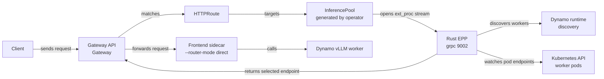

<Warning>
Experimental. Use the Rust EPP for evaluation and development. The operator-managed GAIE quickstart
uses the standard Dynamo EPP path.
</Warning>

The Rust EPP is a native Envoy `ext_proc` server that embeds Dynamo router logic directly. It
replaces the Go EPP plus CGO bridge with a single Rust binary, serves `ext_proc` gRPC on port `9002`,
and uses Dynamo discovery to find workers.

This walkthrough starts from the [GAIE Quickstart](./quickstart.mdx), then swaps the EPP container
image for the experimental Rust EPP while keeping the same operator-managed `InferencePool`,
`HTTPRoute`, Frontend sidecar, and vLLM worker shape.

## What This Deploys



The `InferencePool` is still required by the Gateway data plane. It attaches the `ext_proc` filter,
points the gateway at the EPP service, enables the selected endpoint override, and scopes the
eligible backend pod set. The Rust EPP does not use `InferencePool` or `InferenceModel` for worker
discovery; it intersects Dynamo-discovered workers with the gateway's subset hint before returning an
endpoint.

See [GAIE Reference: Resource Contract](./reference.mdx#resource-contract) for the `InferencePool`
contract.

## Prerequisites

- Complete the [GAIE Quickstart](./quickstart.mdx) through
  [Prepare the Model Cache](./quickstart.mdx#prepare-the-model-cache).
- Use a Kubernetes cluster with GPU nodes and a programmed Gateway from either the agentgateway or
  Istio quickstart tab.
- Push a Rust EPP image to a registry your cluster can pull. For build and publish commands, see the
  [Rust EPP developer reference](https://github.com/ai-dynamo/dynamo/blob/main/deploy/inference-gateway/ext-proc/DEVEL.md).

Set the variables used below:

```bash
export NAMESPACE=gaie-dynamo
export ROUTE_MODEL=Qwen/Qwen3-0.6B
```

## Deploy the Serving Graph

Deploy Qwen 0.6B with an operator-managed EPP component that uses the Rust EPP image. Keep the
`eppConfig` block even though the Rust EPP uses Dynamo discovery for worker selection; the operator
uses the EPP component to create the EPP service and `InferencePool`.

Replace `<your-registry>/dynamo-rust-epp:<tag>` with the image you pushed.

```bash
kubectl apply -n "$NAMESPACE" -f - <<'YAML'
apiVersion: nvidia.com/v1alpha1
kind: DynamoGraphDeployment
metadata:
  name: qwen3-0-6b-rust-epp
spec:
  backendFramework: vllm
  pvcs:
    - name: model-cache
      create: false
  services:
    Epp:
      componentType: epp
      replicas: 1
      extraPodSpec:
        mainContainer:
          image: <your-registry>/dynamo-rust-epp:<tag>
          env:
            - name: RUST_LOG
              value: info
      eppConfig:
        config:
          plugins:
            - type: disagg-profile-handler
            - name: decode-filter
              type: label-filter
              parameters:
                label: "nvidia.com/dynamo-sub-component-type"
                validValues:
                  - "decode"
                allowsNoLabel: true
            - name: picker
              type: max-score-picker
            - name: dyn-decode
              type: dyn-decode-scorer
          schedulingProfiles:
            - name: decode
              plugins:
                - pluginRef: decode-filter
                  weight: 1
                - pluginRef: dyn-decode
                  weight: 1
                - pluginRef: picker
                  weight: 1
    VllmDecodeWorker:
      componentType: worker
      envFromSecret: hf-token-secret
      volumeMounts:
        - name: model-cache
          mountPoint: /opt/models
      sharedMemory:
        size: 2Gi
      frontendSidecar:
        image: nvcr.io/nvidia/ai-dynamo/vllm-runtime:1.2.1
        args:
          - -m
          - dynamo.frontend
          - --router-mode
          - direct
      extraPodSpec:
        mainContainer:
          env:
            - name: SERVED_MODEL_NAME
              value: "Qwen/Qwen3-0.6B"
            - name: MODEL_PATH
              value: "Qwen/Qwen3-0.6B"
            - name: HF_HOME
              value: /opt/models
            - name: DYN_STORE_KV
              value: "mem"
          args:
            - >-
              python3 -m dynamo.vllm
              --model $MODEL_PATH
              --served-model-name $SERVED_MODEL_NAME
              --tensor-parallel-size 1
              --data-parallel-size 1
              --gpu-memory-utilization 0.90
              --enable-prefix-caching
              --kv-events-config '{"enable_kv_cache_events":true}'
              --block-size 16
          command:
            - /bin/sh
            - -c
          image: nvcr.io/nvidia/ai-dynamo/vllm-runtime:1.2.1
          workingDir: /workspace/examples/backends/vllm
      replicas: 2
      resources:
        limits:
          gpu: "1"
        requests:
          gpu: "1"
YAML
```

Wait for the graph and inspect the generated EPP resources:

```bash
kubectl wait -n "$NAMESPACE" dynamographdeployment/qwen3-0-6b-rust-epp \
  --for=condition=Ready --timeout=1800s

kubectl get pods -n "$NAMESPACE" \
  -l nvidia.com/dynamo-component-type=epp

kubectl get inferencepool qwen3-0-6b-rust-epp-pool -n "$NAMESPACE"
```

## Create the Route

Create an `HTTPRoute` that points at the operator-generated `InferencePool`.

```bash
kubectl apply -n "$NAMESPACE" -f - <<'YAML'
apiVersion: gateway.networking.k8s.io/v1
kind: HTTPRoute
metadata:
  name: qwen3-0-6b-rust-epp
spec:
  parentRefs:
    - group: gateway.networking.k8s.io
      kind: Gateway
      name: inference-gateway
  rules:
    - matches:
        - headers:
            - name: X-Gateway-Model-Name
              type: Exact
              value: Qwen/Qwen3-0.6B
          path:
            type: PathPrefix
            value: /
      backendRefs:
        - group: inference.networking.k8s.io
          kind: InferencePool
          name: qwen3-0-6b-rust-epp-pool
          port: 8000
          weight: 1
      timeouts:
        request: 300s
YAML
```

Wait for the route to attach to the Gateway:

```bash
kubectl wait httproute/qwen3-0-6b-rust-epp -n "$NAMESPACE" \
  --for=condition=Accepted --timeout=180s
```

## Verify End-to-End

Port-forward the Gateway service:

```bash
export GATEWAY_SERVICE=$(kubectl get svc -n "$NAMESPACE" \
  -l gateway.networking.k8s.io/gateway-name=inference-gateway \
  -o jsonpath='{.items[0].metadata.name}')

kubectl port-forward -n "$NAMESPACE" "svc/$GATEWAY_SERVICE" 8080:80
```

In another terminal, send a request through Gateway API and the Rust EPP:

```bash
curl -sS http://localhost:8080/v1/chat/completions \
  -H "Content-Type: application/json" \
  -H "X-Gateway-Model-Name: $ROUTE_MODEL" \
  -d '{
    "model": "Qwen/Qwen3-0.6B",
    "messages": [
      {
        "role": "user",
        "content": "In one sentence, what is Dynamo?"
      }
    ],
    "max_tokens": 64
  }' | jq
```

Check the Rust EPP logs if the request fails before reaching a worker:

```bash
kubectl logs -n "$NAMESPACE" \
  -l nvidia.com/dynamo-component-type=epp \
  --tail=100
```

## Configuration

For the operator-managed manifest above, the operator injects the Dynamo namespace and discovery
environment. Set only the values that differ from the defaults:

| Variable | Default | Meaning |
|---|---|---|
| `DYN_ENFORCE_DISAGG` | `false` | Fail requests when prefill routing is unavailable instead of falling back to aggregated routing. |
| `DYN_SECURE_SERVING` | `true` | Serve `ext_proc` gRPC with TLS. Set to `false` only for gateways that expect plaintext h2c. |
| `RUST_LOG` | `info` | Rust tracing filter. |

For hand-authored deployments outside the Dynamo operator, set `DYN_NAMESPACE_PREFIX` or
`DYN_NAMESPACE` so the Rust EPP can find Dynamo-registered workers.

Router tuning uses the same `DYN_ROUTER_*` settings as the standard EPP path. For GAIE routing
settings, see [GAIE Reference: Router Tuning](./reference.mdx#router-tuning). For the broader router
configuration surface, including deprecated overlap-weight aliases, see
[Router Configuration](../../components/router/router-configuration.md).

## Limitations

- Use one Rust EPP replica per pool. Request selection and booking are not yet atomic across
  concurrent Rust EPP replicas.
- Use pod-level Kubernetes discovery only. The Rust EPP rejects container-level discovery because it
  resolves worker endpoints by pod identity.
- Restart the Rust EPP after a worker-generation rolling update so it binds to the new generation
  namespace.
- Exact streamed output-block updates are not yet wired into the Rust EPP.
- The Rust EPP request preprocessor does not yet preserve every routing feature from the full
  Frontend path, including LoRA, session routing, topology constraints, and multimodal routing
  hashes.
- Do not hand-edit the generated `InferencePool` selector unless you also keep it aligned with
  Dynamo discovery. If the gateway subset hint and Dynamo-discovered workers disagree, the EPP can
  return `RoutingFailed`.

## When to Prefer the Standard EPP

Use the standard EPP path for the operator-managed quickstart, production validation, and any setup
that needs the most tested GAIE integration. Use the Rust EPP when evaluating the native `ext_proc`
path or developing the Rust router integration.
