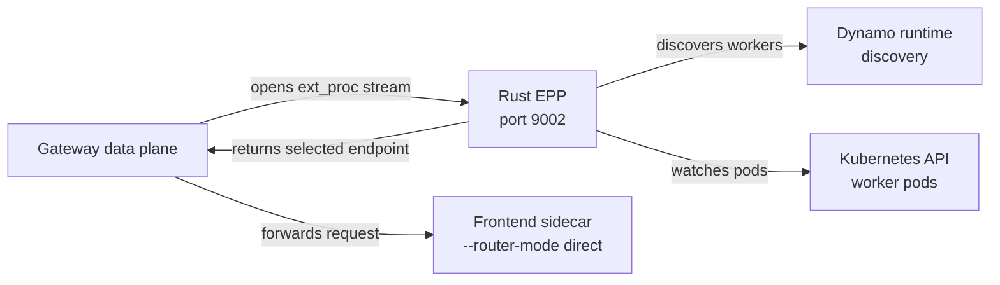

> [!WARNING]
> Experimental. Use the Rust EPP for evaluation and development. The operator-managed quickstart uses
> the standard Dynamo EPP path.

The Rust EPP is a native Envoy ext_proc server that embeds Dynamo router logic directly. It replaces
the Go EPP plus CGO bridge with a single Rust binary, serves ext_proc gRPC on port `9002`, and uses
Dynamo discovery to find workers.

Use this page to understand the runtime contract. Build and image-publishing steps belong with the
[Rust EPP source](https://github.com/ai-dynamo/dynamo/tree/main/deploy/inference-gateway/ext-proc).

## How It Fits

The `InferencePool` is still required by the Gateway data plane. It attaches the ext_proc filter,
points the gateway at the EPP service, enables the selected endpoint override, and scopes the
eligible backend pod set. The Rust EPP does not use the `InferencePool` for worker discovery; it
intersects Dynamo-discovered workers with the gateway's subset hint before returning an endpoint.

See [GAIE Reference](./reference.mdx#resource-contract) for the `InferencePool` contract.

## Runtime Behavior

The Rust EPP:

- Serves ext_proc gRPC on port `9002`.
- Serves plaintext gRPC health on port `9003`.
- Uses TLS for ext_proc by default, with `DYN_SECURE_SERVING=false` available for local debugging.
- Resolves worker endpoints from pod IPs and the container port named `http`.
- Tokenizes request bodies before endpoint selection.
- Sets the same Dynamo routing headers used by the standard EPP path.
- Falls back from disaggregated to aggregated routing unless `DYN_ENFORCE_DISAGG=true`.

## Configuration

Set these environment variables on the Rust EPP container.

| Variable | Default | Meaning |
|---|---|---|
| `DYN_NAMESPACE_PREFIX` | unset | Preferred Dynamo discovery namespace prefix. Takes precedence over `DYN_NAMESPACE`. |
| `DYN_NAMESPACE` | unset | Exact Dynamo discovery namespace fallback. If both namespace values are unset, the Rust EPP uses `vllm-agg`. |
| `DYN_COMPONENT_NAME` | `backend` | Dynamo component that exposes the `generate` endpoint. |
| `DYN_ENFORCE_DISAGG` | `false` | Fail requests when prefill routing is unavailable instead of falling back to aggregated routing. |
| `DYN_SECURE_SERVING` | `true` | Serve ext_proc gRPC with TLS. Set to `false` only for gateways that expect plaintext h2c. |
| `RUST_LOG` | `info` | Rust tracing filter. |

Router tuning uses the same `DYN_ROUTER_*` settings as the standard EPP path. For router tuning
details, see [GAIE Reference](./reference.mdx#router-tuning).

## Limitations

- Use one Rust EPP replica per pool. Request selection and booking are not yet atomic across
  concurrent Rust EPP replicas.
- Restart the Rust EPP after a worker-generation rolling update so it binds to the new generation
  namespace.
- Exact streamed output-block updates are not yet wired into the Rust EPP.
- The Rust EPP request preprocessor does not yet preserve every routing feature from the full
  Frontend path, including LoRA, session routing, topology constraints, and multimodal routing
  hashes.

## When to Prefer the Standard EPP

Use the standard EPP path for the operator-managed quickstart, production validation, and any setup
that needs the most tested GAIE integration. Use the Rust EPP when evaluating the native ext_proc
path or developing the Rust router integration.
