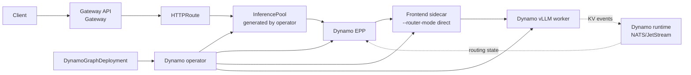

Use this path when you want the Dynamo operator to own the serving graph and generated Kubernetes
resources while GAIE owns the external request entry point. The EPP performs KV cache aware routing at
the gateway layer, then the selected worker's Frontend sidecar forwards the request in direct mode.

## What This Deploys



## Prerequisites

- Kubernetes cluster with GPU nodes.
- `kubectl`, Helm, and `jq`.
- Dynamo platform installed. See the [Kubernetes Quickstart](../README.md) or
  [Installation Guide](../installation-guide.md).
- Model credentials required by the deployment. The general Kubernetes quickstart explains the
  expected [Hugging Face token secret](../README.md#huggingface-token-secret) pattern.

Set the namespace once:

```bash
export NAMESPACE=gaie-full-dynamo
export AGW_NAMESPACE=agentgateway-system
export ISTIO_NAMESPACE=istio-system
kubectl create namespace "$NAMESPACE" --dry-run=client -o yaml | kubectl apply -f -
```

Create model credentials if the model requires them. This is a Dynamo and model-serving prerequisite,
not a GAIE-specific resource:

```bash
export HF_TOKEN=<your-hf-token>
kubectl create secret generic hf-token-secret \
  -n "$NAMESPACE" \
  --from-literal=HF_TOKEN="$HF_TOKEN"
```

## Install Gateway API and a Gateway Implementation

Install the Gateway API layer explicitly. If your platform team already installed Gateway API, GAIE,
and a Gateway implementation, skip to [Configure DGDs for GAIE](#configure-dgds-for-gaie).

```bash
kubectl apply --server-side --force-conflicts \
  -f https://github.com/kubernetes-sigs/gateway-api/releases/download/v1.5.1/standard-install.yaml

kubectl apply \
  -f https://github.com/kubernetes-sigs/gateway-api-inference-extension/releases/download/v1.2.1/manifests.yaml
```

Then choose the Gateway implementation for this namespace.

<Tabs>
  <Tab title="agentgateway" language="bash">
    ```bash
    helm upgrade -i --create-namespace --namespace "$AGW_NAMESPACE" --version v1.0.0 \
      agentgateway-crds oci://cr.agentgateway.dev/charts/agentgateway-crds

    helm upgrade -i --namespace "$AGW_NAMESPACE" --version v1.0.0 \
      agentgateway oci://cr.agentgateway.dev/charts/agentgateway \
      --set inferenceExtension.enabled=true \
      --wait

    kubectl get gatewayclass agentgateway
    ```

    Create an `AgentgatewayParameters` resource and a `Gateway` in the model namespace. The
    parameters resource excludes Istio sidecar injection from `agentgateway-proxy` pods when the
    namespace has `istio-injection=enabled`.

    ```bash
    kubectl apply --server-side -n "$NAMESPACE" -f - <<'YAML'
    apiVersion: agentgateway.dev/v1alpha1
    kind: AgentgatewayParameters
    metadata:
      name: inference-gateway-params
    spec:
      deployment:
        spec:
          template:
            metadata:
              annotations:
                sidecar.istio.io/inject: "false"
    YAML

    kubectl apply -n "$NAMESPACE" -f - <<'YAML'
    apiVersion: gateway.networking.k8s.io/v1
    kind: Gateway
    metadata:
      name: inference-gateway
    spec:
      gatewayClassName: agentgateway
      infrastructure:
        parametersRef:
          group: agentgateway.dev
          kind: AgentgatewayParameters
          name: inference-gateway-params
      listeners:
        - name: http
          port: 80
          protocol: HTTP
    YAML

    kubectl wait gateway/inference-gateway -n "$NAMESPACE" \
      --for=condition=Programmed --timeout=180s
    ```
  </Tab>
  <Tab title="Istio" language="bash">
    ```bash
    export ISTIO_VERSION=1.29.2

    if ! command -v istioctl >/dev/null 2>&1; then
      curl -fsSL https://istio.io/downloadIstio | ISTIO_VERSION="$ISTIO_VERSION" sh -
      export PATH="$PWD/istio-$ISTIO_VERSION/bin:$PATH"
    fi

    istioctl install -y \
      --set values.global.istioNamespace="$ISTIO_NAMESPACE" \
      --set values.pilot.env.ENABLE_GATEWAY_API_INFERENCE_EXTENSION=true

    kubectl wait --for=condition=Available --timeout=180s \
      -n "$ISTIO_NAMESPACE" deployment/istiod

    kubectl apply -n "$NAMESPACE" -f - <<'YAML'
    apiVersion: gateway.networking.k8s.io/v1
    kind: Gateway
    metadata:
      name: inference-gateway
    spec:
      gatewayClassName: istio
      listeners:
        - name: http
          port: 80
          protocol: HTTP
    YAML

    kubectl wait gateway/inference-gateway -n "$NAMESPACE" \
      --for=condition=Programmed --timeout=180s

    kubectl get gatewayclass istio
    ```
  </Tab>
</Tabs>

Keeping the `Gateway` and `HTTPRoute` in the same namespace avoids a cross-namespace
`parentRefs[].namespace` field in the route.

## Configure DGDs for GAIE

In GAIE mode, the EPP chooses workers. The worker Frontend sidecar must run in direct routing mode so
it honors the EPP selection instead of choosing a worker again.

```yaml
frontendSidecar: sidecar-frontend
podTemplate:
  spec:
    containers:
      - name: sidecar-frontend
        args:
          - -m
          - dynamo.frontend
          - --router-mode
          - direct
```

The EPP component is part of the `DynamoGraphDeployment`. The operator creates the EPP Service and
the matching `InferencePool`.

## Deploy an Example

From the repository root, pick one topology. The Llama 3.3 70B examples use full Dynamo workers and
GAIE route manifests.

<Tabs>
  <Tab title="Aggregated" language="bash">
    ```bash
    kubectl apply -n "$NAMESPACE" \
      -f recipes/llama-3-70b/vllm/agg/gaie/deploy.yaml

    kubectl apply -n "$NAMESPACE" \
      -f recipes/llama-3-70b/vllm/agg/gaie/http-route.yaml
    ```
  </Tab>
  <Tab title="Disaggregated" language="bash">
    ```bash
    kubectl apply -n "$NAMESPACE" \
      -f recipes/llama-3-70b/vllm/disagg-single-node/gaie/deploy.yaml

    kubectl apply -n "$NAMESPACE" \
      -f recipes/llama-3-70b/vllm/disagg-single-node/gaie/http-route.yaml
    ```
  </Tab>
</Tabs>

Wait for the operator-created resources:

<Tabs>
  <Tab title="Aggregated" language="bash">
    ```bash
    export ROUTE_HOST=llama3-70b-agg.example.com

    kubectl wait -n "$NAMESPACE" dynamographdeployment/llama3-70b-agg \
      --for=condition=Ready --timeout=1800s

    kubectl get inferencepool llama3-70b-agg-pool -n "$NAMESPACE"
    kubectl get httproute llama3-70b-agg-route -n "$NAMESPACE"
    ```
  </Tab>
  <Tab title="Disaggregated" language="bash">
    ```bash
    export ROUTE_HOST=llama3-70b-disagg.example.com

    kubectl wait -n "$NAMESPACE" dynamographdeployment/llama3-70b-disagg \
      --for=condition=Ready --timeout=1800s

    kubectl get inferencepool llama3-70b-disagg-pool -n "$NAMESPACE"
    kubectl get httproute llama3-70b-disagg-route -n "$NAMESPACE"
    ```
  </Tab>
</Tabs>

## Verify End-to-End

Use one access mode to set `GATEWAY_URL`, then send a request through the Gateway and EPP. Keep
`ROUTE_HOST` set to the hostname from the route manifest you applied.

<Tabs>
  <Tab title="Port-forward" language="bash">
    ```bash
    kubectl -n "$NAMESPACE" port-forward svc/inference-gateway 8000:80
    ```

    In another terminal:

    ```bash
    export GATEWAY_URL=http://localhost:8000
    ```
  </Tab>
  <Tab title="LoadBalancer or tunnel" language="bash">
    ```bash
    export GATEWAY_HOST=$(kubectl get gateway inference-gateway -n "$NAMESPACE" \
      -o jsonpath='{.status.addresses[0].value}')
    export GATEWAY_URL=http://$GATEWAY_HOST
    ```
  </Tab>
</Tabs>

<CodeBlocks>
```bash title="List models"
curl --max-time 20 -sS "$GATEWAY_URL/v1/models" \
  -H "Host: $ROUTE_HOST" | jq .
```

```bash title="Send a chat request"
curl --max-time 180 -sS "$GATEWAY_URL/v1/chat/completions" \
  -H "Host: $ROUTE_HOST" \
  -H "content-type: application/json" \
  -d '{
    "model": "RedHatAI/Llama-3.3-70B-Instruct-FP8-dynamic",
    "messages": [{"role": "user", "content": "Explain KV cache aware routing in one sentence."}],
    "max_tokens": 96
  }' | jq .
```
</CodeBlocks>

Finish by checking that the EPP path handled the request. A successful smoke test should show the EPP
receiving endpoint-picker traffic and selecting a worker near the time of your request; that proves
the request flowed through Gateway API and the Dynamo EPP before it reached the Frontend sidecar.

```bash
kubectl logs -n "$NAMESPACE" -l nvidia.com/dynamo-component-type=epp --tail=200
```

If the log output is quiet, run the chat request again while tailing the EPP logs in another
terminal.

## Istio Variant

Use the same DGD and route model with Istio, but configure the gateway-to-EPP TLS path. The Dynamo
operator can create the EPP `DestinationRule` when `dynamo.serviceMesh.enabled=true` is set on the
platform Helm chart. If you manage Istio resources yourself, create a `DestinationRule` for each EPP
service:

```yaml
apiVersion: networking.istio.io/v1
kind: DestinationRule
metadata:
  name: <dgd-name>-epp
spec:
  host: <dgd-name>-epp.<namespace>.svc.cluster.local
  trafficPolicy:
    tls:
      mode: SIMPLE
      insecureSkipVerify: true
```

Use this variant when your platform standardizes on Istio Gateway instead of agentgateway.

## Troubleshooting

<Tabs>
  <Tab title="agentgateway" language="bash">
    ```bash
    kubectl describe gateway inference-gateway -n "$NAMESPACE"
    kubectl get pods -n "$AGW_NAMESPACE"
    kubectl logs -n "$AGW_NAMESPACE" deployment/agentgateway --tail=50
    kubectl get gatewayclass agentgateway
    kubectl get inferencepool -n "$NAMESPACE"
    kubectl describe httproute -n "$NAMESPACE"
    ```

    If requests return HTTP 500 and the namespace has `istio-injection=enabled`, verify the
    `agentgateway-proxy` pod does not have an `istio-proxy` sidecar:

    ```bash
    kubectl get pods -n "$NAMESPACE" \
      -l gateway.networking.k8s.io/gateway-name=inference-gateway \
      -o jsonpath='{.items[*].spec.containers[*].name}'
    ```
  </Tab>
  <Tab title="Istio" language="bash">
    ```bash
    kubectl describe gateway inference-gateway -n "$NAMESPACE"
    kubectl get pods -n "$ISTIO_NAMESPACE"
    kubectl logs -n "$ISTIO_NAMESPACE" deployment/istiod --tail=50
    kubectl get gatewayclass istio
    kubectl get inferencepool -n "$NAMESPACE"
    kubectl describe httproute -n "$NAMESPACE"
    ```

    Confirm Istio was installed with `ENABLE_GATEWAY_API_INFERENCE_EXTENSION=true`, and confirm the
    EPP service has a `DestinationRule` when Istio sidecars enforce TLS policy for gateway-to-EPP
    traffic.
  </Tab>
</Tabs>

## Clean Up

If this namespace is only for the quick start, delete it:

```bash
kubectl delete namespace "$NAMESPACE"
```
