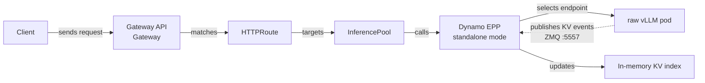

This on-ramp is for Kubernetes users who already use
[Gateway API Inference Extension (GAIE)](https://github.com/kubernetes-sigs/gateway-api-inference-extension) with
vanilla `vLLM serve` pods and want to evaluate the Dynamo kv aware router without installing the Dynamo operator
first. GAIE still owns endpoint selection at the Gateway API layer. The difference is that the
Endpoint Picker uses Dynamo Router without the rest of the Dynamo stack.

If you already run GAIE + vLLM, you **replace only your EndpointPicker (EPP) image**
with the Dynamo EPP image, specify the `DYN_EPP_MODE="standalone"` environment variable, and you are done — no need to install the Dynamo operator, Dynamo runtime, or Dynamo worker.

## What This Deploys



This is intentionally not the same lifecycle model as the operator-managed GAIE quickstart. There is no `DynamoGraphDeployment`, no Dynamo worker runtime, and no Dynamo event plane in this on-ramp.

| | This on-ramp (standalone mode) | Full Dynamo (dynamo mode) |
|---|---|---|
| Workers | stock `vllm serve` | Dynamo workers (vLLM/SGLang/TRT-LLM) |
| Discovery | K8s pod reflector; membership comes from the `InferencePool` (selector + target port) | Dynamo discovery (etcd/K8s) |
| KV events | per-pod vLLM ZMQ → the in-process `SelectionCore` indexer subscribes directly | Dynamo event plane |
| Runtime | none — runtime-free (no etcd, no NATS, no event plane) | etcd + NATS |
| Operator | not required | required (DynamoGraphDeployment) |
| Tokenization | EPP calls vLLM `/v1/chat/completions/render` for routing tokens | model-card preprocessor, no extra render call |

The EPP is served in one of two modes, selected at startup by **`DYN_EPP_MODE`**
(`dynamo` | `standalone`); the same binary serves both. In
standalone mode the EPP and a runtime-free `SelectionService` are compiled into
one process, so there is no separate selection-service Deployment and no HTTP
hop. It runs single-replica, or **replicated** — set `DYN_EPP_PEER_SERVICE` and
the replicas discover each other and sync active load (admission/prefill/free)
over ZMQ.


## Prerequisites

- Kubernetes cluster with GPU nodes.
- `kubectl`, [Helm](https://helm.sh/docs/intro/install/), and
  [jq](https://jqlang.org/download/) configured for the cluster.
- Baseline Gateway API knowledge from the upstream
  [Gateway API getting started guide](https://gateway-api.sigs.k8s.io/guides/getting-started/introduction/)
  and the upstream
  [GAIE guide](https://github.com/kubernetes-sigs/gateway-api-inference-extension/blob/main/site-src/guides/index.md).
- A Gateway API implementation that supports GAIE `InferencePool` resources and `endpointPickerRef`
  calls. This walkthrough shows the same verified agentgateway path as the GAIE
  quickstart; other implementations might work when they support that same EPP path. See the upstream
  [GAIE gateway implementation list](https://github.com/kubernetes-sigs/gateway-api-inference-extension/blob/main/site-src/implementations/gateways.md)
  for other implementations.
- A model namespace that can run GPU workloads.
- Hugging Face credentials if the model requires them. The
  [Kubernetes Quickstart](../README.md#huggingface-token-secret) explains the general secret
  pattern; it is not GAIE-specific.
- Access to a Dynamo EPP image.


If you are starting from scratch install the [Prerequisites](#1-prerequisites) and apply the provided example file [`agg.yaml`](https://github.com/ai-dynamo/dynamo/blob/main/deploy/inference-gateway/ext-proc/examples/onramp/agg.yaml).

```bash
kubectl apply -n <ns> -f agg.yaml
# The Gateway may live in another namespace (e.g. agentgateway-system):
GW=$(kubectl get gateway inference-gateway -n agentgateway-system -o jsonpath='{.status.addresses[0].value}')
curl http://$GW/v1/chat/completions -H 'content-type: application/json' -d '{
  "model": "Qwen/Qwen3-0.6B",
  "messages": [{"role":"user","content":"hello"}]
}'
```
Otherwise, if you already have GAIE and raw vLLM workers running follow the steps below.


## Example Progression from vLLM to vLLM + Dynamo + GAIE

### Initial Deployment

```yaml
apiVersion: apps/v1
kind: Deployment
metadata:
  name: vllm-qwen
  labels:
    app: vllm-qwen
spec:
  replicas: 3
  selector:
    matchLabels:
      app: vllm-qwen
  template:
    metadata:
      labels:
        app: vllm-qwen
    spec:
      containers:
        - name: vllm
          image: vllm/vllm-openai:latest
          args:
            - "--model"
            - "Qwen/Qwen3-0.6B"
          ports:
            - name: http
              containerPort: 8000
          resources:
            limits:
              nvidia.com/gpu: "1"
---
apiVersion: v1
kind: Service
metadata:
  name: vllm-qwen
spec:
  selector:
    app: vllm-qwen
  ports:
    - name: http
      port: 8000
      targetPort: 8000
```

### 1. Prerequisites

Set up a Gateway-API gateway + Inference Extension (GAIE) if you don't have one
yet. Follow the instructions for your gateway (e.g. [AgentGateway](https://agentgateway.dev/docs/kubernetes/main/quickstart/install/)) and [Inference Extension](https://gateway-api-inference-extension.sigs.k8s.io/guides/).

We provide a convenience script if you are installing from scratch for experimentation.
```bash
# Gateway API + Inference Extension CRDs + a gateway named `inference-gateway`
deploy/inference-gateway/scripts/install_gaie_crd_agentgateway.sh
```

Create the HuggingFace token secret the vLLM worker uses to download the
model.

```bash
# HF token secret for the vLLM worker (required for gated models)
kubectl create secret generic hf-token-secret --from-literal=HF_TOKEN=<your-token>
```

### 2. Create / Wire the InferencePool and HTTPRoute

Now that Gateway and GAIE is installed, we can create an InferencePool and an accompanying Dynamo EPP.

Point the `InferencePool` at your vLLM workers (see the
[`vllm-qwen-pool` InferencePool in `agg.yaml`](https://github.com/ai-dynamo/dynamo/blob/main/deploy/inference-gateway/ext-proc/examples/onramp/agg.yaml#L254) for a complete example):

Specifically, these fields depend on the model you deploy, so make sure the settings below are adjusted to match your workers.

- `spec.selector` — labels matching your vLLM pods.
```yaml
  selector:
    matchLabels:
      app: vllm-qwen
```

- `spec.targetPorts[].number` — the vLLM serving port (usually `8000`).
```yaml
  targetPorts:
    - number: 8000
```

- `spec.endpointPickerRef` (a.k.a. `spec.extensionRef`) — the EPP service + port.
```yaml
  endpointPickerRef:
    kind: Service
    name: dynamo-epp
    port:
      number: 9002
```

Attach the `HTTPRoute` to the gateway and target the pool (see the
[`vllm-qwen-route` HTTPRoute in `agg.yaml`](https://github.com/ai-dynamo/dynamo/blob/main/deploy/inference-gateway/ext-proc/examples/onramp/agg.yaml#L270) for a complete example):

- `spec.rules[].backendRefs[]` — targets the `InferencePool`.
```yaml
    - backendRefs:
        - group: inference.networking.k8s.io
          kind: InferencePool
          name: vllm-qwen-pool
          port: 8000
          weight: 1
```

- `spec.parentRefs[]` — your gateway (set `namespace` + `sectionName` when the
  gateway lives in another namespace, e.g. `agentgateway-system`).
```yaml
  parentRefs:
    - group: gateway.networking.k8s.io
      kind: Gateway
      name: inference-gateway
      # Name the Gateway's namespace + listener when it lives elsewhere (drop
      # `namespace` only if the Gateway is in this namespace). Otherwise the
      # route silently fails to attach (status.parents stays empty).
      namespace: agentgateway-system
      sectionName: http
```

### 3. Update vLLM deployment

Add labels to your vLLM pods that match `InferencePool.spec.selector` (the EPP
reads the pool to learn which pods to watch — there is no separate selector env
var):

```yaml
metadata:
  name: vllm-qwen
  labels:
    app: vllm-qwen
```

or
```bash
kubectl -n <ns> label deployment <vllm-deployment> app=vllm-qwen --overwrite
```

### 4. Add the EPP to your deployment

Remove the vLLM router (if you have it already installed) and replace it with the EPP (Dynamo Router).
Add the EPP as a `Deployment` + `Service` (see the
[`dynamo-epp` Deployment in `agg.yaml`](https://github.com/ai-dynamo/dynamo/blob/main/deploy/inference-gateway/ext-proc/examples/onramp/agg.yaml#L146) for a complete example) and set:

```yaml
kind: Deployment
metadata:
  name: dynamo-epp
  labels:
    app: dynamo-epp
```

1. **Set the EPP image.** The Dynamo EPP ships as the "frontend" image with each
   release; standalone mode is a pure runtime flag, no special build.

2. **Select standalone mode and point at the pool.** The EPP reads the
   `InferencePool` it backs (the same object the gateway routes to) to learn the
   pod selector and HTTP target port — so no pod-selector/target-port env is
   needed. It watches pods in its own namespace (`POD_NAMESPACE`, via the
   downward API):

   ```yaml
   - name: DYN_EPP_MODE
     value: "standalone"       # in-process selector; no separate service
   - name: DYN_EPP_INFERENCE_POOL_NAME
     value: "vllm-qwen-pool"    # the InferencePool this EPP backs
   - name: POD_NAMESPACE
     valueFrom:
       fieldRef:
         fieldPath: metadata.namespace
   ```

3. **Point at the workers' KV-event socket.** The worker publishes KV events via
   `--kv-events-config`; the in-process `SelectionCore` indexer subscribes on the
   matching port at each Ready pod's IP.

   vLLM worker arg:

   ```text
   --kv-events-config '{"enable_kv_cache_events":true,"endpoint":"tcp://*:5557"}'
   ```

   EPP env:

   ```yaml
   - name: DYN_EPP_KV_EVENT_PORT
     value: "5557"
   ```

4. **Set the model, tokenizer service, and block size.** The tokenizer service
   URL points to a vLLM HTTP Service exposing `/v1/chat/completions/render`; it
   may select the same homogeneous worker pods. `DYN_EPP_TOKENIZER_PROTOCOL`
   selects its wire protocol (only `vllm-render` is supported today). The block
   size MUST equal the vLLM `--block-size`:

   ```yaml
   - name: DYN_MODEL_NAME
     value: "Qwen/Qwen3-0.6B"
   - name: DYN_EPP_TOKENIZER_SERVICE_URL
     value: "http://vllm-qwen-render:8000"
   - name: DYN_EPP_TOKENIZER_PROTOCOL
     value: "vllm-render"
   - name: DYN_KV_CACHE_BLOCK_SIZE
     value: "16"
   ```

5. **(Optional) Tune KV routing and recovery:**

   ```yaml
   # KV indexer thread pool for the in-process selector.
   - name: DYN_EPP_SELECTION_INDEXER_THREADS
     value: "4"
   # ZMQ replay socket for gap recovery (only if the vLLM worker exposes one).
   - name: DYN_EPP_KV_EVENT_REPLAY_PORT
     value: "5558"
   # Scoring / queueing behavior use the standard router env, e.g.:
   - name: DYN_ROUTER_KV_OVERLAP_SCORE_WEIGHT
     value: "1.0"
   ```

   To run **more than one** EPP replica, set `DYN_EPP_PEER_SERVICE` to the EPP's
   own `Service` so replicas discover each other and sync active load over its
   required named `replica-agg` port (see the `README.md` "Replicated mode"
   section), and add `POD_IP` (downward API `status.podIP`) so a replica excludes
   itself.

   See the full list in the
   [environment contract](#standalone-mode-environment-contract) below.

In the end your Final vLLM deployment will look like below:

```yaml
apiVersion: apps/v1
kind: Deployment
metadata:
  name: vllm-qwen
  labels:
    app: vllm-qwen
spec:
  replicas: 3
  selector:
    matchLabels:
      app: vllm-qwen
  template:
    metadata:
      labels:
        app: vllm-qwen
    spec:
      containers:
        - name: vllm
          image: vllm/vllm-openai:latest
          args:
            - "--model"
            - "Qwen/Qwen3-0.6B"
            - "--served-model-name"     # NEW: pin the OpenAI model id
            - "Qwen/Qwen3-0.6B"
            - "--port"                  # NEW: explicit (8000 is vLLM's default)
            - "8000"
            - "--enable-prefix-caching" # NEW: required so vLLM emits prefix KV events
            - "--block-size"            # NEW: MUST equal the EPP's DYN_KV_CACHE_BLOCK_SIZE
            - "16"
            - "--kv-events-config"      # NEW: publish KV events on a ZMQ PUB socket for the EPP
            - '{"enable_kv_cache_events":true,"endpoint":"tcp://*:5557"}'
          ports:
            - name: http
              containerPort: 8000
            - name: kv-events           # NEW: KV-event PUB port the EPP subscribes to
              containerPort: 5557
          env:                          # NEW: HF token lets the worker pull the model (required for gated models)
            - name: HF_TOKEN
              valueFrom:
                secretKeyRef:
                  name: hf-token-secret
                  key: HF_TOKEN
          resources:
            limits:
              nvidia.com/gpu: "1"
      tolerations:
        - effect: NoSchedule
          key: nvidia.com/gpu
          operator: Exists
```

## Test

```bash
# terminal 1
kubectl -n agentgateway-system port-forward svc/inference-gateway 8000:80

# terminal 2
GATEWAY_URL=http://localhost:8000

# quick health/smoke first
curl --max-time 20 -sS "$GATEWAY_URL/v1/models" | jq .

# then chat completion
curl --max-time 120 -sS "$GATEWAY_URL/v1/chat/completions" \
  -H 'content-type: application/json' \
  -d '{
    "model": "Qwen/Qwen3-0.6B",
    "messages": [{"role":"user","content":"hello"}]
  }' | jq .

```

## Standalone mode environment contract


> [!NOTE]
> The `model` field MUST match `DYN_MODEL_NAME` in the EPP deployment, and the
> EPP's `DYN_KV_CACHE_BLOCK_SIZE` MUST equal the vLLM `--block-size`.

| Env | Meaning | Required? |
|---|---|---|
| `DYN_EPP_MODE=standalone` | Select standalone (selector) mode | required |
| `DYN_EPP_INFERENCE_POOL_NAME` | Name of the `InferencePool` this EPP backs (its selector + target port drive pod discovery) | required |
| `DYN_MODEL_NAME` | Model id (no model card in this mode) | required |
| `DYN_EPP_TOKENIZER_SERVICE_URL` | Base URL of the tokenizer service (vLLM `/v1/chat/completions/render`) | required |
| `DYN_EPP_TOKENIZER_PROTOCOL` | Tokenizer service wire protocol; only `vllm-render` is supported | required |
| `DYN_KV_CACHE_BLOCK_SIZE` | MUST equal vLLM `--block-size` | required |
| `DYN_EPP_KV_EVENT_PORT` | vLLM KV-events PUB port (not in the pool spec) | optional; default 5557 |
| `DYN_EPP_KV_EVENT_REPLAY_PORT` | ZMQ REQ port for live-stream gap replay | optional |
| `DYN_EPP_TOKENIZATION_TIMEOUT_MS` | Deadline for the tokenizer service request | optional; default 5000 |
| `DYN_EPP_TOKENIZER_MAX_RESPONSE_BYTES` | Max tokenizer response body accepted | optional; default 16777216 (16 MiB) |
| `DYN_EPP_TOTAL_KV_BLOCKS` | Per-worker total KV blocks hint | optional |
| `DYN_EPP_MAX_NUM_BATCHED_TOKENS` | Per-worker max batched tokens | optional |
| `DYN_EPP_SELECTION_INDEXER_THREADS` | KV indexer thread pool | optional; default 4 |
| `DYN_EPP_PEER_SERVICE` | The EPP's own Service. Set = replicated; the Service must expose named port `replica-agg`. Unset = single local replica | optional; unset by default |
| `POD_NAMESPACE` | The namespace the EPP, its `InferencePool`, worker pods, and sibling replicas all live in (downward API) | required |
| `POD_IP` | EPP's own pod IP (downward API); needed only for replication, so a replica excludes itself from its peer set | required when `DYN_EPP_PEER_SERVICE` is set |


## Replicated mode

You can run **more than one** EPP replica. Each replica still runs its own
in-process selector, but the replicas discover each other and synchronize active
load so they don't each under-count load and herd onto the same worker. This is
what `agg.yaml` deploys (`replicas: 2`); set `replicas: 1` and drop
`DYN_EPP_PEER_SERVICE` for a single local replica.

```yaml
spec:
  replicas: 2
  # ...
        env:
          # Watch THIS Deployment's own Service to find sibling replicas:
          - name: DYN_EPP_PEER_SERVICE
            value: "dynamo-epp"
          # Own pod IP, so a replica excludes itself from its peer set:
          - name: POD_IP
            valueFrom:
              fieldRef:
                fieldPath: status.podIP
        ports:
          - name: replica-agg
            containerPort: 9092
---
apiVersion: v1
kind: Service
spec:
  ports:
    - name: replica-agg
      port: 9092
      targetPort: replica-agg
```

How it works:

1. Each replica builds its in-process selector with **replica-sync enabled**
   (resolving and binding the Service's named `replica-agg` port).
2. It watches its **own** `Service`'s EndpointSlices (the `DYN_EPP_PEER_SERVICE`
   above) and registers/deregisters every other replica as a replica-sync peer
   as pods come and go — excluding itself via `POD_IP`. Peers connect pod-to-pod
   on the resolved `replica-agg` endpoint port.
3. Admission (`select_and_reserve`), `prefill_complete`, and `free` are broadcast
   over ZMQ, so every replica's selector converges on the same active-load view.
   This is the same consistency model as the standalone selector — output-block
   growth stays local by design; admission/prefill/free are synchronized.


Replica synchronization is best-effort; see the
[selection service docs](../../components/router/standalone-selection.md)
for the consistency invariants.
