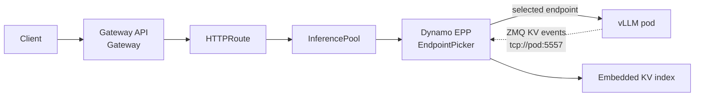
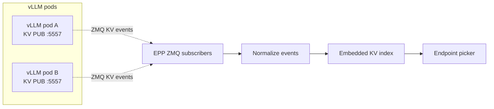

Use this path when you already run, or want to evaluate, GAIE with stock `vLLM serve` pods. The
Dynamo EPP becomes the GAIE EndpointPicker and embeds the routing logic that the Dynamo Frontend
normally owns in full Dynamo deployments.

<Warning>
This on-ramp is for adopting Dynamo routing in an existing GAIE + vLLM stack. It does not install the
Dynamo operator, and it does not provide the full Dynamo event-plane and lifecycle behavior.
</Warning>

## What This Deploys



The EPP watches ready vLLM pods, subscribes to their native KV cache event streams, tokenizes
incoming prompts for routing, and returns the selected endpoint to the gateway.

## Prerequisites

- Kubernetes cluster with GPU nodes.
- `kubectl`, Helm, and `jq`.
- A model namespace that can run GPU workloads.
- Hugging Face credentials if the model requires them.
- Access to the Dynamo EPP image and the vLLM image used by the example. The EPP image is
  `nvcr.io/nvidia/ai-dynamo/dynamo-frontend:<dynamo-version>`; the example currently uses the
  `1.3.0-dev.1` preview tag.
- For the disaggregated on-ramp only, a P/D sidecar image published to a registry your cluster can
  pull. The source lives in `deploy/inference-gateway/pd-sidecar/`; update the
  `pd-router-sidecar` image in `disagg.yaml` before applying it.

Set the namespace once and use it for every namespaced resource in this quick start:

```bash
export NAMESPACE=gaie-vllm-onramp
export AGW_NAMESPACE=agentgateway-system
export ISTIO_NAMESPACE=istio-system
kubectl create namespace "$NAMESPACE" --dry-run=client -o yaml | kubectl apply -f -
```

## Install Gateway API and a Gateway Implementation

Install the shared Gateway API CRDs and GAIE CRDs first:

```bash
kubectl apply --server-side --force-conflicts \
  -f https://github.com/kubernetes-sigs/gateway-api/releases/download/v1.5.1/standard-install.yaml

kubectl apply \
  -f https://github.com/kubernetes-sigs/gateway-api-inference-extension/releases/download/v1.2.1/manifests.yaml
```

Then choose the Gateway implementation for this namespace.

<Tabs>
  <Tab title="agentgateway" language="bash">
    ```bash
    helm upgrade -i --create-namespace --namespace "$AGW_NAMESPACE" --version v1.0.0 \
      agentgateway-crds oci://cr.agentgateway.dev/charts/agentgateway-crds

    helm upgrade -i --namespace "$AGW_NAMESPACE" --version v1.0.0 \
      agentgateway oci://cr.agentgateway.dev/charts/agentgateway \
      --set inferenceExtension.enabled=true \
      --wait

    kubectl get gatewayclass agentgateway
    ```

    Create an `AgentgatewayParameters` resource and a `Gateway` in the model namespace. The
    parameters resource excludes Istio sidecar injection from `agentgateway-proxy` pods when the
    namespace has `istio-injection=enabled`.

    ```bash
    kubectl apply --server-side -n "$NAMESPACE" -f - <<'YAML'
    apiVersion: agentgateway.dev/v1alpha1
    kind: AgentgatewayParameters
    metadata:
      name: inference-gateway-params
    spec:
      deployment:
        spec:
          template:
            metadata:
              annotations:
                sidecar.istio.io/inject: "false"
    YAML

    kubectl apply -n "$NAMESPACE" -f - <<'YAML'
    apiVersion: gateway.networking.k8s.io/v1
    kind: Gateway
    metadata:
      name: inference-gateway
    spec:
      gatewayClassName: agentgateway
      infrastructure:
        parametersRef:
          group: agentgateway.dev
          kind: AgentgatewayParameters
          name: inference-gateway-params
      listeners:
        - name: http
          port: 80
          protocol: HTTP
    YAML

    kubectl wait gateway/inference-gateway -n "$NAMESPACE" \
      --for=condition=Programmed --timeout=180s
    ```
  </Tab>
  <Tab title="Istio" language="bash">
    ```bash
    export ISTIO_VERSION=1.29.2

    if ! command -v istioctl >/dev/null 2>&1; then
      curl -fsSL https://istio.io/downloadIstio | ISTIO_VERSION="$ISTIO_VERSION" sh -
      export PATH="$PWD/istio-$ISTIO_VERSION/bin:$PATH"
    fi

    istioctl install -y \
      --set values.global.istioNamespace="$ISTIO_NAMESPACE" \
      --set values.pilot.env.ENABLE_GATEWAY_API_INFERENCE_EXTENSION=true

    kubectl wait --for=condition=Available --timeout=180s \
      -n "$ISTIO_NAMESPACE" deployment/istiod

    kubectl apply -n "$NAMESPACE" -f - <<'YAML'
    apiVersion: gateway.networking.k8s.io/v1
    kind: Gateway
    metadata:
      name: inference-gateway
    spec:
      gatewayClassName: istio
      listeners:
        - name: http
          port: 80
          protocol: HTTP
    YAML

    kubectl wait gateway/inference-gateway -n "$NAMESPACE" \
      --for=condition=Programmed --timeout=180s

    kubectl get gatewayclass istio
    ```
  </Tab>
</Tabs>

Keeping the `Gateway` and `HTTPRoute` in the same namespace avoids a cross-namespace
`parentRefs[].namespace` field in the route.

## Create Model Credentials

Create the model credentials required by your vLLM pods and by the EPP tokenizer download. This is a
Dynamo and model-serving prerequisite, not a GAIE-specific resource. The general Kubernetes
quickstart explains the expected
[Hugging Face token secret](../README.md#huggingface-token-secret) pattern.

```bash
export HF_TOKEN=<your-hf-token>
kubectl create secret generic hf-token-secret \
  -n "$NAMESPACE" \
  --from-literal=HF_TOKEN="$HF_TOKEN"
```

## Deploy vLLM and the Dynamo EPP

From the repository root, pick one topology. Both examples create a vLLM fleet, EPP Deployment, EPP
Service, InferencePool, and HTTPRoute.

<Tabs>
  <Tab title="Aggregated" language="bash">
    ```bash
    kubectl apply -n "$NAMESPACE" \
      -f deploy/inference-gateway/ext-proc/examples/onramp/agg.yaml
    ```
  </Tab>
  <Tab title="Disaggregated" language="bash">
    The disaggregated on-ramp is experimental and not turnkey. Before applying it, replace the
    `pd-router-sidecar` image placeholder in `disagg.yaml` with an image available to your cluster.

    ```bash
    kubectl apply -n "$NAMESPACE" \
      -f deploy/inference-gateway/ext-proc/examples/onramp/disagg.yaml
    ```
  </Tab>
</Tabs>

Wait for the pods and route to become ready:

<Tabs>
  <Tab title="Aggregated" language="bash">
    ```bash
    kubectl wait -n "$NAMESPACE" --for=condition=Available deployment/vllm-qwen --timeout=600s
    kubectl wait -n "$NAMESPACE" --for=condition=Available deployment/qwen-epp --timeout=180s
    kubectl get httproute qwen-route -n "$NAMESPACE"
    ```
  </Tab>
  <Tab title="Disaggregated" language="bash">
    ```bash
    kubectl wait -n "$NAMESPACE" --for=condition=Available deployment/vllm-qwen-prefill --timeout=600s
    kubectl wait -n "$NAMESPACE" --for=condition=Available deployment/vllm-qwen-decode --timeout=600s
    kubectl wait -n "$NAMESPACE" --for=condition=Available deployment/qwen-epp --timeout=180s
    kubectl get httproute qwen-route -n "$NAMESPACE"
    ```
  </Tab>
</Tabs>

## Verify End-to-End

Use one access mode to set `GATEWAY_URL`, then run the common OpenAI-compatible checks.

<Tabs>
  <Tab title="Port-forward" language="bash">
    ```bash
    kubectl -n "$NAMESPACE" port-forward svc/inference-gateway 8000:80
    ```

    In another terminal:

    ```bash
    export GATEWAY_URL=http://localhost:8000
    ```
  </Tab>
  <Tab title="LoadBalancer or tunnel" language="bash">
    ```bash
    export GATEWAY_HOST=$(kubectl get gateway inference-gateway -n "$NAMESPACE" \
      -o jsonpath='{.status.addresses[0].value}')
    export GATEWAY_URL=http://$GATEWAY_HOST
    ```
  </Tab>
</Tabs>

<CodeBlocks>
```bash title="List models"
curl --max-time 20 -sS "$GATEWAY_URL/v1/models" | jq .
```

```bash title="Send a chat request"
curl --max-time 120 -sS "$GATEWAY_URL/v1/chat/completions" \
  -H "content-type: application/json" \
  -d '{
    "model": "Qwen/Qwen3-0.6B",
    "messages": [{"role": "user", "content": "Write one sentence about prefix caching."}],
    "max_tokens": 64
  }' | jq .
```
</CodeBlocks>

Finish by checking the EPP logs. A successful smoke test should show pod discovery and endpoint
selection near the time of your request; that is the signal that Gateway API called the Dynamo EPP
instead of bypassing the endpoint picker.

```bash
kubectl logs -n "$NAMESPACE" deployment/qwen-epp -c epp --tail=200
```

If the log output is quiet, run the chat request again while tailing the EPP logs in another
terminal.

## Configure the EPP Router Mode

In a normal Dynamo deployment, the Dynamo Frontend performs request routing. In this on-ramp, the EPP
embeds the relevant frontend routing logic so GAIE can ask the EPP to choose a vLLM endpoint. The
literal switch is `DYN_EPP_MODE=router-only`, set on the EPP container in the example manifest.

For related routing behavior, see the [Frontend Guide](../../components/frontend/frontend-guide.md)
and [Router Guide](../../components/router/router-guide.md).

| Setting | Required for | Meaning |
|---|---|---|
| `DYN_EPP_MODE=router-only` | All on-ramp deployments | Run the EPP without the full Dynamo control plane. |
| `DYN_EPP_POD_SELECTOR` | All on-ramp deployments | Select the raw vLLM pods watched by the EPP. |
| `DYN_EPP_TARGET_PORT` | All on-ramp deployments | vLLM OpenAI-compatible HTTP port. |
| `DYN_EPP_KV_EVENTS=true` | KV cache aware routing | Subscribe to each vLLM pod's KV event socket. |
| `DYN_EPP_KV_EVENT_PORT` | KV cache aware routing | Port from vLLM `--kv-events-config`. |
| `DYN_KV_CACHE_BLOCK_SIZE` | KV cache aware routing | Must match vLLM `--block-size`. |
| `DYN_DISCOVERY_BACKEND=mem` | Router-only runtime | Avoid etcd discovery. |
| `DYN_EVENT_PLANE=zmq` | Router-only runtime | Avoid NATS and consume live ZMQ events. |
| `DYN_EPP_ROLE_LABEL` | Disaggregated only | Split prefill and decode pods. |
| `DYN_ENFORCE_DISAGG=true` | Disaggregated only | Fail instead of falling back to aggregated routing. |
| `DYN_EPP_EMIT_PREFILLER_HOST_PORT=true` | Disaggregated only | Emit the selected prefill pod for the decode-side sidecar. |

## KV Events Without NATS

Router-only mode reads vLLM's native ZMQ KV cache events directly. That keeps the on-ramp lightweight,
but the EPP only knows about events it observes while it is connected.



## What Full Dynamo Adds

Router-only mode starts with an empty KV index. Early requests have little or no cache-aware routing
signal, and the index warms only as new KV events arrive after startup.

Full Dynamo adds the managed Dynamo runtime around the same routing goal:

- NATS/JetStream-backed event delivery for routing state.
- Replay after EPP restart or temporary disconnects.
- Gap detection and recovery when events are missed.
- Initial worker cache-state synchronization instead of rebuilding the index from live traffic.
- Operator-managed lifecycle for workers, services, InferencePools, and EPP resources.

Move to the [Full Dynamo quickstart](./full-dynamo.mdx) when you need those properties.

## Troubleshooting

<Tabs>
  <Tab title="agentgateway" language="bash">
    ```bash
    kubectl describe gateway inference-gateway -n "$NAMESPACE"
    kubectl get pods -n "$AGW_NAMESPACE"
    kubectl logs -n "$AGW_NAMESPACE" deployment/agentgateway --tail=50
    kubectl get gatewayclass agentgateway
    kubectl describe httproute qwen-route -n "$NAMESPACE"
    ```

    If requests return HTTP 500 and the namespace has `istio-injection=enabled`, verify the
    `agentgateway-proxy` pod does not have an `istio-proxy` sidecar:

    ```bash
    kubectl get pods -n "$NAMESPACE" \
      -l gateway.networking.k8s.io/gateway-name=inference-gateway \
      -o jsonpath='{.items[*].spec.containers[*].name}'
    ```
  </Tab>
  <Tab title="Istio" language="bash">
    ```bash
    kubectl describe gateway inference-gateway -n "$NAMESPACE"
    kubectl get pods -n "$ISTIO_NAMESPACE"
    kubectl logs -n "$ISTIO_NAMESPACE" deployment/istiod --tail=50
    kubectl get gatewayclass istio
    kubectl describe httproute qwen-route -n "$NAMESPACE"
    ```

    Confirm Istio was installed with `ENABLE_GATEWAY_API_INFERENCE_EXTENSION=true` if the
    `HTTPRoute` does not attach to the `InferencePool`.
  </Tab>
</Tabs>

## Clean Up

If this namespace is only for the quick start, delete it:

```bash
kubectl delete namespace "$NAMESPACE"
```
