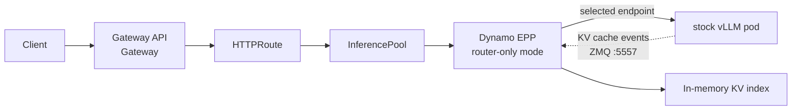
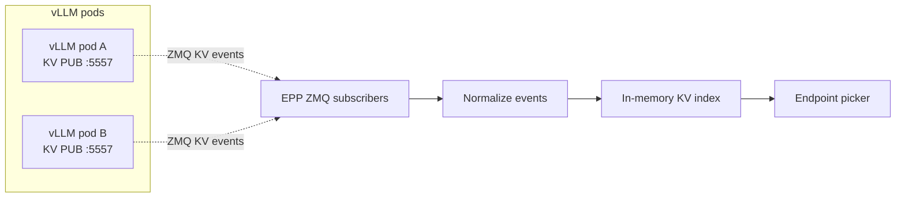

This experimental on-ramp is for Kubernetes stacks that already use
[Gateway API Inference Extension (GAIE)](https://gateway-api-inference-extension.sigs.k8s.io/) with
stock `vLLM serve` pods, or that want to evaluate that shape without installing the Dynamo operator
first. GAIE still owns endpoint selection at the Gateway API layer. The difference is that the
Endpoint Picker Plugin is a Dynamo EPP image running in a lightweight router-only mode.

**Status:** this page describes an experimental path being developed for existing GAIE + vLLM
deployments. Use the [GAIE Quickstart](./quickstart.mdx) for the supported operator-managed path,
where the Dynamo operator creates the EPP, workers, Services, and `InferencePool` together.

## What This Deploys



The example manifests create stock vLLM pods, a Dynamo EPP Deployment, an EPP Service, an
`InferencePool`, and an `HTTPRoute`. The EPP watches the vLLM pods, subscribes to vLLM's native KV
cache event stream, tokenizes incoming prompts for routing, and returns the selected endpoint to the
gateway.

This is intentionally not the same lifecycle model as the operator-managed GAIE quickstart. There is
no `DynamoGraphDeployment`, no Dynamo worker runtime, and no Dynamo event plane in this on-ramp.

## Prerequisites

- Kubernetes cluster with GPU nodes.
- `kubectl`, [Helm](https://helm.sh/docs/intro/install/), and
  [jq](https://jqlang.org/download/) configured for the cluster.
- Baseline Gateway API knowledge from the upstream
  [Gateway API getting started guide](https://gateway-api.sigs.k8s.io/guides/getting-started/introduction/)
  and the upstream [GAIE guide](https://gateway-api-inference-extension.sigs.k8s.io/guides/).
- A Gateway API implementation that supports GAIE. This walkthrough shows agentgateway and Istio;
  see the upstream
  [GAIE gateway implementation list](https://gateway-api-inference-extension.sigs.k8s.io/implementations/gateways/)
  for other implementations.
- A model namespace that can run GPU workloads.
- Hugging Face credentials if the model requires them. The
  [Kubernetes Quickstart](../README.md#huggingface-token-secret) explains the general secret
  pattern; it is not GAIE-specific.
- Access to the vLLM image used by the example.
- Access to a Dynamo EPP image with experimental router-only on-ramp support. The examples use the
  `nvcr.io/nvidia/ai-dynamo/dynamo-frontend:1.3.0` release-line convention; replace the image if
  your test branch publishes router-only support under a different tag.
- For the disaggregated example only, a decode-side P/D routing sidecar image that your cluster can
  pull. The example keeps this as an explicit image placeholder.

Set the namespace once and use it for every namespaced resource:

```bash
export NAMESPACE=gaie-vllm-onramp
export AGW_NAMESPACE=agentgateway-system
export ISTIO_NAMESPACE=istio-system

kubectl create namespace "$NAMESPACE" --dry-run=client -o yaml | kubectl apply -f -
```

## Install Gateway API and GAIE

Install the Gateway API and GAIE CRDs. If your platform team already installed these CRDs, skip to
[Create the Gateway](#create-the-gateway).

```bash
kubectl apply --server-side --force-conflicts \
  -f https://github.com/kubernetes-sigs/gateway-api/releases/download/v1.5.1/standard-install.yaml

kubectl apply \
  -f https://github.com/kubernetes-sigs/gateway-api-inference-extension/releases/download/v1.2.1/manifests.yaml
```

## Create the Gateway

Choose the Gateway implementation for this namespace.

<Tabs>
  <Tab title="agentgateway" language="bash">
    ```bash
    helm upgrade -i --create-namespace --namespace "$AGW_NAMESPACE" --version v1.0.0 \
      agentgateway-crds oci://cr.agentgateway.dev/charts/agentgateway-crds

    helm upgrade -i --namespace "$AGW_NAMESPACE" --version v1.0.0 \
      agentgateway oci://cr.agentgateway.dev/charts/agentgateway \
      --set inferenceExtension.enabled=true \
      --wait

    kubectl get gatewayclass agentgateway
    ```

    Create an `AgentgatewayParameters` resource and a `Gateway` in the model namespace. The
    parameters resource excludes Istio sidecar injection from `agentgateway-proxy` pods when the
    namespace has `istio-injection=enabled`.

    ```bash
    kubectl apply --server-side -n "$NAMESPACE" -f - <<'YAML'
    apiVersion: agentgateway.dev/v1alpha1
    kind: AgentgatewayParameters
    metadata:
      name: inference-gateway-params
    spec:
      deployment:
        spec:
          template:
            metadata:
              annotations:
                sidecar.istio.io/inject: "false"
    YAML

    kubectl apply -n "$NAMESPACE" -f - <<'YAML'
    apiVersion: gateway.networking.k8s.io/v1
    kind: Gateway
    metadata:
      name: inference-gateway
    spec:
      gatewayClassName: agentgateway
      infrastructure:
        parametersRef:
          group: agentgateway.dev
          kind: AgentgatewayParameters
          name: inference-gateway-params
      listeners:
        - name: http
          port: 80
          protocol: HTTP
    YAML

    kubectl wait gateway/inference-gateway -n "$NAMESPACE" \
      --for=condition=Programmed --timeout=180s
    ```
  </Tab>
  <Tab title="Istio" language="bash">
    ```bash
    export ISTIO_VERSION=1.29.2

    if ! command -v istioctl >/dev/null 2>&1; then
      curl -fsSL https://istio.io/downloadIstio | ISTIO_VERSION="$ISTIO_VERSION" sh -
      export PATH="$PWD/istio-$ISTIO_VERSION/bin:$PATH"
    fi

    istioctl install -y \
      --set values.global.istioNamespace="$ISTIO_NAMESPACE" \
      --set values.pilot.env.ENABLE_GATEWAY_API_INFERENCE_EXTENSION=true

    kubectl wait --for=condition=Available --timeout=180s \
      -n "$ISTIO_NAMESPACE" deployment/istiod

    kubectl apply -n "$NAMESPACE" -f - <<'YAML'
    apiVersion: gateway.networking.k8s.io/v1
    kind: Gateway
    metadata:
      name: inference-gateway
    spec:
      gatewayClassName: istio
      listeners:
        - name: http
          port: 80
          protocol: HTTP
    YAML

    kubectl wait gateway/inference-gateway -n "$NAMESPACE" \
      --for=condition=Programmed --timeout=180s

    kubectl get gatewayclass istio
    ```
  </Tab>
</Tabs>

Keeping the `Gateway` and `HTTPRoute` in the same namespace avoids a cross-namespace
`parentRefs[].namespace` field in the route. For the upstream routing model, see the
[Gateway API HTTP routing guide](https://gateway-api.sigs.k8s.io/guides/user-guides/http-routing/).

## Create Model Credentials

Create the model credentials required by your vLLM pods and by the EPP tokenizer download:

```bash
export HF_TOKEN=<your-hf-token>

kubectl create secret generic hf-token-secret \
  -n "$NAMESPACE" \
  --from-literal=HF_TOKEN="$HF_TOKEN"
```

## Deploy vLLM and the Dynamo EPP

From the repository root, pick one topology. Both examples are namespace-neutral; apply them with
`-n "$NAMESPACE"`.

<Tabs>
  <Tab title="Aggregated" language="bash">
    The aggregated example runs multiple stock vLLM pods and one Dynamo EPP that chooses a decode
    endpoint for each request.

    ```bash
    kubectl apply -n "$NAMESPACE" \
      -f deploy/inference-gateway/ext-proc/examples/onramp/agg.yaml
    ```
  </Tab>
  <Tab title="Disaggregated" language="bash">
    The disaggregated example is more experimental. Before applying it, replace the
    `pd-router-sidecar` image placeholder in `disagg.yaml` with a decode-side sidecar image that can
    consume the selected prefill endpoint and drive the vLLM KV-transfer handshake.

    ```bash
    kubectl apply -n "$NAMESPACE" \
      -f deploy/inference-gateway/ext-proc/examples/onramp/disagg.yaml
    ```
  </Tab>
</Tabs>

Wait for the selected topology to become ready:

<Tabs>
  <Tab title="Aggregated" language="bash">
    ```bash
    kubectl wait -n "$NAMESPACE" --for=condition=Available deployment/vllm-qwen --timeout=600s
    kubectl wait -n "$NAMESPACE" --for=condition=Available deployment/qwen-epp --timeout=180s
    kubectl get inferencepool qwen-pool -n "$NAMESPACE"
    kubectl get httproute qwen-route -n "$NAMESPACE"
    ```
  </Tab>
  <Tab title="Disaggregated" language="bash">
    ```bash
    kubectl wait -n "$NAMESPACE" --for=condition=Available deployment/vllm-qwen-prefill --timeout=600s
    kubectl wait -n "$NAMESPACE" --for=condition=Available deployment/vllm-qwen-decode --timeout=600s
    kubectl wait -n "$NAMESPACE" --for=condition=Available deployment/qwen-epp --timeout=180s
    kubectl get inferencepool qwen-pool -n "$NAMESPACE"
    kubectl get httproute qwen-route -n "$NAMESPACE"
    ```
  </Tab>
</Tabs>

## Verify End-to-End

Use one access mode to set `GATEWAY_URL`, then run the same OpenAI-compatible checks for either
Gateway implementation.

<Tabs>
  <Tab title="Port-forward" language="bash">
    ```bash
    export GATEWAY_SERVICE=$(kubectl get svc -n "$NAMESPACE" \
      -l gateway.networking.k8s.io/gateway-name=inference-gateway \
      -o jsonpath='{.items[0].metadata.name}')

    kubectl -n "$NAMESPACE" port-forward "svc/$GATEWAY_SERVICE" 8000:80
    ```

    In another terminal:

    ```bash
    export GATEWAY_URL=http://localhost:8000
    ```
  </Tab>
  <Tab title="LoadBalancer or tunnel" language="bash">
    ```bash
    export GATEWAY_HOST=$(kubectl get gateway inference-gateway -n "$NAMESPACE" \
      -o jsonpath='{.status.addresses[0].value}')
    export GATEWAY_URL=http://$GATEWAY_HOST
    ```
  </Tab>
</Tabs>

<CodeBlocks>
```bash title="List models"
curl --max-time 20 -sS "$GATEWAY_URL/v1/models" | jq .
```

```bash title="Send a chat request"
curl --max-time 120 -sS "$GATEWAY_URL/v1/chat/completions" \
  -H "content-type: application/json" \
  -d '{
    "model": "Qwen/Qwen3-0.6B",
    "messages": [{"role": "user", "content": "Write one sentence about prefix caching."}],
    "max_tokens": 64
  }' | jq .
```
</CodeBlocks>

Finish by checking the EPP logs. A successful smoke test should show pod discovery and endpoint
selection near the request time:

```bash
kubectl logs -n "$NAMESPACE" deployment/qwen-epp -c epp --tail=200
```

If the EPP logs stay quiet while the model responds, the route may be bypassing the `InferencePool`.

## How the EPP On-ramp Works

Dynamo has routing logic that is normally used by the Frontend when Dynamo owns the request entry
path. In this on-ramp, the EPP embeds that routing logic so a Gateway API implementation can ask the
EPP to choose an endpoint before forwarding the request to a stock vLLM pod.

For the broader routing model, see the [Frontend Guide](../../components/frontend/frontend-guide.md)
and [Router Guide](../../components/router/router-guide.md).

The example manifests express the experimental router-only contract through environment variables on
the EPP container:

| Setting | Required for | Meaning |
|---|---|---|
| `DYN_EPP_MODE=router-only` | All on-ramp deployments | Run the EPP without the Dynamo operator-managed control plane. |
| `DYN_EPP_POD_SELECTOR` | All on-ramp deployments | Select the stock vLLM pods watched by the EPP. |
| `DYN_EPP_TARGET_PORT` | All on-ramp deployments | vLLM OpenAI-compatible HTTP port. |
| `DYN_EPP_KV_EVENTS=true` | KV cache aware routing | Subscribe to each vLLM pod's KV event socket. |
| `DYN_EPP_KV_EVENT_PORT` | KV cache aware routing | Port from vLLM `--kv-events-config`. |
| `DYN_KV_CACHE_BLOCK_SIZE` | KV cache aware routing | Must match vLLM `--block-size`. |
| `DYN_ROUTER_PREFILL_LOAD_SCALE` | KV cache aware routing | Weight the prefill-load term in the Dynamo router score. |
| `DYN_DISCOVERY_BACKEND=mem` | Router-only runtime | Avoid etcd discovery. |
| `DYN_EVENT_PLANE=zmq` | Router-only runtime | Consume live ZMQ events instead of Dynamo NATS. |
| `DYN_EPP_ROLE_LABEL` | Disaggregated only | Split prefill and decode pods. |
| `DYN_ENFORCE_DISAGG=true` | Disaggregated only | Fail instead of silently falling back to aggregated routing. |
| `DYN_EPP_EMIT_PREFILLER_HOST_PORT=true` | Disaggregated only | Emit the selected prefill pod for the decode-side sidecar. |

## KV Events Without NATS

Router-only mode reads vLLM's native ZMQ KV cache events directly. That keeps the on-ramp small, but
the EPP only knows about events it observes while it is connected.



On startup, the EPP begins with an empty KV index. It has no snapshot of prefixes that were already
cached on vLLM pods before the EPP started, so early requests may route with little or no cache
locality. The index warms as new KV cache events arrive from live traffic.

## What Dynamo-managed GAIE Adds

The operator-managed [GAIE Quickstart](./quickstart.mdx) keeps the same Gateway API integration goal
but adds the Dynamo runtime around it:

- NATS/JetStream-backed routing-state delivery instead of only live ZMQ events.
- Event replay after EPP restart or temporary disconnects.
- Gap detection and recovery when routing events are missed.
- Initial worker cache-state synchronization so the EPP can start with a populated routing view.
- Operator-managed lifecycle for workers, Services, the EPP, and the generated `InferencePool`.

Use the operator-managed quickstart when you need those properties.

## Troubleshooting

<Tabs>
  <Tab title="agentgateway" language="bash">
    ```bash
    kubectl describe gateway inference-gateway -n "$NAMESPACE"
    kubectl describe httproute qwen-route -n "$NAMESPACE"
    kubectl get pods -n "$AGW_NAMESPACE"
    kubectl logs -n "$AGW_NAMESPACE" deployment/agentgateway --tail=50
    kubectl get gatewayclass agentgateway
    ```

    If requests return HTTP 500 and the namespace has `istio-injection=enabled`, verify the
    `agentgateway-proxy` pod does not have an `istio-proxy` sidecar:

    ```bash
    kubectl get pods -n "$NAMESPACE" \
      -l gateway.networking.k8s.io/gateway-name=inference-gateway \
      -o jsonpath='{.items[*].spec.containers[*].name}'
    ```
  </Tab>
  <Tab title="Istio" language="bash">
    ```bash
    kubectl describe gateway inference-gateway -n "$NAMESPACE"
    kubectl describe httproute qwen-route -n "$NAMESPACE"
    kubectl get pods -n "$ISTIO_NAMESPACE"
    kubectl logs -n "$ISTIO_NAMESPACE" deployment/istiod --tail=50
    kubectl get gatewayclass istio
    ```

    Confirm Istio was installed with `ENABLE_GATEWAY_API_INFERENCE_EXTENSION=true` if the
    `HTTPRoute` does not attach to the `InferencePool`.
  </Tab>
</Tabs>

## Clean Up

If this namespace is only for the on-ramp test, delete it:

```bash
kubectl delete namespace "$NAMESPACE"
```
