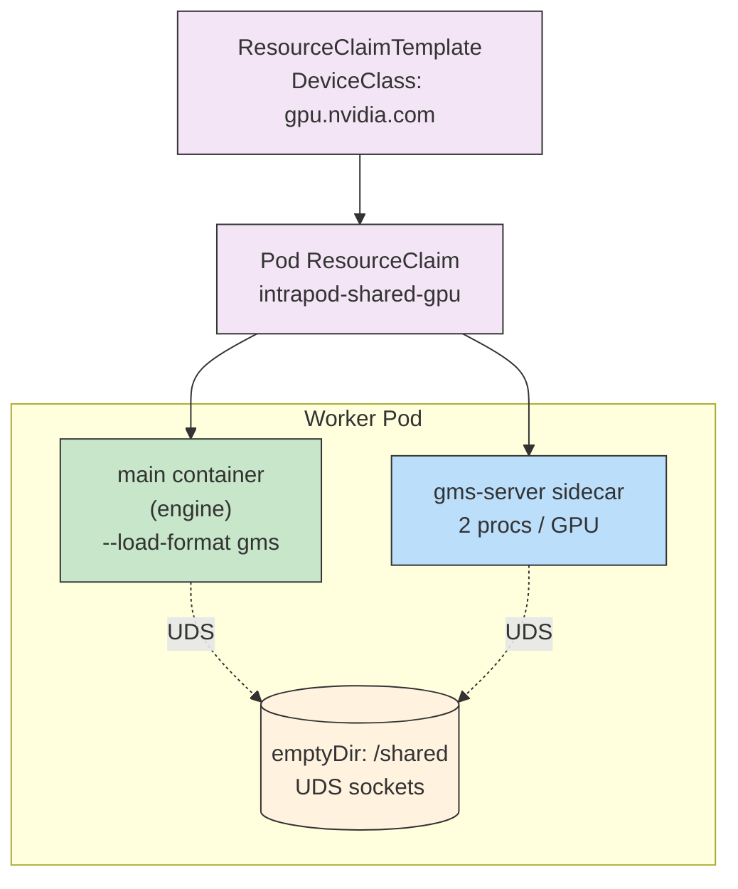

The GPU Memory Service (GMS) is a sidecar container that gives multiple containers in the same pod shared access to the same physical GPUs. It is the foundation for [Engine Failover](failover.md) and is also used by [checkpoint snapshots](snapshot.md).

## Overview

A traditional Dynamo worker pod requests GPUs via the NVIDIA device plugin (`nvidia.com/gpu`). This model assigns each GPU to exactly one container, which makes it impossible to share resident weights or KV cache across containers in the same pod.

GMS replaces that model with **Dynamic Resource Allocation (DRA)**. The operator:

- Removes the `nvidia.com/gpu` resource request from the main container.
- Adds a pod-level `ResourceClaim` that every GMS-aware container references.
- Injects a `gms-server` sidecar that holds the GPUs and exposes two processes per GPU (one for weights, one for KV cache) over UDS sockets on a shared `emptyDir` volume.

Engines connect to the sidecar over those sockets and pull weights / KV cache out of resident GPU memory. Because the weights stay in GPU memory across engine restarts, a restarted or standby engine can become ready much faster than a cold reload.

## Pod layout



Key properties:

- **`gms-server` is a native sidecar.** It runs as an init container with `restartPolicy: Always`, so it starts before the main container and stays up for the life of the pod. A startup probe waits for the sidecar to create `/shared/gms-ready`; the main container does not start serving until the sidecar is healthy.
- **All GPU-consuming containers share one `ResourceClaim`.** Both `gms-server` and any engine containers (under [failover](failover.md), `engine-0` and `engine-1`) reference `intrapod-shared-gpu`, so they see the same physical devices.
- **UDS sockets live on an `emptyDir` volume mounted at `/shared`.** The path is exported to the main container as `GMS_SOCKET_DIR`.

## Requirements

GMS requires a DRA-capable cluster:

| Component | Minimum version |
| --- | --- |
| Kubernetes | 1.32 |
| NVIDIA GPU Operator | 25.10.0 |
| `nvidia-dra-driver-gpu` | 25.12.0 *(installed separately from its own Helm chart — the GPU Operator does not include it)* |
| NVIDIA GPU driver | 580 |

To verify DRA is installed and the DeviceClass is present:

```bash
kubectl api-resources | grep resource.k8s.io
# Expect: resourceclaims, resourceclaimtemplates, deviceclasses, ...

kubectl get deviceclass gpu.nvidia.com
# Expect the DeviceClass to exist
```

> [!WARNING]
> Any pod on the same node that requests `nvidia.com/gpu` directly (via the traditional device plugin) can collide with DRA allocations for GMS pods. The two allocators can hand the same physical GPU to different pods, which typically surfaces as `shm_broadcast` errors in the engine. Make sure no legacy GPU workloads are running on nodes that host GMS pods.

## Configuration

Enable GMS on a worker service via `gpuMemoryService`:

```yaml
apiVersion: nvidia.com/v1alpha1
kind: DynamoGraphDeployment
metadata:
  name: my-deployment
spec:
  services:
    VllmWorker:
      resources:
        limits:
          gpu: "2"
      gpuMemoryService:
        enabled: true
      extraPodSpec:
        mainContainer:
          image: nvcr.io/nvidia/ai-dynamo/vllm-runtime:<tag>
          command: ["python3", "-m", "dynamo.vllm"]
          args:
            - --model
            - Qwen/Qwen3-0.6B
            - --tensor-parallel-size
            - "2"
            - --load-format
            - gms
```

### Fields

| Field | Type | Default | Description |
| --- | --- | --- | --- |
| `enabled` | `boolean` | — | Activates the GMS sidecar. GPU resources on the main container are replaced with a DRA `ResourceClaim`. |
| `mode` | `intraPod` \| `interPod` | `intraPod` | Deployment topology. Only `intraPod` is implemented today; `interPod` is reserved. |
| `deviceClassName` | `string` | `gpu.nvidia.com` | DRA DeviceClass to request GPUs from. |

See the [API reference](api-reference.md#gpumemoryservicespec) for the full generated schema.

### Engine-side flag

Engines that participate in GMS must opt in on the command line:

```text
--load-format gms
```

This tells the engine to load weights through the GMS sidecar rather than from local filesystem or a remote checkpoint store. It is currently supported on the vLLM backend.

## How the operator wires it up

When `gpuMemoryService.enabled: true`, the operator performs two transforms on the worker pod spec during reconciliation:

1. **`ApplyClaim`** (`deploy/operator/internal/dra/dra.go`)
   - Strips `nvidia.com/gpu` from the main container's `resources.limits` / `resources.requests`.
   - Adds a pod-level `PodResourceClaim` named `intrapod-shared-gpu`, backed by a generated `ResourceClaimTemplate` (`<parent>-<service>-gpu`).
   - Adds a toleration for `nvidia.com/gpu=NoSchedule` (DRA bypasses the device-plugin toleration injection).

2. **`EnsureServerSidecar`** (`deploy/operator/internal/gms/gms.go`)
   - Appends an init container named `gms-server` with `restartPolicy: Always`.
   - Creates an `emptyDir` volume `gms-shared`, mounts it at `/shared` on both the sidecar and the main container, and sets `GMS_SOCKET_DIR=/shared` on the main container.
   - Adds a startup probe that waits for `/shared/gms-ready` with `periodSeconds: 1` and `failureThreshold: 300` (5-minute ceiling).

Both hooks run before any failover transform, so if failover is also enabled the engines are cloned from a main container that already has the DRA claim, the shared mount, and `GMS_SOCKET_DIR`.

## Related

- [Engine Failover](failover.md) — builds on GMS to run an active/standby engine pair in the same pod.
- [Snapshot and restore](snapshot.md) — uses GMS loader/saver sidecars to checkpoint GPU state.
- [API reference: `GPUMemoryServiceSpec`](api-reference.md#gpumemoryservicespec)
