# SLA Planner Quick Start Guide

Complete workflow to deploy SLA-based autoscaling for Dynamo deployments. This guide consolidates all necessary steps into a clear, sequential process.

> [!IMPORTANT]
> **Prerequisites**: This guide assumes you have a Kubernetes cluster with GPU nodes and have completed the [Dynamo Platform installation](/docs/kubernetes/installation_guide.md).

## Overview

The SLA Planner automatically scales prefill and decode workers to meet your TTFT (Time To First Token) and ITL (Inter-Token Latency) targets. The deployment process consists of two mandatory phases:

1. **Pre-Deployment Profiling** (2-4 hours) - Generates performance data
2. **SLA Planner Deployment** (5-10 minutes) - Enables autoscaling

```mermaid
flowchart TD
    A[🚀 Start SLA Planner Setup] --> B{📊 Profiling Complete?}
    B -->|❌ No| C[⏱️ Run Pre-Deployment Profiling<br/>Duration: 2-4 hours<br/>Purpose: Generate performance data]
    C --> D[✅ Verify Profiling Results]
    D --> E[🚀 Deploy SLA Planner<br/>Duration: 5-10 minutes<br/>Purpose: Enable autoscaling]
    B -->|✅ Yes| E
    E --> F[🧪 Test & Monitor]
    F --> G[🎉 Production Ready]

    style A fill:#e1f5fe
    style C fill:#fff3e0
    style E fill:#e8f5e8
    style G fill:#f3e5f5
    style B fill:#fff8e1
```



## Phase 1: Pre-Deployment Profiling (REQUIRED)

> [!WARNING]
> **MANDATORY**: Pre-deployment profiling must be completed before deploying SLA planner. This process analyzes your model's performance characteristics to determine optimal tensor parallelism configurations and scaling parameters.

### Step 1.1: Set Up Profiling Environment

Set up your Kubernetes namespace for profiling (one-time per namespace). If your namespace is already set up, skip this step.

```bash
export NAMESPACE=your-namespace
```

**Prerequisites**: Ensure all dependencies are installed:
```bash
pip install -r deploy/utils/requirements.txt
```

### Step 1.2: Inject Your Configuration

Use the injector utility to place your DGD manifest into the PVC:

```bash
# Use default disagg.yaml config
python3 -m deploy.utils.inject_manifest --namespace $NAMESPACE --src components/backends/vllm/deploy/disagg.yaml --dest /data/configs/disagg.yaml

# Or use a custom disagg config file
python3 -m deploy.utils.inject_manifest --namespace $NAMESPACE --src my-custom-disagg.yaml --dest /data/configs/disagg.yaml
```

> **Note**: All paths must start with `/data/` for security reasons.

### Step 1.3: Configure SLA Targets

For dense models, edit `$DYNAMO_HOME/benchmarks/profiler/deploy/profile_sla_job.yaml`:

```yaml
spec:
  template:
    spec:
      containers:
        - name: profile-sla
          args:
            - --isl
            - "3000" # average ISL is 3000 tokens
            - --osl
            - "150" # average OSL is 150 tokens
            - --ttft
            - "200" # target TTFT is 200ms
            - --itl
            - "20" # target ITL is 20ms
            - --backend
            - <vllm/sglang>
```

For MoE models, edit `$DYNAMO_HOME/benchmarks/profiler/deploy/profile_sla_moe_job.yaml` instead.

### Step 1.4: Run Profiling

Set the container image and config path:

```bash
export DOCKER_IMAGE=nvcr.io/nvidia/ai-dynamo/vllm-runtime:my-tag
export DGD_CONFIG_FILE=/data/configs/disagg.yaml
```

Run profiling:

```bash
# for dense models
envsubst < benchmarks/profiler/deploy/profile_sla_job.yaml | kubectl apply -f -

# for MoE models
envsubst < benchmarks/profiler/deploy/profile_sla_moe_job.yaml | kubectl apply -f -
```

### Step 1.5: Monitor Profiling Progress

```bash
kubectl get jobs -n $NAMESPACE
kubectl logs job/profile-sla -n $NAMESPACE
```

> [!NOTE]
> **Time Investment**: This profiling process is comprehensive and typically takes **2-4 hours** to complete. The script systematically tests multiple tensor parallelism configurations and load conditions to find optimal performance settings.

### Step 1.6: Download Profiling Results

After the profiling job completes successfully:

```bash
# Download to directory
python3 -m deploy.utils.download_pvc_results --namespace $NAMESPACE --output-dir ./results --folder /data/profiling_results
```

**Expected Output Structure:**
```
./results/
├── prefill_performance.png                    # Main prefill performance plot
├── decode_performance.png                     # Main decode performance plot
├── selected_prefill_interpolation/
│   ├── raw_data.npz                           # Prefill interpolation data
│   ├── prefill_ttft_interpolation.png         # TTFT vs ISL plot
│   └── prefill_throughput_interpolation.png   # Throughput vs ISL plot
└── selected_decode_interpolation/
    ├── raw_data.npz                           # Decode interpolation data
    └── decode_tp{best_tp}.png                 # 3D ITL surface plot
```

**Verify Success**: Look for terminal output like:
```
Suggested prefill TP:4 (TTFT 48.37 ms, throughput 15505.23 tokens/s/GPU)
Suggested decode TP:4 (ITL 4.83 ms, throughput 51.22 tokens/s/GPU)
```

## Phase 2: Deploy SLA Planner

### Step 2.1: Verify Prerequisites

Before deploying the SLA planner, ensure:

- **Pre-deployment profiling completed successfully** (from Phase 1)
- **Profiling results saved to `dynamo-pvc` PVC**
- **[kube-prometheus-stack](/docs/kubernetes/metrics.md) installed and running**
- **Dynamo platform installed** (see [Installation Guide](/docs/kubernetes/installation_guide.md))
- **Prefill and decode worker uses the best parallelization mapping from profiling**

### Step 2.2: Deploy the System

We use vllm as the backend engine in this guide. SLA planner also supports SGLang and TensorRT-LLM.

```bash
# Apply the disaggregated planner deployment
kubectl apply -f components/backends/vllm/deploy/disagg_planner.yaml -n $NAMESPACE # for vllm
# kubectl apply -f components/backends/sglang/deploy/disagg_planner.yaml -n $NAMESPACE # for sglang
# kubectl apply -f components/backends/trtllm/deploy/disagg_planner.yaml -n $NAMESPACE # for trtllm

# Check deployment status
kubectl get pods -n $NAMESPACE
```

**Expected pods** (all should be `1/1 Running`):
```
vllm-disagg-planner-frontend-*            1/1 Running
vllm-disagg-planner-planner-*             1/1 Running
vllm-disagg-planner-backend-*             1/1 Running
vllm-disagg-planner-prefill-*             1/1 Running
```

### Step 2.3: Test the System

**Important:** Streaming requests (`"stream": true`) are required for the planner to collect latency metrics and make scaling decisions.

```bash
# Port forward to frontend
kubectl port-forward -n $NAMESPACE deployment/vllm-disagg-planner-frontend 8000:8000

# Send a streaming request (required for full metrics)
curl -N http://localhost:8000/v1/chat/completions \
  -H "Content-Type: application/json" \
  -d '{
    "model": "Qwen/Qwen3-0.6B",
    "messages": [
    {
        "role": "user",
        "content": "Hello, how are you?"
    }
    ],
    "stream":true,
    "max_tokens": 30
  }'
```

### Step 2.4: Monitor Scaling

```bash
# Check planner logs for scaling decisions
kubectl logs -n $NAMESPACE deployment/vllm-disagg-planner-planner --tail=10
```

**Expected successful output** (after streaming requests):
```
New adjustment interval started!
Observed num_req: X.XXX isl: X.XXX osl: X.XXX
Observed ttft: X.XXXs itl: X.XXXs
Number of prefill workers: 1, number of decode workers: 1
```

## Phase 3: Production Readiness

### Monitoring Metrics

- **Basic metrics** (request count): Available with any request type
- **Latency metrics** (TTFT/ITL): Only available with `"stream": true` requests
- **Scaling decisions**: Require sufficient request volume and streaming requests

### Troubleshooting

**Connection Issues:**
```bash
# Verify Prometheus is accessible
kubectl port-forward svc/prometheus-kube-prometheus-prometheus -n monitoring 9090:9090
curl "http://localhost:9090/api/v1/query?query=up"
```

**Missing Metrics:**
```bash
# Check frontend metrics
kubectl port-forward -n $NAMESPACE deployment/vllm-disagg-planner-frontend 8000:8000
curl http://localhost:8000/metrics | grep nv_llm_http_service
```

**Worker Issues:**
- Large models can take 10+ minutes to initialize
- Check worker logs: `kubectl logs -n $NAMESPACE deployment/vllm-disagg-planner-backend`
- Ensure GPU resources are available for workers

## Next Steps

- **Advanced Configuration**: See [SLA Planner Advanced Guide](sla_planner_deployment.md) for detailed configuration options
- **Architecture Details**: See [SLA-based Planner Architecture](/docs/architecture/sla_planner.md) for technical details
- **Performance Tuning**: See [Pre-Deployment Profiling Guide](/docs/benchmarks/pre_deployment_profiling.md) for advanced profiling options

## Quick Reference

| Phase | Duration | Purpose | Status Check |
|-------|----------|---------|--------------|
| Profiling | 2-4 hours | Generate performance data | `kubectl logs job/profile-sla` |
| Deployment | 5-10 minutes | Enable autoscaling | `kubectl get pods` |
| Testing | 5 minutes | Verify functionality | `kubectl logs deployment/planner` |

---

> [!TIP]
> **Need Help?** If you encounter issues, check the [troubleshooting section](#troubleshooting) or refer to the detailed guides linked in [Next Steps](#next-steps).