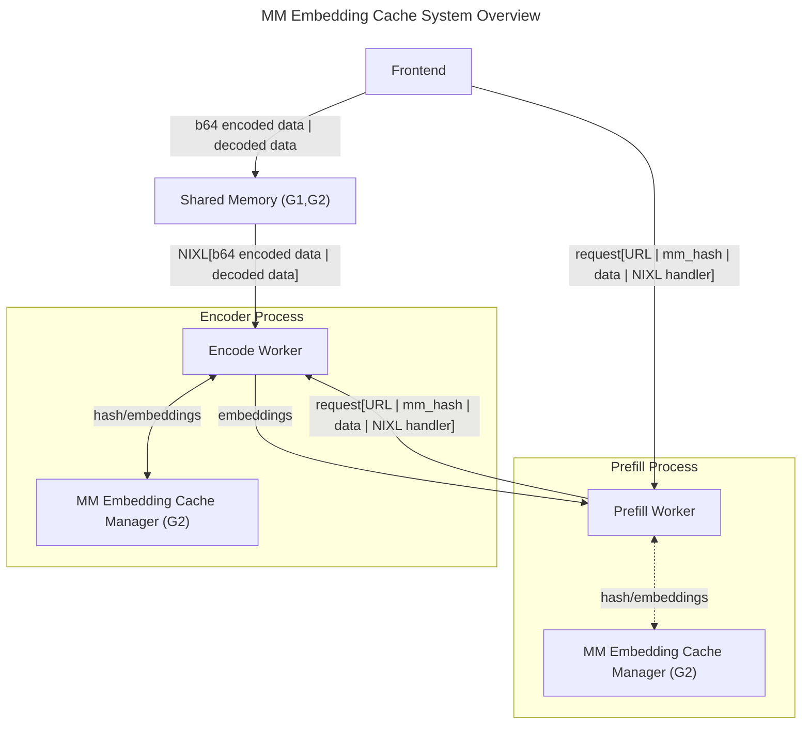
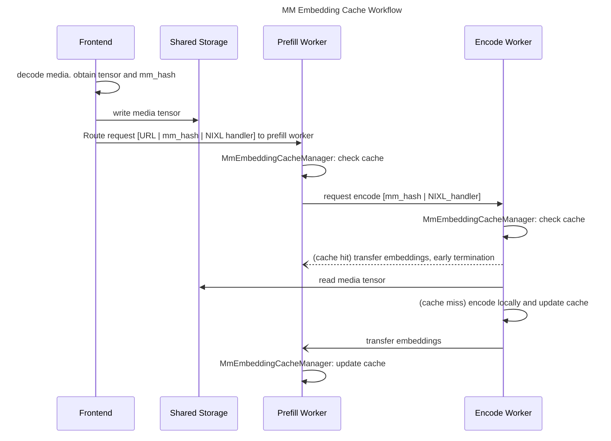
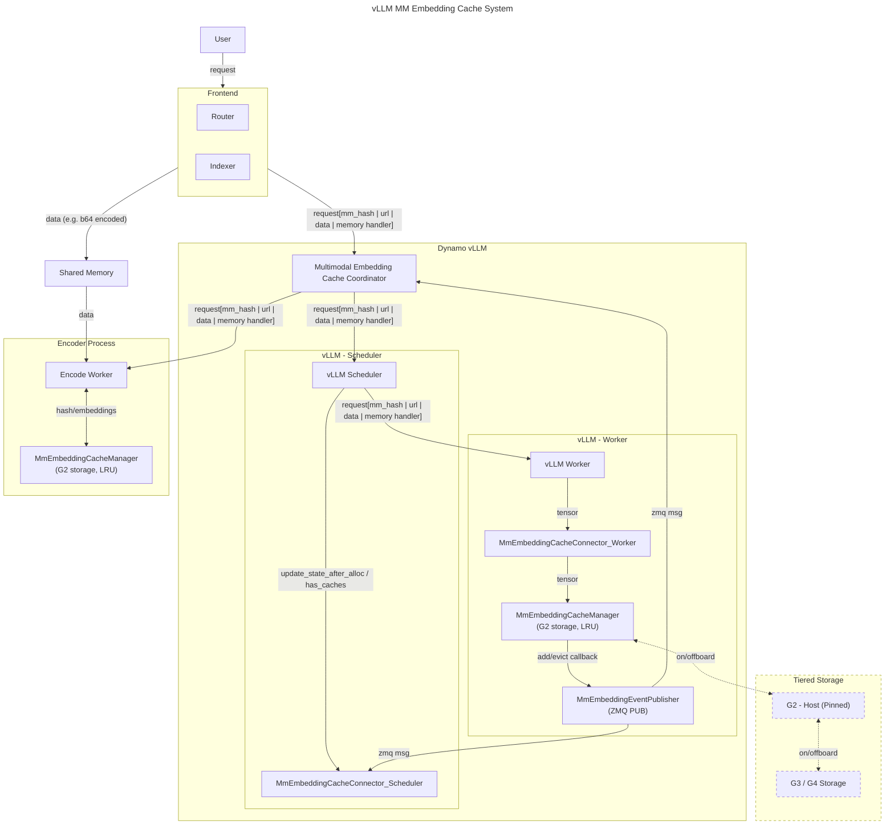
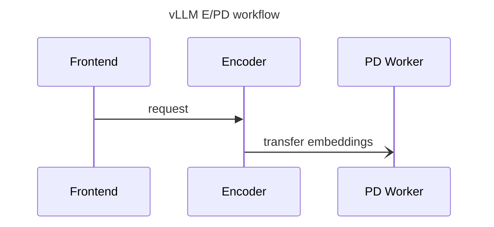
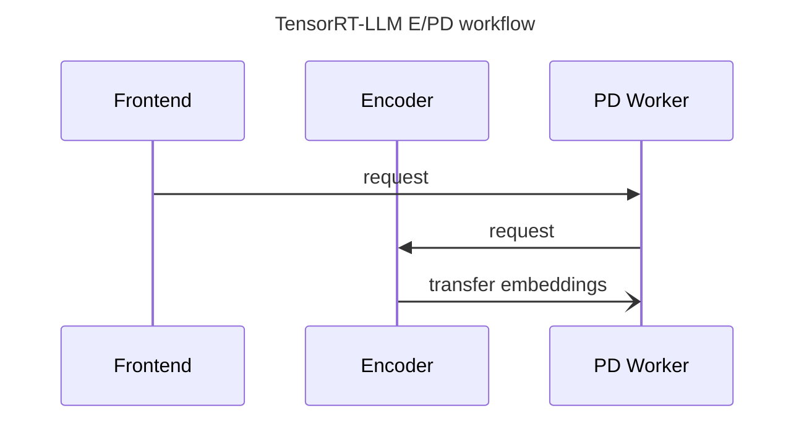
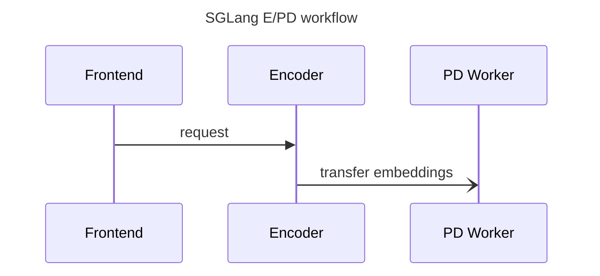
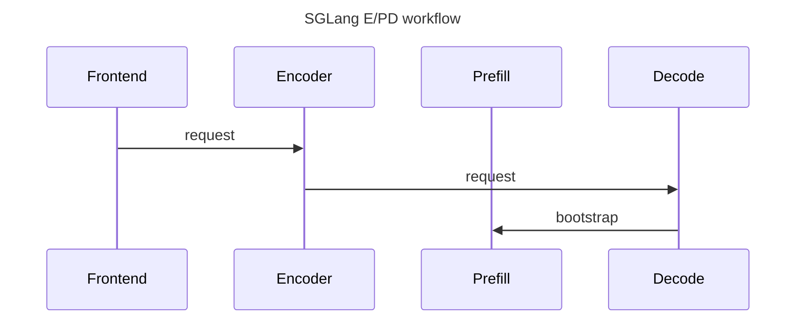

```mermaid
---
title: MM Embedding Cache System Overview
---
flowchart TD
    Frontend

    SharedMemory["Shared Memory (G1,G2)"]

    subgraph PrefillProcess["Prefill Process"]
        vLlmWorker["Prefill Worker"]
        PrefillMmEmbeddingCacheManager["MM Embedding Cache Manager (G2)"]
    end

    subgraph EncoderProcess["Encoder Process"]
        EncodeWorker["Encode Worker"]
        EncodeMmEmbeddingCacheManager["MM Embedding Cache Manager (G2)"]
    end

    Frontend --"b64 encoded data | decoded data"-->SharedMemory
    Frontend --request[URL | mm_hash | data | NIXL handler]--> vLlmWorker
    vLlmWorker <-."hash/embeddings".-> PrefillMmEmbeddingCacheManager

    vLlmWorker --request[URL | mm_hash | data | NIXL handler]--> EncodeWorker
    SharedMemory --NIXL[b64 encoded data | decoded data]--> EncodeWorker
    EncodeWorker <--"hash/embeddings"--> EncodeMmEmbeddingCacheManager
    EncodeWorker --embeddings--> vLlmWorker
```

```mermaid
---
title: MM Embedding Cache Workflow
---
sequenceDiagram
    participant F as Frontend
    participant S as Shared Storage
    participant P as Prefill Worker
    participant E as Encode Worker

    F->>F: decode media. obtain tensor and mm_hash
    F->>S: write media tensor
    F->>P: Route request [URL | mm_hash | NIXL handler] to prefill worker
    P->>P: MmEmbeddingCacheManager: check cache

    P->>E: request encode [mm_hash | NIXL_handler]
    E->>E: MmEmbeddingCacheManager: check cache
    E--)P: (cache hit) transfer embeddings, early termination

    E->>S: read media tensor
    E->>E: (cache miss) encode locally and update cache
    E-)P: transfer embeddings

    P->>P: MmEmbeddingCacheManager: update cache
```

```mermaid
---
title: vLLM MM Embedding Cache System
---
flowchart TD
    User
    SharedMemory["Shared Memory"]

    subgraph Frontend
      Router
      Indexer
    end

    subgraph DynamoVllm["Dynamo vLLM"]
        mmCacheCoordinator["Multimodal Embedding Cache Coordinator"]

        subgraph DynamoScheduler["vLLM - Scheduler"]
            vLllmScheduler["vLLM Scheduler"]
            MmEmbeddingCacheConnector_Scheduler
        end

        subgraph DynamoWorker["vLLM - Worker"]
            vLlmWorker["vLLM Worker"]
            MmEmbeddingCacheConnector_Worker
            MmEmbeddingCacheManager["MmEmbeddingCacheManager<br/>(G2 storage, LRU)"]
            MmEmbeddingEventPublisher["MmEmbeddingEventPublisher<br/>(ZMQ PUB)"]
        end
    end

    subgraph EncoderProcess["Encoder Process"]
        EncodeWorker["Encode Worker"]
        EncodeMmEmbeddingCacheManager["MmEmbeddingCacheManager<br/>(G2 storage, LRU)"]
    end

    subgraph TieredStorage["Tiered Storage"]
        direction LR
        G2["G2 - Host (Pinned)"]
        Gx["G3 / G4 Storage"]
    end

    %% Request flow
    User --request--> Frontend
    Frontend --"data (e.g. b64 encoded)"--> SharedMemory
    Frontend --"request[mm_hash | url | data | memory handler]"--> mmCacheCoordinator
    mmCacheCoordinator --request[mm_hash | url | data | memory handler]--> EncodeWorker
    mmCacheCoordinator --request[mm_hash | url | data | memory handler]--> vLllmScheduler

    %% Scheduler flow
    vLllmScheduler --"update_state_after_alloc / has_caches"--> MmEmbeddingCacheConnector_Scheduler
    vLllmScheduler --request[mm_hash | url | data | memory handler]--> vLlmWorker

    %% Worker flow
    vLlmWorker --tensor--> MmEmbeddingCacheConnector_Worker
    MmEmbeddingCacheConnector_Worker --tensor--> MmEmbeddingCacheManager
    MmEmbeddingCacheManager --"add/evict callback"--> MmEmbeddingEventPublisher

    %% Encoder flow
    SharedMemory --"data"--> EncodeWorker
    EncodeWorker <--"hash/embeddings"--> EncodeMmEmbeddingCacheManager

    %% ZMQ event notifications
    MmEmbeddingEventPublisher --"zmq msg"--> mmCacheCoordinator
    MmEmbeddingEventPublisher --"zmq msg"--> MmEmbeddingCacheConnector_Scheduler

    %% Tiered storage (future)
    MmEmbeddingCacheManager <-."on/offboard".-> G2
    G2 <-."on/offboard".-> Gx

    classDef future stroke-dasharray: 5 5
    class G2,Gx,TieredStorage future
```

```mermaid
---
title: vLLM E/PD workflow
---
sequenceDiagram
    participant F as Frontend
    participant E as Encoder
    participant PD as PD Worker

    F ->> E: request
    E -) PD: transfer embeddings
```

```mermaid
---
title: TensorRT-LLM E/PD workflow
---
sequenceDiagram
    participant F as Frontend
    participant E as Encoder
    participant PD as PD Worker

    F ->> PD: request
    PD ->> E: request
    E -) PD: transfer embeddings
```

```mermaid
---
title: SGLang E/PD workflow
---
sequenceDiagram
    participant F as Frontend
    participant E as Encoder
    participant PD as PD Worker

    F ->> E: request
    E -) PD: transfer embeddings
```

```mermaid
---
title: SGLang E/PD workflow
---
sequenceDiagram
    participant F as Frontend
    participant E as Encoder
    participant P as Prefill
    participant D as Decode

    F ->> E: request
    E ->> D: request
    D ->> P: bootstrap
```
