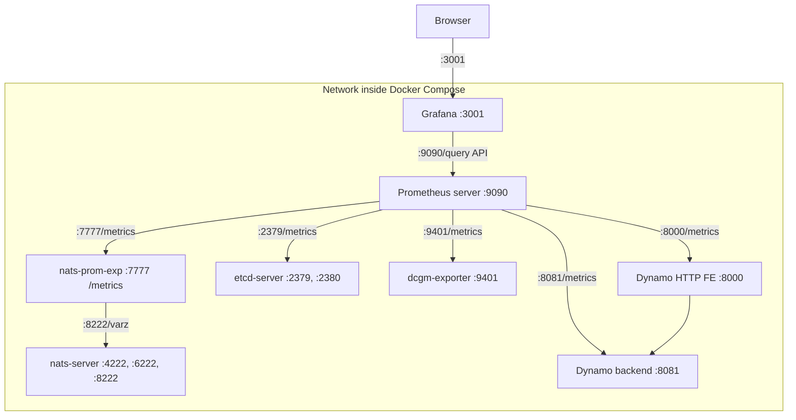
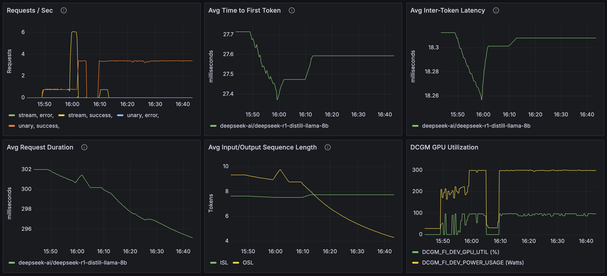

<!--
SPDX-FileCopyrightText: Copyright (c) 2025 NVIDIA CORPORATION & AFFILIATES. All rights reserved.
SPDX-License-Identifier: Apache-2.0
-->

# Dynamo MetricsRegistry

## Overview

Dynamo provides built-in metrics capabilities through the `MetricsRegistry` trait, which is automatically available whenever you use the `DistributedRuntime` framework. This guide explains how to use metrics for observability and monitoring across all Dynamo components.

## Automatic Metrics

Dynamo automatically exposes metrics with the `dynamo_` name prefixes. It also adds the following labels `dynamo_namespace`, `dynamo_component`, and `dynamo_endpoint` to indicate which component is providing the metric.

**Frontend Metrics**: When using Dynamo HTTP Frontend (`--framework VLLM` or `--framework TRTLLM`), these metrics are automatically exposed with the `dynamo_frontend_*` prefix and include `model` labels containing the model name. These cover request handling, token processing, and latency measurements. See [prometheus-grafana.md](prometheus-grafana.md#available-metrics) for the complete list of frontend metrics.

**Component Metrics**: The core Dynamo backend system automatically exposes metrics with the `dynamo_component_*` prefix for all components that use the `DistributedRuntime` framework. These include request counts, processing times, byte transfers, and system uptime metrics. See [prometheus-grafana.md](prometheus-grafana.md#available-metrics) for the complete list of component metrics.

**Specialized Component Metrics**: Components can also expose additional metrics specific to their functionality. For example, a `preprocessor` component exposes metrics with the `dynamo_preprocessor_*` prefix. See [prometheus-grafana.md](prometheus-grafana.md#available-metrics) for details on specialized component metrics.

**Kubernetes Integration**: For comprehensive Kubernetes deployment and monitoring setup, see the [Kubernetes Metrics Guide](../kubernetes/observability/metrics.md). This includes Prometheus Operator setup, metrics collection configuration, and visualization in Grafana.

## GPU Hardware Metadata

Dynamo workers automatically expose GPU hardware metadata via the `dynamo_component_gpu_info` metric. This metric uses the Prometheus info pattern (gauge with value=1) where metadata is exposed as labels.

Each GPU visible to a worker exposes one metric series with the following labels:

**GPU Identification:** `gpu_uuid`, `gpu_index`, `pci_bus_id`
**Hardware Specifications:** `gpu_model`, `gpu_memory_gb`, `compute_capability`
**Software Environment:** `driver_version`, `cuda_version`
**Configuration:** `power_limit_w`, `mig_mode`
**Standard Dynamo Labels:** `model`, `dynamo_component`, `dynamo_namespace`

### Example Output

```prometheus
# Single GPU worker
dynamo_component_gpu_info{
    gpu_uuid="GPU-ef6ef310-6bb8-8bfa-1b66-9fb6e8479ee8",
    gpu_index="0",
    gpu_model="NVIDIA RTX 6000 Ada Generation",
    gpu_memory_gb="48.0",
    compute_capability="8.9",
    pci_bus_id="00000000:01:00.0",
    driver_version="535.129.03",
    cuda_version="12.2",
    power_limit_w="300",
    mig_mode="Disabled",
    model="Qwen/Qwen3-0.6B",
    dynamo_component="backend",
    dynamo_namespace="dynamo"
} 1.0

# Multi-GPU worker (tensor parallel) - one series per GPU
dynamo_component_gpu_info{gpu_index="0", gpu_uuid="GPU-abc...", ...} 1.0
dynamo_component_gpu_info{gpu_index="1", gpu_uuid="GPU-def...", ...} 1.0
```

### Use Cases

- **Hardware Inventory:** Query GPU models, memory, and compute capabilities across your cluster
- **DCGM Correlation:** Use `gpu_uuid` label to join with DCGM GPU telemetry metrics
- **Version Verification:** Check driver and CUDA version consistency across workers
- **Capacity Planning:** Aggregate GPU memory and power limits per model

> [!NOTE]
> GPU metadata collection requires the `nvidia-ml-py` package (pynvml) to query NVML. If unavailable, workers will start normally but the metric will not be populated.

## Metrics Hierarchy

The `MetricsRegistry` trait is implemented by `DistributedRuntime`, `Namespace`, `Component`, and `Endpoint`, providing a hierarchical approach to metric collection that matches Dynamo's distributed architecture:

- `DistributedRuntime`: Global metrics across the entire runtime
- `Namespace`: Metrics scoped to a specific dynamo_namespace
- `Component`: Metrics for a specific dynamo_component within a namespace
- `Endpoint`: Metrics for individual dynamo_endpoint within a component

This hierarchical structure allows you to create metrics at the appropriate level of granularity for your monitoring needs.


## Getting Started

For a complete setup guide including Docker Compose configuration, Prometheus setup, and Grafana dashboards, see the [Getting Started section](prometheus-grafana.md#getting-started) in the Prometheus and Grafana guide.

The quick start includes:
- Docker Compose setup for Prometheus and Grafana
- Pre-configured dashboards and datasources
- Access URLs for all monitoring endpoints
- GPU targeting configuration

## Implementation Examples

Examples of creating metrics at different hierarchy levels and using dynamic labels are included in this document below.

### Grafana Dashboards

Use dashboards in `deploy/metrics/grafana_dashboards/`:
- `grafana-dynamo-dashboard.json`: General Dynamo dashboard
- `grafana-dcgm-metrics.json`: DCGM GPU metrics dashboard

## Metrics Visualization Architecture

### Service Topology

The metrics system follows this architecture for collecting and visualizing metrics:



### Grafana Dashboard

The metrics system includes a pre-configured Grafana dashboard for visualizing service metrics:



## Detailed Setup Guide

For complete setup instructions including Docker Compose, Prometheus configuration, and Grafana dashboards, see:

```{toctree}
:hidden:

prometheus-grafana
```

- [Prometheus and Grafana Setup Guide](prometheus-grafana.md)

## Related Documentation

- [Distributed Runtime Architecture](../design_docs/distributed_runtime.md)
- [Dynamo Architecture Overview](../design_docs/architecture.md)
- [Backend Guide](../development/backend-guide.md)
