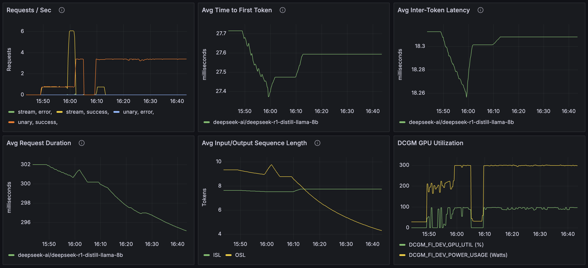
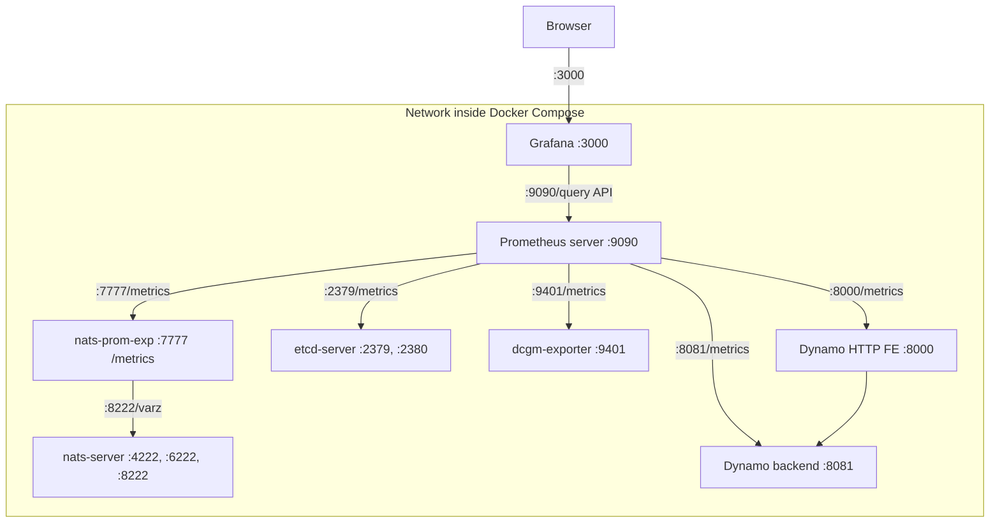

# Metrics Visualization with Prometheus and Grafana

## Overview

This guide shows how to set up Prometheus and Grafana for visualizing Dynamo metrics on a single machine for demo purposes.



**Components:**
- **Prometheus Server** - Collects and stores metrics from Dynamo services
- **Grafana** - Provides dashboards by querying the Prometheus Server

**For metrics reference**, see [Metrics Documentation](metrics.md).

## Environment Variables

| Variable | Description | Default | Example |
|----------|-------------|---------|---------|
| `DYN_SYSTEM_ENABLED` | Enable system metrics/health server | `false` | `true` |
| `DYN_SYSTEM_PORT` | System metrics/health port | `8081` | `9090` |

## Getting Started (Single GPU)

### Prerequisites

Install these on your machine:

- [Docker](https://docs.docker.com/get-docker/)
- [Docker Compose](https://docs.docker.com/compose/install/)

### Start the Observability Stack

From the Dynamo root directory:

```bash
# Start infrastructure (NATS, etcd)
docker compose -f deploy/docker-compose.yml up -d

# Then start observability stack (Prometheus, Grafana, Tempo, DCGM GPU exporter, NATS exporter)
docker compose -f deploy/docker-observability.yml up -d
```

### Start Dynamo Components

Start frontend and worker (a simple single GPU example):

```bash
# Start frontend in one process
python -m dynamo.frontend --http-port 8000 &

# Start vLLM worker with metrics enabled in another process
DYN_SYSTEM_ENABLED=true DYN_SYSTEM_PORT=8081 \
  python -m dynamo.vllm --model Qwen/Qwen3-0.6B --enforce-eager
```

After the workers are running, send a few test requests to populate metrics in the system:

```bash
curl -X POST http://localhost:8000/v1/chat/completions \
  -H "Content-Type: application/json" \
  -d '{
    "model": "Qwen/Qwen3-0.6B",
    "messages": [{"role": "user", "content": "Hello"}],
    "max_completion_tokens": 100
  }'
```

After sending a few requests, the Prometheus Exposition Format text metrics are available at:
- Frontend: `http://localhost:8000/metrics`
- Backend worker: `http://localhost:8081/metrics`

### Access Web Interfaces

Once Dynamo components are running:

1. Open **Grafana** at `http://localhost:3000` (username: `dynamo`, password: `dynamo`)
2. Click on **Dashboards** in the left sidebar
3. Select **Dynamo Dashboard** to view metrics and traces

Other interfaces:
- **Prometheus**: `http://localhost:9090`
- **Tempo** (tracing): Accessible through Grafana's Explore view. See [Tracing Guide](tracing.md) for details.

**Note:** If accessing from another machine, replace `localhost` with the machine's hostname or IP address, and ensure firewall rules allow access to these ports (3000, 9090).

---

## Topology

Default Service Relationship Diagram:


The dcgm-exporter service in the Docker Compose network is configured to use port 9401 instead of the default port 9400. This adjustment is made to avoid port conflicts with other dcgm-exporter instances that may be running simultaneously. Such a configuration is typical in distributed systems like SLURM.

### Required Files

The following configuration files are located in the `deploy/observability/` directory:
- [docker-compose.yml](../../deploy/docker-compose.yml): Defines NATS and etcd services
- [docker-observability.yml](../../deploy/docker-observability.yml): Defines Prometheus, Grafana, Tempo, and exporters
- [prometheus.yml](../../deploy/observability/prometheus.yml): Contains Prometheus scraping configuration
- [grafana-datasources.yml](../../deploy/observability/grafana-datasources.yml): Contains Grafana datasource configuration
- [grafana_dashboards/dashboard-providers.yml](../../deploy/observability/grafana_dashboards/dashboard-providers.yml): Contains Grafana dashboard provider configuration
- [grafana_dashboards/dynamo.json](../../deploy/observability/grafana_dashboards/dynamo.json): A general Dynamo Dashboard for both SW and HW metrics
- [grafana_dashboards/dcgm-metrics.json](../../deploy/observability/grafana_dashboards/dcgm-metrics.json): Contains Grafana dashboard configuration for DCGM GPU metrics
- [grafana_dashboards/kvbm.json](../../deploy/observability/grafana_dashboards/kvbm.json): Contains Grafana dashboard configuration for KVBM metrics

### Configuration

#### Prometheus

The Prometheus configuration is specified in [prometheus.yml](../../deploy/observability/prometheus.yml). This file is set up to collect metrics from the metrics aggregation service endpoint.

Please be aware that you might need to modify the target settings to align with your specific host configuration and network environment.

After making changes to prometheus.yml, restart the Prometheus service:

```bash
docker compose -f deploy/docker-observability.yml restart prometheus
```

#### Grafana

Grafana is pre-configured with:
- Prometheus datasource
- Sample dashboard for visualizing service metrics

### Troubleshooting

1. Verify services are running:
  ```bash
  docker compose -f deploy/docker-observability.yml ps
  ```

2. Check logs:
  ```bash
  docker compose -f deploy/docker-observability.yml logs prometheus
  docker compose -f deploy/docker-observability.yml logs grafana
  ```

3. Check Prometheus targets at `http://localhost:9090/targets` to verify metric collection.

4. If you encounter issues with stale data or configuration, stop services and wipe volumes:
  ```bash
  docker compose -f deploy/docker-observability.yml down -v
  docker compose -f deploy/docker-observability.yml up -d
  ```

  **Note:** The `-v` flag removes named volumes (grafana-data, tempo-data), which will reset dashboards and stored metrics.

## Developer Guide

For detailed information on creating custom metrics in Dynamo components, see:

- [Metrics Developer Guide](metrics-developer-guide.md)
