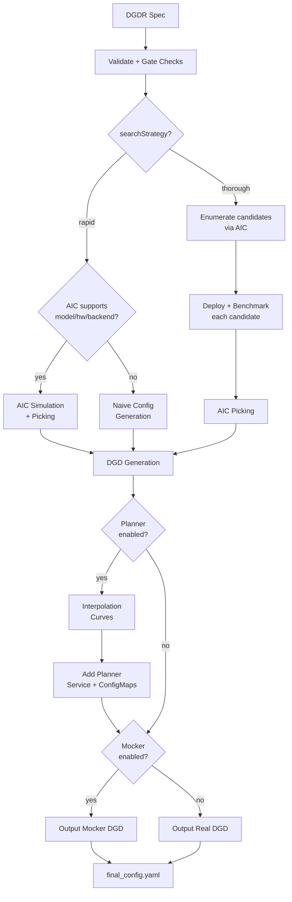

# Profiler Guide

## Overview

The Dynamo Profiler analyzes model inference performance and generates optimized deployment configurations (DynamoGraphDeployments). Given a model, hardware, and SLA targets, it determines the best parallelization strategy, selects optimal prefill and decode engine configurations, and produces a ready-to-deploy DGD YAML.

The profiler accepts a `DynamoGraphDeploymentRequestSpec` (DGDR) as input and uses [AI Configurator (AIC)](https://github.com/ai-dynamo/aiconfigurator) for performance simulation, candidate enumeration, and configuration picking. When the planner is enabled, the profiler additionally generates engine interpolation curves used for runtime autoscaling.

## Workflow

The profiler follows this pipeline:



### Stage-by-stage walkthrough

1. **Validation**: The DGDR spec is validated — required fields checked (`image`, `hardware.gpuSku`, `hardware.numGpusPerNode`), SLA targets verified, and gate checks applied (see [Gate Checks](#gate-checks-and-constraints)).

2. **Search Strategy**: The profiler branches based on `searchStrategy`:
   - **Rapid**: Uses AIC simulation to estimate performance across parallelization configs. No GPUs needed, completes in ~30 seconds.
   - **Thorough**: Enumerates candidate parallelization configs via AIC, deploys each on real GPUs, benchmarks with AIPerf, then picks the best. Takes 2-4 hours, disagg mode only.

3. **Picking**: The profiler selects the best configuration using one of three modes, determined automatically from the DGDR spec (see [Picking Modes](#picking-modes)).

4. **DGD Generation**: The picked configuration is rendered into a complete DGD YAML via AIC's generator pipeline, including correct parallelization, replica counts, container image, and PVC mounts.

5. **Interpolation** (planner only): When the planner is enabled, the profiler generates detailed performance interpolation curves — TTFT vs ISL for prefill, ITL vs KV-cache utilization for decode. These are saved into ConfigMaps for the planner to use at runtime.

6. **Final Assembly**: The planner service is added to the DGD if enabled. If mocker is enabled, the mocker DGD is used instead of real workers. The result is written to `final_config.yaml`.

## Search Strategies

### Rapid

Uses AIC's performance simulation to estimate optimal configurations without deploying real engines. Completes in ~30 seconds.

```yaml
searchStrategy: rapid
```

- Supports all backends: vLLM, SGLang, TensorRT-LLM
- If the model/hardware/backend combination is not supported by AIC, falls back to a naive config (memory-fit TP calculation)
- No GPU resources consumed during profiling

### Thorough

Enumerates candidate parallelization configs, deploys each as a real K8s workload, and benchmarks with AIPerf.

```yaml
searchStrategy: thorough
```

- Only disaggregated mode is supported
- Does not support `auto` backend — specify `vllm`, `sglang`, or `trtllm`
- Takes 2-4 hours depending on the number of candidates
- Provides highest accuracy since measurements come from real hardware

## Picking Modes

The profiler automatically selects a picking mode based on the DGDR spec:

### Autoscale

Triggered when the **planner is enabled** (scaling enabled in `features.planner`). Picks prefill and decode engines independently, each with 1 replica. The planner handles scaling at runtime.

### Load Match

Triggered when a **target load** is specified (`workload.requestRate` or `workload.concurrency`). Finds the configuration that serves the target load with the minimum number of GPUs under SLA.

```yaml
workload:
  requestRate: 5.0   # target 5 req/s
```

### Default

Triggered when there is **no planner and no target load**. Maximizes throughput for the available GPU budget under SLA.

## Planner Integration

When the planner is enabled, the profiler generates engine interpolation data needed for throughput-based autoscaling. The `pre_deployment_sweeping_mode` field controls how this data is produced:

```yaml
features:
  planner:
    pre_deployment_sweeping_mode: rapid   # rapid | thorough | none
    enable_throughput_scaling: true
```

- **rapid**: Uses AIC simulation to generate interpolation curves (~30s, no GPUs)
- **thorough**: Deploys the selected engine config on real GPUs and sweeps across ISL/concurrency ranges (2-4h)
- **none**: Skips interpolation. Only valid when using load-based scaling without throughput-based scaling.

The profiler saves two ConfigMaps into the generated DGD:
- **planner-config-XXXX**: Serialized `PlannerConfig` JSON (with `profile_results_dir` pointing to the profiling data mount)
- **planner-profile-data-XXXX**: Prefill and decode interpolation data (JSON)

See the [Planner Guide](../planner/planner-guide.md) for the full `PlannerConfig` reference.

## Mocker

When `features.mocker.enabled: true`, the profiler outputs a mocker DGD that simulates engine behavior without real GPUs. This is useful for testing planner behavior and validating configurations at scale.

Mocker requires pre-deployment sweeping to generate simulated performance profiles — `pre_deployment_sweeping_mode` cannot be `none` when mocker is enabled.

## Gate Checks and Constraints

The profiler enforces these rules at startup:

| Condition | Behavior |
|-----------|----------|
| `searchStrategy: thorough` + `backend: auto` | Rejected. Specify a concrete backend. |
| AIC unsupported + `enable_throughput_scaling: true` | Rejected. Throughput planner requires AIC support. |
| AIC unsupported + `pre_deployment_sweeping_mode: rapid` | Falls back to `none` with a warning. |
| `e2eLatency` provided without `ttft: null, itl: null` | Rejected by SLA validator. When using `e2eLatency`, explicitly null out `ttft` and `itl`. |
| SLA unachievable | Warning logged, SLA updated to best achievable value. |
| Load-match needs more GPUs than available | Warning logged. |

## CLI Usage

The profiler can be run directly for local development and testing:

```bash
python -m dynamo.profiler --config <spec.yaml>
```

Where `<spec.yaml>` is a DGDR spec (JSON or YAML file, or inline JSON string).

### Operational flags

| Flag | Default | Description |
|------|---------|-------------|
| `--output-dir` | `profiling_results` | Directory for output files |
| `--deployment-timeout` | `3600` | Max seconds to wait for K8s deployment readiness |
| `--prefill-interpolation-granularity` | `16` | Number of ISL samples for prefill interpolation |
| `--decode-interpolation-granularity` | `6` | Number of samples for decode interpolation |
| `--dry-run` | `false` | Skip all deployments and benchmarking (dev mode) |

### Output

The profiler writes `final_config.yaml` to the output directory. When the planner is enabled, this is a multi-document YAML containing ConfigMaps + DGD. The `profiler_status.yaml` file tracks job status (`success` / `failed`).

## Support Matrix

| Backend | Dense Models | MoE Models |
|---------|-------------|------------|
| vLLM | ✅ | 🚧 |
| SGLang | ✅ | ✅ |
| TensorRT-LLM | ✅ | 🚧 |

## Troubleshooting

### SLA Cannot Be Met

The profiler logs a warning and updates the SLA to the best achievable value. To improve results:
- Relax SLA targets (increase TTFT/ITL)
- Add more GPU resources
- Try a different backend
- Use a smaller or quantized model

### Profiling Takes Too Long

- Use `searchStrategy: rapid` for ~30s profiling
- Reduce interpolation granularity
- Reduce the GPU search space via hardware constraints

### Out of Memory During Profiling

- Reduce `max_batch_size` in engine config
- Skip larger TP configurations by constraining hardware
- Use a quantized model variant

### Image Pull Errors

Ensure image pull secrets are configured in your namespace for the container registry.

## See Also

- [Profiler README](README.md) — Quick overview and feature matrix
- [Profiler Examples](profiler-examples.md) — Complete DGDR YAML examples
- [Planner Guide](../planner/planner-guide.md) — PlannerConfig reference and scaling modes
- [DGDR API Reference](../../kubernetes/api-reference.md) — Full DGDR specification
