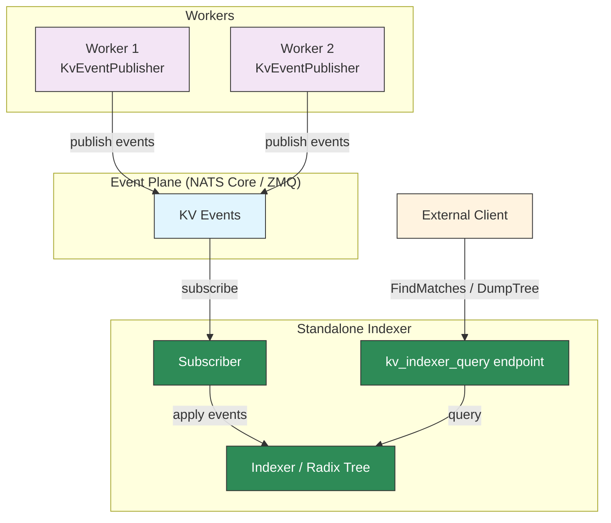

# Standalone KV Indexer

## Overview

The standalone KV indexer runs the KV cache radix tree as an independent service, separate from the router. It subscribes to KV events from workers, maintains a radix tree of cached blocks, and exposes a query endpoint (`kv_indexer_query`) that external clients can use to inspect or query KV cache state.

This is distinct from the [Standalone Router](../../../../components/src/dynamo/router/README.md), which is a full routing service. The standalone indexer provides only the indexing and query layer without routing logic.

## Use Cases

- **Debugging**: Inspect the radix tree state to verify which blocks are cached on which workers.
- **State verification**: Confirm that the indexer's view of KV cache state matches the router's internal state (used in integration tests).
- **Custom routing**: Build external routing logic that queries the indexer for overlap scores and makes its own worker selection decisions.
- **Monitoring**: Observe KV cache distribution across workers without running a full router.

## API

### Python

```python
from dynamo._internal import start_kv_block_indexer
from dynamo.llm import KvRouterConfig

# Start the standalone indexer on a component's endpoint
await start_kv_block_indexer(endpoint, block_size, kv_router_config)
```

**Parameters:**

| Parameter | Type | Description |
|-----------|------|-------------|
| `endpoint` | `Endpoint` | The Dynamo runtime endpoint on whose component the indexer will run |
| `block_size` | `int` | KV cache block size (must match workers) |
| `kv_router_config` | `KvRouterConfig` | Router configuration (controls event threading, TTL, etc.) |

### Query Endpoint

Once started, the indexer exposes a `kv_indexer_query` endpoint on the same component. Clients can send one of three request types:

**`FindMatchesTokens`** — Given raw tokens, compute block hashes and return per-worker overlap scores:

```python
query_client = await query_endpoint.client()
stream = await query_client.generate(
    {"FindMatchesTokens": {"tokens": [1, 2, 3, ...], "block_mm_infos": None}},
    annotated=False,
)
response = await stream.__anext__()
# response == {"Matches": {"scores": {(worker_id, dp_rank): count, ...}, "frequencies": [...]}}
```

**`FindMatchesHashed`** — Same as above but with pre-computed block hashes:

```python
stream = await query_client.generate(
    {"FindMatchesHashed": {"block_hashes": [hash1, hash2, ...]}},
    annotated=False,
)
```

**`DumpTree`** — Dump the full radix tree state as a list of router events:

```python
stream = await query_client.generate("DumpTree", annotated=False)
response = await stream.__anext__()
events = response["TreeDump"]  # List of RouterEvent objects
```

## Limitations

- **JetStream not supported**: The standalone indexer does not support `durable_kv_events` (JetStream mode). It relies on NATS Core or ZMQ event plane with local indexer mode. Attempting to start with `durable_kv_events=True` will raise an error.
- **No routing logic**: The indexer only maintains the radix tree and answers queries. It does not track active blocks, manage request lifecycle, or perform worker selection.

## Architecture



The standalone indexer internally:

1. Creates an `Indexer` instance with the given config and block size.
2. Starts a subscriber that listens for KV events from workers via the event plane. On worker discovery, it queries the worker's local indexer to bootstrap state.
3. Registers a `kv_indexer_query` endpoint that accepts `FindMatchesHashed`, `FindMatchesTokens`, and `DumpTree` requests.

## See Also

- **[Router Guide](router-guide.md)**: Full KV router configuration and tuning
- **[Router Design](../../design-docs/router-design.md)**: Architecture and event transport modes
- **[Standalone Router](../../../../components/src/dynamo/router/README.md)**: Full routing service (routes requests to workers)
