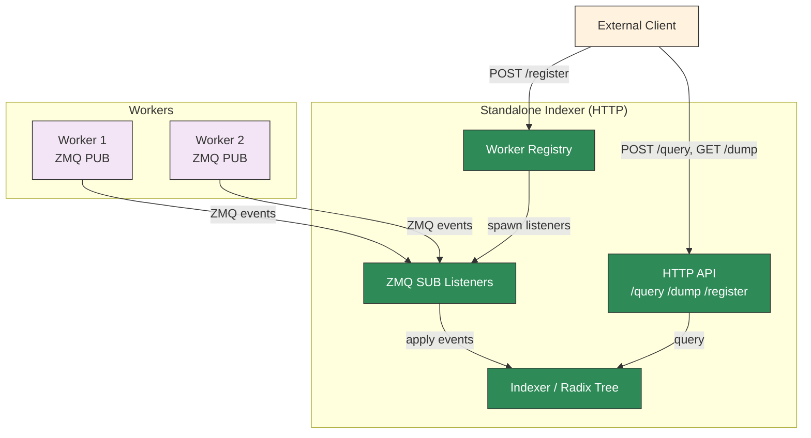

## Overview

The standalone KV indexer (`dynamo-kv-indexer`) is a lightweight HTTP binary that subscribes to ZMQ KV event streams from workers, maintains a radix tree of cached blocks, and exposes HTTP endpoints for querying and managing workers.

This is distinct from the [Standalone Router](../../../../components/src/dynamo/router/README.md), which is a full routing service. The standalone indexer provides only the indexing and query layer without routing logic.

The HTTP API follows the [Mooncake KV Indexer RFC](https://github.com/kvcache-ai/Mooncake/issues/1403) conventions.

## Compatibility

The standalone indexer works with any engine that publishes KV cache events over ZMQ in the expected msgpack format. This includes bare vLLM and SGLang engines, which emit ZMQ KV events natively — no Dynamo-specific wrapper is required.

## Use Cases

- **Debugging**: Inspect the radix tree state to verify which blocks are cached on which workers.
- **State verification**: Confirm that the indexer's view of KV cache state matches the router's internal state (used in integration tests).
- **Custom routing**: Build external routing logic that queries the indexer for overlap scores and makes its own worker selection decisions.
- **Monitoring**: Observe KV cache distribution across workers without running a full router.

## Building

The binary is a feature-gated target in the `dynamo-kv-router` crate:

```bash
cargo build -p dynamo-kv-router --features indexer-bin --bin dynamo-kv-indexer
```

## CLI

```bash
dynamo-kv-indexer --block-size 16 --port 8090 [--threads 1] [--workers "1=tcp://host:5557,2=tcp://host:5558"]
```

| Flag | Default | Description |
|------|---------|-------------|
| `--block-size` | (required) | KV cache block size (must match the engine's block size) |
| `--port` | `8090` | HTTP server listen port |
| `--threads` | `1` | Number of indexer threads (1 = single-threaded, >1 = thread pool) |
| `--workers` | (none) | Initial workers as `instance_id=zmq_address,...` pairs |

## HTTP API

### `POST /register` — Register an endpoint

Register a ZMQ endpoint for an instance. Call once per dp_rank for data-parallel workers:

```bash
# Single dp_rank (dp_rank defaults to 0)
curl -X POST http://localhost:8090/register \
  -H 'Content-Type: application/json' \
  -d '{"instance_id": 1, "endpoint": "tcp://127.0.0.1:5557"}'

# Multiple dp_ranks — register each separately
curl -X POST http://localhost:8090/register \
  -H 'Content-Type: application/json' \
  -d '{"instance_id": 1, "endpoint": "tcp://127.0.0.1:5557", "dp_rank": 0}'
curl -X POST http://localhost:8090/register \
  -H 'Content-Type: application/json' \
  -d '{"instance_id": 1, "endpoint": "tcp://127.0.0.1:5558", "dp_rank": 1}'
```

The indexer spawns a ZMQ SUB listener for each endpoint and begins consuming KV events.

### `POST /unregister` — Deregister an instance

Remove all dp_ranks for an instance, or a specific dp_rank:

```bash
# Remove all dp_ranks
curl -X POST http://localhost:8090/unregister \
  -H 'Content-Type: application/json' \
  -d '{"instance_id": 1}'

# Remove a specific dp_rank
curl -X POST http://localhost:8090/unregister \
  -H 'Content-Type: application/json' \
  -d '{"instance_id": 1, "dp_rank": 0}'
```

Cancels ZMQ listeners and removes the instance's blocks from the radix tree.

### `GET /workers` — List registered instances

```bash
curl http://localhost:8090/workers
```

Returns:
```json
[{"instance_id": 1, "endpoints": {"0": "tcp://127.0.0.1:5557", "1": "tcp://127.0.0.1:5558"}}]
```

### `POST /query` — Query overlap for token IDs

Given raw token IDs, compute block hashes and return per-instance overlap scores:

```bash
curl -X POST http://localhost:8090/query \
  -H 'Content-Type: application/json' \
  -d '{"token_ids": [1, 2, 3, 4, 5, 6, 7, 8, 9, 10, 11, 12, 13, 14, 15, 16]}'
```

Returns:
```json
{
  "scores": {"1": {"0": 2}, "2": {"1": 0}},
  "frequencies": [1, 1],
  "tree_sizes": {"1": {"0": 5}, "2": {"1": 3}}
}
```

Scores are nested by `instance_id` then `dp_rank`. Higher score means more cached prefix blocks on that instance.

### `POST /query_by_hash` — Query overlap for pre-computed hashes

```bash
curl -X POST http://localhost:8090/query_by_hash \
  -H 'Content-Type: application/json' \
  -d '{"block_hashes": [123456, 789012]}'
```

Same response format as `/query`.

### `GET /dump` — Dump all radix tree events

Returns the full radix tree state as a JSON array of `RouterEvent` objects:

```bash
curl http://localhost:8090/dump
```

## Limitations

- **ZMQ only**: Workers must publish KV events via ZMQ PUB sockets. The standalone indexer does not subscribe to NATS event streams.
- **No routing logic**: The indexer only maintains the radix tree and answers queries. It does not track active blocks, manage request lifecycle, or perform worker selection.

## Architecture



## See Also

- **[Mooncake KV Indexer RFC](https://github.com/kvcache-ai/Mooncake/issues/1403)**: Community API standardization for KV cache indexers
- **[Router Guide](router-guide.md)**: Full KV router configuration and tuning
- **[Router Design](../../design-docs/router-design.md)**: Architecture and event transport modes
- **[Standalone Router](../../../../components/src/dynamo/router/README.md)**: Full routing service (routes requests to workers)
