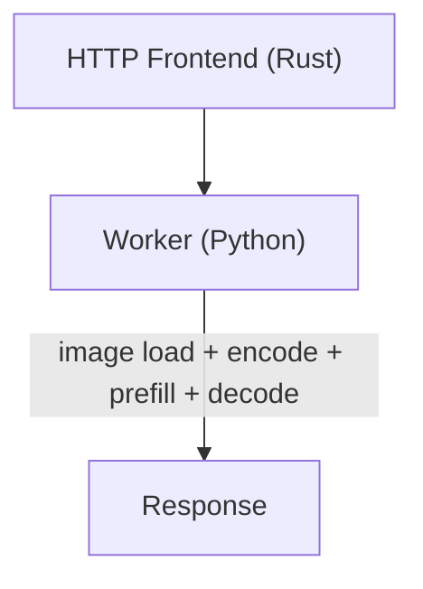
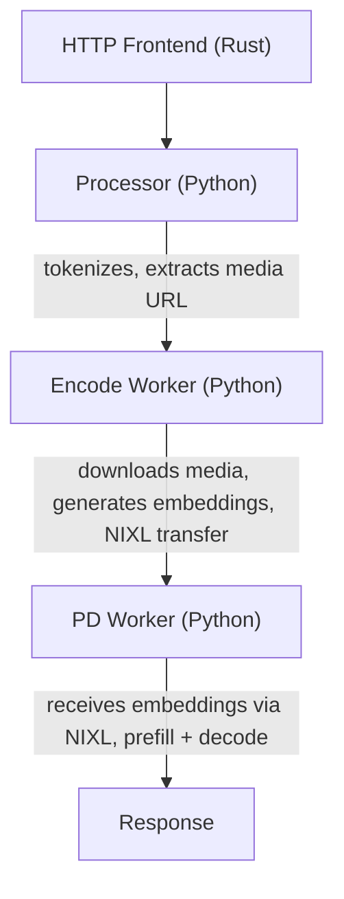
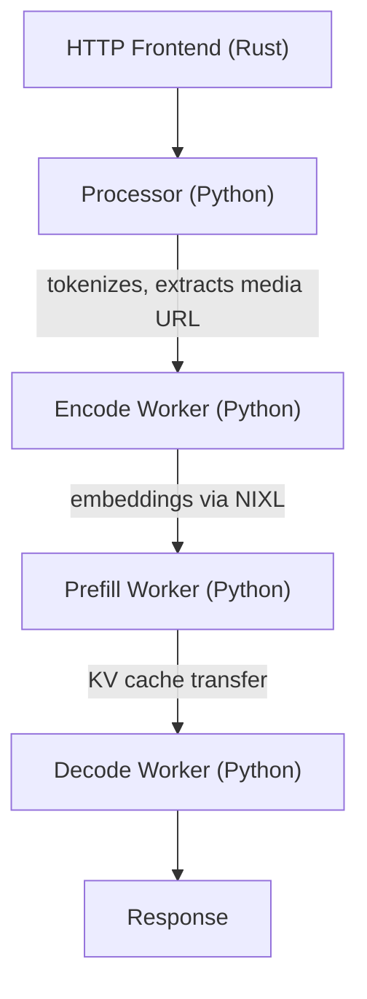
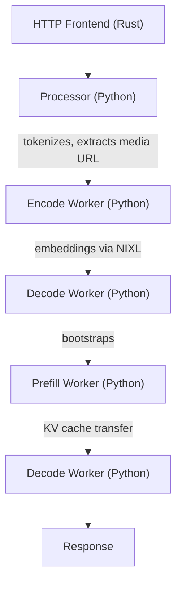
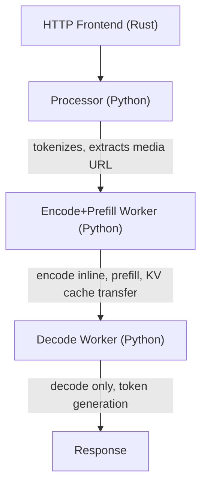

Dynamo supports multimodal inference across multiple LLM backends, enabling models to process images, video, and audio alongside text. This section provides comprehensive documentation for deploying multimodal models.

> [!IMPORTANT]
> **Security Requirement**: Multimodal processing must be explicitly enabled at startup.
> See the relevant documentation for each backend for the necessary flags.
>
> This prevents unintended processing of multimodal data from untrusted sources.

## Backend Documentation
## Support Matrix

### Backend Capabilities

| Stack | E/PD | E/P/D | EP/D | EPD | Image | Video | Audio |
|-------|------|-------|------|-----|-------|-------|-------|
| **[vLLM](multimodal-vllm.md)** | ✅ | ✅ | ✅ | ✅ | ✅ | ✅ | 🧪 |
| **[TRT-LLM](multimodal-trtllm.md)** | ❌ | 🚧* | ✅ | ✅ | ✅ | ❌ | ❌ |
| **[SGLang](multimodal-sglang.md)** | ✅ | ✅ | ❌ | ❌ | ✅ | ❌ | ❌ |

\* E/P/D supported in TRT-LLM with pre-computed embeddings only; image URL support is WIP ([PR #4668](https://github.com/ai-dynamo/dynamo/pull/4668))

**Pattern Key:**

- **EPD** - All-in-one worker (Simple Aggregated)
- **E/PD** - Separate encode, combined prefill+decode
- **E/P/D** - All stages separate
- **EP/D** - Combined encode+prefill, separate decode

**Status:** ✅ Supported | 🚧 WIP | 🧪 Experimental | ❌ Not supported

### Input Format Support

| Format | SGLang | TRT-LLM | vLLM |
|--------|--------|---------|------|
| HTTP/HTTPS URL | ✅ | ✅ | ✅ |
| Data URL (Base64) | ❌ | ❌ | ✅ |
| Pre-computed Embeddings (.pt) | ❌ | ✅ | ❌ |

## Architecture Patterns

Dynamo supports several deployment patterns for multimodal inference based on two dimensions:

1. **Encoding**: Is media encoding handled inline (within prefill) or by a separate **Encode Worker**?
   - *Inline*: Simpler setup, encoding happens in the prefill worker
   - *Separate (EPD)*: Dedicated encode worker transfers embeddings via **NIXL (RDMA)**, enabling independent scaling

2. **Prefill/Decode**: Are prefill and decode in the same worker or separate?
   - *Aggregated*: Single worker handles both prefill and decode
   - *Disaggregated*: Separate workers for prefill and decode, with KV cache transfer between them

These combine into four deployment patterns:

### EPD - Simple Aggregated

All processing happens within a single worker - the simplest setup.

| Component | Purpose |
|-----------|---------|
| Frontend (Rust) | HTTP entry point, tokenization, image URL preprocessing |
| Worker | Complete inference pipeline (encode + prefill + decode) |

**When to use:** Quick setup, smaller models, development/testing.

### E/PD - Encode Separate

Encoding happens in a separate worker; prefill and decode share the same engine.

| Component | Purpose |
|-----------|---------|
| Frontend (Rust) | HTTP entry point |
| Processor (Python) | Tokenization, extracts media URLs |
| Encode Worker | Media encoding, embeddings generation |
| PD Worker | Prefill + Decode with embeddings |

**When to use:** Offload vision encoding to separate GPU, scale encode workers independently.

### E/P/D - Full Disaggregation

Full disaggregation with separate workers for encoding, prefill, and decode.
There are two variants of this workflow:
- Prefill-first, used by vLLM
- Decode-first, used by SGLang

**Prefill-first** (vLLM):

**Decode-first** (SGLang):

| Component | Purpose |
|-----------|---------|
| Frontend (Rust) | HTTP entry point |
| Processor (Python) | Tokenization, extracts media URLs |
| Encode Worker | Media encoding, embeddings generation |
| Prefill Worker | Prefill only, transfers KV cache |
| Decode Worker | Decode only, token generation |

**When to use:** Maximum optimization, multi-node deployment, independent scaling of each phase.

### EP/D - Traditional Disaggregated

Encoding is combined with prefill, with decode separate.

| Component | Purpose |
|-----------|---------|
| Frontend (Rust) | HTTP entry point |
| Processor (Python) | Tokenization, extracts media URLs (vLLM only) |
| Encode+Prefill Worker | Combined encoding and prefill |
| Decode Worker | Decode only, token generation |

> **Note:** TRT-LLM's EP/D mode skips the Python Processor - the Rust frontend handles tokenization and routes directly to the Prefill worker.
> For multimodal requests, the Python prefill worker still re-tokenizes/builds inputs; Rust token_ids are ignored.

**When to use:** Models without pre-computed embedding support (Llama 4), or TRT-LLM disaggregated deployment.

## Example Workflows

You can find example workflows and reference implementations for deploying multimodal models in:

- [vLLM multimodal examples](https://github.com/ai-dynamo/dynamo/tree/main/examples/backends/vllm/launch)
- [TRT-LLM multimodal examples](https://github.com/ai-dynamo/dynamo/tree/main/examples/backends/trtllm/launch)
- [SGLang multimodal examples](https://github.com/ai-dynamo/dynamo/tree/main/examples/backends/sglang/launch)
- [Advanced multimodal examples](https://github.com/ai-dynamo/dynamo/tree/main/examples/multimodal/launch) (video, audio)
