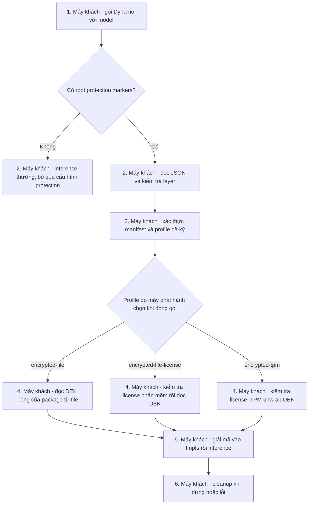
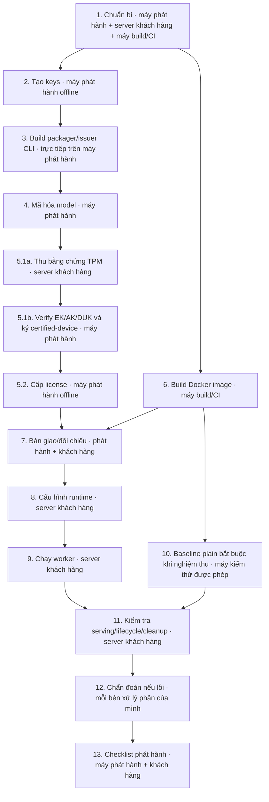

## Mục đích và luồng công việc

Last verified: 2026-10-07 (Asia/Ho_Chi_Minh).

### 0. Chọn profile trước khi thực hiện các bước

Đã thêm cấu hình layer V2. Các bước 1–13 bên dưới vẫn là quy trình
`encrypted-tpm`; không cần làm enrollment/challenge ở bước 5 nếu chọn
`encrypted-file` hoặc `encrypted-file-license`.

Nếu chỉ cần mã hóa model không dùng TPM, dùng hướng dẫn riêng
[model-encryption-only.md](model-encryption-only.md) (có
[bản tiếng Anh](model-encryption-only.en.md)). Tài liệu đó hướng dẫn tạo
package `encrypted-file`, xuất DEK cho đúng package, copy `package/` và
`runtime/` sang server khách, rồi cấu hình `OCR_MODEL_PATH` hoặc
`LLM_MODEL_PATH` trong Compose. Không dùng package TPM cũ bằng cách chỉ đổi
biến môi trường.

`DYN_MODEL_PROTECTION_CONFIG` nhận JSON trực tiếp hoặc đường dẫn tuyệt đối
đến file JSON. Đây là cấu hình, không phải nơi chứa khóa. Không ghi DEK,
private key hoặc passphrase vào env. Bốn cờ bên dưới có mặc định `false` khi
không khai báo; JSON từ chối tên layer lạ, giá trị chuỗi `"true"` và trường trùng.

| Layer | Chức năng khi bật | Cơ bản | License phần mềm | TPM |
|---|---|---:|---:|---:|
| `package_verification` | Xác thực chữ ký manifest và metadata/weights theo digest | true | true | true |
| `license_verification` | Xác thực entitlement, identity và digest package | false | true | true |
| `tpm_binding` | Lấy DEK bằng DUK/policy của TPM máy đã đăng ký | false | false | true |
| `secure_materialization` | Giải mã AES-256-GCM vào tmpfs và dọn session | true | true | true |

Không có cờ `process_hardening`, `engine_guard`, `audit`. Những kiểm tra
an toàn đã tồn tại ở loader và session vẫn được giữ, không trở thành layer
bật/tắt mới. Vì vậy chế độ cơ bản cũng cần tmpfs, memory/memlock phù hợp và
container không swap; nó không giải mã thành một thư mục bình thường trên đĩa.



Hai cờ tối thiểu cho package mã hóa là `package_verification` và
`secure_materialization`. Thiếu cờ bắt buộc sẽ báo
`MODEL_PROTECTION_LAYER_DISABLED: <tên-layer>` trước khi đọc khóa model.
Nếu JSON hợp lệ nhưng khác profile của package đã ký, runtime từ chối với
`LICENSE_BINDING_MISMATCH`. Package hỏng/giả không được chuyển sang luồng plain.

Package V1 cũ không có trường profile và luôn được coi là `encrypted-tpm`.
File cấu hình TPM cũ vẫn được hỗ trợ dưới dạng đường dẫn, với đúng bốn layer
TPM bật như trước. Quy tắc tương thích này không áp dụng cho JSON inline.
Muốn bỏ TPM cho một model cũ phải đóng gói lại với profile phần mềm, không
chỉ đổi cờ trong env. Manifest V2 ký cả `runtime.protection_profile`.

Với Compose có frontend và worker tách container, worker protected phải bật
system endpoint bằng `DYN_SYSTEM_PORT` để phục vụ metadata từ session tmpfs.
Đặt `DYN_SELF_HOST_METADATA=true` rõ ràng trên worker và giữ endpoint trên
mạng Docker nội bộ; frontend không thể đọc trực tiếp đường dẫn tmpfs của worker.
Nếu endpoint thiếu hoặc không truy cập được, frontend có thể hiểu đường dẫn
`/run/<namespace>-models/<session>` là Hugging Face repo ID. Đây là lỗi phân
phối metadata, không phải yêu cầu tải lại package hoặc weights. Hướng dẫn
`model-encryption-only.md` có config Compose, cách sửa cache CuPy trên root
filesystem read-only và các bước recreate worker.

### 0.1. Chế độ cơ bản không TPM

**Bước A1 — máy phát hành:** dùng keys ở bước 2 và binary ở bước 3 để đóng
gói một output mới. Ví dụ Qwen; không ghi đè package TPM đang sử dụng:

```bash
KEY_DIR=/home/thinh_do/Desktop/key-so-hoa/cqtt
PASS_DIR="$XDG_RUNTIME_DIR/issuer-secrets"
MODEL_OUT=/media/thinh_do/Data/Workspace/ocr_service/Resources/models/protected/Qwen3.5-4B-25-09-file
PROTECTION_PROFILE=encrypted-file \
PACKAGE_SIGNING_KEY="$KEY_DIR/package-signing-v1.pk8" \
PACKAGE_PASSPHRASE_FILE="$PASS_DIR/package.pass" \
PACKAGE_KEY_ID=package-signing-v1 \
KEK_KEY_FILE="$KEY_DIR/issuer-kek-v1.bin" \
KEK_KEY_ID=issuer-kek-v1 KEK_KEY_VERSION=1 \
MIN_RUNTIME_VERSION=1.6.0 \
deploy/model-protection/protect-model.sh \
  /media/thinh_do/Data/Workspace/ocr_service/Resources/models/Qwen3.5-4B-25-09 \
  "$MODEL_OUT" customer-ocr Qwen3.5-4B-25-09 1
```

`MODEL_OUT` is the output directory. The script creates `package/` and
`issuer-record.json` directly inside it. The final `1` is the model-version
metadata; it does not create a `file-v1/` directory.

**Bước A2 — máy phát hành:** xuất đúng DEK 32 byte của package vừa tạo,
không phải issuer KEK và không phải private signing key:

```bash
install -d -m 0700 "$MODEL_OUT/runtime" "$MODEL_OUT/runtime/trust"
target/release/model-protection-issue export-file-key \
  --package "$MODEL_OUT/package" \
  --issuer-record "$MODEL_OUT/issuer-record.json" \
  --package-key-id package-signing-v1 \
  --package-public-key "$KEY_DIR/package-signing-v1.pub" \
  --kek-key-file "$KEY_DIR/issuer-kek-v1.bin" \
  --kek-key-id issuer-kek-v1 --kek-key-version 1 \
  --output "$MODEL_OUT/runtime/model-dek.bin"
install -m 0600 "$KEY_DIR/package-signing-v1.pub" \
  "$MODEL_OUT/runtime/trust/package-public.key"
install -m 0600 deploy/model-protection/runtime.file.json.example \
  "$MODEL_OUT/runtime/runtime.json"
```

CLI xác minh chữ ký package, chữ ký issuer-record và binding trước khi xuất
DEK. Lệnh từ chối ghi đè; không xóa khóa rồi chạy lại nếu chưa kiểm tra các
package/license đang dùng khóa đó. Đây là thao tác trên máy phát hành, không
phải câu lệnh khách hàng cần build hay chạy.

Issuer giữ quy tắc khóa bộ nhớ cho process. Giải mã PKCS#8 dùng KDF có thể
cần hơn 128 MiB locked memory; synthetic CLI test dùng memlock 256 MiB và
RAM container 512 MiB. Nếu gặp `ISSUER_MEMORY_UNAVAILABLE` hoặc lỗi cấp phát,
admin máy phát hành phải cấp đủ memlock theo keys/KDF đang dùng; không bỏ
memory lock hoặc giảm KDF để chạy qua. Đây không phải `MEMLOCK_BYTES` của worker.

**Bước A3 — máy phát hành → máy khách:** chuyển riêng `package/` và
`runtime/` qua kênh bảo mật; không gửi `issuer-record.json`, KEK, passphrases
hay các file `.pk8`. Máy khách đặt chúng tại:

```text
/secure/customer/ocr/
├── package/                  # manifest, signature, public/, weights/
└── runtime/
    ├── runtime.json
    ├── model-dek.bin          # bí mật; chỉ chế độ phần mềm
    └── trust/package-public.key
```

> [!WARNING]
> Chế độ cơ bản không ràng buộc máy. Ai lấy được package và `model-dek.bin`
> có thể giải mã/copy model sang máy khác. License phần mềm cũng không tạo
> ràng buộc TPM. Đây là lựa chọn bảo mật khác, không tương đương profile TPM.

**Bước A4 — máy khách:** admin đặt owner của `runtime/` và files thành UID/GID
chạy container, thư mục `0700`, file `0600`. Đặt cấu hình env như sau; toàn
bộ đường dẫn trong JSON là đường dẫn bên trong container:

```bash
export OCR_PROTECTED_ROOT=/secure/customer/ocr
export DYN_MODEL_PROTECTION_CONFIG='{"schema_version":2,"profile":"encrypted-file","layers":{"package_verification":true,"license_verification":false,"tpm_binding":false,"secure_materialization":true},"package_trust":{"key_id":"package-signing-v1","public_key_file":"/runtime/trust/package-public.key"},"key_provider":{"type":"file","key_file":"/runtime/model-dek.bin"},"process_memory_margin_bytes":8589934592}'
```

Cũng có thể dùng `DYN_MODEL_PROTECTION_CONFIG=/runtime/runtime.json` thay vì
inline. Giá trị margin trong ví dụ là cấu hình khởi điểm, không phải số đo RAM
đã nghiệm thu cho hai model. Xác định các biến giới hạn theo bước 8.

**Bước A5 — máy khách:** dùng container không mount `/dev/tpmrm0` và không
yêu cầu `TPM_DEVICE_GID`. Ví dụ worker kết nối NATS/etcd trên `ocr_network`:

```bash
docker run --rm --name protected-ocr-file-worker --read-only \
  --user 1000:1000 --network ocr_network \
  --gpus "device=${OCR_GPU_ID:?Chọn GPU trên server khách}" \
  --memory "${OCR_PROTECTED_MEMORY_LIMIT:?Đặt giới hạn RAM đã đo}" \
  --memory-swap "${OCR_PROTECTED_MEMORY_LIMIT:?Đặt bằng giới hạn RAM}" \
  --ulimit core=0:0 --ulimit "memlock=${MEMLOCK_BYTES:?Đặt memlock đã đo}:${MEMLOCK_BYTES}" \
  --cap-drop ALL --security-opt no-new-privileges:true \
  --mount "type=bind,src=$OCR_PROTECTED_ROOT/package,dst=/models/package,readonly" \
  --mount "type=bind,src=$OCR_PROTECTED_ROOT/runtime,dst=/runtime,readonly" \
  --tmpfs "/run/protected-ocr-models:rw,noexec,nosuid,nodev,size=${OCR_PROTECTED_TMPFS_SIZE:?Đặt tmpfs đã đo},mode=0700,uid=1000,gid=1000" \
  --tmpfs /tmp:rw,nosuid,nodev,size=2g \
  -e DYN_NAMESPACE=protected-ocr -e DYN_NAMESPACE_WORKER_SUFFIX= \
  -e DYN_MODEL_PROTECTION_CONFIG \
  -e NATS_SERVER=nats://nats-server:4222 -e ETCD_ENDPOINTS=http://etcd-server:2379 \
  "${OCR_PROTECTED_IMAGE:?Đặt image protected đã build và kiểm tra}" \
  python3 -m dynamo.vllm --model /models/package \
  --load-format safetensors --served-model-name "${OCR_MODEL_NAME:?Đặt tên model}" \
  --max-model-len 8192 --max-num-seqs 8
```

Khởi động discovery và frontend như triển khai hiện tại trước worker này.
Ví dụ chỉ minh họa một GPU; không mở rộng topology hoặc khẳng định chất lượng
inference của model thật. File `docker-compose.model-ocr.yaml` hiện vẫn là
profile triển khai **có TPM**; không dùng nó trên host thiếu TPM cho chế độ cơ
bản vì nó vẫn khai báo device/GID TPM.

### 0.2. License phần mềm nhưng không TPM

**Máy phát hành:** đổi `PROTECTION_PROFILE=encrypted-file-license` tại A1,
chọn output mới, làm A2 rồi cấp license:

```bash
target/release/model-protection-issue issue-file-license \
  --package "$MODEL_OUT/package" --issuer-record "$MODEL_OUT/issuer-record.json" \
  --package-key-id package-signing-v1 --package-public-key "$KEY_DIR/package-signing-v1.pub" \
  --kek-key-file "$KEY_DIR/issuer-kek-v1.bin" --kek-key-id issuer-kek-v1 --kek-key-version 1 \
  --license-signing-key "$KEY_DIR/license-signing-v1.pk8" \
  --license-key-passphrase-file "$PASS_DIR/license.pass" \
  --license-key-id license-signing-v1 --license-id license-ocr-file-v1 --generation 1 \
  --output "$MODEL_OUT/runtime/license"
install -m 0600 "$KEY_DIR/license-signing-v1.pub" "$MODEL_OUT/runtime/trust/license-public.key"
install -m 0600 deploy/model-protection/runtime.file-license.json.example \
  "$MODEL_OUT/runtime/runtime.json"
```

**Máy khách:** thêm `license_root=/runtime/license`, `license_trust` trỏ tới
`/runtime/trust/license-public.key`, đổi profile thành `encrypted-file-license`
và bật `license_verification:true` trong JSON. `tpm_binding` vẫn `false`.
License ký identity, manifest digest, generation và digest của DEK; license
TPM cũ không được dùng thay license phần mềm. Không cần request/challenge/
certified-device cho profile này. Chạy worker tương tự A5.

### 0.3. Một biến host root cho Compose OCR

**Máy khách:** đặt trong `.env.prod` của OCR service:

```dotenv
OCR_PROTECTED_ROOT=/secure/customer/ocr
# Không bắt buộc: đặt JSON inline hoặc đường dẫn cấu hình bên trong container.
OCR_MODEL_PROTECTION_CONFIG=/runtime/runtime.json
```

Compose lấy `$OCR_PROTECTED_ROOT/package` và `$OCR_PROTECTED_ROOT/runtime`,
đều read-only; không tự tạo thư mục thiếu. Biến riêng `OCR_MODEL_PROTECTION_CONFIG`
ưu tiên hơn `DYN_MODEL_PROTECTION_CONFIG`; nếu cả hai không đặt, dùng
`/runtime/runtime.json`. Worker không còn CLI config cố định ghi đè env.
Compose TPM vẫn cần GID `/dev/tpmrm0` của đúng server và các giới hạn RAM/memlock.

**Máy build/CI:** image mới hỗ trợ các profile trên; image cũ chỉ hỗ trợ TPM
không tự nhận layer V2. Build lại theo bước 6, không tạo lại issuer keys, không
provision lại TPM hay cấp lại license chỉ vì thay image.

Dùng runbook này để đóng gói model thành artifact mã hóa, cấp license gắn với
TPM của máy đích, rồi khởi chạy Dynamo/vLLM trong runtime được bảo vệ. Quy trình
có hai vai trò: **máy phát hành** giữ model gốc và private issuer keys; **server
khách hàng** giữ TPM, package mã hóa và license. Máy build/CI tạo runtime image.

Model thường (plain) tiếp tục theo đường Dynamo/vLLM cũ và không cần license,
TPM hay protected tmpfs. Các quy tắc mật mã, wire format và threat model được
định nghĩa tại [model-protection-architecture.md](model-protection-architecture.md).

> [!WARNING]
> Experimental. Collector/authority/registry đã có code; native simulator và
> Intel PTT tests pass với test keys. OEM trust và product acceptance chưa hoàn tất. Bước 5.1 không phải
> thao tác tự tạo certified-device JSON rồi ký trên máy khách. Xem
> [tiến độ TPM](TPM-Implementation-Status.md) trước khi cấp license production.

### Sơ đồ các bước



Thực hiện theo số thứ tự. Chạy bước 3 trực tiếp trên máy phát hành, ngoài
Docker và không phải trên server khách hàng. Máy build/CI chỉ cần cho bước 6;
có thể dùng máy phát hành làm máy build nếu đáp ứng yêu cầu bảo mật. Bước 6
không tạo packager và không cần binary ở bước 3; script Docker tự build Python
wheel có TPM support. Bước 6 có thể chạy
song song với bước 4–5 sau khi đã chốt source và profile runtime, nhưng phải
hoàn tất trước bước 9. Máy khách thu evidence ở bước 5.1a; enrollment authority
trên máy phát hành xác minh và ký ở bước 5.1b, rồi issuer chạy bước 5.2.
Trao đổi challenge qua kênh xác thực; CLI đã implement nhưng toàn bộ luồng
production phải được nghiệm thu theo kế hoạch, không lấy test giả lập thay OEM trust.

> [!WARNING]
> Không chạy lệnh tạo khóa, packager hoặc issuer trên server khách hàng. Không
> mount thư mục offline-keys vào container. Không đưa private key, passphrase,
> issuer-record hoặc model plaintext vào image hay customer bundle.

### Phân vai

| Công việc | Máy phát hành | Máy build/CI | Server khách hàng |
|---|---:|---:|---:|
| Giữ model gốc plaintext và private issuer keys | Có | Không | Không |
| Tạo package mã hóa và issuer-record | Có | Không | Không |
| Provision TPM, thu evidence và trả lời challenge | Xác minh evidence | Chỉ build công cụ | Có |
| Ký `certified-device` sau khi verify EK/AK/DUK | Có, enrollment authority | Không | Không |
| Cấp license sau khi xác minh thiết bị | Có | Không | Không |
| Build, ký và phân phối runtime image | Có thể | Có | Chỉ nhận image đã duyệt |
| Giữ package, license, public trust keys và runtime config | Có thể lưu archive | Không bắt buộc | Có, mount chỉ đọc |
| TPM unwrap, materialize vào tmpfs và chạy vLLM | Không | Không | Có |

Nếu thử nghiệm trên một máy, vẫn giữ ranh giới thư mục và không mount
`offline-keys` vào container runtime. Khi bàn giao thật, tách quyền phát hành
khỏi quyền vận hành.

### Cách tiếp tục từ trạng thái hiện tại

Các việc còn mở **không chỉ là chạy test**. Không tạo lại keys/package đã có
hoặc dùng keys tổng hợp của test để cấp license production.

| Thứ tự tiếp tục | Nơi thực hiện | Việc làm và điều kiện chuyển bước |
|---|---|---|
| A. Chốt cấu hình triển khai | Máy phát triển + máy khách | Chọn single-node hay multi-node, GPU được cấp, TP/PP/DP và executor. Multi-GPU hiện cần mở rộng code theo P5; xem mục 9.1 |
| B. Hoàn thiện phát hành | Máy phát hành | Bước 1–3: duyệt OEM trust/revocation, kiểm tra custody/backup, build CLI đúng source; chỉ tạo key còn thiếu sau phê duyệt |
| C. Chuẩn bị model và thiết bị | Máy phát hành + máy khách | Bước 4–5: pack từng model, enrollment OEM thật, cấp license theo artifact và TPM; không sửa state/certificate bằng tay |
| D. Build và baseline | Máy build/CI + máy kiểm thử được phép | Bước 6 và 10: rebuild source mới, scan/pin digest, chứng minh cả hai OCR model chạy plain trên backend trước protected acceptance |
| E. Cài và chạy protected | Máy phát hành + máy khách | Bước 7–9: nhận bundle, đối chiếu identity, cấu hình TPM/tmpfs, chạy topology đã được triển khai và kiểm tra |
| F. Nghiệm thu và phê duyệt | Máy khách + máy phát hành | Bước 11–13: inference, reboot/copy rejection, lifecycle, restore/rotation, review và canary đúng source/image |

Theo dõi trạng thái từng phase tại [tiến độ TPM](TPM-Implementation-Status.md).
Không coi việc build image thành công là hoàn tất B, C hoặc F.

### Đầu vào và kết quả của từng bước

| Bước | Máy thực hiện | Đầu vào cần có | Kết quả cần kiểm tra |
|---|---|---|---|
| 1 | Phát hành + build/CI + khách | Quyền vận hành, source, model, TPM/GPU | Toolchain, thư mục, inventory và cấu hình triển khai |
| 2 | Phát hành offline | Kho custody đã duyệt | Issuer keys/public keys và backup; không ghi đè key cũ |
| 3 | Phát hành | Source/toolchain | Packager, issuer và authority CLI; đây không phải build Docker |
| 4 | Phát hành | Model plain, keys, scope/model ID | Package ciphertext và issuer-record riêng cho mỗi model |
| 5 | Khách ↔ phát hành | TPM, policy public, binding artifact, OEM trust và authority keys | Certified-device do authority xác minh; license đúng artifact/DUK |
| 6 | Build/CI | Source và backend pin, không issuer secrets | Image rebuild, scan, digest và provenance |
| 7 | Phát hành → khách | Package, license, public trust, image digest | Bundle đủ và đối chiếu qua kênh xác thực |
| 8 | Khách | Bundle, state TPM, UID/GID, RAM budget | Runtime config, tmpfs và quyền TPM hợp lệ |
| 9 | Khách | Image/config và topology được hỗ trợ | Protected worker khởi động, readiness hợp lệ |
| 10 | Máy kiểm thử được phép | Model plain và cùng backend/model revision | Baseline inference; không phân phối plain model cho khách |
| 11 | Khách + máy kiểm thử | Worker/model và kịch bản lỗi | Inference, reject sai identity, cleanup và recovery evidence |
| 12 | Bên sở hữu lỗi | Stable error code và log đã lọc secrets | Sửa nguyên nhân; không bỏ kiểm tra license/TPM |
| 13 | Phát hành + build/CI + khách | Bằng chứng từ các bước trước | Review/canary approval; không tự đánh dấu gate chưa chạy |

## 1. Kiểm tra điều kiện và chuẩn bị thư mục

**Thực hiện trên:** máy phát hành và server khách hàng; mỗi bên chuẩn bị máy
thuộc quyền quản lý của mình. Chuẩn bị máy phát hành hoặc máy build/CI cho bước
3 và bước 6; cùng một máy có thể đảm nhiệm cả hai vai trò nếu chính sách cho
phép.

### 1.1. Máy phát hành

Cần có:

- Rust/Cargo, OpenSSL và source branch đã review.
- Model gốc Hugging Face có `config.json` và ít nhất một file safetensors.
- Một vùng lưu offline owner-only, nằm ngoài repository, để tạo và giữ key.
- Passphrase file owner-only; bước 2 tạo key và passphrase mới nếu đây là lần
  khởi tạo đầu tiên.

Thư mục key issuer theo máy phát hành hiện tại:

```text
/home/thinh_do/Desktop/key-so-hoa/cqtt/
  package-signing-v1.pk8
  package-signing-v1.pub
  license-signing-v1.pk8
  license-signing-v1.pub
  tpm-policy-signing-v1.pk8
  tpm-policy-signing-v1.pub.pem   # public P-256, không phải Ed25519 raw32
  tpm-policy-v1.tpmt-public      # public TPM template 88 bytes từ bước 5.1
  issuer-kek-v1.bin
  enrollment-v1.pub              # public key được enrollment authority cấp
${XDG_RUNTIME_DIR}/issuer-secrets/ (runtime path, for example /run/user/1000/issuer-secrets/)
  package.pass
  license.pass
  policy.pass
/source-model/
  config.json
  tokenizer.json
  model-00001.safetensors
```

Các file key trong `cqtt/` phải là absolute regular file, không symlink, mode
0600; thư mục `cqtt/` phải là mode 0700 và nằm ngoài repository. Public key
`enrollment-v1.pub` do enrollment authority cấp để xác minh certified-device;
không được tạo bằng các lệnh ở bước 2. Các file `*.pass` chỉ là passphrase tạm,
được giữ riêng trong `$XDG_RUNTIME_DIR/issuer-secrets/` (thường là
`/run/user/<uid>/issuer-secrets/`), không phải key và không bàn giao. Chạy các
bước issuer trong phiên đăng nhập user còn hiệu lực; thư mục runtime có thể bị
xóa khi đăng xuất hoặc khởi động lại. Trước đó phải có backup passphrase/key
được mã hóa và quản lý quyền riêng theo quy trình custody, đồng thời thử restore.
Mất passphrase có thể làm private key không mở lại được; không tạo key mới đè
lên key đã dùng phát hành để xử lý lỗi này.
Chỉ dùng đường dẫn Desktop này nếu thư mục không được đồng bộ lên cloud hoặc
chia sẻ với tài khoản/người khác.

### 1.2. Server khách hàng

Cần có:

- Docker hoặc runtime Python đã build với feature `model-protection-tpm2`.
- vLLM phiên bản được profile hỗ trợ (hiện tại: chính xác `0.30.0`).
- TPM 2.0 với device node `/dev/tpmrm0` và quyền truy cập runtime.
- Công cụ enrollment được tổ chức phát hành phê duyệt để thu bằng chứng TPM;
  authority trên máy phát hành xác minh/ký certified-device cho TPM đích.
  Công cụ production này hiện là hạng mục phát triển, xem kế hoạch TPM.
- Package, license, public trust keys và runtime image trước khi chạy worker.

Không cài Cargo hoặc source repo trên máy khách. Máy phát hành chuyển collector
binary đã xác minh và khởi chạy nó tại máy khách qua SSH theo bước 5.1.1; nếu
không được cấp SSH, admin khách chạy các lệnh TPM tại chỗ. Trong cả hai trường
hợp, không giữ private issuer key hay model plaintext trên server khách.

## 2. Tạo issuer keys offline (chỉ máy phát hành)

**Thực hiện trên:** máy phát hành offline. Không chạy bước này trên máy khách
hoặc trong container inference.

Dùng quy trình trong phần Key-directory bootstrap and rotation procedure của
[Runbook.md](Runbook.md). Đây là thao tác chỉ thực hiện trên máy phát hành.
Bản rút gọn:

```bash
set -euo pipefail
umask 077

KEY_DIR=/home/thinh_do/Desktop/key-so-hoa/cqtt
: "${XDG_RUNTIME_DIR:?Đăng nhập bằng user session có XDG_RUNTIME_DIR}"
PASS_DIR="$XDG_RUNTIME_DIR/issuer-secrets"
install -d -m 0700 "$KEY_DIR" "$PASS_DIR"

for f in package-signing-v1.pk8 license-signing-v1.pk8 \
         tpm-policy-signing-v1.pk8 issuer-kek-v1.bin \
         package-signing-v1.pub license-signing-v1.pub \
         package.pass license.pass policy.pass; do
  if [ -e "$KEY_DIR/$f" ] || [ -e "$PASS_DIR/$f" ]; then
    printf 'Đã tồn tại, dừng để tránh ghi đè: %s hoặc %s\n' \
      "$KEY_DIR/$f" "$PASS_DIR/$f" >&2
    exit 1
  fi
done

openssl rand -base64 48 > "$PASS_DIR/package.pass"
openssl rand -base64 48 > "$PASS_DIR/license.pass"
openssl rand -base64 48 > "$PASS_DIR/policy.pass"
chmod 0600 "$PASS_DIR"/*.pass

openssl genpkey -algorithm ED25519 -aes-256-cbc \
  -pass "file:$PASS_DIR/package.pass" \
  -out "$KEY_DIR/package-signing-v1.pk8"

openssl genpkey -algorithm ED25519 -aes-256-cbc \
  -pass "file:$PASS_DIR/license.pass" \
  -out "$KEY_DIR/license-signing-v1.pk8"

openssl genpkey -algorithm EC -pkeyopt ec_paramgen_curve:P-256 \
  -aes-256-cbc -pass "file:$PASS_DIR/policy.pass" \
  -out "$KEY_DIR/tpm-policy-signing-v1.pk8"

openssl rand -out "$KEY_DIR/issuer-kek-v1.bin" 32

openssl pkey -in "$KEY_DIR/package-signing-v1.pk8" \
  -passin "file:$PASS_DIR/package.pass" -pubout -outform DER \
  | tail -c 32 > "$KEY_DIR/package-signing-v1.pub"
openssl pkey -in "$KEY_DIR/license-signing-v1.pk8" \
  -passin "file:$PASS_DIR/license.pass" -pubout -outform DER \
  | tail -c 32 > "$KEY_DIR/license-signing-v1.pub"
chmod 0600 "$KEY_DIR"/*
test "$(stat -c %s "$KEY_DIR/package-signing-v1.pub")" -eq 32
test "$(stat -c %s "$KEY_DIR/license-signing-v1.pub")" -eq 32
```

| Thành phần | Dùng để làm gì | Có giao khách không? |
|---|---|---|
| package-signing-v1.pk8 | Ký manifest để runtime biết package chưa bị thay đổi | Không; chỉ giao public key |
| license-signing-v1.pk8 | Ký license entitlement | Không; chỉ giao public key |
| tpm-policy-signing-v1.pk8 | Ký policy cho TPM recipient | Không; policy public identity được kiểm tra khi issue |
| issuer-kek-v1.bin | Bọc DEK trong issuer-record giữa packager và issuer | Không |
| *.pass | Mở private key trong tiến trình offline | Không |
| package-signing-v1.pub | Xác minh manifest và issuer-record | Có |
| license-signing-v1.pub | Xác minh license | Có |
| enrollment-v1.pub | Xác minh certified-device do enrollment authority cấp | Có |

Không truyền key/passphrase qua argv, biến môi trường, log hoặc Dockerfile.
Nếu key đã lộ, dừng phát hành, thay key ID/version và thực hiện rotation theo
Runbook.

## 3. Build công cụ packager và issuer (máy phát hành)

**Thực hiện trên:** máy phát hành, trong checkout source của Dynamo. Chạy trực
tiếp trên host, không chạy trong Docker container hoặc trên server khách hàng.
Lệnh biên dịch `model-protection-pack` để đóng gói/mã hóa model ở bước 4 và
`model-protection-issue` để cấp license ở bước 5b. Đây không phải lệnh build
Docker; Docker image được build riêng ở bước 6.

```bash
cargo build --locked --release -p dynamo-model-protection \
  --features packager,enrollment-authority
```

Kết quả cần có:

```text
target/release/model-protection-pack
target/release/model-protection-issue
target/release/model-protection-enrollment-authority
```

Build này cần OpenSSL và SQLite development libraries trên máy phát hành.
Issuer production bắt buộc `--registry` là database của authority, không phải
file do khách gửi. Build chỉ `--features packager` vẫn mã hóa được model nhưng
issuer từ chối cấp license mặc định; cờ `--allow-development-certification true`
chỉ dành cho pilot, không dùng để hoàn tất production enrollment.

Nếu chỉ tạo Docker image, không cần chạy `maturin develop` trước. Script ở bước
6 tự build Python wheel với feature `model-protection-tpm2` rồi đưa wheel vào
image. Thực hiện build image trên máy build/CI, không phải server khách hàng.
Nếu bindgen báo thiếu stdbool.h, cài
compiler development headers trên máy build hoặc đặt BINDGEN_EXTRA_CLANG_ARGS
theo hướng dẫn trong Runbook.md.

## 4. Mã hóa model và tạo package (chỉ máy phát hành)

**Thực hiện trên:** máy phát hành có model gốc và offline keys.

### 4.1. Cách dùng script (khuyến nghị)

Chạy trên **máy phát hành**:

Đứng tại thư mục gốc checkout Dynamo trên máy phát hành. Hai thư mục model
nguồn bên dưới đã có `config.json` và safetensors tại thư mục gốc. Các lệnh tạo
package trong `Resources/models/protected/`, không sửa checkpoint nguồn. Thay
`customer-scope` bằng mã scope ổn định đã thống nhất với license và enrollment.

```bash
KEY_DIR=/home/thinh_do/Desktop/key-so-hoa/cqtt
: "${XDG_RUNTIME_DIR:?Đăng nhập bằng user session có XDG_RUNTIME_DIR}"
PASS_DIR="$XDG_RUNTIME_DIR/issuer-secrets"
set -euo pipefail
export PACKAGE_SIGNING_KEY="$KEY_DIR/package-signing-v1.pk8"
export PACKAGE_PASSPHRASE_FILE="$PASS_DIR/package.pass"
export KEK_KEY_FILE="$KEY_DIR/issuer-kek-v1.bin"
export KEK_KEY_ID=issuer-kek-v1
export KEK_KEY_VERSION=1
export PACKAGE_KEY_ID=package-signing-v1
export MIN_RUNTIME_VERSION=0.1.0

deploy/model-protection/protect-model.sh \
  /media/thinh_do/Data/Workspace/ocr_service/Resources/models/Qwen3.5-4B-25-09 \
  /media/thinh_do/Data/Workspace/ocr_service/Resources/models/protected/Qwen3.5-4B-25-09 \
  customer-scope \
  model-llm-25-09-2026 \
  1

deploy/model-protection/protect-model.sh \
  /media/thinh_do/Data/Workspace/ocr_service/Resources/models/Model_ocr_02_10_2026 \
  /media/thinh_do/Data/Workspace/ocr_service/Resources/models/protected/Model_ocr_02_10_2026 \
  customer-scope \
  model-ocr-02-10-2026 \
  1
```

Chạy hai lệnh trong cùng shell để dùng chung các biến key đã export. Mỗi lệnh
tạo một `package/` mã hóa và một `issuer-record.json` riêng. Không gửi
`issuer-record.json` cho khách hàng. Nếu đích tương ứng đã có `package/` hoặc
`issuer-record.json`, script sẽ dừng thay vì ghi đè.

Script nhận đúng năm positional argument:

| Vị trí | Ví dụ | Ý nghĩa | Quy tắc |
|---|---|---|---|
| 1: MODEL_DIR | /absolute/path/to/source-model | Thư mục model gốc cần đọc | Absolute directory; không sửa source |
| 2: OUTPUT_DIR | /absolute/path/to/release/model-protected | Nơi tạo package và issuer-record | Absolute; script tạo thư mục nếu cần, nhưng dừng nếu `package/` hoặc `issuer-record.json` đã tồn tại |
| 3: CUSTOMER_SCOPE | customer-scope | Phạm vi khách hàng/entitlement | Identifier ổn định, không chứa secret |
| 4: MODEL_ID | model-id | Tên logic của model | Phải khớp license sau này |
| 5: MODEL_VERSION | 1 | Phiên bản artifact | Dùng cho nâng cấp/rotation; phải khớp license |

Các biến môi trường của script:

| Biến | Bắt buộc | Ý nghĩa |
|---|---|---|
| PACKAGE_SIGNING_KEY | Có | Private Ed25519 package signer đã mã hóa |
| PACKAGE_PASSPHRASE_FILE | Có | File passphrase owner-only để mở signer |
| KEK_KEY_FILE | Có | File đúng 32 byte AES-256 KEK |
| KEK_KEY_ID | Có | ID dùng chọn KEK |
| KEK_KEY_VERSION | Có | Version để ngăn dùng nhầm KEK sau rotation |
| PACKAGE_KEY_ID | Không | ID package signer; mặc định package-signing-v1 |
| MIN_RUNTIME_VERSION | Không | Runtime tối thiểu; mặc định 0.1.0 |
| PACK_BIN | Không | Đường dẫn binary packager; mặc định target/release/model-protection-pack |

Script tự sinh DEK mới cho mỗi lần build, mã hóa từng safetensors, ký manifest
và ghi issuer-record. Nếu output đã có package hoặc record, lệnh dừng để tránh
ghi đè artifact đã phát hành.

### 4.2. Kết quả và ý nghĩa

```text
/absolute/path/to/release/model-protected/
  package/
    model.protection.json
    model.protection.sig
    public/
      config.json
      tokenizer.json
      ...
    weights/
      model-00001.safetensors.protected
      model-00002.safetensors.protected
  issuer-record.json
```

- package/model.protection.json: manifest đã ký, metadata và hash.
- package/model.protection.sig: chữ ký Ed25519 của manifest.
- package/weights/*.protected: ciphertext; không phải safetensors plaintext.
- package/public: metadata được allowlist để vLLM khởi tạo.
- issuer-record.json: dữ liệu phát hành để issue license; **không giao khách**.

Kiểm tra trước khi chuyển package:

```bash
MODEL_OUT=/media/thinh_do/Data/Workspace/ocr_service/Resources/models/protected/Qwen3.5-4B-25-09
find "$MODEL_OUT/package" -type f -printf '%p %s bytes\n'
find "$MODEL_OUT/package" -type f \
  \( -name '*.safetensors' -o -name '*.bin' \)
```

Chạy kiểm tra này cho từng model; với Hunyuan đổi `MODEL_OUT` thành
`/media/thinh_do/Data/Workspace/ocr_service/Resources/models/protected/HunyuanOCR-v1.5-finetuned`.
Lệnh thứ hai phải không trả về plaintext weights. Không dùng grep nội dung model
hoặc copy package vào thư mục cache không kiểm soát.

## 5. Enroll TPM và cấp license — luồng bàn giao

Phần này đi lần lượt qua ba hệ thống: **máy khách** (TPM đích), **máy phát hành**
(model, package, issuer keys), và **enrollment authority** (có thể là máy phát
hành được cô lập hoặc dịch vụ OEM/PKI riêng). Authority xác minh TPM và ký
certified-device; issuer sau đó tra registry để cấp license. Không chạy authority
hoặc issuer trên server khách.

Các giá trị được dùng xuyên suốt:

| Giá trị | Nguồn chính xác |
|---|---|
| `KEY_DIR` | Key directory tạo ở bước 2: `/home/thinh_do/Desktop/key-so-hoa/cqtt` trên máy phát hành này |
| `PASS_DIR` | `$XDG_RUNTIME_DIR/issuer-secrets` trong cùng phiên user máy phát hành |
| `RELEASE_ROOT` | Output bước 4: `/media/thinh_do/Data/Workspace/ocr_service/Resources/models/protected` |
| `CLIENT_SSH` | Username và DNS/IP do admin server khách cấp; không tự đoán |
| `CLIENT_ROOT` | Mặc định `$HOME/model-protection` của account chạy worker trên server khách |
| Ba TPM handles | Output `inspect` trên server khách + xác nhận của admin TPM; không có giá trị dùng chung an toàn |
| `customer_scope_id` | Mã scope đã thống nhất với quyền sử dụng; phải giống manifest của bước 4 |
| `policy_authority_name` | JSON output của `provision` trên TPM khách; gửi về issuer để tạo binding |
| EK certificate chain | OEM/server vendor cung cấp cho đúng TPM; collector hiện không tự thu chuỗi OEM |
| OEM trust policy và EK root certificate | OEM/server vendor + security owner; phải là trust material được phê duyệt, không phải certificate khách tự đưa |
| `TRUST_KEY_ID` | `key_id` của chữ ký trust-policy theo authority PKI; authority admin cấp |
| `MIN_TRUST_SEQUENCE` | Giá trị rollback-resistant đã lưu ngoài file request, do trust-policy operator quản lý; không tự đặt lại về 1 khi policy đã tăng |
| `CHALLENGE_KEY_ID` | ID cố định authority gán cho challenge signer; giữ giống nhau khi cấu hình signer/public key |
| `CERTIFICATION_ID` | Authority operator đặt duy nhất cho từng certification, ví dụ theo model + customer + ngày |
| Authority challenge/enrollment signers và state KEK | Tạo/custody tại authority như phần 5.1.4, hoặc cấp bởi hệ thống PKI; không phải bước trên máy khách |

`set -euo pipefail` (nếu dùng trong shell) chỉ làm terminal dừng khi lệnh lỗi;
nó **không tạo** key, handle, đường dẫn hay giá trị biến. Có thể bỏ dòng đó nếu
muốn, nhưng các file/ID trong bảng vẫn phải được lấy từ đúng nguồn trước khi chạy.

**Giới hạn hiện tại:** CLI hỗ trợ các bước collector/authority, nhưng luồng
production không thể chạy đến cấp license nếu chưa có OEM EK certificate chain
và trust/key material thật từ authority. Đây là đầu vào bên ngoài, không phải
placeholder có thể tự điền bằng machine-id hoặc tự ký.

```mermaid
sequenceDiagram
    participant I as Máy phát hành/issuer
    participant C as Server khách có TPM
    participant A as Enrollment authority/OEM trust
    I->>C: tpm-policy-v1.tpmt-public (public)
    C->>I: policy_authority_name (từ provision)
    I->>C: binding.json theo manifest artifact
    A->>C: EK cert chain OEM (đúng TPM, qua kênh tin cậy)
    C->>A: request.json (SCP/SSH; state+journal ở lại C)
    A->>C: challenge.json + sig + pinned challenge public key
    C->>A: response.json (SCP/SSH; state+journal ở lại C)
    A->>I: certified-device.json + sig + enrollment-v1.pub
    I->>I: tra registry + issue license theo package/DUK
    I->>C: package + license + runtime trust/config + image digest
```

### 5.1. Thu bằng chứng TPM và xin certified-device

#### 5.1.0 — Máy phát hành: xuất public policy template

Chạy từ thư mục gốc checkout Dynamo trên máy phát hành. Private policy key và
passphrase ở lại máy phát hành. Nếu public output đã tồn tại, không ghi đè;
đối chiếu với signer trước.

```bash
set -euo pipefail
umask 077
KEY_DIR=/home/thinh_do/Desktop/key-so-hoa/cqtt
: "${XDG_RUNTIME_DIR:?Cần user runtime session}"
PASS_DIR="$XDG_RUNTIME_DIR/issuer-secrets"
openssl pkey -in "$KEY_DIR/tpm-policy-signing-v1.pk8" \
  -passin "file:$PASS_DIR/policy.pass" -pubout \
  -out "$KEY_DIR/tpm-policy-signing-v1.pub.pem"
target/release/model-protection-issue export-policy-public \
  --policy-public-key "$KEY_DIR/tpm-policy-signing-v1.pub.pem" \
  --output "$KEY_DIR/tpm-policy-v1.tpmt-public"
```

Kết quả `tpm-policy-v1.tpmt-public` là public TPM template để collector dùng;
không phải EK certificate hay certified-device. Chỉ template này được chuyển
sang máy khách. Đưa file này lên cùng USB với gói collector ở bước 5.1.1;
không đưa private policy key/passphrase lên USB. Challenge public key chỉ có sau
khi authority đã provision challenge signer (mục 5.1.4).

#### 5.1.1 — Máy phát hành: đóng gói collector để chuyển qua USB

Collector là chương trình trong repo Dynamo tại
`lib/model-protection/src/bin/model-protection-enroll.rs`, thuộc Cargo package
`dynamo-model-protection`. Các lệnh `inspect/provision/request/respond` phải
chạy trên máy khách có TPM vì chúng giao tiếp với `/dev/tpmrm0` tại chỗ. Máy
phát hành build binary một lần từ source SHA đã duyệt, đóng gói binary cùng
checksum/source revision vào `.tar.gz`, rồi chuyển archive và public policy
template qua USB. Không build lại Docker image, không copy source repo và không
cài Cargo, Rust, Docker hoặc `tpm2-tools` trên máy khách.

Build trên cùng phiên bản Ubuntu và kiến trúc CPU với máy khách. Nếu khác nhau,
dùng build host/CI phù hợp với Ubuntu/CPU đích để tránh sai ABI hoặc shared
libraries. Trên Ubuntu máy phát hành, `libtss2-dev` và `pkg-config` là dependency
build; đây là gói development, không cần cài trên khách.

```bash
# Chỉ chạy trên máy phát hành nếu thiếu TSS2 development files
sudo apt-get update
sudo apt-get install -y libtss2-dev pkg-config
```

```bash
# Trên máy phát hành, từ thư mục gốc checkout Dynamo đã được duyệt
set -euo pipefail
REPO_ROOT="$(git rev-parse --show-toplevel)"
ISSUER_ROOT=/home/thinh_do/Desktop/key-so-hoa
KEY_DIR="$ISSUER_ROOT/cqtt"
cd "$REPO_ROOT"
SOURCE_REVISION="$(git rev-parse HEAD)"
printf 'Source revision: %s\n' "$SOURCE_REVISION" # so sánh với SHA do release admin phê duyệt
cargo build --locked --release -p dynamo-model-protection \
  --features enrollment-client --bin model-protection-enroll
ENROLL_BIN="$REPO_ROOT/target/release/model-protection-enroll"
test -x "$ENROLL_BIN"
file "$ENROLL_BIN"
. /etc/os-release
RUN_ID="$(date -u +%Y%m%dT%H%M%SZ)-$$"
OUTPUT_ROOT="$ISSUER_ROOT/model-protection-enrollment"
ARTIFACT_DIR="$OUTPUT_ROOT/$RUN_ID"
BUILD_DIR="$ARTIFACT_DIR/payload"
mkdir -p "$OUTPUT_ROOT"
mkdir -m 0700 "$ARTIFACT_DIR"
mkdir -m 0700 "$BUILD_DIR"
install -m 0755 "$ENROLL_BIN" "$BUILD_DIR/model-protection-enroll"
printf '%s\n' "$SOURCE_REVISION" > "$BUILD_DIR/SOURCE_REVISION"
(cd "$BUILD_DIR" && sha256sum model-protection-enroll > SHA256SUMS)
ARCHIVE_NAME="model-protection-enroll-ubuntu-${VERSION_ID}-$(uname -m).tar.gz"
ARCHIVE="$ARTIFACT_DIR/$ARCHIVE_NAME"
tar -czf "$ARCHIVE" -C "$BUILD_DIR" \
  model-protection-enroll SHA256SUMS SOURCE_REVISION
(cd "$ARTIFACT_DIR" && sha256sum "$ARCHIVE_NAME" > "$ARCHIVE_NAME.sha256")
printf 'Artifact folder: %s\n' "$ARTIFACT_DIR"
printf 'USB files:\n  %s\n  %s.sha256\n  %s/tpm-policy-v1.tpmt-public\n' \
  "$ARCHIVE" "$ARCHIVE" "$KEY_DIR"
sha256sum "$ARCHIVE"
```

Lệnh in ra một thư mục theo từng lần chạy bên dưới
`/home/thinh_do/Desktop/key-so-hoa/model-protection-enrollment/`. Dùng đúng ba
đường dẫn trong phần `USB files` để chép archive, checksum và
`tpm-policy-v1.tpmt-public` lên USB; sau đó eject USB an toàn. Các file build
không còn nằm rải trong `$HOME`. Gửi hash archive in ở cuối lệnh qua một kênh
riêng. Checksum nằm trên cùng USB chỉ phát hiện lỗi chép, không xác thực nguồn
archive.

**Trên Ubuntu máy khách:** cắm USB, dùng Files để chép ba file vào
`/root/developments/sohoa/ocr-prod`. Tạo thư mục này trước nếu chưa có. Đối
chiếu hash archive với giá trị nhận qua kênh riêng trước khi giải nén.

```bash
# Trên máy khách; ARCHIVES phải chỉ khớp đúng một gói đã copy từ USB
set -euo pipefail
CLIENT_BUNDLE=/root/developments/sohoa/ocr-prod
ARCHIVES=("$CLIENT_BUNDLE"/model-protection-enroll-ubuntu-*.tar.gz)
test "${#ARCHIVES[@]}" -eq 1 || { echo "Cần đúng một archive collector trong $CLIENT_BUNDLE" >&2; exit 1; }
ARCHIVE="${ARCHIVES[0]}"
ARCHIVE_NAME="$(basename "$ARCHIVE")"
(cd "$CLIENT_BUNDLE" && sha256sum -c "$ARCHIVE_NAME.sha256")
EXPECTED_ARCHIVE_SHA256='SHA256-do-may-phat-hanh-gui-qua-kenh-rieng'
ACTUAL_ARCHIVE_SHA256="$(sha256sum "$ARCHIVE" | cut -d' ' -f1)"
test "$ACTUAL_ARCHIVE_SHA256" = "$EXPECTED_ARCHIVE_SHA256"
tar -tzf "$ARCHIVE"
CLIENT_ROOT="$HOME/model-protection"
BUNDLE_DIR="$CLIENT_ROOT/incoming/enroll-tool"
ENROLL_DIR="$CLIENT_ROOT/enrollment"
install -d -m 0700 "$CLIENT_ROOT" "$CLIENT_ROOT/incoming" "$BUNDLE_DIR" "$ENROLL_DIR"
tar -xzf "$ARCHIVE" -C "$BUNDLE_DIR"
(cd "$BUNDLE_DIR" && sha256sum -c SHA256SUMS)
cat "$BUNDLE_DIR/SOURCE_REVISION" # so sánh với source SHA đã được duyệt
install -d -m 0700 "$HOME/.local/bin"
install -m 0755 "$BUNDLE_DIR/model-protection-enroll" \
  "$HOME/.local/bin/model-protection-enroll"
install -m 0600 "$CLIENT_BUNDLE/tpm-policy-v1.tpmt-public" \
  "$CLIENT_ROOT/incoming/tpm-policy-v1.tpmt-public"
```

Trên Ubuntu 22.04/24.04, cài runtime TSS2 libraries trên máy khách. Chọn đúng
package theo `/etc/os-release`; Ubuntu 24.04 đổi tên một số package sang hậu tố
`t64`.

```bash
. /etc/os-release
case "$VERSION_ID" in
  22.04) TSS_PACKAGES=(libtss2-esys-3.0.2-0 libtss2-tcti-device0) ;;
  24.04) TSS_PACKAGES=(libtss2-esys-3.0.2-0t64 libtss2-tcti-device0t64) ;;
  *) echo "Chưa có danh sách package TSS2 đã xác nhận cho Ubuntu $VERSION_ID" >&2; exit 1 ;;
esac
sudo apt-get update
sudo apt-get install -y "${TSS_PACKAGES[@]}"
```

Xem [Ubuntu 22.04 ESAPI package](https://packages.ubuntu.com/jammy/amd64/libtss2-esys-3.0.2-0),
[Ubuntu 22.04 device TCTI package](https://packages.ubuntu.com/jammy/amd64/libtss2-tcti-device0),
[Ubuntu 24.04 ESAPI package](https://packages.ubuntu.com/noble/amd64/libtss2-esys-3.0.2-0t64),
và [Ubuntu 24.04 device TCTI package](https://packages.ubuntu.com/noble/amd64/libtss2-tcti-device0t64).

Kiểm tra shared library và quyền TPM trên máy khách trước khi chạy collector:

```bash
ENROLL_BIN="$HOME/.local/bin/model-protection-enroll"
ldd "$ENROLL_BIN"
if ldd "$ENROLL_BIN" | grep -q 'not found'; then
  echo "Thiếu shared library; dừng và cài dependency Ubuntu phù hợp." >&2
  exit 1
fi
test -c /dev/tpmrm0
test -r /dev/tpmrm0 && test -w /dev/tpmrm0 || {
  echo "User hiện tại chưa có quyền truy cập /dev/tpmrm0; nhờ admin khách cấp quyền." >&2
  exit 1
}
"$ENROLL_BIN" inspect --device /dev/tpmrm0
```

`inspect` chỉ đọc. Lấy danh sách persistent handles từ output; nhờ admin TPM
chọn ba handle còn trống và duyệt thao tác tạo object. Không clear TPM, không xóa
handle hiện có. Trên máy hiện tại, `0x81012001`–`0x81012003` đã dùng trong test,
không tái sử dụng. Nếu checksum sai, thiếu library, Ubuntu/CPU không khớp hoặc
không truy cập được TPM, dừng tại đây; chưa chạy `provision`.

Các lệnh ở bước 5.1.2 và 5.1.4–5.1.5 có chú thích **Server khách**: chạy trong
terminal máy khách sau khi cài collector. Không chạy lệnh chứa `/dev/tpmrm0`
trên máy phát hành.

Luồng chuyển file trong enrollment:

| Hướng | Chuyển file/dữ liệu | Không chuyển |
|---|---|---|
| Máy phát hành → máy khách | `model-protection-enroll`, `tpm-policy-v1.tpmt-public`, `binding.json`, `challenge.json`, `challenge.sig`, `challenge-v1.pub` | Private issuer/authority keys và passphrase |
| Máy khách → máy phát hành | `request.json`, `response.json`, `policy_authority_name` dưới dạng text | `enrollment-state.json`, `provision-journal.json` |
| OEM → authority/máy khách theo trust policy | EK certificate chain đúng TPM | Không tự ký hoặc tự tạo OEM trust root |

`inspect` chỉ đọc. Lấy từ output danh sách persistent handles đang dùng; nhờ
admin TPM chọn ba handle chưa có trong danh sách và duyệt thao tác tạo object.
Không clear TPM, không xóa handle hiện có. Trên máy hiện tại,
`0x81012001`–`0x81012003` đã dùng trong test, không tái sử dụng.

Không copy repo, Cargo files hay model package cho bước này. USB chỉ chứa public
policy template và collector binary; không chứa private key/passphrase.

#### 5.1.2 — Server khách hàng: provision persistent objects

Chạy sau khi public template đã nhận/đối chiếu và admin đã chỉ định ba handle
trống từ bước inspect. Thay các giá trị minh họa bằng đúng ba handle admin
duyệt; lệnh này **ghi object vào TPM**:

```bash
CLIENT_ROOT="$HOME/model-protection"
ENROLL_DIR="$CLIENT_ROOT/enrollment"
ENROLL_BIN="$HOME/.local/bin/model-protection-enroll"
install -m 0600 "$CLIENT_ROOT/incoming/tpm-policy-v1.tpmt-public" \
  "$ENROLL_DIR/tpm-policy-v1.tpmt-public"
ENROLLMENT_EK_HANDLE=0x81012011  # thay theo inventory + duyệt của admin
ENROLLMENT_AK_HANDLE=0x81012012  # thay theo inventory + duyệt của admin
ENROLLMENT_DUK_HANDLE=0x81012013 # thay theo inventory + duyệt của admin
"$ENROLL_BIN" provision --device /dev/tpmrm0 \
  --state "$ENROLL_DIR/enrollment-state.json" \
  --journal "$ENROLL_DIR/provision-journal.json" \
  --policy-public "$ENROLL_DIR/tpm-policy-v1.tpmt-public" \
  --ek-handle "$ENROLLMENT_EK_HANDLE" --ak-handle "$ENROLLMENT_AK_HANDLE" \
  --duk-handle "$ENROLLMENT_DUK_HANDLE" --confirm-new-handles true
```

Đặt public template được bàn giao tại path trên, mode 0600, trước chạy. Collector
lưu journal trước persist. Nếu lỗi giữa chừng, chạy lại **cùng lệnh/journal**;
không xóa journal/state hoặc evict handle. Giữ journal riêng ở máy khách ngoài
repository/image; nó chứa TPM-wrapped child blobs và original creation ticket.
Không bàn giao journal cho máy phát hành.

Sau provision, output JSON có `policy_authority_name`. Ghi nguyên giá trị này;
gửi riêng giá trị đó cùng customer scope/model cần cấp cho máy phát hành. Giữ
`enrollment-state.json` và `provision-journal.json` mode 0600 trên server khách;
không gửi hai file này.

#### 5.1.3 — Máy phát hành: tạo binding cho đúng package và trả khách

`customer_scope_id`/`artifact_id` lấy từ `model.protection.json` đã ký ở bước
4; `manifest_sha256` dùng domain hash của Dynamo, không phải hash file thô.
Thay `POLICY_AUTHORITY_NAME` bằng đúng giá trị khách vừa gửi ở bước 5.1.2.
Ví dụ Qwen (chạy trên máy phát hành); với Hunyuan đổi `PACKAGE` và output path
thành thư mục Hunyuan tương ứng:

```bash
RELEASE_ROOT=/media/thinh_do/Data/Workspace/ocr_service/Resources/models/protected
PACKAGE="$RELEASE_ROOT/Qwen3.5-4B-25-09/package"
POLICY_AUTHORITY_NAME='DAN_GIA_TRI_CHINH_XAC_KHACH_GUI'
python3 - "$PACKAGE/model.protection.json" "$POLICY_AUTHORITY_NAME" \
  > "$RELEASE_ROOT/Qwen3.5-4B-25-09/binding.json" <<'PY'
import hashlib, json, pathlib, sys
p = pathlib.Path(sys.argv[1])
m = json.loads(p.read_bytes())
digest = hashlib.sha256(b"model-protection-manifest-v1\0" + p.read_bytes()).hexdigest()
print(json.dumps({
    "customer_scope_id": m["customer_scope_id"],
    "artifact_id": m["artifact_id"],
    "manifest_sha256": digest,
    "policy_authority_name": sys.argv[2],
}, indent=2))
PY
```

Trước khi chuyển, đối chiếu `customer_scope_id`, `artifact_id` và digest với
manifest/issuer-record package hiện tại. Rồi chuyển file qua SSH:

```bash
CLIENT_SSH='user@DNS-hoac-IP'  # cùng account/host admin khách đã cấp
scp "$RELEASE_ROOT/Qwen3.5-4B-25-09/binding.json" \
  "$CLIENT_SSH:~/model-protection/incoming/"
```

Server vendor/OEM phải cung cấp EK certificate đúng TPM cùng issuer chain và
profile/CA identity. Collector hiện không tự đọc/export EK certificate NV;
`inspect` không tạo trust chain. Authority mới là bên xác minh chain theo trust
policy đã phê duyệt. Nếu OEM chưa cung cấp cert/chain hoặc authority chưa có
trust root hợp lệ, dừng tại đây — không tự tạo `ek-chain.json`, không dùng
machine-id và không tự ký certificate.

#### 5.1.4 — Server khách: tạo request; enrollment authority phát challenge

Nhận `binding.json` bằng SSH như trên. OEM chain phải được cung cấp dưới schema
authority yêu cầu: JSON array các certificate DER mã hóa Base64 (leaf EK trước,
sau đó intermediate/root theo profile). Không tự thêm root khách tự ký làm trust:

```bash
CLIENT_ROOT="$HOME/model-protection"
ENROLL_DIR="$CLIENT_ROOT/enrollment"
ENROLL_BIN="$HOME/.local/bin/model-protection-enroll"
install -m 0600 "$CLIENT_ROOT/incoming/binding.json" "$ENROLL_DIR/binding.json"
EK_CHAIN="$CLIENT_ROOT/incoming/ek-chain.json" # do OEM cấp/đóng gói theo schema
test -s "$EK_CHAIN"
"$ENROLL_BIN" request --device /dev/tpmrm0 \
  --state "$ENROLL_DIR/enrollment-state.json" \
  --binding "$ENROLL_DIR/binding.json" \
  --ek-certificate-chain "$ENROLL_DIR/ek-chain.json" \
  --output "$ENROLL_DIR/request.json"
```

Chuyển `request.json` từ khách về máy phát hành bằng SSH; `enrollment-state.json`
và `provision-journal.json` không rời khách. Giá trị `ISSUER_SSH` phải do admin
máy phát hành cấp (user + DNS/IP, đã xác thực host key):

```bash
# Trên máy khách
ISSUER_SSH='issuer-user@issuer-host' # lấy từ admin máy phát hành
ssh "$ISSUER_SSH" 'install -d -m 0700 "$HOME/enrollment-inbox"'
scp "$ENROLL_DIR/request.json" "$ISSUER_SSH:~/enrollment-inbox/"
```

**Enrollment authority trên máy phát hành/authority host:** operator phải có
trust-policy JSON đã ký, trust public key/key ID/minimum sequence, challenge
signer+passphrase, enrollment signer+passphrase, state KEK, và registry path
theo PKI/OEM đã duyệt. Dynamo hiện không tạo OEM root hay authority private keys
production. Thiếu một trong các file này thì chưa thể chạy bước dưới.

Trust policy do OEM/security owner phê duyệt phải có format
`model-protection-enrollment-trust-policy`, version 1, policy ID, sequence,
thời hạn tối đa 7 ngày, root EK certs Base64 DER, manufacturer allowlist đúng
định dạng `id:` + 8 hex digits, revoked certificate fingerprints và
`revocation_mode: operator-fingerprint-snapshot-v1`. `trust-policy.sig` ký trên
bytes chính xác của JSON bằng trust signer; `trust-root.pub` là raw Ed25519
public key 32 byte tương ứng; `TRUST_KEY_ID` phải khớp key ID trong signature
envelope. File/policy, root, signer, key ID và minimum sequence phải được cấp
hoặc ký duyệt bởi authority owner. Nếu chưa có, **dừng ở đây**; không lấy cert
từ khách rồi tự đặt thành root.

Tạo registry một lần trên host authority (không tạo mới nếu đã có database):
Giữ cùng terminal cho các lệnh init/challenge/verify để dùng lại `AUTHORITY_BIN`
và `AUTHORITY_DIR`; nếu mở terminal khác, gán lại hai biến theo cùng giá trị.

```bash
AUTHORITY_BIN="$(pwd)/target/release/model-protection-enrollment-authority" # checkout đã build ở bước 3
AUTHORITY_DIR="$HOME/model-protection-authority"
install -d -m 0700 "$AUTHORITY_DIR"
install -d -m 0700 "$AUTHORITY_DIR"/{inbox,trust,keys,secrets,state,out}
"$AUTHORITY_BIN" init-registry --registry "$AUTHORITY_DIR/registry.sqlite"
```

`init-registry` chỉ tạo database rỗng; nó **không tạo trust policy, trust root,
signing keys hoặc OEM approval**. Authority admin phải provision riêng các file
`trust-policy.json`, `trust-policy.sig`, `trust-root.pub`, challenge signer,
enrollment signer và state KEK vào thư mục trên trước khi challenge chạy. Hai
signer/passphrase dưới đây chỉ là cách tạo key material cho authority mới đã
được phê duyệt; chưa có OEM trust policy thì không được tiếp tục cấp license.
Chạy một lần trên authority host, trong phiên user có `XDG_RUNTIME_DIR`; không
chạy lại nếu file nào tồn tại:

```bash
set -euo pipefail
AUTHORITY_DIR="$HOME/model-protection-authority"
AUTHORITY_PASS_DIR="$XDG_RUNTIME_DIR/issuer-secrets"
install -d -m 0700 "$AUTHORITY_DIR"/{keys,secrets}
install -d -m 0700 "$AUTHORITY_PASS_DIR"
for f in challenge-signing.pk8 enrollment-signing.pk8 challenge-v1.pub enrollment-v1.pub state-kek.bin; do
  test ! -e "$AUTHORITY_DIR/keys/$f" || { echo "Đã tồn tại, dừng: $AUTHORITY_DIR/keys/$f" >&2; exit 1; }
done
for f in challenge.pass enrollment.pass; do
  test ! -e "$AUTHORITY_PASS_DIR/$f" || { echo "Đã tồn tại, dừng: $AUTHORITY_PASS_DIR/$f" >&2; exit 1; }
done
openssl rand -base64 48 > "$AUTHORITY_PASS_DIR/challenge.pass"
openssl rand -base64 48 > "$AUTHORITY_PASS_DIR/enrollment.pass"
openssl genpkey -algorithm ED25519 -aes-256-cbc \
  -pass "file:$AUTHORITY_PASS_DIR/challenge.pass" \
  -out "$AUTHORITY_DIR/keys/challenge-signing.pk8"
openssl genpkey -algorithm ED25519 -aes-256-cbc \
  -pass "file:$AUTHORITY_PASS_DIR/enrollment.pass" \
  -out "$AUTHORITY_DIR/keys/enrollment-signing.pk8"
openssl rand -out "$AUTHORITY_DIR/keys/state-kek.bin" 32
openssl pkey -in "$AUTHORITY_DIR/keys/challenge-signing.pk8" \
  -passin "file:$AUTHORITY_PASS_DIR/challenge.pass" -pubout -outform DER \
  | tail -c 32 > "$AUTHORITY_DIR/keys/challenge-v1.pub"
openssl pkey -in "$AUTHORITY_DIR/keys/enrollment-signing.pk8" \
  -passin "file:$AUTHORITY_PASS_DIR/enrollment.pass" -pubout -outform DER \
  | tail -c 32 > "$AUTHORITY_DIR/keys/enrollment-v1.pub"
chmod 0600 "$AUTHORITY_PASS_DIR/challenge.pass" "$AUTHORITY_PASS_DIR/enrollment.pass" \
  "$AUTHORITY_DIR/keys/"*
test "$(stat -c %s "$AUTHORITY_DIR/keys/challenge-v1.pub")" -eq 32
test "$(stat -c %s "$AUTHORITY_DIR/keys/enrollment-v1.pub")" -eq 32
KEY_DIR=/home/thinh_do/Desktop/key-so-hoa/cqtt
test ! -e "$KEY_DIR/enrollment-v1.pub" || { echo "Đã tồn tại; đối chiếu, không ghi đè" >&2; exit 1; }
install -m 0400 "$AUTHORITY_DIR/keys/enrollment-v1.pub" "$KEY_DIR/enrollment-v1.pub"
```

Passphrase files ở `AUTHORITY_PASS_DIR` chỉ ở authority runtime storage; nếu
authority không cùng máy với issuer thì chuyển **chỉ public** `enrollment-v1.pub`
về `KEY_DIR` bằng SSH đã xác thực. Backup private signer/passphrase/state KEK
theo quy trình custody; không đặt chúng vào package/customer bundle. Các khóa
này không làm cho OEM chain được tin cậy và không thay security review.

Chạy tiếp trên authority host để đưa file vừa nhận vào đúng thư mục làm việc:

```bash
install -d -m 0700 "$AUTHORITY_DIR/inbox"
install -m 0600 "$HOME/enrollment-inbox/request.json" \
  "$AUTHORITY_DIR/inbox/request.json"
```

Điền biến trust/key từ authority admin; chúng không lấy từ request hoặc model.
Tạo `EXCHANGE_ID` mới cho mỗi lần thử để không ghi đè output/state:

```bash
EXCHANGE_ID="$(date -u +%Y%m%dT%H%M%SZ)-$RANDOM"
AUTHORITY_PASS_DIR="$XDG_RUNTIME_DIR/issuer-secrets"
TRUST_KEY_ID=enrollment-trust-v1 # chữ ký trust-policy phải dùng cùng ID
MIN_TRUST_SEQUENCE=1 # chỉ nếu policy sequence=1 và authority chưa chấp nhận policy cũ
CHALLENGE_KEY_ID=enrollment-challenge-v1 # ID của keypair challenge vừa tạo
"$AUTHORITY_BIN" challenge --registry "$AUTHORITY_DIR/registry.sqlite" \
  --request "$AUTHORITY_DIR/inbox/request.json" \
  --trust-policy "$AUTHORITY_DIR/trust/trust-policy.json" \
  --trust-policy-signature "$AUTHORITY_DIR/trust/trust-policy.sig" \
  --trust-key-id "$TRUST_KEY_ID" --trust-public-key "$AUTHORITY_DIR/trust/trust-root.pub" \
  --minimum-trust-sequence "$MIN_TRUST_SEQUENCE" \
  --challenge-signing-key "$AUTHORITY_DIR/keys/challenge-signing.pk8" \
  --challenge-passphrase-file "$AUTHORITY_PASS_DIR/challenge.pass" \
  --challenge-key-id "$CHALLENGE_KEY_ID" \
  --state-kek-key-file "$AUTHORITY_DIR/keys/state-kek.bin" \
  --state-output "$AUTHORITY_DIR/state/$EXCHANGE_ID.json" \
  --output "$AUTHORITY_DIR/out/$EXCHANGE_ID" --ttl-seconds 300
```

Challenge ID được sinh trong `challenge.json`; `EXCHANGE_ID` chỉ là tên thư mục
cục bộ. Key IDs, trust sequence, signer files, passphrase files và KEK phải do
authority operator cấp. Dùng lại đúng `EXCHANGE_ID` để tìm state tương ứng.
Authority gửi challenge JSON/signature và challenge public key về khách bằng
SSH. Chạy lệnh copy ở phía authority host, thay `CLIENT_SSH` bằng user/host
thật do admin khách cấp; pin public-key fingerprint bằng kênh riêng trước khi
khách gọi `respond`:

```bash
CLIENT_SSH='user@DNS-hoac-IP'
scp "$AUTHORITY_DIR/out/$EXCHANGE_ID/challenge.json" \
  "$AUTHORITY_DIR/out/$EXCHANGE_ID/challenge.sig" \
  "$AUTHORITY_DIR/keys/challenge-v1.pub" \
  "$CLIENT_SSH:~/model-protection/incoming/"
```

#### 5.1.5 — Server khách trả lời; authority xác minh và cấp chứng nhận

Trên khách, lưu challenge/signature/public key authority vào enrollment area,
đối chiếu key fingerprint đã pin, rồi trả lời. `CHALLENGE_KEY_ID` lấy từ
authority operator:

Response yêu cầu memlock đủ và no-core/no-dump. Trước lệnh `respond`, khách cần
copy 3 challenge file vào enrollment directory và kiểm tra fingerprint public
key đã pin. Chỉ chuyển `response.json` về authority; không chuyển state/journal:

```bash
# Trên server khách
CLIENT_ROOT="$HOME/model-protection"
ENROLL_DIR="$CLIENT_ROOT/enrollment"
ENROLL_BIN="$HOME/.local/bin/model-protection-enroll"
CHALLENGE_KEY_ID=enrollment-challenge-v1 # authority cung cấp cùng fingerprint
ISSUER_SSH='issuer-user@issuer-host' # admin máy phát hành cấp
install -m 0600 "$CLIENT_ROOT/incoming/challenge.json" "$ENROLL_DIR/challenge.json"
install -m 0600 "$CLIENT_ROOT/incoming/challenge.sig" "$ENROLL_DIR/challenge.sig"
install -m 0600 "$CLIENT_ROOT/incoming/challenge-v1.pub" "$ENROLL_DIR/challenge-v1.pub"
sha256sum "$ENROLL_DIR/challenge-v1.pub" # so sánh fingerprint nhận qua kênh riêng
"$ENROLL_BIN" respond --device /dev/tpmrm0 \
  --state "$ENROLL_DIR/enrollment-state.json" --request "$ENROLL_DIR/request.json" \
  --challenge "$ENROLL_DIR/challenge.json" --challenge-signature "$ENROLL_DIR/challenge.sig" \
  --challenge-key-id "$CHALLENGE_KEY_ID" \
  --challenge-public-key "$ENROLL_DIR/challenge-v1.pub" \
  --output "$ENROLL_DIR/response.json"
scp "$ENROLL_DIR/response.json" "$ISSUER_SSH:~/enrollment-inbox/"
```

Output dùng no-overwrite; exchange mới cần path mới, không sửa request đang được
challenge tham chiếu.

Trên authority host, đưa response vừa nhận vào đúng thư mục:

```bash
install -d -m 0700 "$AUTHORITY_DIR/inbox"
install -m 0600 "$HOME/enrollment-inbox/response.json" \
  "$AUTHORITY_DIR/inbox/response.json"
```

Trước `verify`, authority admin nhận `response.json` bằng SCP.
`EXCHANGE_ID` phải chỉ đến đúng thư mục state/challenge của lần này.
`CERTIFICATION_ID` phải được authority
operator đặt duy nhất theo quy tắc cấp phát. `verify` mới là bước kiểm tra chain,
credential activation, DUK profile/Name, freshness và package binding; khi pass
mới ghi registry và đồng thời ký/xuất `certified-device.json` cùng `.sig` trong
thư mục `--output`. **Không chạy `export-certificate` thêm lần nữa.** Authority
admin chuyển certificate pair và public `enrollment-v1.pub` cho issuer bằng SCP
nội bộ; không gửi private enrollment key.

```bash
AUTHORITY_PASS_DIR="$XDG_RUNTIME_DIR/issuer-secrets"
TRUST_KEY_ID=enrollment-trust-v1
MIN_TRUST_SEQUENCE=1 # nếu policy đã có sequence cao hơn, dùng counter đã lưu
CHALLENGE_KEY_ID=enrollment-challenge-v1
CERTIFICATION_ID=cert-qwen-customer-scope-v1 # ID duy nhất, đổi scope/model nếu phát hành lại
"$AUTHORITY_BIN" verify --registry "$AUTHORITY_DIR/registry.sqlite" \
  --request "$AUTHORITY_DIR/inbox/request.json" \
  --trust-policy "$AUTHORITY_DIR/trust/trust-policy.json" \
  --trust-policy-signature "$AUTHORITY_DIR/trust/trust-policy.sig" \
  --trust-key-id "$TRUST_KEY_ID" --trust-public-key "$AUTHORITY_DIR/trust/trust-root.pub" \
  --minimum-trust-sequence "$MIN_TRUST_SEQUENCE" \
  --challenge "$AUTHORITY_DIR/out/$EXCHANGE_ID/challenge.json" \
  --challenge-signature "$AUTHORITY_DIR/out/$EXCHANGE_ID/challenge.sig" \
  --challenge-key-id "$CHALLENGE_KEY_ID" \
  --challenge-public-key "$AUTHORITY_DIR/keys/challenge-v1.pub" \
  --state "$AUTHORITY_DIR/state/$EXCHANGE_ID.json" \
  --state-kek-key-file "$AUTHORITY_DIR/keys/state-kek.bin" \
  --response "$AUTHORITY_DIR/inbox/response.json" \
  --enrollment-signing-key "$AUTHORITY_DIR/keys/enrollment-signing.pk8" \
  --enrollment-passphrase-file "$AUTHORITY_PASS_DIR/enrollment.pass" \
  --enrollment-key-id enrollment-v1 \
  --certification-id "$CERTIFICATION_ID" --quota 1 \
  --output "$AUTHORITY_DIR/out/$CERTIFICATION_ID"
```

Private enrollment/challenge keys, passphrases, trust signer, state KEK và
registry không rời authority. Nếu output có
`production_ready:false`, trust verification fail, hoặc chưa có OEM chain/key
đã duyệt: dừng, không tự viết JSON/chữ ký.

> [!IMPORTANT]
> Source có collector, verifier/registry và authority CLI, nhưng OEM/physical
> enrollment production chưa nghiệm thu. Không tự viết certified-device JSON,
> dùng machine-id hay development key để coi bước này hoàn tất. Xem
> [TPM-Production-Plan.md](TPM-Production-Plan.md), đặc biệt P0–P4.

Hiện đã có CLI `model-protection-enroll inspect/provision/request/respond`;
xem [tiến độ và lệnh chạy trên máy khách](TPM-Implementation-Status.md).
Collector **không tạo certified-device** và không thay enrollment verifier.

Với hai package OCR ở bước 4, tạo binding/certification/license riêng cho từng
artifact. Lặp lại 5.1.3–5.1.5 cho Hunyuan; không tái dùng certificate Qwen.

### 5.2. Máy phát hành: issue license

Chạy trên máy phát hành sau khi authority verify thành công và ghi certification
`active`. Binary/key paths đến từ bước 2–3; package/issuer-record từ bước 4;
certificate pair/public enrollment key từ 5.1.5. Registry phải là DB authority
thật vừa ghi. Mẫu dưới giả định authority và issuer cùng máy, dưới
`$HOME/model-protection-authority` của cùng user. Nếu authority ở host khác, cần
cơ chế DB replication/snapshot được thiết kế và duyệt; không copy SQLite đang
được ghi.

```bash
set -euo pipefail
KEY_DIR=/home/thinh_do/Desktop/key-so-hoa/cqtt
: "${XDG_RUNTIME_DIR:?Đăng nhập bằng user session có XDG_RUNTIME_DIR}"
PASS_DIR="$XDG_RUNTIME_DIR/issuer-secrets"
AUTHORITY_DIR="$HOME/model-protection-authority"
ENROLLMENT_REGISTRY="$AUTHORITY_DIR/registry.sqlite"
CERTIFICATION_ID='cert-QWEN-CHANGE-TO-EXACT-ID-FROM-VERIFY'
CERT_DIR="$AUTHORITY_DIR/out/$CERTIFICATION_ID"
RELEASE_ROOT=/media/thinh_do/Data/Workspace/ocr_service/Resources/models/protected
MODEL_OUT="$RELEASE_ROOT/Qwen3.5-4B-25-09"

target/release/model-protection-issue \
  --registry "$ENROLLMENT_REGISTRY" \
  --package "$MODEL_OUT/package" \
  --issuer-record "$MODEL_OUT/issuer-record.json" \
  --certified-device "$CERT_DIR/certified-device.json" \
  --certified-device-signature "$CERT_DIR/certified-device.sig" \
  --output "$MODEL_OUT/license" \
  --package-key-id package-signing-v1 \
  --package-public-key "$KEY_DIR/package-signing-v1.pub" \
  --enrollment-key-id enrollment-v1 \
  --enrollment-public-key "$KEY_DIR/enrollment-v1.pub" \
  --license-signing-key "$KEY_DIR/license-signing-v1.pk8" \
  --license-key-passphrase-file "$PASS_DIR/license.pass" \
  --license-key-id license-signing-v1 \
  --policy-signing-key "$KEY_DIR/tpm-policy-signing-v1.pk8" \
  --policy-key-passphrase-file "$PASS_DIR/policy.pass" \
  --policy-key-id tpm-policy-v1 \
  --kek-key-file "$KEY_DIR/issuer-kek-v1.bin" \
  --kek-key-id issuer-kek-v1 \
  --kek-key-version 1 \
  --license-id license-qwen-customer-v1 \
  --generation 1
```

Giải thích từng tham số:

| Tham số | Chức năng | Vì sao cần |
|---|---|---|
| --package | Package đã ký | Lấy manifest digest và kiểm tra package |
| --issuer-record | Record do packager tạo | Lấy DEK đã bọc bằng KEK; bind đúng artifact |
| --registry | Database authority trên máy phát hành | Kiểm tra active, exact certificate/manifest binding và quota trước unwrap |
| --certified-device | Public DUK/policy identity | Bind license với đúng server |
| --certified-device-signature | Chữ ký enrollment | Chống khách tự sửa device identity |
| --output | Thư mục license đầu ra | Nơi tạo hai file `model.protection.license.*`; không overwrite |
| --package-key-id | ID trust root package | Chọn đúng public key xác thực manifest/record |
| --package-public-key | Public package key | Xác minh package và issuer-record |
| --enrollment-key-id | ID signer enrollment | Chọn trust root cấp certified-device |
| --enrollment-public-key | Public enrollment key | Xác minh certified-device |
| --license-signing-key | Private Ed25519 license key | Ký entitlement; chỉ offline |
| --license-key-passphrase-file | Passphrase license key | Mở private key mà không đưa qua argv |
| --license-key-id | ID license signer | Runtime chọn đúng trust key |
| --policy-signing-key | Private ECDSA policy key | Ký TPM policy authorize |
| --policy-key-passphrase-file | Passphrase policy key | Mở policy signer an toàn |
| --policy-key-id | ID policy signer | Runtime kiểm tra đúng policy authority |
| --kek-key-file | AES-256 KEK | Mở wrapped DEK trong issuer-record |
| --kek-key-id | ID KEK | Chống dùng nhầm key giữa các phiên bản |
| --kek-key-version | Version KEK | Bind issuer-record với đúng KEK khi rotation |
| --license-id | ID duy nhất của license | Audit/reissue/revocation bookkeeping |
| --generation | Số lần phát hành | Metadata đã ký phục vụ audit/reissue; V1 offline chưa có monotonic state nên riêng trường này không chặn replay license cũ |

Kết quả trong thư mục output:

```text
<MODEL_OUT>/license/
  model.protection.license.json
  model.protection.license.sig
```

Với Hunyuan chạy lại lệnh trên, đổi `MODEL_OUT` thành
`$RELEASE_ROOT/HunyuanOCR-v1.5-finetuned`, dùng certification ID đã verify riêng
cho Hunyuan và một license ID duy nhất (ví dụ `license-hunyuanocr-customer-v1`).
Mỗi output chứa `model.protection.license.json` và `.sig`. Lưu license cạnh
package để bàn giao ở bước 7. Không chuyển issuer-record hoặc private key nào.

## 6. Build runtime Docker image (máy build/CI)

**Thực hiện trên:** máy build/CI. Có thể dùng máy phát hành nếu máy đó có build
toolchain, nhưng không đưa secrets hoặc model vào image build context.

Chạy bước này sau khi đã chốt source và runtime profile. Có thể build song song
với bước 4–5; image cần sẵn sàng trước bước 9. Image chỉ chứa code protected và
Python binding, không chứa model, license hoặc issuer keys.

```bash
python3 -m pip install PyYAML Jinja2
SKIP_BASE_BUILD=false \
IMAGE_TAG=dynamo-vllm-protected:1.5.0 \
  deploy/model-protection/build-protected-image.sh
```

Script ghim base vLLM `0.30.0` và Omni `0.30.0rc1`. Protected loader cũng
chỉ nhận chính xác `0.30.0`; không bỏ kiểm tra phiên bản. Script kiểm tra cả
version vLLM và loader trong base trước khi build TPM-enabled wheel.
Sau khi cập nhật source, chạy `SKIP_BASE_BUILD=false` như lệnh trên để đưa
Python loader mới vào base. Base cũ có thể đã chứa vLLM `0.30.0` nhưng vẫn
có loader chỉ nhận `0.29.x`; trường hợp này cũng bị từ chối.
`SKIP_BASE_BUILD=true` chỉ dùng khi base đã có đúng vLLM và loader mới.
Kiểm tra cuối image in version thực tế và đường dẫn extension, báo riêng
lỗi version, loader hoặc TPM. Test API/bootstrap trên base vLLM `0.30.0`
không thay thế nghiệm thu OCR/Qwen protected inference trên GPU với image cuối.

Sau khi build, push image lên registry đã chọn. Thay image reference dưới đây
bằng registry/repository do admin hạ tầng cấp. Registry URL, project/namespace
và quyền push/pull không do Dynamo tự chọn; lấy từ owner registry của bạn. Lệnh
inspect trả digest thật của image đã push:

```bash
docker push registry.example.com/team/dynamo-vllm-protected:1.5.0
docker image inspect registry.example.com/team/dynamo-vllm-protected:1.5.0 \
  --format '{{index .RepoDigests 0}}'
```

Ghi lại digest kết quả và dùng `image@sha256:...` ở bước 9. Không triển khai
bằng tag mutable. Nếu script báo thiếu `maturin` hoặc `stdbool.h`, sửa toolchain build;
không thay bằng image cũ chưa kiểm tra.

## 7. Bàn giao và xác nhận artifacts

**Thực hiện trên cả hai phía:** máy phát hành chuẩn bị và gửi bundle; server
khách hàng nhận bundle, đối chiếu model/version và image digest trước khi cài.

### 7.1. Máy phát hành chuẩn bị bundle

**Thực hiện trên:** máy phát hành.

Chạy các lệnh copy của Qwen và Hunyuan trong cùng terminal máy phát hành để giữ
`CLIENT_SSH`/`KEY_DIR`; nếu mở terminal khác, gán lại hai biến theo đúng nguồn.
Trước tiên đặt SSH account/host do admin khách cấp vào `CLIENT_SSH`, xác thực
host key, rồi copy đúng model bundle. Ví dụ Qwen (Hunyuan thay `MODEL_OUT` và
tên thư mục đích):

```bash
CLIENT_SSH='customer-user@customer-dns-or-ip' # do admin server khách cấp
CLIENT_ROOT_REMOTE='model-protection/incoming/Qwen3.5-4B-25-09'
KEY_DIR=/home/thinh_do/Desktop/key-so-hoa/cqtt
MODEL_OUT=/media/thinh_do/Data/Workspace/ocr_service/Resources/models/protected/Qwen3.5-4B-25-09
ssh "$CLIENT_SSH" "install -d -m 0700 \"\$HOME/$CLIENT_ROOT_REMOTE/trust\" \"\$HOME/$CLIENT_ROOT_REMOTE/runtime\""
scp -r "$MODEL_OUT/package" "$MODEL_OUT/license" \
  "$CLIENT_SSH:~/$CLIENT_ROOT_REMOTE/"
scp "$KEY_DIR/package-signing-v1.pub" "$KEY_DIR/license-signing-v1.pub" \
  "$KEY_DIR/tpm-policy-v1.tpmt-public" \
  deploy/model-protection/runtime.json.example \
  "$CLIENT_SSH:~/$CLIENT_ROOT_REMOTE/trust/"
```

Hunyuan cũng copy riêng, không gộp hai model trong cùng package directory:

```bash
CLIENT_ROOT_REMOTE='model-protection/incoming/HunyuanOCR-v1.5-finetuned'
MODEL_OUT=/media/thinh_do/Data/Workspace/ocr_service/Resources/models/protected/HunyuanOCR-v1.5-finetuned
ssh "$CLIENT_SSH" "install -d -m 0700 \"\$HOME/$CLIENT_ROOT_REMOTE/trust\""
scp -r "$MODEL_OUT/package" "$MODEL_OUT/license" \
  "$CLIENT_SSH:~/$CLIENT_ROOT_REMOTE/"
scp "$KEY_DIR/package-signing-v1.pub" "$KEY_DIR/license-signing-v1.pub" \
  "$KEY_DIR/tpm-policy-v1.tpmt-public" deploy/model-protection/runtime.json.example \
  "$CLIENT_SSH:~/$CLIENT_ROOT_REMOTE/trust/"
```

`runtime.json.example` lấy từ checkout cùng source SHA. Image gửi qua registry
đã duyệt; không nhét image vào model bundle.

Gói khách chỉ gồm:

- `package/` đã ký và mã hóa;
- thư mục license chứa `model.protection.license.json` và `.sig`;
- public trust keys cần cho profile;
- `runtime.json.example` làm mẫu để server đích tạo cấu hình riêng;
- runtime image đã pin digest;
- thông tin model ID, version và image digest để đối chiếu khi triển khai.

Giữ `issuer-record.json`, model gốc, KEK, private keys và passphrase tại kho
phát hành. Không chép chúng vào image hoặc bundle khách hàng. Trước khi chuyển
giao, kiểm tra package không có plaintext weights:

```bash
find "$MODEL_OUT/package" -type f -printf '%p %s bytes\n'
find "$MODEL_OUT/package" -type f \
  \( -name '*.safetensors' -o -name '*.bin' \)
```

Lệnh thứ hai không được liệt kê plaintext weights.

### 7.2. Server khách hàng nhận và đặt file đúng chỗ

**Thực hiện trên:** server khách hàng.

Admin/customer account đăng nhập SSH phải giống `CLIENT_SSH`. Với Qwen, trên
server khách chạy:

```bash
CLIENT_ROOT="$HOME/model-protection"
MODEL_DIR="$CLIENT_ROOT/Qwen3.5-4B-25-09"
install -d -m 0700 "$MODEL_DIR/package" "$MODEL_DIR/runtime/license" \
  "$MODEL_DIR/runtime/trust"
cp -a "$CLIENT_ROOT/incoming/Qwen3.5-4B-25-09/package/." "$MODEL_DIR/package/"
cp -a "$CLIENT_ROOT/incoming/Qwen3.5-4B-25-09/license/." "$MODEL_DIR/runtime/license/"
install -m 0400 "$CLIENT_ROOT/incoming/Qwen3.5-4B-25-09/trust/package-signing-v1.pub" \
  "$MODEL_DIR/runtime/trust/package-public.key"
install -m 0400 "$CLIENT_ROOT/incoming/Qwen3.5-4B-25-09/trust/license-signing-v1.pub" \
  "$MODEL_DIR/runtime/trust/license-public.key"
install -m 0400 "$CLIENT_ROOT/incoming/Qwen3.5-4B-25-09/trust/tpm-policy-v1.tpmt-public" \
  "$MODEL_DIR/runtime/trust/tpm-policy-v1.tpmt-public"
install -m 0400 "$CLIENT_ROOT/incoming/Qwen3.5-4B-25-09/trust/runtime.json.example" \
  "$MODEL_DIR/runtime/trust/runtime.json.example"
```

Lặp lại bước đặt file trên cho Hunyuan với tên nguồn/đích
`HunyuanOCR-v1.5-finetuned` (cùng cấu trúc `package/`, `runtime/license/`,
`runtime/trust/`). Xác nhận package/license/signatures, public
trust keys và image digest đã đến; đối chiếu model ID/version. File
`certified-device` dùng để issue, không cần mount vào container. Không nhận
`issuer-record`, private keys/passphrases, authority DB/state, hoặc model plain.
Không chạy issuer tool trên máy khách.

Image: nếu registry truy cập được, khách `docker pull` đúng image reference và
digest do nhà phát hành gửi rồi xác nhận `docker image inspect`. Nếu mạng deploy
không truy cập registry, trên máy build chạy `docker save dynamo-vllm-protected:1.5.0
-o protected-runtime.tar`, tính `sha256sum protected-runtime.tar`, gửi tar qua SSH
và gửi checksum qua kênh release đã ký/xác thực; khách chạy
`docker load -i protected-runtime.tar` rồi đối chiếu checksum và image ID với
release metadata. Không chạy tag khác image đã nghiệm thu.

## 8. Tạo runtime config và chuẩn bị TPM/tmpfs (server khách hàng)

**Thực hiện trên:** server khách hàng sẽ chạy worker; đặt các file runtime trong
thư mục riêng để mount chỉ đọc vào container.

### 8.1. Tạo runtime config

**Thực hiện trên:** server khách hàng.

Trên server khách, file `runtime.json.example` nằm ở `runtime/trust/` do bước
7.2 cài đặt. Copy nó ra `runtime.json`, rồi chỉnh bản copy:

```bash
CLIENT_ROOT="$HOME/model-protection"
MODEL_DIR="$CLIENT_ROOT/Qwen3.5-4B-25-09"
cp "$MODEL_DIR/runtime/trust/runtime.json.example" "$MODEL_DIR/runtime/runtime.json"
chmod 0600 "$MODEL_DIR/runtime/runtime.json"
```

Cấu hình mẫu:

```json
{
  "license_root": "/runtime/license",
  "package_trust": {
    "key_id": "package-signing-v1",
    "public_key_file": "/runtime/trust/package-public.key"
  },
  "license_trust": {
    "key_id": "license-signing-v1",
    "public_key_file": "/runtime/trust/license-public.key"
  },
  "tpm": {
    "device_key_handle": "<DUK handle đã chọn ở bước 5.1.2>",
    "policy_authority_public_file": "/runtime/trust/tpm-policy-v1.tpmt-public",
    "policy_authority_key_id": "tpm-policy-v1"
  },
  "process_memory_margin_bytes": 8589934592
}
```

| Trường | Ý nghĩa | Giá trị cần đặt |
|---|---|---|
| license_root | Root chứa `model.protection.license.json` và `.sig` | Đường dẫn trong container |
| package_trust.key_id | ID package signer được tin cậy | Phải khớp manifest signature |
| package_trust.public_key_file | Ed25519 public key package | File regular, read-only |
| license_trust.key_id | ID license signer được tin cậy | Phải khớp license signature |
| license_trust.public_key_file | Ed25519 public key license | File regular, read-only |
| tpm.device_key_handle | Handle DUK đã enrollment trên TPM | Đúng handle của server khách |
| tpm.policy_authority_public_file | Public TPMT_PUBLIC 88 bytes của policy signer, nạp transient | Absolute regular file, mode 0600, signer/Name khớp DUK đã issue |
| tpm.policy_authority_key_id | ID policy signer | Khớp license recipient |
| process_memory_margin_bytes | RAM dự phòng trước decrypt | Đặt theo model và memory budget |

Thay chuỗi `<DUK handle ...>` bằng đúng `ENROLLMENT_DUK_HANDLE` đã provision ở
bước 5.1.2. Ví dụ `0x81012013` chỉ đúng nếu admin đã duyệt handle đó trên máy
này. Config không chứa DEK, KEK hay private key. Các public key và config nên nằm
trên volume read-only, không lấy từ image layer không kiểm soát.
`device_key_handle` trong ví dụ chỉ minh họa; lấy handle thật từ state đã được
collector tạo. Không dùng `policy_authority_key_handle` cho enrollment mới:
TPM không lưu persistent public-only external signer. Config legacy nhận handle
nhưng phải chọn **đúng một** trong hai source, không cấu hình cả hai.

### 8.2. Chuẩn bị tmpfs

**Thực hiện trên:** server khách hàng.

Chọn đúng một trong hai cách mount. Với Docker, dùng `--tmpfs` ở bước 9; không
cần mount thêm cùng đường dẫn trên host. Với chạy trực tiếp trên host, tạo
tmpfs như dưới đây.

Giá trị `DYN_NAMESPACE` phải được chọn một lần cho deployment và chỉ gồm
[A-Za-z0-9._-], ký tự đầu/cuối là alphanumeric. Runtime tạo root:

```text
/run/<DYN_NAMESPACE>-models
```

Ví dụ namespace dynamo:

```bash
sudo install -d -m 0700 /run/dynamo-models
sudo mount -t tmpfs -o size=40G,mode=0700,uid=$(id -u),gid=$(id -g),nosuid,nodev,noexec \
  tmpfs /run/dynamo-models
findmnt /run/dynamo-models
touch /run/dynamo-models/.write-test
rm /run/dynamo-models/.write-test
```

Phải thấy FSTYPE là tmpfs. Dung lượng 40G chỉ là ví dụ; tính theo plaintext
model, vLLM load peak, cache và safety margin. Protected worker cache/TMP/JIT
cũng phải là volume memory-backed có giới hạn, không rơi xuống node disk.

Nếu dùng Docker, mount tmpfs trực tiếp để container sở hữu vùng này:

```text
Docker option:
--tmpfs /run/dynamo-models:rw,noexec,nosuid,nodev,size=40g,mode=0700,uid=1000,gid=1000
```

UID/GID phải khớp user chạy vLLM. Không dùng literal path
`/run/DYN_NAMESPACE-models`.

## 9. Chạy protected model (server khách hàng)

**Thực hiện trên:** server khách hàng có TPM, GPU và package đã được cấp license.

Ví dụ Docker cho baseline một GPU:

Code protected hiện **từ chối** `TP`, `PP` hoặc `DP` khác 1, không chỉ thiếu
bằng chứng nghiệm thu. Đây là giới hạn triển khai tạm thời, không phải yêu cầu
của TPM/license hoặc giới hạn sản phẩm cuối. Không chỉ thay `--gpus all` rồi
coi multi-GPU đã được hỗ trợ. Xem mục 9.1 và P5 trong kế hoạch.
Nguồn các giá trị lệnh chạy: `IMAGE_REF` lấy từ registry + digest đã ghi ở bước
6; GPU ID lấy từ `nvidia-smi -L` và GPU assignment của admin/scheduler; model
path lấy từ bước 7.2; `MEMLOCK_BYTES`, container RAM và tmpfs size lấy từ sizing
đã đo/duyệt cho model/runtime — ví dụ bên dưới không phải giá trị áp dụng cho
mọi model. `DYN_NAMESPACE=dynamo` là tên do operator chọn và phải khớp profile.
Chạy bằng account service non-root sở hữu `$CLIENT_ROOT`; UID/GID lấy từ
`id -u`/`id -g` của account đó để file mode 0600/0700 vẫn đọc được trong container.

Đặt `MEMLOCK_BYTES` từ đo đạc runtime/key-lock requirement; không mặc định Docker
memlock nhỏ hoặc vô hạn. Lệnh dưới giả sử chỉ định GPU host ID `0`:

```bash
CLIENT_ROOT="$HOME/model-protection"
MODEL_DIR="$CLIENT_ROOT/Qwen3.5-4B-25-09"
GPU_DEVICE=0 # thay bằng ID được scheduler/admin cấp; đối chiếu nvidia-smi -L
CONTAINER_UID="$(id -u)"
CONTAINER_GID="$(id -g)"
IMAGE_REF='registry.example.com/team/dynamo-vllm-protected@sha256:IMAGE_DIGEST_FROM_STEP_6'
: "${MEMLOCK_BYTES:?Đặt giới hạn memlock bytes đã đo và duyệt cho runtime}"
docker run --rm --gpus "\"device=${GPU_DEVICE}\"" \
  --user "$CONTAINER_UID:$CONTAINER_GID" \
  --device /dev/tpmrm0 \
  --group-add "$(stat -c '%g' /dev/tpmrm0)" \
  --memory 64g --memory-swap 64g \
  --ulimit core=0 \
  --ulimit "memlock=${MEMLOCK_BYTES}:${MEMLOCK_BYTES}" \
  -v "$MODEL_DIR/package:/models/protected:ro" \
  -v "$MODEL_DIR/runtime:/runtime:ro" \
  --tmpfs "/run/dynamo-models:rw,noexec,nosuid,nodev,size=40g,mode=0700,uid=${CONTAINER_UID},gid=${CONTAINER_GID}" \
  -e DYN_NAMESPACE=dynamo \
  "$IMAGE_REF" \
  python3 -m dynamo.vllm \
    --model /models/protected \
    --model-protection-config /runtime/runtime.json
```

| Thành phần | Tác dụng |
|---|---|
| --rm | Xóa container sau khi dừng; không phải cơ chế xóa dữ liệu node |
| --gpus device=0 | Baseline GPU 0; không tự bật tensor/pipeline/data parallel |
| --user | Chạy non-root bằng account sở hữu file mounted và khớp quyền tmpfs |
| --device /dev/tpmrm0 | Cho runtime gọi TPM resource manager |
| --group-add ... | Thêm GID đang sở hữu TPM trên host cho user trong container |
| --memory/--memory-swap bằng nhau | Tạo cgroup có `memory.swap.max=0`; chọn 64 GiB theo đo đạc model, không copy mù |
| --ulimit core=0 | Defense-in-depth; runtime vẫn khóa hard limit trước key release |
| --ulimit memlock | Explicit lock budget; thiếu quyền/budget phải fail closed, không thêm SYS_ADMIN để bypass |
| -v package:ro | Cấp ciphertext và public metadata, chỉ đọc |
| -v runtime:ro | Cấp license, signature, public keys, config |
| --tmpfs | Vùng plaintext memory-backed, noexec/nosuid/nodev; thay 40g bằng sizing đã duyệt |
| -e DYN_NAMESPACE | Tên namespace để tính root tmpfs |
| image@sha256 | Image bất biến đã kiểm tra |
| --model | Đường dẫn package trong container |
| --model-protection-config | File config bảo vệ |
| python3 -m dynamo.vllm | Entrypoint Dynamo/vLLM |

Trước khi chạy:

```bash
CLIENT_ROOT="$HOME/model-protection"
MODEL_DIR="$CLIENT_ROOT/Qwen3.5-4B-25-09"
test -r "$MODEL_DIR/package/model.protection.json"
test -r "$MODEL_DIR/runtime/license/model.protection.license.json"
test -r "$MODEL_DIR/runtime/license/model.protection.license.sig"
test -r "$MODEL_DIR/runtime/trust/package-public.key"
test -r "$MODEL_DIR/runtime/trust/license-public.key"
test -r "$MODEL_DIR/runtime/trust/tpm-policy-v1.tpmt-public"
stat -c '%a %U:%G %n' "$MODEL_DIR/runtime/runtime.json"
```

Runtime sẽ fail closed nếu marker, signature, license, DUK, policy, tmpfs,
cgroup/swap policy hoặc vLLM allowlist không hợp lệ. Không thêm cờ fallback để
chạy package protected như plain.

### 9.1. Scale theo cấu hình GPU của sản phẩm

**Thực hiện trên:** máy phát triển mở rộng runtime; máy khách đặt tài nguyên
triển khai; máy build/CI kiểm tra backend và đóng gói image mới.

Thiết kế mục tiêu: GPU/process/rank là cấu hình inference, **không là danh tính
license riêng**. Cùng TPM/DUK và binding artifact, tăng/giảm GPU không cần enroll
lại hoặc cấp license mới chỉ vì số GPU đổi. Đưa workload sang máy/TPM khác thì
máy mới phải có enrollment/license đúng identity.

1. **Máy khách:** khai báo GPU được cấp bởi Docker/scheduler và TP/PP/DP theo
   workload. Runtime nhận cấu hình đó, để vLLM kiểm tra tính hợp lệ và khả năng
   model/backend. Không tự lấy tổng GPU trên host làm TP; GPU được nhìn thấy
   không đồng nghĩa GPU phải dùng hết hoặc đều đủ VRAM.
2. **Máy phát triển:** thay hai gate `TP=PP=DP=1` trong
   `components/src/dynamo/vllm/protection_bootstrap.py` bằng hỗ trợ topology của
   backend đã triển khai. Không âm thầm ép cấu hình người dùng về 1. Trước mắt
   ưu tiên multi-GPU **cùng node**; Ray/multi-node/disaggregated là phạm vi riêng.
3. **Máy phát triển:** đưa policy chống core dump/swap vào entrypoint của các
   process load weights, trước khi load; giữ DEK trong Rust, không chuyền raw
   key qua Python/IPC. Không tạo DUK/license hay chạy unwrap riêng cho mỗi GPU/rank.
   Các rank cùng engine dùng staging session do runtime quản lý; replica độc lập
   có session/lifetime riêng để không cleanup lẫn nhau.
4. **Máy phát triển + CI:** quản lý lifetime session đến khi mọi consumer dừng;
   kiểm tra worker spawn/restart, partial rank failure và cancel/SIGTERM. Kiểm
   tra cơ chế chung và các kiểu executor/parallelism được hỗ trợ, không xây
   allowlist license cho từng số GPU hay đòi duyệt mọi tổ hợp số học.
5. **Máy build/CI + máy khách:** rebuild và nghiệm thu cấu hình đại diện của
   sản phẩm; ghi tài nguyên và kết quả. Sau khi hỗ trợ được triển khai, thay số
   GPU trong cùng topology không mặc nhiên trở thành một dự án bảo mật mới.

Đây là kế hoạch mở rộng, **chưa phải hướng dẫn bật multi-GPU trên binary hiện
tại**. TPM không bảo vệ tuyệt đối weights trước quản trị viên root/kernel/GPU
debugger; phạm vi vẫn là chống copy sang máy chưa được cấp phép.

## 10. Kiểm tra đường chạy model thường

**Thực hiện trên:** máy phát triển/máy kiểm thử được phép giữ model plain; không
gửi model gốc cho khách chỉ để chạy bước này. Baseline plain của cả hai OCR
model là **bắt buộc khi nghiệm thu release**, trước protected acceptance. Khách
chỉ cài bundle đã nghiệm thu có thể dùng báo cáo baseline do nhà phát hành cung cấp.

Model không có model.protection.json và model.protection.sig dùng luồng cũ:

```bash
python3 -m dynamo.vllm \
  --model /models/plain \
  --enable-multimodal
```

Không cần:

- license hoặc TPM;
- model-protection-config;
- package public key;
- protected tmpfs;
- decrypt hoặc key file.

Đây là đường code độc lập. Thêm cờ bảo vệ cho plain model không làm plain model
thành protected; ngược lại, marker protected luôn chọn secure-or-invalid.

## 11. Xác minh inference và vòng đời runtime

**Thực hiện trên:** server khách hàng đang chạy worker. Gửi smoke request từ
client được phép truy cập endpoint; kiểm tra readiness, kết quả và log tại server.

Sau khi worker khởi động, kiểm tra health/readiness, gửi một inference smoke
request, rồi kiểm tra log chỉ có stable error code nếu có lỗi. Runtime phải từ
chối startup khi package, chữ ký, license, DUK, policy, tmpfs hoặc host policy
không hợp lệ. Không thêm cờ fallback để chạy package protected bằng loader plain.

Khi worker dừng, xác nhận engine đã dừng trước khi session tmpfs được dọn. Bản
V1 giữ session trong suốt lifetime worker để vLLM có thể đọc lại weights; vì vậy
không xóa session khi worker vẫn đang chạy.

### Thứ tự xử lý bên trong runtime

1. Detector kiểm tra đúng hai marker ở root.
2. Bootstrap kiểm tra path và cấu hình trước khi tạo EngineArgs.
3. Runtime xác minh manifest/package signature và license signature.
4. Runtime đối chiếu customer scope, model/version, artifact và DUK.
5. TPM unwrap authenticated DEK; Python không nhận raw DEK.
6. Rust đọc ciphertext theo record, xác thực AEAD trước khi ghi plaintext.
7. Rust ghi metadata và weights vào session UUID dưới tmpfs.
8. Dynamo truyền đường dẫn session cho vLLM; vLLM load lên GPU.
9. Session tmpfs được giữ trong suốt lifetime worker V1 để tránh vLLM reread.
10. Khi worker dừng, engine dừng trước rồi session cleanup; key buffer được
    zeroize theo ownership của Rust.

Copy package sang server khác không đủ để chạy vì license chứa identity DUK của
server ban đầu; TPM khác không unwrap được ciphertext. Đây là chống copy ở mức
machine-bound deployment, không phải cam kết chống root/kernel/GPU-debug tuyệt đối.

## 12. Chẩn đoán lỗi

**Thực hiện trên:** bên được ghi trong cột “Nơi xử lý”. Nếu lỗi phát sinh ở
ranh giới bàn giao, máy phát hành kiểm tra package/license; server khách hàng
kiểm tra TPM, runtime và image đã nhận.

| Mã/lỗi | Nơi xử lý | Nguyên nhân thường gặp | Cách xử lý đúng |
|---|---|---|---|
| PROTECTED_MARKER_INVALID | Máy phát hành | Thiếu một marker hoặc marker sai | Tạo lại package; không bỏ marker để bypass |
| PACKAGE_VERIFICATION_FAILED | Máy phát hành và máy khách | Sai trust key, manifest hoặc package | Kiểm tra package ở issuer; trên máy khách dùng đúng public trust key và artifact |
| LICENSE_BINDING_MISMATCH | Máy phát hành | License không dành cho package/server này | Xác minh certified-device rồi issue license mới |
| TPM_UNWRAP_FAILED | Server khách hàng | Sai handle, policy, ciphertext hoặc quyền `/dev/tpmrm0` | Kiểm tra enrollment, TPM profile và quyền thiết bị |
| TMPFS_REQUIRED | Server khách hàng | Root không phải tmpfs hoặc mount sai | Mount `/run/<namespace>-models` đúng tùy chọn |
| HOST_POLICY_INVALID | Server khách hàng | cgroup swap/memory/dump policy không đạt | Sửa host policy theo profile trước khi chạy worker |
| SECRET_MEMORY_UNAVAILABLE | Server khách hàng | Không đủ mlock/non-dumpable memory | Cấp `RLIMIT_MEMLOCK` phù hợp; không tắt kiểm tra |
| VLLM_CONFIG_UNSUPPORTED | Server khách hàng | Dùng TP/PP/DP, LoRA, snapshot hoặc remote code ngoài allowlist | Dùng profile V1 hoặc xin profile đã review |
| PACKAGE_PATH_INVALID | Máy phát hành hoặc máy khách | Path tương đối, symlink, nested output hoặc file không hợp lệ | Dùng absolute path và layout direct-root ở phía đang tạo/đọc package |
| maturin is required | Máy build/CI | Thiếu maturin ở máy build | Cài `maturin[patchelf]` hoặc dùng script build; không ảnh hưởng runtime |

Không đưa key, passphrase, wrapped DEK hay raw OS error vào issue/log. Chỉ gửi
stable error code và artifact/license ID đã được allowlist.

## 13. Checklist hoàn tất

Đánh dấu từng nhóm tại máy tương ứng. Không đánh dấu hoàn tất thay cho máy còn lại.

**Thực hiện trên:** máy phát hành đánh dấu checklist phát hành; server khách
hàng đánh dấu checklist triển khai.

### Máy phát hành

- [ ] OEM roots/profile/revocation và protocol đã được review, không dùng fixture test làm trust.
- [ ] Production keys/custody và diễn tập restore được duyệt; không dùng key test hiện tại.
- [ ] Đã tạo package từ model gốc và kiểm tra không có plaintext weights trong output.
- [ ] Đã ký package bằng package key đúng key ID.
- [ ] Đã issue license từ certified-device hợp lệ.
- [ ] Đã lưu issuer-record trong kho offline, không đưa vào customer bundle.
- [ ] Đã ký image và ghi lại digest.
- [ ] Đã backup/rotation key theo Runbook.

### Máy build/CI

- [ ] Image rebuild từ source mới; ghi source SHA/dirty state, backend version và digest.
- [ ] Feature matrix/remote CI, image runtime tests, scan và dependency audit đã chạy.
- [ ] Hai model có plain baseline; cấu hình parallelism công bố không còn bị gate cứng chặn.
- [ ] Multi-GPU có worker-entry/lifecycle tests, không chỉ sửa hai câu điều kiện TP/PP/DP.

### Server khách hàng

- [ ] Có package mã hóa, license và public trust keys đúng artifact.
- [ ] Có TPM DUK/handle đúng certified-device.
- [ ] Có /run/<DYN_NAMESPACE>-models là tmpfs owner-only.
- [ ] Có cgroup memory headroom, swap/core-dump policy và RLIMIT_MEMLOCK phù hợp.
- [ ] Image được pin digest và chạy non-root khi profile cho phép.
- [ ] Protected smoke test thành công; plain smoke test vẫn không tạo secure side effect.
- [ ] Đã kiểm tra log không chứa secret hoặc plaintext path.
- [ ] Reboot có kế hoạch bảo trì và copy rejection trên TPM thứ hai đã được nghiệm thu.
- [ ] Đã kiểm tra cancel/load failure/worker restart và thứ tự dừng consumer trước cleanup.

### Phê duyệt phát hành — cả hai phía

- [ ] Review bảo mật và custody/rotation/TPM replacement drills hoàn tất.
- [ ] Chủ sản phẩm duyệt canary đúng source SHA, image digest và phạm vi triển khai.
- [ ] Mọi gate chưa chạy vẫn được ghi là mở; unit tests không thay nghiệm thu sản phẩm.

## 14. Tài liệu liên quan

- [model-protection-architecture.md](model-protection-architecture.md): kiến trúc,
  format, trust boundary và giới hạn bảo mật.
- [Runbook.md](Runbook.md): key custody, backup/restore, rotation, build và
  rollback.
- [Obstacles.md](Obstacles.md): giới hạn môi trường và các acceptance gate còn mở.
- [Docker/Kubernetes profile](https://github.com/ai-dynamo/dynamo/blob/main/deploy/model-protection/README.md).
