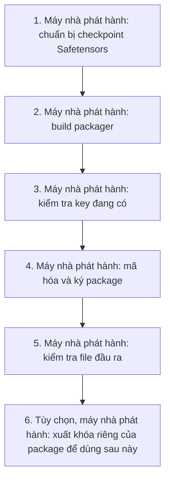

Tài liệu thao tác cục bộ cho checkout hiện tại, kiểm tra ngày 2026-10-07.
Hướng dẫn này bao gồm mã hóa trên **máy nhà phát hành** và cấu hình chạy trên
**server khách hàng**. Lệnh mã hóa chỉ chạy trên máy nhà phát hành, nơi có
model gốc và key. Chế độ này không cần TPM, enrollment, challenge hay license.
Server khách hàng vẫn cần image protected đã build và cấu hình runtime bên dưới.
Branch này khóa protected runtime ở vLLM `0.30.0` và Omni `0.30.0rc1`; dùng
image được build từ branch này.
Bản tiếng Anh: [model-encryption-only.en.md](model-encryption-only.en.md).

Hướng dẫn chọn `PROTECTION_PROFILE=encrypted-file`: mã hóa cơ bản, không ràng
buộc model với TPM. Không thay đổi package TPM hoặc container đang triển khai.
Nếu cần quy trình TPM, dùng [hướng dẫn triển khai đầy đủ](Protected-Model-Usage.md).

> [!WARNING]
> Chế độ này không ngăn sao chép model sang máy khác nếu người dùng có cả
> package và khóa giải mã `model-dek.bin`. Không tương đương bảo vệ bằng TPM.

## 1. Xác định đầu vào và đầu ra (máy nhà phát hành)



| Thành phần | Đường dẫn sử dụng |
| --- | --- |
| Checkout Dynamo | `/media/thinh_do/Data/Workspace/dynamo` |
| Key nhà phát hành | `/home/thinh_do/Desktop/key-so-hoa/cqtt` |
| Passphrase | `$XDG_RUNTIME_DIR/issuer-secrets/package-v2.pass` |
| Model Qwen gốc | `/media/thinh_do/Data/Workspace/ocr_service/Resources/models/Qwen3.5-4B-25-09` |
| Model HunyuanOCR gốc | `/media/thinh_do/Data/Workspace/ocr_service/Resources/models/Model_ocr_02_10_2026` |
| Thư mục đầu ra | `/media/thinh_do/Data/Workspace/ocr_service/Resources/models/protected/encrypted-file/<tên-model>` |

Thư mục checkpoint phải chứa trực tiếp `config.json` và các file
`*.safetensors`. Packager không tìm checkpoint trong các thư mục con. Nếu dùng
`sft_HunyuanOCR_v1_5/finetuned_models`, chọn đúng checkpoint hoàn chỉnh bên trong,
không dùng thư mục cha chứa nhiều lần train. Adapter LoRA chưa merge không phải
model hoàn chỉnh để phục vụ theo hướng dẫn này.

Weights được mã hóa bằng AES-256-GCM. Metadata được cho phép, như cấu hình và
tokenizer, được giữ dạng đọc được trong `public/`; không phải mọi file nguồn
đều được đóng gói. Checkpoint nguồn không bị sửa hoặc xóa.

Các khối Bash dùng `(...)` để lỗi chỉ kết thúc khối lệnh, không đóng terminal.
Copy cả dấu mở và đóng ngoặc. Không thêm `set -e` hoặc `exit` vào shell chính.

## 2. Build công cụ mã hóa (máy nhà phát hành)

Cần Rust/Cargo theo `rust-toolchain.toml` của checkout, compiler C trên Linux,
OpenSSL CLI và Python 3. Không cần cài công cụ TPM cho profile này.

```bash
(
  set -euo pipefail
  cd /media/thinh_do/Data/Workspace/dynamo
  cargo build --locked --release -p dynamo-model-protection \
    --features packager --bin model-protection-pack --bin model-protection-issue
  test -x target/release/model-protection-pack
  test -x target/release/model-protection-issue
  target/release/model-protection-pack --help
)
```

`model-protection-pack` mã hóa model. `model-protection-issue` chỉ cần cho bước
xuất khóa tùy chọn ở mục 6. Đây là build hai công cụ trên máy phát hành,
không phải build image và không phải yêu cầu khách hàng build code.
Nếu binary đã có từ code cũ, build lại để hỗ trợ profile `encrypted-file`.

## 3. Kiểm tra key (máy nhà phát hành)

Chỉ cần bộ key sau, không cần key license, enrollment hoặc TPM policy:

| File | Vai trò | Gửi khách hàng? |
| --- | --- | --- |
| `package-signing-v2.pk8` | Private key Ed25519 để ký package | Không |
| `package-signing-v2.pub` | Public key 32 byte để kiểm tra chữ ký | Có |
| `issuer-kek-v2.bin` | Khóa 32 byte bảo vệ khóa riêng của mỗi package | Không |
| `package-v2.pass` | Passphrase mở private key; nằm trong `$XDG_RUNTIME_DIR/issuer-secrets/` | Không |

Packager tự tạo khóa mã hóa riêng cho mỗi package, gọi là DEK. DEK được bảo vệ
bằng KEK trong `issuer-record.json`. Không dùng `issuer-kek-v2.bin` làm khóa
giải mã trên server khách.

Nếu đã tạo key trước đây, chạy kiểm tra này; **không tạo lại hoặc xóa key**:

```bash
(
  set -euo pipefail
  KEY_DIR=/home/thinh_do/Desktop/key-so-hoa/cqtt
  : "${XDG_RUNTIME_DIR:?Cần phiên đăng nhập có XDG_RUNTIME_DIR}"
  PASS_DIR="$XDG_RUNTIME_DIR/issuer-secrets"
  for f in "$KEY_DIR/package-signing-v2.pk8" \
           "$KEY_DIR/package-signing-v2.pub" \
           "$KEY_DIR/issuer-kek-v2.bin" "$PASS_DIR/package-v2.pass"; do
    test -s "$f" || { printf 'Thiếu hoặc rỗng: %s\n' "$f" >&2; exit 1; }
    stat -c '%n: %s bytes, quyền %a, owner %U' "$f"
  done
  test "$(stat -c %s "$KEY_DIR/package-signing-v2.pub")" -eq 32
  test "$(stat -c %s "$KEY_DIR/issuer-kek-v2.bin")" -eq 32
  openssl pkey -in "$KEY_DIR/package-signing-v2.pk8" \
    -passin "file:$PASS_DIR/package-v2.pass" -pubout -out /dev/null
  printf 'Đã đọc được private key bằng passphrase hiện tại.\n'
  printf 'Memlock của shell, đơn vị KiB: '
  ulimit -l
)
```

Các file key/passphrase phải thuộc user chạy công cụ, có quyền `0600`, không
là symlink hoặc hard link. Không chạy bằng user khác rồi bỏ qua lỗi owner.
Public key cũng cần quyền `0600` khi dùng với CLI xuất DEK hiện tại.

> [!IMPORTANT]
> `$XDG_RUNTIME_DIR` thường là `/run/user/1000` trên máy này. Passphrase ở đây
> có thể mất khi đăng xuất hoặc reboot. Nếu private key còn nhưng passphrase
> mất, khôi phục đúng passphrase từ bản sao lưu bảo mật; không tạo passphrase
> mới cho private key cũ. Sao lưu private key, KEK và passphrase ở nơi an toàn,
> không đưa vào Git, Docker image hay gói gửi khách.

### 3.1. Tạo bộ key v2 mới (máy nhà phát hành)

Bộ key v2 dùng cho package mới. Giữ nguyên bộ key v1 để đọc package cũ.
Lệnh dừng nếu một file v2 đã tồn tại; không xóa file một phần để chạy lại.
Nếu lệnh dừng, kiểm tra từng file và khôi phục bộ key v2 trước khi mã hóa.

```bash
(
  set -euo pipefail
  umask 077
  KEY_DIR=/home/thinh_do/Desktop/key-so-hoa/cqtt
  : "${XDG_RUNTIME_DIR:?Cần phiên đăng nhập có XDG_RUNTIME_DIR}"
  PASS_DIR="$XDG_RUNTIME_DIR/issuer-secrets"
  install -d -m 0700 "$KEY_DIR" "$PASS_DIR"
  for f in "$KEY_DIR/package-signing-v2.pk8" \
           "$KEY_DIR/package-signing-v2.pub" \
           "$KEY_DIR/issuer-kek-v2.bin" "$PASS_DIR/package-v2.pass"; do
    if [ -e "$f" ] || [ -L "$f" ]; then
      printf 'Đã tồn tại, không ghi đè: %s\n' "$f" >&2
      exit 1
    fi
  done
  printf '[1/4] Tạo passphrase...\n'
  openssl rand -base64 -out "$PASS_DIR/package-v2.pass" 48
  printf '[2/4] Tạo private signing key...\n'
  openssl genpkey -algorithm ED25519 -aes-256-cbc \
    -pass "file:$PASS_DIR/package-v2.pass" \
    -out "$KEY_DIR/package-signing-v2.pk8"
  printf '[3/4] Tạo KEK...\n'
  openssl rand -out "$KEY_DIR/issuer-kek-v2.bin" 32
  printf '[4/4] Tạo public key...\n'
  PUB_DER="$(mktemp "$XDG_RUNTIME_DIR/package-v2-public.XXXXXX")"
  trap 'rm -f -- "$PUB_DER"' EXIT
  openssl pkey -in "$KEY_DIR/package-signing-v2.pk8" \
    -passin "file:$PASS_DIR/package-v2.pass" -pubout -outform DER -out "$PUB_DER"
  tail -c 32 "$PUB_DER" > "$KEY_DIR/package-signing-v2.pub"
  chmod 0600 "$KEY_DIR/package-signing-v2.pk8" \
    "$KEY_DIR/package-signing-v2.pub" "$KEY_DIR/issuer-kek-v2.bin" \
    "$PASS_DIR/package-v2.pass"
  test "$(stat -c %s "$KEY_DIR/package-signing-v2.pub")" -eq 32
  test "$(stat -c %s "$KEY_DIR/issuer-kek-v2.bin")" -eq 32
  printf 'Đã tạo bộ key v2. Chạy lại kiểm tra ở mục 3 trước khi mã hóa.\n'
)
```

## 4. Mã hóa hai model (máy nhà phát hành)

Khối này định nghĩa đầy đủ các biến rồi mã hóa Qwen và HunyuanOCR lần lượt.
`customer-ocr` là mã phạm vi khách hàng trong ví dụ; đổi nếu phát hành cho
scope khác. Thư mục đầu ra chính là thư mục model; script tạo `package/` và
`issuer-record.json` ngay bên trong. Tham số `MODEL_VERSION` chỉ là metadata
trong manifest, không tạo thư mục phiên bản. Ví dụ dùng giá trị `1`.

Đích mới nằm dưới `protected/encrypted-file/`, tách khỏi package TPM cũ.
Kiểm tra dung lượng đĩa đủ cho một bản weights mã hóa của mỗi model.

```bash
(
  set -euo pipefail
  umask 077
  cd /media/thinh_do/Data/Workspace/dynamo
  KEY_DIR=/home/thinh_do/Desktop/key-so-hoa/cqtt
  : "${XDG_RUNTIME_DIR:?Cần phiên đăng nhập có XDG_RUNTIME_DIR}"
  PASS_DIR="$XDG_RUNTIME_DIR/issuer-secrets"
  MODEL_ROOT=/media/thinh_do/Data/Workspace/ocr_service/Resources/models
  RELEASE_ROOT="$MODEL_ROOT/protected/encrypted-file"
  export PROTECTION_PROFILE=encrypted-file
  export PACKAGE_SIGNING_KEY="$KEY_DIR/package-signing-v2.pk8"
  export PACKAGE_PASSPHRASE_FILE="$PASS_DIR/package-v2.pass"
  export PACKAGE_KEY_ID=package-signing-v2
  export KEK_KEY_FILE="$KEY_DIR/issuer-kek-v2.bin"
  export KEK_KEY_ID=issuer-kek-v2
  export KEK_KEY_VERSION=2
  export MIN_RUNTIME_VERSION=1.6.0

  # Kiểm tra đường dẫn key trước khi gọi protect-model.sh.
  printf 'Kiểm tra bộ key v2...\n'
  for f in "$PACKAGE_SIGNING_KEY" "$KEY_DIR/package-signing-v2.pub" \
           "$PACKAGE_PASSPHRASE_FILE" "$KEK_KEY_FILE"; do
    if [ ! -s "$f" ]; then
      printf 'Thiếu hoặc rỗng: %s\n' "$f" >&2
      exit 1
    fi
  done
  test "$(stat -c %s "$KEY_DIR/package-signing-v2.pub")" -eq 32
  test "$(stat -c %s "$KEY_DIR/issuer-kek-v2.bin")" -eq 32

  # Kiểm tra cả hai checkpoint và đích trước khi bắt đầu.
  for MODEL in Qwen3.5-4B-25-09 Model_ocr_02_10_2026; do
    test -s "$MODEL_ROOT/$MODEL/config.json"
    compgen -G "$MODEL_ROOT/$MODEL/*.safetensors" > /dev/null
    for OUT in "$RELEASE_ROOT/$MODEL/package" \
               "$RELEASE_ROOT/$MODEL/issuer-record.json"; do
      if [ -e "$OUT" ] || [ -L "$OUT" ]; then
        printf 'Đích đã tồn tại, không ghi đè: %s\n' "$OUT" >&2
        exit 1
      fi
    done
  done

  # 4.1. Qwen.
  bash deploy/model-protection/protect-model.sh \
    "$MODEL_ROOT/Qwen3.5-4B-25-09" \
    "$RELEASE_ROOT/Qwen3.5-4B-25-09" \
    customer-ocr Qwen3.5-4B-25-09 1

  # 4.2. HunyuanOCR.
  bash deploy/model-protection/protect-model.sh \
    "$MODEL_ROOT/Model_ocr_02_10_2026" \
    "$RELEASE_ROOT/Model_ocr_02_10_2026" \
    customer-ocr Model_ocr_02_10_2026 1
)
```

Thành công, mỗi lệnh in hai đường dẫn:

```text
encrypted package: .../<tên-model>/package
issuer record (do not ship): .../<tên-model>/issuer-record.json
```

Nếu Qwen thành công nhưng OCR thất bại, giữ nguyên kết quả Qwen. Sau khi sửa
lỗi OCR, chạy lại khối trên nhưng chỉ giữ OCR trong vòng kiểm tra và bỏ lệnh
4.1. Không xóa kết quả Qwen để chạy lại cả hai. Khi phát hành phiên bản mới,
dùng thư mục đầu ra mới hoặc xác nhận/di chuyển bản cũ trước khi chạy lại; đặt
`MODEL_VERSION` thành giá trị phiên bản mới trong metadata. Không thêm thư mục
`file-v1` hoặc `file-v2` vào đường dẫn.

## 5. Kiểm tra package (máy nhà phát hành)

```bash
(
  set -euo pipefail
  RELEASE_ROOT=/media/thinh_do/Data/Workspace/ocr_service/Resources/models/protected/encrypted-file
  for MODEL in Qwen3.5-4B-25-09 Model_ocr_02_10_2026; do
    MODEL_OUT="$RELEASE_ROOT/$MODEL"
    test -s "$MODEL_OUT/package/model.protection.json"
    test -s "$MODEL_OUT/package/model.protection.sig"
    test -s "$MODEL_OUT/issuer-record.json"
    printf '\nPackage của %s:\n' "$MODEL"
    find "$MODEL_OUT/package" -maxdepth 2 -type f -printf '%P: %s bytes\n'
    python3 - "$MODEL_OUT/package/model.protection.json" <<'PY'
import json
import sys
from pathlib import Path

manifest = json.loads(Path(sys.argv[1]).read_text())
assert manifest["format"] == "secure-model-package"
assert manifest["format_version"] == 2
assert manifest["runtime"]["protection_profile"] == "encrypted-file"
assert manifest["encryption"]["algorithm"] == "AES-256-GCM"
assert manifest["protected_files"]
print("Đúng profile encrypted-file; số file weights:", len(manifest["protected_files"]))
PY
  done
)
```

Kiểm tra trên xác nhận cấu trúc/profile, không thay thế xác thực chữ ký,
kiểm tra toàn bộ digest hoặc smoke test inference. Mã hóa xong không chứng
minh model có chất lượng OCR tốt hoặc tương thích với vLLM.

```text
<tên-model>/
├── package/                       # Package được phép chuyển cho khách
│   ├── model.protection.json       # Manifest đã ký
│   ├── model.protection.sig        # Chữ ký Ed25519
│   ├── public/                    # Metadata không mã hóa
│   └── weights/*.protected        # Weights mã hóa
└── issuer-record.json             # Giữ riêng tại máy nhà phát hành
```

**Đến đây đã hoàn thành việc mã hóa.** Không cần thực hiện bước enrollment
trong tài liệu TPM. Nếu chỉ lưu package đã mã hóa, dừng tại đây.

## 6. Tùy chọn: xuất khóa để giải mã sau này (máy nhà phát hành)

Chỉ làm mục này khi cần chuẩn bị bộ file cho chế độ không TPM. Không có DEK,
server khách không thể chạy package. CLI xuất DEK kiểm tra chữ ký manifest,
chữ ký issuer-record và sự khớp giữa chúng trước khi mở khóa.

```bash
(
  set -euo pipefail
  umask 077
  cd /media/thinh_do/Data/Workspace/dynamo
  KEY_DIR=/home/thinh_do/Desktop/key-so-hoa/cqtt
  RELEASE_ROOT=/media/thinh_do/Data/Workspace/ocr_service/Resources/models/protected/encrypted-file
  for MODEL in Qwen3.5-4B-25-09 Model_ocr_02_10_2026; do
    MODEL_OUT="$RELEASE_ROOT/$MODEL"
    test ! -e "$MODEL_OUT/runtime/model-dek.bin"
    test ! -L "$MODEL_OUT/runtime/model-dek.bin"
    install -d -m 0700 "$MODEL_OUT/runtime" "$MODEL_OUT/runtime/trust"
    target/release/model-protection-issue export-file-key \
      --package "$MODEL_OUT/package" \
      --issuer-record "$MODEL_OUT/issuer-record.json" \
      --package-key-id package-signing-v2 \
      --package-public-key "$KEY_DIR/package-signing-v2.pub" \
      --kek-key-file "$KEY_DIR/issuer-kek-v2.bin" \
      --kek-key-id issuer-kek-v2 --kek-key-version 2 \
      --output "$MODEL_OUT/runtime/model-dek.bin"
    test "$(stat -c %s "$MODEL_OUT/runtime/model-dek.bin")" -eq 32
    install -m 0600 "$KEY_DIR/package-signing-v2.pub" \
      "$MODEL_OUT/runtime/trust/package-public.key"
    sed 's/package-signing-v1/package-signing-v2/' \
      deploy/model-protection/runtime.file.json.example \
      > "$MODEL_OUT/runtime/runtime.json"
    python3 -c 'import json,sys; assert json.load(open(sys.argv[1]))["package_trust"]["key_id"] == "package-signing-v2"' \
      "$MODEL_OUT/runtime/runtime.json"
    chmod 0600 "$MODEL_OUT/runtime/runtime.json"
    printf 'Đã chuẩn bị runtime riêng cho %s.\n' "$MODEL"
  done
)
```

Mỗi model có DEK khác nhau. Nếu chạy lại mà một model đã xuất DEK thành công,
chỉ giữ model còn thiếu trong vòng lặp; không ghi đè DEK đang dùng.

Khi cần bàn giao, chuyển riêng `package/` và `runtime/` của đúng model qua
kênh bảo mật. `runtime/model-dek.bin` là **bí mật**, không in nội dung vào log.
Chỉ chuyển hai thư mục `package/` và `runtime/`; không chuyển
`issuer-record.json`. Không gửi KEK, `.pk8` hoặc passphrase. Không đưa
checkpoint gốc vào gói bàn giao.

## 7. Cấu hình chạy trên server khách hàng

Chỉ chuyển `package/` và `runtime/` của cùng một model/version. Đặt hai thư
mục này trực tiếp dưới thư mục model. Không tạo thêm thư mục `file-v1`.
Compose OCR và LLM nối `OCR_MODEL_PATH` hoặc `LLM_MODEL_PATH` trực tiếp với
`/package` và `/runtime`.

Nếu bạn đặt thư mục model tại `/root/developments/sohoa/ocr-prod`, cây thư
mục phải như sau:

```text
/root/developments/sohoa/ocr-prod/
├── package/
└── runtime/
    ├── runtime.json
    ├── model-dek.bin
    └── trust/package-public.key
```

Đặt `OCR_MODEL_PATH=/root/developments/sohoa/ocr-prod`. Nếu bạn giữ thư mục
model bên trong thư mục gốc triển khai, hãy đặt biến này trỏ thẳng tới thư
mục model có `package/` và `runtime/` bên trong.

### 7.1. Cấu hình `runtime.json`

`runtime.json` nằm trong thư mục runtime đã mount thành `/runtime`. Dùng cấu
hình profile `encrypted-file`; không bật license hoặc TPM:

```json
{
  "schema_version": 2,
  "profile": "encrypted-file",
  "layers": {
    "package_verification": true,
    "license_verification": false,
    "tpm_binding": false,
    "secure_materialization": true
  },
  "package_trust": {
    "key_id": "package-signing-v2",
    "public_key_file": "/runtime/trust/package-public.key"
  },
  "key_provider": {
    "type": "file",
    "key_file": "/runtime/model-dek.bin"
  },
  "process_memory_margin_bytes": 8589934592
}
```

`package_trust.key_id` phải khớp với key ID đã dùng để ký package. Ví dụ này
dùng `package-signing-v2`; nếu package của bạn dùng key ID khác, dùng đúng giá
trị trong package manifest và file runtime. Các đường dẫn JSON là đường dẫn
bên trong container, không phải đường dẫn host.

Không đặt DEK trong `.env.prod`. File `runtime.json`, DEK và public key đã
được chuyển trong thư mục `runtime/`.

### 7.2. Cấu hình `.env.prod`

Với OCR, đặt các biến sau trong `.env.prod` cạnh Compose file:

```dotenv
OCR_PROTECTED_IMAGE=dynamo-vllm-protected-prod:1.5.0
OCR_MODEL_PATH=/root/developments/sohoa/ocr-prod
OCR_MODEL_NAME=KNM/OCR1.0-1B
OCR_MODEL_PROTECTION_CONFIG=/runtime/runtime.json
```

Đường dẫn trên phải trỏ trực tiếp tới thư mục có `package/` và `runtime/`.
`OCR_MODEL_NAME` phải trùng tên model
được khai báo cho frontend và worker.

Với LLM, dùng biến `LLM_*` tương ứng:

```dotenv
LLM_PROTECTED_IMAGE=dynamo-vllm-protected-prod:1.5.0
LLM_MODEL_PATH=/root/developments/sohoa/llm-prod
LLM_MODEL_NAME=Qwen3.5-4B-25-09
LLM_MODEL_PROTECTION_CONFIG=/runtime/runtime.json
```

`OCR_MODEL_PATH` và `LLM_MODEL_PATH` là đường dẫn host tới thư mục model.
Compose mount `<đường-dẫn>/package` vào `/models/package` và
`<đường-dẫn>/runtime` vào `/runtime`, ở chế độ chỉ đọc. Giá trị
`OCR_MODEL_PROTECTION_CONFIG` hoặc `LLM_MODEL_PROTECTION_CONFIG` là đường dẫn
trong container. Không đặt biến này bằng đường dẫn host.

Đặt UID/GID của worker để khớp owner của file runtime trên host. Các biến
`OCR_PROTECTED_MEMORY_LIMIT`, `OCR_PROTECTED_TMPFS_SIZE`,
`LLM_PROTECTED_MEMORY_LIMIT`, `LLM_PROTECTED_TMPFS_SIZE` và `MEMLOCK_BYTES`
phải dựa trên số đo của server khách. Giá trị mặc định trong Compose chỉ là
giá trị khởi điểm, không phải mức đã nghiệm thu cho mọi model.

Compose mặc định chạy worker bằng UID/GID `1000:1000`. Sau khi sao chép artifact,
đặt owner và mode khớp với worker:

```bash
MODEL_DIR=/root/developments/sohoa/ocr-prod
sudo chown -R 1000:1000 "$MODEL_DIR/package" "$MODEL_DIR/runtime"
sudo find "$MODEL_DIR/package" "$MODEL_DIR/runtime" -type d -exec chmod 0700 {} +
sudo find "$MODEL_DIR/package" "$MODEL_DIR/runtime" -type f -exec chmod 0600 {} +
```

Đặt `MODEL_DIR` thành thư mục có trực tiếp `package/` và `runtime/`.
Nếu dùng UID/GID khác, đặt `MODEL_PROTECTION_UID` và
`MODEL_PROTECTION_GID` tương ứng.

### 7.3. Metadata local và truy cập Hugging Face

Worker giải mã model vào thư mục tmpfs riêng. Frontend không thể đọc trực tiếp
đường dẫn đó. Vì vậy worker phải phục vụ các file metadata cho frontend qua
HTTP trên mạng Docker nội bộ. Cả hai Compose file phải đặt các biến này trong
môi trường worker:

```yaml
DYN_SYSTEM_PORT: "9090"
DYN_SELF_HOST_METADATA: "true"
```

OCR và LLM Compose hiện đặt hai biến này trong `protected-environment`. Cổng
`9090` không cần publish ra host; frontend và worker phải cùng mạng Docker.
Khi self-host metadata hoạt động, frontend đọc config/tokenizer từ worker.
Nó không cần tải weights hoặc metadata từ Hugging Face.

Nếu `DYN_SYSTEM_PORT` thiếu hoặc worker không thể phục vụ metadata, Dynamo có
thể coi đường dẫn tạm như `/run/protected-ocr-models/<id>` là Hugging Face
repository ID. Log sẽ có `ignore_weights=true` và URL không hợp lệ
`/api/models//run/protected-ocr-models/...`. Dòng `ignore_weights=true` nghĩa
là lần tải đó bỏ qua weights; nó vẫn có thể thử tải metadata. Kiểm tra hai
biến trên, trạng thái worker và kết nối giữa frontend/worker trên mạng Docker.

Compose worker cũng cần cache ghi được vì container chạy với root filesystem
chỉ đọc:

```yaml
HOME: /tmp
CUPY_CACHE_DIR: /tmp/cache/cupy
XDG_CACHE_HOME: /tmp/cache
```

`/tmp` trong Compose đã là `tmpfs`. `CUPY_CACHE_DIR` xử lý lỗi CuPy ghi vào
`/home/dynamo/.cupy`; biến này không liên quan tới mã hóa hoặc tải model.

### 7.4. Khởi động lại worker

Sau khi chuyển package/runtime, cập nhật `.env.prod` và Compose file, chạy từ
thư mục `deploy/prod` trên server khách:

```bash
docker compose --env-file .env.prod \
  -f docker-compose.model-ocr.yaml \
  up -d --force-recreate vllm-ocr-worker
```

Đổi file Compose và env không yêu cầu build lại image. Chỉ build image nếu
image trên server chưa có model-protection loader hoặc thiếu bản sửa code.
Kiểm tra log sau khi worker khởi động:

```bash
docker compose --env-file .env.prod \
  -f docker-compose.model-ocr.yaml \
  logs -f --tail=100 vllm-ocr-server vllm-ocr-worker
```

Không thấy frontend yêu cầu `/api/models//run/protected-ocr-models/...`. Sau
đó kiểm tra `/v1/models` và gửi một yêu cầu OCR. Thực hiện tương tự với
`docker-compose.model-llm.yaml` và service `vllm-llm-worker` cho LLM.

## 8. Xử lý lỗi thường gặp

### Lỗi thường gặp

| Lỗi | Cách xử lý |
| --- | --- |
| `packager not found` | Chạy mục 2 trong đúng checkout Dynamo. |
| `key/passphrase files must exist` | Lệnh mã hóa phải trỏ tới `package-signing-v2.pk8`, `package-v2.pass` và `issuer-kek-v2.bin` như mục 4. Kiểm tra chúng trước khi chạy lại. |
| `ISSUER_KEY_DECRYPT_FAILED` | Dùng đúng passphrase của private key; không tạo passphrase mới. |
| `ISSUER_KEY_INVALID` / `ISSUER_PASSPHRASE_INVALID` | Kiểm tra file không rỗng, KEK đủ 32 byte, owner, quyền `0600` và không có symlink/hard link. |
| `SOURCE_INVALID` | Chọn checkpoint có `config.json`, weights Safetensors và index shard nhất quán, không chọn thư mục cha. |
| `refusing to overwrite existing output` | Kiểm tra kết quả cũ; nếu phát hành mới, dùng thư mục và version mới. Không xóa package đang dùng. |
| `ISSUER_MEMORY_UNAVAILABLE` hoặc lỗi cấp phát bộ nhớ | Nhờ admin cấp RAM và giới hạn memlock phù hợp cho process đóng gói. Không bỏ khóa bộ nhớ để chạy qua lỗi. |
| `SOFTWARE_PROFILE_REQUIRED` khi xuất DEK | Package cũ là TPM hoặc profile khác. Tạo package mới với `PROTECTION_PROFILE=encrypted-file`; không sửa manifest đã ký. |
| Frontend gọi Hugging Face với `/run/protected-...` | Đặt `DYN_SYSTEM_PORT=9090` và `DYN_SELF_HOST_METADATA=true` trên worker; xác nhận worker và frontend ở cùng mạng Docker. Không đổi model thành repo ID giả. |
| `OSError: Read-only file system: /home/dynamo/.cupy` | Đặt `HOME=/tmp` và `CUPY_CACHE_DIR=/tmp/cache/cupy`; xác nhận `/tmp` là tmpfs ghi được. |
| Không tìm thấy `package/` hoặc `runtime/` | Đặt `OCR_MODEL_PATH`/`LLM_MODEL_PATH` trỏ tới thư mục host có trực tiếp hai thư mục này; không thêm `/file-v1`. Kiểm tra cấu trúc đã copy. |
| `MODEL_PROTECTION_CONFIG_INVALID` | Kiểm tra JSON tại `runtime/runtime.json`, key ID và đường dẫn `/runtime/...`; đảm bảo worker đọc được mọi file. |

`ulimit -l` trên Bash trả đơn vị KiB, khác `MEMLOCK_BYTES` của container worker.
Kiểm thử CLI tổng hợp trước đây dùng memlock 256 MiB (`262144` KiB); đây không
phải cam kết đủ cho mọi key/KDF hoặc model. Không dùng `sudo` chạy packager chỉ
để vượt giới hạn, vì kiểm tra owner của key sẽ thay đổi. Giữ nguyên thông báo
lỗi để xác định thiếu file, sai passphrase hay thiếu tài nguyên trước khi chạy lại.
