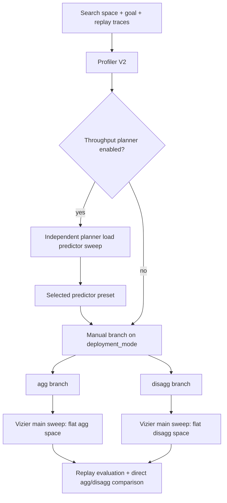

# Profiler V2: Smart Sweeping Tool for Dynamo Deployments

## Motivation

Dynamo deployments are hard to configure. A good setup depends on multiple interacting components, including engines, routers, planners, KV policy, replica counts, and parallelization choices. The right choice can also change under dynamic traffic, where static rules of thumb are often not enough.

Replay gives us a fast way to try candidate configurations before deployment, but today the process still needs a human expert to decide what to try next. Profiler V2 should automate that loop: generate legal candidates, evaluate them with replay, and use Vizier to guide the next sweep samples.

This sweeper is not an engine/kernel autotuner. Its focus is high-level Dynamo configuration: scheduling, routing, autoscaling, deployment shape, replica counts, and runtime capacity knobs that affect serving behavior.

## Scope

This plan defines the Profiler V2 smart-search surface. Profiler V2 uses Vizier as the smart sweeping optimizer. This document inventories deployment, engine, KV manager, router, and planner knobs, then classifies each knob by optimizer treatment. It does not define how the search inputs are populated.

## V2 Refactor Direction

V2 should land as an opt-in implementation under `components/src/dynamo/profiler/v2/`. It should own search-space construction, candidate decoding, replay evaluation, ranking, and report generation for opt-in runs.

V2 should not change the existing V1 profiler defaults or k8s controller/operator path. In the opt-in path, V2 replaces the current AIC sweeper/picker role, while AIC remains a lower-level provider for backend support checks, legal parallelism hints, perf model data, and memory/capacity estimates.

## Overview

Profiler V2 uses two sweep paths. The main Vizier sweep is manually branched by deployment mode, so `agg` and `disagg` each expose a flat search space. Vizier samples are guided by replay's virtual-clock simulation, and replay evaluations can run in parallel on CPU. Planner load prediction can be tuned separately with an independent simple grid sweep when throughput planner is enabled.



| Branch | Engine | Router | Planner |
| --- | --- | --- | --- |
| `agg` | aggregated workers: `tp/pp/dp/moe_tp/moe_ep`, `workers`, agg engine args | agg-compatible router modes and queue policy | `mode=agg`, agg engine GPU shape |
| `disagg` | prefill/decode workers: separate prefill shape, decode shape, prefill worker count, decode worker count | disagg router mode, prefill/decode scoring, admission | `mode=disagg`, prefill/decode engine GPU shape |

Treatment labels:

- `Branch`: split outside a single Vizier flat study.
- `Search`: Vizier candidate dimension. All `Search` knobs can also be pinned by user override.
- `Composite Search`: one high-level candidate dimension decoded into multiple runtime fields.
- `Derived`: generated from branch, backend, shape, AIC output, or candidate generation.
- `Pinned`: fixed by user input, environment, model, or backend policy.

## Optimization Goal

Profiler V2 does not return a single tuned configuration. Its goal is to produce a list of viable deployment candidates ranked by performance, so the user can compare the top recommendation against ranked alternatives.

The optimization goal is user-owned and `Pinned`; it is never a search dimension:

- `optimization_target` defines what "better" means: `throughput`, `e2e_latency`, `goodput`, or `goodput_per_gpu`.
- SLA targets (`ttft_ms`+`itl_ms`, or `e2e_ms`) are user constraints. `goodput` and `goodput_per_gpu` require an SLA target; `throughput` and `e2e_latency` may run without one.
- The GPU budget (`gpu_budget`) is the deployment `budget` knob, not part of the goal; it is applied as a feasibility constraint in the gate below.

The goal is captured by the `OptimizationGoal` structure, defined alongside the other search inputs in [Internal Search API](#internal-search-api).

Candidates are ranked in two stages:

1. Feasibility gate — a candidate must pass candidate generation and preflight (legal parallel shape, memory fit, backend/SKU support, `gpu_budget`, and any user-pinned knobs) and, when an SLA is set, satisfy it under replay. Infeasible candidates are dropped rather than scored.
2. Objective ranking — feasible candidates are sorted by the `optimization_target` score from their replay report: `throughput`, `goodput`, and `goodput_per_gpu` pick the maximum; `e2e_latency` picks the minimum.

If no candidate clears the feasibility gate the search returns an empty list. The concrete per-candidate score for each objective is defined in [Main Sweep Optimization Goal](#main-sweep-optimization-goal).

## Deployment Knobs

Deployment owns model identity, hardware target, topology, backend type, and budget envelope: model, GPU SKU, branch, replica counts, GPU budget, and per-engine GPU accounting. Engine and KV manager consume these derived values.

| Category | Knob | Applies | Proposed treatment | Notes |
| --- | --- | --- | --- | --- |
| model | `model_name` | all | `Pinned` | Model identity (HF id or private model name). Selects the AIC perf-model table and memory-fit estimates; never a search dimension. One model is shared across all components in a candidate. Maps to `EngineSpec.model`. |
| hardware | `hardware_sku` | all | `Pinned` | GPU SKU (e.g. `h200_sxm`, `h100_sxm`). Selects the AIC hardware system and bounds legal parallelism and `gpu_budget`; never a search dimension. Maps to `HardwareSpec.gpuSku`. |
| deployment mode | `deployment_mode`: `agg`, `disagg` | all | `Pinned`+`Branch` | Pin when user specifies one mode; otherwise split studies outside Vizier and rank branches globally. |
| backend type | `backend` + `engine_type`: `vllm`, `sglang`, `trtllm` | all | `Search` | Search only across candidate backends with comparable replay+perf model support; can be pinned by user override. Disagg first pass uses one shared backend type for prefill+decode unless mixed-backend deployment is explicitly enabled. |
| objective | `optimization_target`: `throughput`, `e2e_latency`, `goodput`, `goodput_per_gpu`; optional SLA targets: `ttft_ms`+`itl_ms` or `e2e_ms` | profiler+planner | `Pinned` | User-selected replay objective. `goodput` and `goodput_per_gpu` require an SLA target. |
| component enablement | `enable_kvrouter` | deployment | `Pinned` | Controls whether V2 emits/evaluates KV-router config; not a search knob. |
| component enablement | `enable_planner` | deployment | `Pinned` | Controls whether V2 emits planner config; not a search knob. |
| replica+parallel config | `workers`, `prefill_workers`, `decode_workers`, parallel strategy: `tp`, `tep`, `dep` (MLA) | replay+profiler+AIC | `Composite Search` | Search legal per-component parallel configs using the current profiler's TP+TEP+DEP (MLA) sweep, then compute replica counts from `gpu_budget` and combine them into one categorical candidate. PP is pinned outside this search. |
| budget | `gpu_budget`, `max_gpu_budget`, `min_gpu_budget`, `min_endpoint` | hardware+planner | `Pinned` | `gpu_budget` is the single max-GPU budget concept and maps to planner `max_gpu_budget`; min constraints are pinned deployment inputs used by candidate generation. |

## Engine Knobs

### Full Engine Inventory

| Category | Knob | Applies | Proposed treatment | Notes |
| --- | --- | --- | --- | --- |
| worker role | `worker_type`: `aggregated`, `prefill`, `decode` | replay engine | `Derived` | Derived from branch and component. |
| parallel shape | `tp`, `pp`, `dp`, `moe_tp`, `moe_ep` | planner+AIC | `Composite Search` | Search together with deployment `replica+parallel config` as legal deployment-shape composites capped by `gpu_budget`; first pass only emits TP+TEP+DEP (MLA) candidates, with PP pinned. |
| KV capacity | `num_gpu_blocks`, `total_kv_blocks`, `max_kv_tokens` | replay+runtime | `Derived` | Derived from AIC+memory-fit and block layout; not a search knob in the first design pass. |
| block layout | `block_size`, `kv_cache_block_size` | replay+runtime | `Pinned` | Backend+runtime policy. vLLM default differs from SGLang page size. |
| context | `context_length` | runtime metadata | `Pinned` | Model+runtime constraint, not a search knob. |
| memory budget policy | `gpu_memory_utilization`, `mem_fraction_static`, `free_gpu_memory_fraction` | replay+AIC+backend | `Pinned` | Different backend/config-surface names for the same KV memory budget fraction policy; pin one normalized value. |
| batching | `max_num_seqs` | replay+runtime | `Search` | Important scheduler capacity knob; controls concurrent sequence admission. |
| batching | `max_num_batched_tokens` | replay+runtime | `Search` | Important scheduler capacity knob; controls token batching capacity. |
| cache | `enable_prefix_caching` | replay+runtime | `Pinned` | Pin from backend+runtime policy; decoder may still force worker-role-specific values such as false for decode workers. |
| startup | `startup_time` | replay+planner | `Pinned` | Deployment+environment input. |
| speculative decode | `aic_nextn`, `aic_nextn_accept_rates` | `origin/main` replay+AIC | `Pinned` | `aic_nextn` validates to 1..5 when set. Replay MTP token progression support should be clarified before searching this. |

### Engine Search Knobs By Component

Parallelization mapping is searched as a composite together with deployment `replica+parallel config`; backend type is also owned by deployment. The component-level engine search below only covers runtime batching knobs.

| Component | Search knob | Treatment | Notes |
| --- | --- | --- | --- |
| prefill | `max_num_batched_tokens` | `Search` | Primary prefill batching capacity knob. |
| prefill | `max_num_seqs` | `Search` | Optional prefill admission and concurrency knob when the backend uses it. |
| decode | `max_num_seqs` | `Search` | Primary decode concurrency knob. |
| decode | `max_num_batched_tokens` | `Search` | Optional decode token batching cap when the backend exposes it. |
| agg | `max_num_seqs` | `Search` | Aggregated concurrency and admission knob. |
| agg | `max_num_batched_tokens` | `Search` | Aggregated token batching capacity knob. |

## KV Manager Knobs

KV manager owns multi-tier KV storage/offload policy. Engine search should only consume the derived capacity and transfer assumptions it needs for replay; G2/G3/G4 should not be modeled as engine knobs.

| Category | Knob | Applies | Proposed treatment | Notes |
| --- | --- | --- | --- | --- |
| KV accounting | `kv_bytes_per_token` | replay/KV manager | `Derived` | Derived from model/cache dtype and block layout; required for capacity and transfer estimates. |
| KV transfer | `kv_transfer_bandwidth` | replay/mocker | `Derived` | PD disagg KV transfer bandwidth for prefill-to-decode KV handoff latency; separate from KVBM G1/G2/G3/G4 offload tier bandwidths. |
| G2 capacity | `num_g2_blocks` | replay/offload | `Pinned` | Entry point for offload policy. G3/G4 depend on G2. |
| G2 transfer | `bandwidth_g1_to_g2_gbps`, `bandwidth_g2_to_g1_gbps` | replay/offload | `Pinned` | Tier-specific transfer model. |
| G2 batching | `offload_batch_size` | replay/offload | `Pinned` | KV policy input, not an optimizer dimension in the first design pass. |
| G3 capacity | `num_g3_blocks` | `origin/main` replay/offload | `Pinned` | Requires `num_g2_blocks`. |
| G3 transfer | `bandwidth_g2_to_g3_gbps`, `bandwidth_g3_to_g2_gbps` | `origin/main` replay/offload | `Pinned` | Applies only when G3 policy is enabled. |
| G4 enablement | `enable_g4_storage` | `origin/main` replay/offload | `Pinned` | Requires `num_g2_blocks`. |
| G4 transfer | `bandwidth_g2_to_g4_gbps`, `bandwidth_g4_to_g2_gbps` | `origin/main` replay/offload | `Pinned` | Applies only when G4 policy is enabled. |

## Router Knobs

### Full Router Inventory

| Category | Knob | Proposed treatment | Notes |
| --- | --- | --- | --- |
| router mode | `router_mode`: `round-robin`, `random`, `power-of-two`, `kv`, `direct`, `least-loaded`, `device-aware-weighted` | `Search` | Replay optimizer currently uses `kv_router` and `round_robin` names; decoder should normalize to runtime names. |
| branch strictness | `enforce_disagg` | `Derived` | Should follow disagg branch unless user wants fallback behavior. |
| admission | `active_decode_blocks_threshold`, `active_prefill_tokens_threshold`, `active_prefill_tokens_threshold_frac`, `no_admission_control` | `Pinned` | Admission policy input, not an optimizer dimension in the first design pass. |
| KV score | `overlap_score_credit` | `Search` | Current replay optimizer already searches it. |
| KV score | `prefill_load_scale` | `Search` | Current replay optimizer already searches it. |
| KV score | `host_cache_hit_weight`, `disk_cache_hit_weight` | `Search` | Rust binding exposes these; Python CLI group does not currently list them. |
| stochasticity | `router_temperature` | `Search` | Only relevant for KV scoring. |

## Planner Knobs

### Full Planner Inventory

| Category | Knob | Proposed treatment | Notes |
| --- | --- | --- | --- |
| mode/env | `mode`: `agg`, `disagg` | `Derived` | Comes from branch. |
| mode/env | `environment`, `namespace` | `Pinned` | Deployment context. Backend type is owned by deployment search. |
| per-engine GPU count | `decode_engine_num_gpu`, `prefill_engine_num_gpu` | `Derived` | Derived directly from the chosen parallel shape. |
| scaling policy | `enable_throughput_scaling`, `enable_load_scaling`, `throughput_adjustment_interval_seconds`, `load_adjustment_interval_seconds` | `Composite Search` | Search as one legal planner scaling policy tuple. If both scaling modes are enabled, load cadence must be shorter than throughput cadence. |
| FPM sampling | `max_num_fpm_samples`, `fpm_sample_bucket_size` | `Composite Search` | Search as paired presets. Bucket size must be a perfect square. |
| load scaling sensitivity | `load_scaling_down_sensitivity`, `load_min_observations` | `Search` | Applies to load scaling policy. |

## Main Sweep Optimization Goal

The main sweep objective is user configurable. Every Vizier sample is decoded into a concrete candidate and evaluated by replay virtual-clock simulation; the replay report provides the metric used as the candidate score.

| Objective | Direction | Requires SLA | Score definition |
| --- | --- | --- | --- |
| `throughput` | maximize | no | Replay throughput for the configured workload. |
| `e2e_latency` | minimize | no | Replay end-to-end request latency for the configured workload. |
| `goodput` | maximize | yes | Throughput from requests that satisfy the configured SLA. SLA can be `ttft_ms`+`itl_ms` or `e2e_ms`. |
| `goodput_per_gpu` | maximize | yes | `goodput / used_gpus`, where `used_gpus` is derived from `replica_parallel_config`. |

## Main Sweep Search Space

Engine batching values in this table are per attention-DP rank. Candidate decoding should derive global component capacity from `attention_dp_size` in the selected `replica_parallel_config`.

| Group | Search dimension | Treatment | Knobs controlled | Candidate values | Notes |
| --- | --- | --- | --- | --- | --- |
| Deployment | `backend_type` | `Search` | `backend` + `engine_type` | `vllm`, `sglang`, `trtllm` | All branches; can be pinned by user override. |
| Deployment | `replica_parallel_config` | `Composite Search` | branch-specific workers + parallel configs | Generated legal TP+TEP+DEP (MLA) configs; replica counts computed from `gpu_budget` | Branch-aware categorical candidate. Agg decodes to `workers` + agg parallel config; disagg decodes to `prefill_workers`, `decode_workers` + prefill+decode parallel configs. |
| Prefill Engine | `prefill_max_num_batched_tokens` | `Search` | `max_num_batched_tokens` | `8k`, `16k`, `32k` | Disagg branch only. |
| Prefill Engine | `prefill_max_num_seqs` | `Search` | `max_num_seqs` | `1`, `2`, `4`, `8` | Disagg branch only. |
| Decode Engine | `decode_max_num_batched_tokens` | `Search` | `max_num_batched_tokens` | `8k` | Disagg branch only; fixed search dimension for explicit config emission. |
| Decode Engine | `decode_max_num_seqs` | `Search` | `max_num_seqs` | `256`, `512`, `1024` | Disagg branch only. |
| Agg Engine | `agg_max_num_batched_tokens` | `Search` | `max_num_batched_tokens` | `8k`, `16k`, `32k` | Agg branch only. |
| Agg Engine | `agg_max_num_seqs` | `Search` | `max_num_seqs` | `256`, `512`, `1024` | Agg branch only. |
| Router | `router_mode` | `Search` | `router_mode` | `round-robin`, `kv` | Decoder normalizes runtime names to replay names such as `round_robin` and `kv_router`. |
| Router | `router_overlap_score_credit` | `Search` | `overlap_score_credit` | `0.0`, `0.5`, `1.0` | Active for KV router mode; ignored by round-robin. |
| Router | `router_prefill_load_scale` | `Search` | `prefill_load_scale` | `0.0`, `0.25`, `0.5`, `1.0`, `2.0`, `4.0` | Active for KV router mode; ignored by round-robin. |
| Router | `router_host_cache_hit_weight` | `Search` | `host_cache_hit_weight` | `0.5`, `0.75`, `1.0` | Active for KV router mode; default is `0.75`. |
| Router | `router_disk_cache_hit_weight` | `Search` | `disk_cache_hit_weight` | `0.0`, `0.25`, `0.5` | Active for KV router mode; default is `0.25`. |
| Router | `router_temperature` | `Search` | `router_temperature` | `0.0`, `0.2`, `0.5`, `1.0` | `0.0` keeps deterministic selection; higher values increase sampling randomness. |
| Planner | `planner_scaling_policy` | `Composite Search` | `enable_throughput_scaling`, `enable_load_scaling`, `throughput_adjustment_interval_seconds`, `load_adjustment_interval_seconds` | `throughput_180_5`: `{true, false, 180, 5}`; `throughput_600_5`: `{true, false, 600, 5}`; `load_180_5`: `{false, true, 180, 5}`; `load_180_10`: `{false, true, 180, 10}`; `hybrid_180_5`: `{true, true, 180, 5}`; `hybrid_600_5`: `{true, true, 600, 5}` | Composite categorical dimension. Candidate generator may filter policies by `optimization_target`. |
| Planner | `planner_fpm_sampling` | `Composite Search` | `max_num_fpm_samples`, `fpm_sample_bucket_size` | `small`: `{32, 4}`; `default`: `{64, 16}`; `large`: `{128, 16}`; `fine`: `{128, 64}` | Paired presets keep bucket size compatible with sample count. `fpm_sample_bucket_size` must be a perfect square. |
| Planner | `planner_load_sensitivity` | `Search` | `load_scaling_down_sensitivity`, `load_min_observations` | `aggressive`: `{70, 3}`; `default`: `{80, 5}`; `conservative`: `{90, 8}` | Controls scale-down conservativeness and regression cold-start threshold. |

## Planner Load Predictor Independent Grid Sweep

Planner load predictor tuning should be a separate deterministic grid search, not part of the main Vizier candidate space. It is easy to validate directly against replay/planner traces, so V2 should run a small predefined set of predictor configs and pick by forecast loss.

Scope: load predictors only matter when the planner uses predictive throughput scaling. The current planner feeds predictors from traffic windows and predicts the next window's `num_req`, `isl`, `osl`, and optionally `kv_hit_rate`. Load-only/easy scaling paths do not need this sweep.

| Category | Knob | Proposed treatment | Notes |
| --- | --- | --- | --- |
| predictor family | `load_predictor`: `constant`, `arima`, `kalman`, `prophet` | Separate Grid Search | Predefine a small config set per family. |
| predictor input transform | `load_predictor_log1p` | Separate Grid Search | Search as part of predictor presets, not independently. |
| predictor warmup | `load_predictor_warmup_trace` | Pinned+Derived | If warmup data is available, apply it to all predictor candidates equally; do not multiply the preset space by warmup path. |
| prophet preset | `prophet_window_size` | Separate Grid Search | Predictor-specific preset field. |
| kalman preset | `kalman_q_level`, `kalman_q_trend`, `kalman_r`, `kalman_min_points` | Separate Grid Search | Predictor-specific preset fields. |

Load Predictor Search Space:

| ID | `load_predictor` | Config | Notes |
| --- | --- | --- | --- |
| `constant_last` | `constant` | `load_predictor_log1p=false` | Baseline: predict last observed value. |
| `arima_raw` | `arima` | `load_predictor_log1p=false` | Auto-ARIMA on raw series. |
| `arima_log1p` | `arima` | `load_predictor_log1p=true` | Auto-ARIMA on log-scaled series. |
| `prophet_w20_raw` | `prophet` | `load_predictor_log1p=false`, `prophet_window_size=20` | Short window, raw series. |
| `prophet_w20_log1p` | `prophet` | `load_predictor_log1p=true`, `prophet_window_size=20` | Short window, log-scaled series. |
| `prophet_w50_raw` | `prophet` | `load_predictor_log1p=false`, `prophet_window_size=50` | Default-ish window, raw series. |
| `prophet_w50_log1p` | `prophet` | `load_predictor_log1p=true`, `prophet_window_size=50` | Default-ish window, log-scaled series. |
| `kalman_default_raw` | `kalman` | `load_predictor_log1p=false`, `kalman_q_level=1.0`, `kalman_q_trend=0.1`, `kalman_r=10.0`, `kalman_min_points=5` | Planner default Kalman shape. |
| `kalman_default_log1p` | `kalman` | `load_predictor_log1p=true`, `kalman_q_level=1.0`, `kalman_q_trend=0.1`, `kalman_r=10.0`, `kalman_min_points=5` | Planner default Kalman shape on log scale. |
| `kalman_reactive_raw` | `kalman` | `load_predictor_log1p=false`, `kalman_q_level=10.0`, `kalman_q_trend=1.0`, `kalman_r=5.0`, `kalman_min_points=3` | Faster response to bursts. |
| `kalman_reactive_log1p` | `kalman` | `load_predictor_log1p=true`, `kalman_q_level=10.0`, `kalman_q_trend=1.0`, `kalman_r=5.0`, `kalman_min_points=3` | Faster response to bursts on log scale. |

Grid search evaluation:

1. Build the same traffic windows used by planner throughput scaling, using `throughput_adjustment_interval_seconds`.
2. Run each predefined predictor preset in rolling one-step-ahead mode. Warm with the configured warmup prefix/trace when present, then score predictions against the next observed window.

Optimization goal:

For each evaluated non-empty window `t`, let observed traffic be `N_t`, `I_t`, `O_t` for `num_req`, `isl`, `osl`, and prediction be `N_hat_t`, `I_hat_t`, `O_hat_t`. Minimize weighted log-scale one-step-ahead error:

`loss = 0.4 * err(N_hat_t * I_hat_t, N_t * I_t) + 0.4 * err(N_hat_t * O_hat_t, N_t * O_t) + 0.1 * err(I_hat_t, I_t) + 0.1 * err(O_hat_t, O_t)`

where `err(pred, actual) = abs(log1p(max(pred, 0)) - log1p(max(actual, 0)))`. This keeps `num_req*isl`, `num_req*osl`, `isl`, and `osl` comparable despite different raw scales.

The selected predictor preset is emitted as pinned planner config for the main V2 candidate evaluation.

## Internal Search API

This is a pure internal search API. It takes a search space, an optimization goal, and a sweep config, runs the Vizier + replay sweep, and returns the evaluated candidates ranked by performance. It is decoupled from any orchestration or deployment-request layer — how the search space and goal get populated (from a config file, a CLI, or a test) is out of scope here.

```python
# components/src/dynamo/profiler/v2/__init__.py

class SearchSpace(BaseModel):
    """Inputs to one search run, grouped by component. Each group lists its
    swept knobs (list-typed candidate sets; a single-element list pins that
    knob) followed by the `Pinned` knobs that group needs (scalars). When
    `deployment_mode` lists both branches the optimizer runs one flat study per
    branch and ranks across both; engine batching is read per branch
    (prefill/decode for disagg, agg for aggregated). This is the main-sweep
    space; planner load-predictor tuning is a separate grid sweep (see below)."""
    model_config = ConfigDict(extra="forbid")

    # deployment: branch + backend + legal parallel shapes
    deployment_mode: list[str] = ["disagg", "agg"]  # branches to explore; pin with one
    backend: list[str] = ["vllm"]                  # vllm | sglang | trtllm
    parallel_configs: list[dict[str, Any]]          # generated legal TP/TEP/DEP shapes
    # pinned
    model_name: str                                 # HF id or private model name
    hardware_sku: str                               # e.g. "h200_sxm"
    gpu_budget: int = 32                            # max GPUs per candidate
    min_gpu_budget: int | None = None                # lower bound for candidate generation
    min_endpoint: int | None = None                 # min replicas per component
    enable_kvrouter: bool = True                    # emit/evaluate KV-router config
    enable_planner: bool = True                     # emit planner config
    context_length: int | None = None               # model + runtime constraint
    startup_time: float | None = None               # worker startup time (s)
    aic_nextn: int | None = None                    # speculative-decode (MTP) depth, 1..5

    # prefill engine (disagg branch): scheduler batching capacity
    prefill_max_num_batched_tokens: list[int] = [8192, 16384, 32768]
    prefill_max_num_seqs: list[int] = [1, 2, 4, 8]
    # pinned
    prefill_block_size: int = 64                     # KV block / page size
    prefill_gpu_memory_utilization: float = 0.9       # KV memory budget fraction
    prefill_enable_prefix_caching: bool = True

    # decode engine (disagg branch): scheduler batching capacity
    decode_max_num_batched_tokens: list[int] = [8192]
    decode_max_num_seqs: list[int] = [256, 512, 1024]
    # pinned
    decode_block_size: int = 64
    decode_gpu_memory_utilization: float = 0.9
    decode_enable_prefix_caching: bool = False        # forced off for decode workers

    # agg engine (agg branch): scheduler batching capacity
    agg_max_num_batched_tokens: list[int] = [8192, 16384, 32768]
    agg_max_num_seqs: list[int] = [256, 512, 1024]
    # pinned
    agg_block_size: int = 64
    agg_gpu_memory_utilization: float = 0.9
    agg_enable_prefix_caching: bool = True

    # kv manager: multi-tier offload policy (all pinned; G3/G4 extend G2)
    num_g2_blocks: int = 0                           # 0 disables host offload
    bandwidth_g1_to_g2_gbps: float | None = None
    bandwidth_g2_to_g1_gbps: float | None = None
    offload_batch_size: int | None = None

    # router (KV-router knobs are ignored under round_robin)
    router_mode: list[str] = ["kv_router", "round_robin"]
    overlap_score_credit: list[float] = [0.0, 0.5, 1.0]
    prefill_load_scale: list[float] = [0.0, 0.25, 0.5, 1.0, 2.0, 4.0]
    host_cache_hit_weight: list[float] = [0.5, 0.75, 1.0]
    disk_cache_hit_weight: list[float] = [0.0, 0.25, 0.5]
    router_temperature: list[float] = [0.0, 0.2, 0.5, 1.0]
    # pinned (admission control)
    active_decode_blocks_threshold: int | None = None
    active_prefill_tokens_threshold: int | None = None
    active_prefill_tokens_threshold_frac: float | None = None
    no_admission_control: bool = False

    # planner: preset ids expanded by the candidate generator
    planner_scaling_policy: list[str] = [
        "throughput_180_5", "throughput_600_5",
        "load_180_5", "load_180_10",
        "hybrid_180_5", "hybrid_600_5",
    ]
    planner_fpm_sampling: list[str] = ["small", "default", "large", "fine"]
    planner_load_sensitivity: list[str] = ["aggressive", "default", "conservative"]
    # pinned
    load_predictor_preset: str | None = None         # chosen by the separate load-predictor grid sweep


class OptimizationTarget(str, Enum):
    THROUGHPUT = "throughput"            # maximize replay throughput
    E2E_LATENCY = "e2e_latency"          # minimize mean end-to-end latency
    GOODPUT = "goodput"                  # maximize SLA-satisfying throughput
    GOODPUT_PER_GPU = "goodput_per_gpu"  # maximize goodput / used_gpus


class SLATarget(BaseModel):
    """Per-request latency bounds in ms. Set ttft_ms+itl_ms, or e2e_ms."""
    model_config = ConfigDict(extra="forbid")
    ttft_ms: float | None = None
    itl_ms: float | None = None
    e2e_ms: float | None = None


class OptimizationGoal(BaseModel):
    """What "better" means + the SLA constraint. Pinned; never searched."""
    model_config = ConfigDict(extra="forbid")
    target: OptimizationTarget = OptimizationTarget.THROUGHPUT
    sla: SLATarget | None = None  # required for goodput / goodput_per_gpu

    @model_validator(mode="after")
    def _require_sla_for_goodput(self) -> "OptimizationGoal":
        needs_sla = self.target in (
            OptimizationTarget.GOODPUT,
            OptimizationTarget.GOODPUT_PER_GPU,
        )
        has_sla = self.sla is not None and (
            self.sla.e2e_ms is not None
            or (self.sla.ttft_ms is not None and self.sla.itl_ms is not None)
        )
        if needs_sla and not has_sla:
            raise ValueError(
                f"{self.target.value} requires an SLA target (ttft_ms+itl_ms or e2e_ms)"
            )
        return self


class SweepConfig(BaseModel):
    """Sweep run-control."""
    model_config = ConfigDict(extra="forbid")
    max_rounds: int = 20                    # total Vizier suggestion/evaluation rounds
    parallel_evals: int = 16                # concurrent CPU replay evaluations
    candidates_per_round: int | None = None  # defaults to parallel_evals
    random_seed: int = 1


class Candidate(BaseModel):
    """One evaluated configuration and its replay performance."""
    model_config = ConfigDict(extra="forbid")
    config: dict[str, Any]     # the decoded knob assignment (engine/router/planner)
    used_gpus: int
    score: float               # objective score, normalized so higher is better
    metrics: dict[str, float]  # replay performance: throughput, ttft, itl, e2e, goodput


class SmartSearchConfig(BaseModel):
    """Top-level config integrating every search input, so a single YAML file
    drives a whole run (`--config smart_sweep.yaml`)."""
    model_config = ConfigDict(extra="forbid")
    search_space: SearchSpace
    goal: OptimizationGoal = Field(default_factory=OptimizationGoal)
    sweep: SweepConfig = Field(default_factory=SweepConfig)

    @classmethod
    def from_yaml(cls, path: str) -> "SmartSearchConfig":
        """Load + validate one YAML file into the nested config."""
        ...


def run_smart_search(config: SmartSearchConfig, *, evaluator: Any = None) -> list[Candidate]:
    """Run the Vizier + replay sweep described by `config` and return the
    evaluated candidates sorted best-first. `evaluator` defaults to the
    Replay-backed whole-deployment evaluator (see AIC Integration); infeasible
    candidates (preflight or SLA failures) are dropped; an empty list means
    nothing was viable."""
    ...
```

Each returned `Candidate` carries its decoded knob assignment (`config`) and measured `metrics`. The list is sorted best-first by `score`, which normalizes objective direction so larger is always better: `throughput`, `goodput`, and `goodput_per_gpu` use the metric directly (pick the max), while `e2e_latency` uses its negative (pick the min latency). `goodput_per_gpu` divides goodput by `used_gpus`.

`SearchSpace` mirrors the deployment, engine, KV-manager, router, and planner inventories above: each group lists its `Search` / `Composite Search` dimensions (list-typed) followed by the `Pinned` knobs it needs (scalar). Planner load-predictor tuning is deliberately excluded — it runs as a separate deterministic grid sweep (see [Planner Load Predictor Independent Grid Sweep](#planner-load-predictor-independent-grid-sweep)), and its selected preset is pinned (`load_predictor_preset`) before the main sweep.

A single YAML maps to `SmartSearchConfig`, so the whole run is `--config`-driven:

```yaml
# smart_sweep.yaml
search_space:
  deployment_mode: [disagg, agg]
  model_name: deepseek-ai/DeepSeek-V3
  hardware_sku: h200_sxm
  gpu_budget: 32
  backend: [vllm]
  router_mode: [kv_router, round_robin]
  planner_scaling_policy: [throughput_180_5, hybrid_180_5]
  # other *Candidates omitted -> defaults apply
goal:
  target: goodput_per_gpu
  sla: {ttft_ms: 2000, itl_ms: 30}
sweep:
  max_rounds: 40
  parallel_evals: 16
```

Standalone, this is driven by `python -m dynamo.profiler.v2 --config smart_sweep.yaml` (Replay evaluator by default). The next section covers connecting the same config into AIC.

## AIC Integration

Profiler V2 is built standalone under `components/src/dynamo/profiler/v2/` first, then connected to AIConfigurator (AIC) **without inverting the dependency direction**: AIC stays the lower-layer forward-pass / memory provider, Replay (driven by Profiler V2) is the deployment evaluator, and AIC never imports Dynamo — Dynamo injects into AIC.

AIC's `sweep` module already separates candidate enumeration from per-point evaluation and already injects a per-worker `Predictor` strategy. Two *additive* seams connect Profiler V2 without touching the existing analytic path or its V1/V2 parity tests.

### Seam 1 — a smart sweep path

AIC gains a `sweep_smart` path beside `sweep_agg` / `sweep_disagg`: a Vizier-driven driver that proposes candidate points, reuses the existing per-point evaluate primitive, scores by objective direction (`throughput` / `goodput` / `goodput_per_gpu` maximize, `e2e_latency` minimize), and returns the same candidate-set shape. It is registered as a new `Task` mode (e.g. `search_strategy: smart`); the grid paths are unchanged.

### Seam 2 — an injectable deployment evaluator

The per-worker `Predictor` cannot express whole-deployment Replay, so AIC adds a *separate* `DeploymentEvaluator` Protocol — not an extension of `Predictor`, so existing callers and parity stay untouched. AIC ships a default; Dynamo provides a `ReplayEvaluator` that wraps `replay_optimize` and is injected into `sweep_smart`. Replay still calls AIC for forward-pass timing, so the dependency direction is unchanged.

### Config and output mapping

`SmartSearchConfig` is the single input object (one YAML). Field names are already snake_case to match AIC `Task`; the only remaining step at merge is the `*_candidates` suffix that AIC uses for swept dimensions (e.g. `router_mode` → `router_mode_candidates`, `agg_tp` → `agg_tp_candidates`). Engine/parallel fields reuse AIC's `tp/pp/dp/moe_*` directly; router/planner add new `*_candidates` of the same shape; pinned scalars (`model_name`, `gpu_budget`, `prefill_block_size`, …) map 1:1. The returned `list[Candidate]` maps to AIC's `ColumnsAgg` / `ColumnsDisagg` DataFrame through a thin adapter, so AIC's downstream picking / Pareto views consume it unchanged.

### CLI

The smart sweep is reached through the existing AIC CLI as a new mode:

```bash
aiconfigurator cli smart --config smart_sweep.yaml --evaluator replay --save-dir ./out
```

`--config` is the `SmartSearchConfig` YAML. `--evaluator` is a CLI-selected strategy (default `analytic`; `replay` builds the Dynamo `ReplayEvaluator`) — the evaluator is a Python object and intentionally not YAML-expressible, matching how AIC already excludes strategy objects from YAML. `--evaluator replay` requires Dynamo installed in the same environment (lazy-imported for this mode only).

### Phasing

1. **Standalone** — `python -m dynamo.profiler.v2 --config smart_sweep.yaml` runs `run_smart_search` with the Replay evaluator by default; no AIC change.
2. **Connected** — add the two seams above to AIC and register the `smart` mode. Because `SmartSearchConfig` already mirrors AIC `Task` field naming and the output adapts to AIC's DataFrame, promotion is mechanical wiring, not a re-spec.
