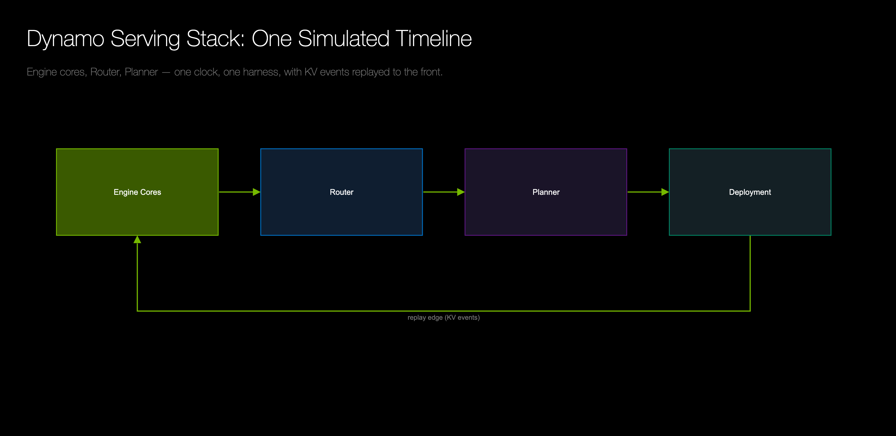
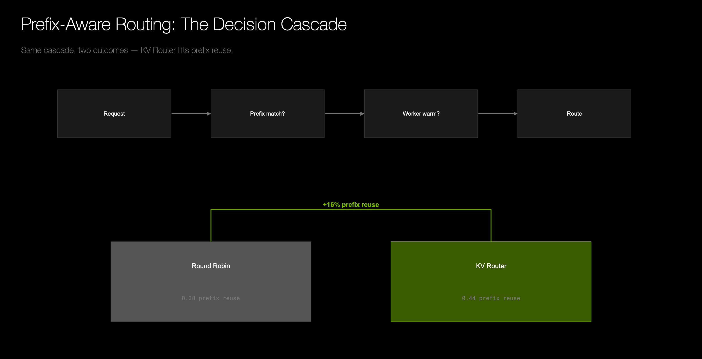
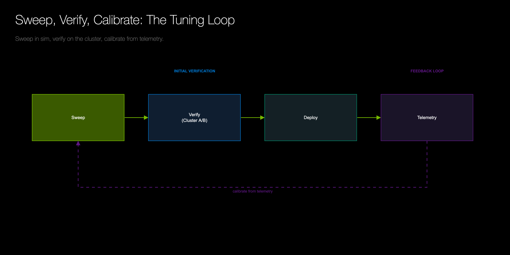
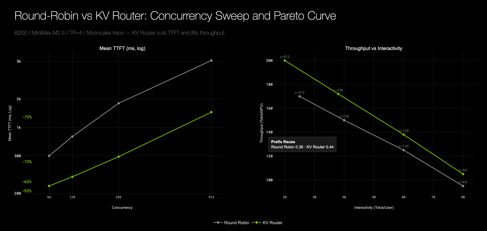
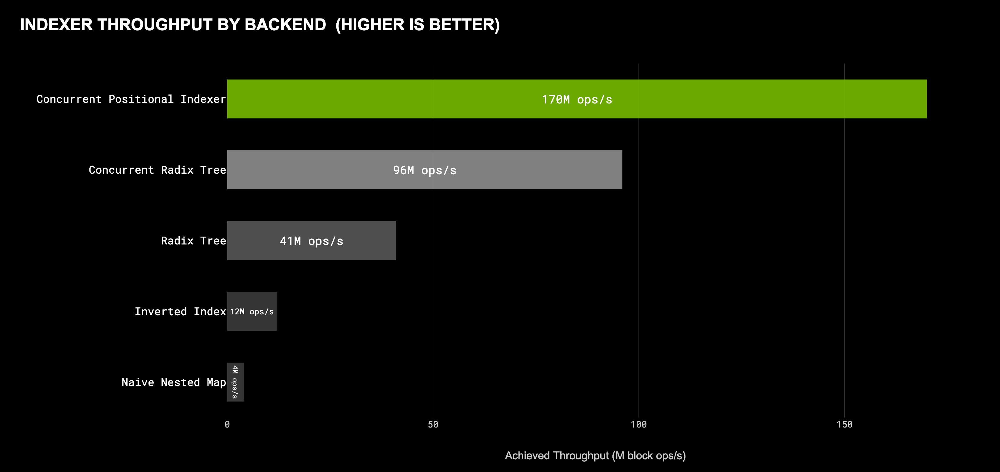
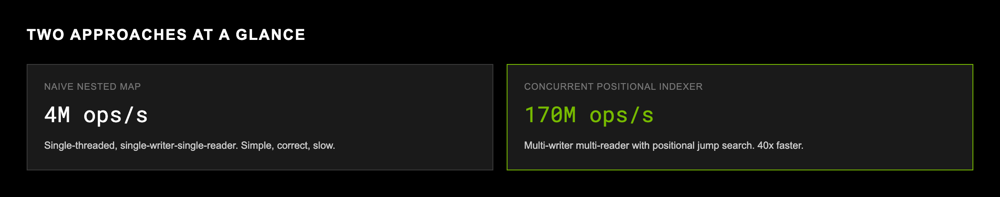

# Blog-Figures Example Scripts

Runnable, self-contained example generators for the `blog-figures` skill.
Each produces one figure in the Dynamo Dark aesthetic and demonstrates a
pattern the skill teaches. Run one, read its source, and adapt it.

These ship with the skill (they are internal tooling, not published docs).

## Figure Inventory

| Script | Output (`images/`) | Figure type | Title treatment |
|---|---|---|---|
| `gen_fig_2_architecture.py` | `fig-2-architecture.png` | Architecture / data-flow diagram with a squared green replay edge | Display (Helvetica Neue Light) |
| `gen_fig_5_decision_cascade.py` | `fig-5-decision-cascade.png` | Decision cascade with a green horizontal delta bracket | Display (Helvetica Neue Light) |
| `gen_fig_6_tuning_loop.py` | `fig-6-tuning-loop.png` | Tuning loop with phase tags + squared dashed feedback loop | Display (Helvetica Neue Light) |
| `gen_fig_concurrency_sweep.py` | `fig-concurrency-sweep.png` | Dual-panel concurrency sweep + Pareto curve (green vs grey) | Display (Helvetica Neue Light) |
| `gen_fig_throughput_bars.py` | `fig-throughput-bars.png` | Compact horizontal-bar scoreboard, single green accent | Compact (Arial 18 px, 700, uppercase) |
| `gen_fig_cards.py` | `fig-cards.png` | HTML+CSS -> PNG comparison cards (Playwright) | Compact (Arial, uppercase) |

The Pareto/hero title treatment also has a full worked exemplar at
[`docs/digest/dynosim/tools/gen_hero.py`](../../../digest/dynosim/tools/gen_hero.py)
(the DynoSim hero).

## Gallery













## Prerequisites

```bash
pip install plotly kaleido numpy pyyaml     # all Plotly generators
pip install playwright && playwright install chromium   # gen_fig_cards.py only
```

## Reproduction

```bash
cd examples
./build.sh                    # renders every figure into images/
# or run one:
python3 gen_fig_6_tuning_loop.py
```

## Design System

Every generator reads the canonical [`design_tokens.yaml`](design_tokens.yaml)
through [`plotly_dynamo.py`](plotly_dynamo.py) (both copied from the
flash-indexer reference; do not fork). Colors, surfaces, borders, and the
mono font come from the tokens. The two title treatments follow the skill:
**display / hero** titles use Helvetica Neue Light in title case; **compact /
chart** titles use Arial 18 px, weight 700, ALL-CAPS. See
[`../DESIGN.md`](../DESIGN.md) for the full spec.

## Note on the Data

These are teaching examples: the series values, component names, and point
clouds are **representative and hard-coded** (deterministic — no RNG, or a
fixed seed), not measured benchmark data. They exist to demonstrate the
*treatment and layout patterns*, not to report results. When building a real
blog figure, replace the sample data with values from a source of truth
(benchmark log, data file, or numbers the user has stated).
