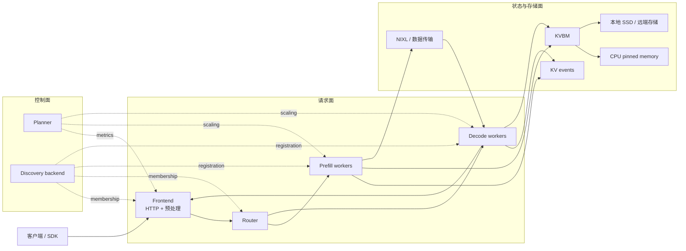

# Dynamo 学习教程

很多文档会告诉你 Dynamo 能做什么，但不一定告诉你 **为什么它必须这样设计**、**这些设计在源码里到底落在哪**。

这套教程的目标，就是把 Dynamo 从“听起来很厉害的分布式推理框架”，拆成一套你能真正抓住的系统直觉：

- 用户请求是怎么进来的
- 为什么 prefill 和 decode 应该分家
- 为什么 KV cache 不是“有没有缓存”这么简单
- 为什么 autoscaling 不是简单地“看 QPS 加机器”
- 这些逻辑分别由哪些 Python 入口和 Rust 核心库实现

> [!TIP]
> 如果你第一次接触 Dynamo，建议按顺序阅读本教程；如果你已经知道产品能力，建议直接跳到 [架构原理](architecture.md) 或 [源码导览](source-tour.md)。

## 你将学到什么

- 为什么 prefill 与 decode 对硬件资源的偏好天然不同
- 为什么 KV-aware routing 往往比朴素负载均衡更快
- 为什么 KVBM 要把显存、内存、磁盘、远端存储看成一个分层系统
- Planner 怎样把延迟目标翻译成副本数
- Dynamo 的关键子系统在源码中的真实入口文件

## 阅读地图

| 页面 | 主要回答什么问题 | 最适合什么时候读 |
|---|---|---|
| [快速入门](quick-start.md) | 先建立最不容易错的整体心智模型 | 看完仓库 `README.md` 之后 |
| [架构原理](architecture.md) | 请求面、控制面、状态面的配合方式 | 快速入门之后 |
| [数学与系统原理](math-theory.md) | Router 成本函数、队列优先级、Planner 公式、传输策略 | 理解架构之后 |
| [源码导览](source-tour.md) | 应该按什么顺序读 Python / Rust 实现 | 任意阶段都可 |

## 一张图先把 Dynamo 看顺

## 先记住这几个源码地标

| 子系统 | 最值得先打开的文件 | 为什么重要 |
|---|---|---|
| Frontend 入口 | `components/src/dynamo/frontend/main.py` | CLI 解析、运行时构建、router mode 选择都从这里开始 |
| 分布式运行时 | `lib/runtime/src/distributed.rs` | discovery、request plane、health、metrics 都挂在这里 |
| KV 路由 | `lib/llm/src/kv_router.rs` | overlap 计算、worker 选择、状态更新的核心 |
| 队列策略 | `lib/kv-router/src/scheduling/policy.rs` | FCFS / LCFS / WSPT 的数学本体 |
| Autoscaling | `components/src/dynamo/planner/core/disagg.py` | prefill / decode 分离伸缩的主循环 |
| 内存搬运 | `lib/kvbm-physical/src/transfer/strategy.rs` | GPU、Host、Disk、Remote 之间如何选传输路径 |

## 这套教程相比现有设计文档多做了什么

官方文档已经覆盖了组件设计和系统设计：

- [Overall Architecture](../design-docs/architecture.md)
- [Disaggregated Serving](../design-docs/disagg-serving.md)
- [Router Guide](../components/router/router-guide.md)
- [KVBM Guide](../components/kvbm/kvbm-guide.md)
- [Planner Guide](../components/planner/planner-guide.md)

本教程额外补上了三件事：

1. 先用大白话建立直觉，再进入系统术语。
2. 每个关键概念都尽量指向真实源码文件。
3. 所有核心公式都给出极简数字例子，而不是只放符号。

## 推荐阅读方式

| 你的角色 | 最推荐起点 |
|---|---|
| 刚接触 Dynamo 的使用者 | [快速入门](quick-start.md) |
| 想评估系统设计优劣的架构师 | [架构原理](architecture.md) |
| 正在排查 router / planner 行为的工程师 | [数学与系统原理](math-theory.md) |
| 想直接看源码的新贡献者 | [源码导览](source-tour.md) |

## 下一步

建议先读 [快速入门](quick-start.md)，再进入 [架构原理](architecture.md)。
