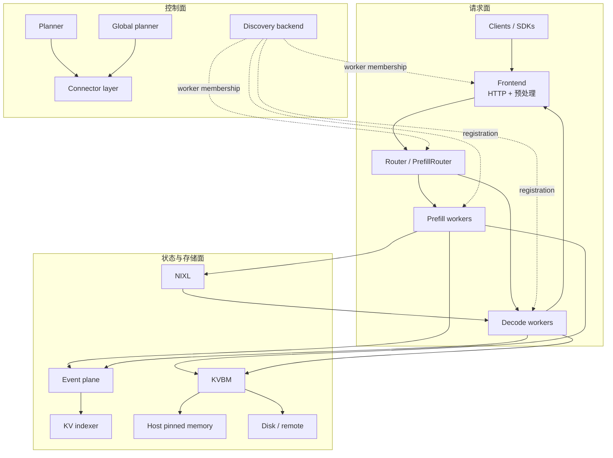
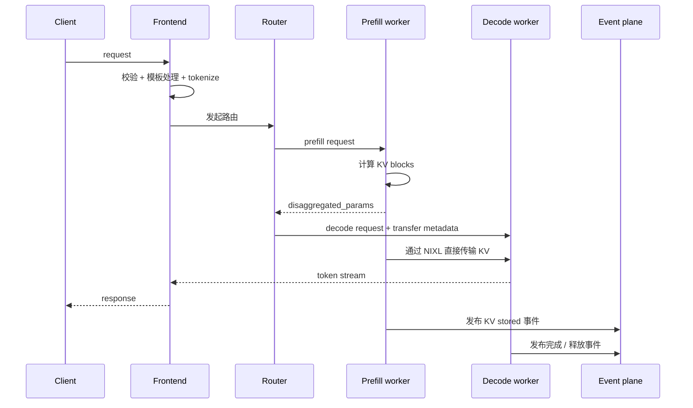

# Dynamo 架构原理

理解 Dynamo 最有效的方法，不是把它当作“一个很强的推理服务”，而是把它拆成三条并行协作的系统平面：

- **请求面**：保证 token 真正流起来
- **控制面**：决定当前到底该有多少算力副本
- **状态面**：决定 KV cache 在哪里、怎么流、谁能看到

这不是抽象概念，而是会直接映射到源码目录与运行时职责。

## 宏观骨架图

## 请求面：真正让 token 流动的热路径

请求面是系统最敏感的快路径，主要包含：

- **Frontend**：接收 OpenAI 兼容请求、做模板处理、tokenize、参数校验
- **Router**：判断请求应该去哪个 worker
- **Prefill workers**：计算 prompt 的 KV 状态
- **Decode workers**：继续生成 token，并流式回传

关键源码：

| 角色 | 文件 |
|---|---|
| Frontend 主入口 | `components/src/dynamo/frontend/main.py` |
| Frontend 参数定义 | `components/src/dynamo/frontend/frontend_args.py` |
| 预处理 / 后处理 | `components/src/dynamo/frontend/prepost.py` |
| KV 路由主体 | `lib/llm/src/kv_router.rs` |
| 队列优先级策略 | `lib/kv-router/src/scheduling/policy.rs` |
| 队列准入与利用率门控 | `lib/kv-router/src/scheduling/queue.rs` |

### 为什么 Router 不只是负载均衡

在 Dynamo 里，router 同时在意两件事：

1. 这个 worker 还需要补多少 **新的 prefill 计算**
2. 这个 worker 当前已经背了多少 **decode 压力**

所以 Dynamo 不会机械地把请求丢给“最空闲”的 worker，而是会倾向于把请求送去 **剩余真实工作量更小** 的地方。

## 控制面：决定系统应该长成什么样

控制面本质上是一个持续运行的调整回路，用来回答：

> 当前这波流量下，prefill 和 decode 分别应该有多少副本？

关键源码：

| 角色 | 文件 |
|---|---|
| Planner 入口 | `components/src/dynamo/planner/__main__.py` |
| 解耦模式主循环 | `components/src/dynamo/planner/core/disagg.py` |
| Prefill planner | `components/src/dynamo/planner/core/prefill.py` |
| Decode planner | `components/src/dynamo/planner/core/decode.py` |
| Load-based regression | `components/src/dynamo/planner/core/load/fpm_regression.py` |
| Global planner | `components/src/dynamo/global_planner/scale_handler.py` |

Planner 主要利用两类信号：

- **throughput-based**：依赖 profiling 数据与未来流量预测
- **load-based**：依赖实时 ForwardPassMetrics

最关键的系统思想在于：  
**Dynamo 并不把 scaling 当成系统外部附属功能，而是把它直接建模进 prefill / decode 的运行时结构。**

## 状态面：让缓存复用、跨节点传输、分层存储真正成立

状态面主要覆盖：

- KV events
- KVIndexer
- KVBM
- NIXL 数据传输

关键源码：

| 角色 | 文件 |
|---|---|
| 运行时根对象 | `lib/runtime/src/distributed.rs` |
| Discovery 抽象 | `lib/runtime/src/discovery/mod.rs` |
| Request-plane manager | `lib/runtime/src/pipeline/network/manager.rs` |
| Event-plane transport | `lib/runtime/src/transports/event_plane/mod.rs` |
| KVBM 传输策略 | `lib/kvbm-physical/src/transfer/strategy.rs` |
| KVBM 物理层管理 | `lib/kvbm-physical/src/manager/mod.rs` |

这也是 Dynamo 最“系统工程化”的部分：它不再把 KV cache 看成单块显存里的临时结构，而是看成一个 **可以跨层迁移、跨组件可见、跨节点协调** 的状态对象。

## 一次解耦请求的完整旅程

这里有两个特别关键的点：

- prefill worker 可以在算完 prompt 后，把状态交给 decode worker，而不是自己继续做 decode
- 这个交接要想高效，系统必须知道 worker 拓扑、缓存位置、传输能力，以及如何选最合适的路径

## Dynamo 的三条通信平面

### Discovery plane

它负责回答“当前有哪些组件存在、哪些是活的”。

- 在 Kubernetes 模式下，依赖 K8s 原生资源与元数据
- 在非 K8s 环境下，可以走 etcd、file、memory 等后端

最值得先看的文件是 `lib/runtime/src/discovery/mod.rs`。

### Request plane

它负责回答“组件之间的请求字节流到底怎么走”。

无论底层走 TCP、HTTP 还是 NATS，统一控制点都在运行时 network manager 里。

最值得先看的文件是 `lib/runtime/src/pipeline/network/manager.rs`。

### Event plane

它负责回答“系统怎样知道缓存状态已经变化了”。

包括但不限于：

- KV 事件
- forward pass metrics
- 其他异步控制信号

最值得先看的文件是 `lib/runtime/src/transports/event_plane/mod.rs`。

## 为什么仓库同时大量使用 Python 与 Rust

这个分工不是历史包袱，而是刻意为之：

- **Python**：CLI 入口、后端集成、外部生态对接、快速迭代
- **Rust**：热路径路由、分布式运行时、传输基础设施、内存敏感逻辑

所以你通常会从 Python 入口如 `components/src/dynamo/frontend/main.py` 进入系统，但真正承载长期核心能力的，是 `lib/` 下的 Rust crate。

## 在 Dynamo 里，容错与弹性不是“附属功能”

Dynamo 默认假设集群在请求流动期间会发生变化：

- worker 会加入或退出
- 副本会扩缩容
- KV state 会在不同层级间迁移
- router 必须在信息不完美的情况下继续做出可接受的决策

所以 discovery、eventing、autoscaling 在架构图里和 serving path 是并列的，而不是后排背景板。

## 建议继续阅读

- [数学与系统原理](math-theory.md)
- [源码导览](source-tour.md)
- [Overall Architecture](../design-docs/architecture.md)
- [Request Plane](../design-docs/request-plane.md)
- [Discovery Plane](../design-docs/discovery-plane.md)
- [Event Plane](../design-docs/event-plane.md)
