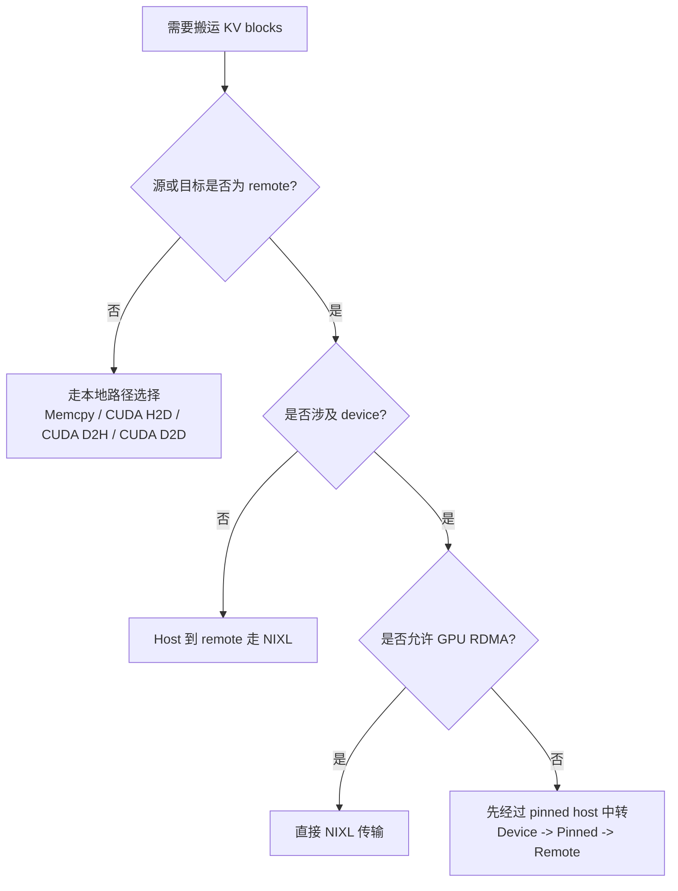

# Dynamo 数学与系统原理

这一页的目标非常明确：

把 Dynamo 里最关键的几个公式，翻译成 **“变量到底在描述什么现实量”**，再用小到不能再小的数字例子，把它们讲到几乎不用背。

## 1. Router 成本函数：缓存复用与繁忙程度的平衡

Router 设计文档里有一个非常核心的想法：

$$
\text{new\_prefill\_tokens} = \text{isl\_tokens} - \text{overlap\_blocks} \times \text{block\_size}
$$

$$
\text{cost} = \text{overlap\_score\_weight} \times \text{prefill\_blocks} + \text{decode\_blocks}
$$

这些符号翻译成人话就是：

- `isl_tokens`：这次输入一共有多少 token
- `overlap_blocks`：这个 worker 已经缓存了多少可复用的块
- `block_size`：一个 KV block 里有多少 token
- `prefill_blocks`：还需要重新算多少块
- `decode_blocks`：这个 worker 当前 decode 压力有多大

相关源码与文档：

- `lib/llm/src/kv_router.rs`
- [Router Design](../design-docs/router-design.md)

### 一个极简数字例子

假设这次请求有：

- `isl_tokens = 1024`
- `block_size = 16`

现在有三个 worker：

| Worker | 已缓存 overlap | 还需新算的 token | 当前 decode blocks | 当 `overlap_score_weight = 1` 时的直觉成本 |
|---|---:|---:|---:|---|
| A | 10 blocks | `1024 - 10*16 = 864` | 4 | 很高 |
| B | 40 blocks | `1024 - 40*16 = 384` | 6 | 中等 |
| C | 55 blocks | `1024 - 55*16 = 144` | 9 | 往往最低 |

为什么 C 可能反而最好？  
因为虽然它 decode 更忙，但它几乎不用重新做 prefill 了。

### 买菜阿姨也能懂的版本

想象你去三个摊位买菜：

- 第一个摊位排队人少，但所有菜都得现称
- 第二个摊位稍微挤一点，但一半菜已经打包好了
- 第三个摊位再挤一些，但你想买的菜几乎全都已经打包好了

真正决定你多久拿到菜的，不是“队伍长度”本身，而是 **队伍长度 + 剩余未完成工作量**。

Dynamo Router 做的就是这个判断。

## 2. 队列优先级：为什么 WSPT 会偏爱“短且缓存命中高”的请求

在 `lib/kv-router/src/scheduling/policy.rs` 里，Dynamo 支持 FCFS、LCFS、WSPT。

其中 WSPT 的关键形式是：

$$
\text{priority} = \frac{1 + \text{priority\_jump}}{\text{new\_tokens}}
$$

其中：

$$
\text{new\_tokens} = \max(1, \text{isl\_tokens} - \text{cached\_tokens})
$$

而：

$$
\text{cached\_tokens} = \text{max\_overlap\_blocks} \times \text{block\_size}
$$

### 每个量真正代表什么

- `priority_jump`：人为附加的优先级加成
- `new_tokens`：这次请求真正还要新算多少 token
- 优先级值越大，越应该先被调度

### 一个非常小的数字例子

假设：

- `block_size = 16`
- 两个请求的 `priority_jump = 0`

请求 1：

- `isl_tokens = 1024`
- overlap = 60 blocks
- 已缓存 token = `60 * 16 = 960`
- `new_tokens = 1024 - 960 = 64`
- `priority = 1 / 64 = 0.015625`

请求 2：

- `isl_tokens = 1024`
- overlap = 0
- `new_tokens = 1024`
- `priority = 1 / 1024 = 0.0009765625`

所以请求 1 明显应该更早执行，因为它几乎没剩多少新工作。

### 这里的本质美感是什么

WSPT 在 Dynamo 里真正优化的，不是“短请求优先”，而是：

> **未被缓存覆盖的剩余工作量更小的请求优先。**

这和真实 GPU 计算成本是高度贴合的。

## 3. Planner 公式：延迟目标如何变成副本数

Planner 设计文档里，吞吐驱动的思路可以抽象成：

$$
\text{predicted\_prefill\_load}
= \frac{\text{next\_requests} \times \text{next\_isl}}{\text{interval}}
$$

$$
\text{prefill\_replicas}
=
\left\lceil
\frac{\text{predicted\_prefill\_load}}
{\text{throughput\_per\_gpu} \times \text{gpus\_per\_engine}}
\right\rceil
$$

以及：

$$
\text{decode\_replicas}
=
\left\lceil
\frac{\text{next\_requests} \times \text{next\_osl}}
{\text{interval} \times \text{throughput\_per\_gpu} \times \text{gpus\_per\_engine}}
\right\rceil
$$

相关文档与实现：

- [Planner Design](../design-docs/planner-design.md)
- `components/src/dynamo/planner/core/disagg.py`

### 一个最小 prefill 例子

假设下一时间窗预测到：

- `next_requests = 120`
- `next_isl = 4000`
- `interval = 60 秒`
- `throughput_per_gpu = 4000 tokens/s`
- `gpus_per_engine = 2`

那么：

$$
\text{predicted\_prefill\_load}
= \frac{120 \times 4000}{60}
= 8000 \text{ tokens/s}
$$

而每个 engine 的能力是：

$$
4000 \times 2 = 8000 \text{ tokens/s}
$$

所以：

$$
\text{prefill\_replicas} = \lceil 8000 / 8000 \rceil = 1
$$

如果流量翻倍，结果自然变成 2。

### 一个最小 decode 例子

假设：

- `next_requests = 120`
- `next_osl = 300`
- `interval = 60`
- `throughput_per_gpu = 300 tokens/s`
- `gpus_per_engine = 2`

则：

$$
\frac{120 \times 300}{60} = 600 \text{ output tokens/s}
$$

每个 engine 能提供：

$$
300 \times 2 = 600 \text{ output tokens/s}
$$

所以：

$$
\lceil 600 / 600 \rceil = 1
$$

这里最重要的不是算术本身，而是 Dynamo 的设计思想：

> **prefill 和 decode 的副本数不必相同，它们可以根据各自瓶颈独立伸缩。**

## 4. 传输策略：为什么有时不能直接搬

在 `lib/kvbm-physical/src/transfer/strategy.rs` 里，KVBM 会根据源位置和目标位置来选择传输路径。

大致规律是：

- host 到 host：走 memcpy
- pinned host 到 device：走 CUDA H2D
- device 到 pinned host：走 CUDA D2H
- device 到 device：走 CUDA D2D
- device 到 remote：要么直接 GPU RDMA，要么先借 host 做中转

### 一个特别生活化的理解

搬沙发时，如果门足够大，就直接进屋。  
如果门太窄，就得先放到中转区，再换角度搬进去。

KVBM 也是一样：

- **直达路径**：硬件和能力允许时，直接搬
- **两跳路径**：不允许直达时，借助 host 内存做缓冲

这不是“性能不够好时的妥协”，而是 **工程上保证正确性与可移植性的必要策略**。

## 5. 为什么这些公式在系统里不是装饰品

你会发现，上面四类公式虽然长得不同，但它们都在做同一件事：

- 估算真实剩余工作量，而不是只看请求数量
- 估算系统真实容量，而不是拍脑袋扩容
- 选择最低成本、仍然安全的内存迁移路径，而不是假设世界只有显存

这也是为什么 Dynamo 本质上更像一个 **分布式系统工程项目**，而不只是一个“套在 LLM 外面的调度壳”。

## 建议配套阅读

- [架构原理](architecture.md)
- [源码导览](source-tour.md)
- [Router Design](../design-docs/router-design.md)
- [Planner Design](../design-docs/planner-design.md)
- [KVBM Design](../design-docs/kvbm-design.md)
