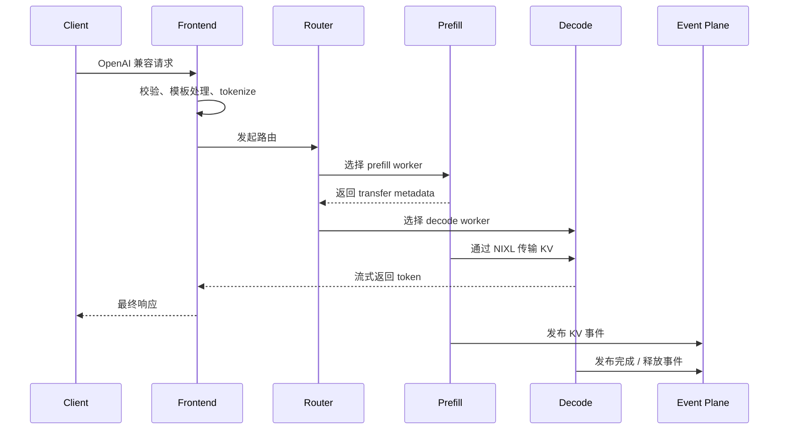
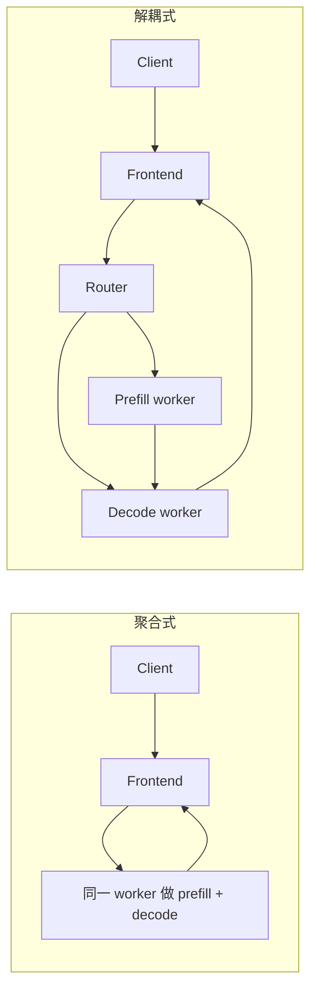

# Dynamo 快速入门

把 LLM 推理想成一个大型机场，会更容易理解 Dynamo。

机场里通常有两类完全不同的瓶颈：

- 值机：前面很重，一次性工作量大
- 登机：单次动作轻，但会持续很久

LLM 推理也是这样：

- **prefill**：把整段 prompt“读懂、编码、写进 KV cache”，一次性开销大
- **decode**：每次只生成少量 token，但要持续进行很多轮

如果所有请求都强行塞进同一类 worker，系统会出现很典型的问题：长 prompt 把短请求拖住，缓存复用率不稳定，GPU 压力结构失衡，扩缩容也变得粗糙。

这就是 Dynamo 出现的原因。

## 一句话理解 Dynamo

Dynamo 是一个位于推理引擎之上的 **分布式推理编排层**，负责把多个 worker、多个节点、多个缓存层，组织成一个协调工作的整体系统。

## 它主要解决哪些痛点

| 痛点 | 没有编排层时会怎样 | Dynamo 怎么解决 |
|---|---|---|
| 长短 prompt 混跑 | 长 prefill 会把 decode 拖慢 | 把 prefill / decode 解耦，并做更聪明的路由 |
| 重复前缀很多 | 同样的 prompt 前缀被重复计算 | 依靠 KV-aware routing 优先命中已有缓存 |
| 显存不够 | 长上下文很快把 HBM 挤爆 | KVBM 让缓存可下沉到 host / disk / remote |
| 流量突发 | 静态副本数总是慢半拍 | Planner 根据延迟目标做自动扩缩容 |
| 多节点复杂 | 服务发现和组件协作容易失控 | 用 discovery / request / event 三条平面拆开管理 |

## 一次请求到底怎么走



这里最关键的一点是：

**Router 在 Dynamo 里不是一个“普通负载均衡器”，而是一个“剩余工作量评估器”。**

它不仅看哪个 worker 忙不忙，还看哪个 worker 已经拥有你需要的 KV 前缀。

## 本地最小可运行示例

如果你只是想先建立对请求链路的感知，甚至不需要 Kubernetes。

```bash
# 终端 1：启动 frontend
python3 -m dynamo.frontend \
  --http-port 8000 \
  --discovery-backend file

# 终端 2：启动 worker
python3 -m dynamo.sglang \
  --model-path Qwen/Qwen3-0.6B \
  --discovery-backend file

# 终端 3：发送请求
curl -s localhost:8000/v1/chat/completions \
  -H "Content-Type: application/json" \
  -d '{
    "model": "Qwen/Qwen3-0.6B",
    "messages": [{"role": "user", "content": "用一句话解释 Dynamo。"}],
    "max_tokens": 64
  }'
```

> [!NOTE]
> 上面的最小例子主要是为了看懂 request path。若要真正体验 KV-aware routing、durable KV events、生产级 cache visibility，还需要把 event plane 等组件配完整。

## 把这次运行映射回源码

| 你启动的东西 | 关键文件 | 它们负责什么 |
|---|---|---|
| `python -m dynamo.frontend` | `components/src/dynamo/frontend/__main__.py`、`components/src/dynamo/frontend/main.py` | 解析参数、构建运行时、决定 router mode、起 HTTP 服务 |
| `DistributedRuntime(...)` | `lib/runtime/src/distributed.rs` | 管 discovery、request transport、health、metrics |
| 路由选择 | `dynamo.llm.RouterMode`、`lib/llm/src/kv_router.rs` | 决定是 round-robin、random、direct 还是 KV-aware |
| 后端 worker | `components/src/dynamo/sglang/main.py`、`components/src/dynamo/vllm/main.py`、`components/src/dynamo/trtllm/main.py` | 启动具体推理引擎并接入 Dynamo 运行时 |

## 聚合式与解耦式服务



聚合式更简单，很多时候也是起步的最佳方式。

解耦式更适合这些场景：

- prompt 很长，而且长度波动大
- decode 必须平稳，不能被大 prefill 拖住
- prefill 和 decode 适合不同的硬件形态
- 跨 worker 传 KV 的代价，已经小于重新算一次 prompt 的代价

## 第一次排障时最值得看什么

1. **Frontend 日志**：看当前启用了哪种 router mode。
2. **Worker 注册情况**：如果 frontend 看不到 worker，先查 discovery backend。
3. **Request plane 是否一致**：TCP / HTTP / NATS 模式要对齐。
4. **KV 事件有没有真正流动**：否则 KV-aware routing 只会停留在配置层。
5. **Metrics 与 health 信号是否正常**：Planner 与 runtime 都依赖它们。

## 一定要记住的直觉

- Dynamo **不是** 替代推理引擎。
- Dynamo **不是** 所有部署都强制解耦。
- Dynamo 的价值核心是 **协调**：更好的算力复用、更好的放置、更好的控制环。

下一页建议读 [架构原理](architecture.md)，看完整体结构；再读 [数学与系统原理](math-theory.md)，把成本函数和伸缩公式真正看透。
