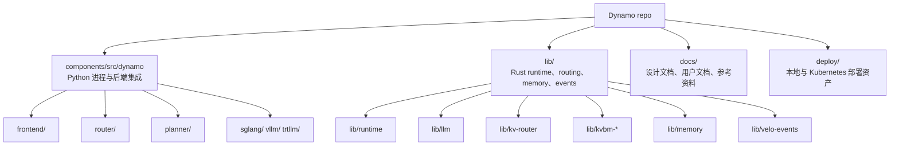
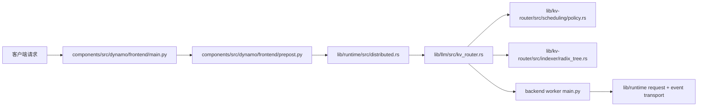

# Dynamo 源码导览

Dynamo 的 monorepo 很大，如果你随机乱翻，极容易在还没建立系统边界前就被细节淹没。

最推荐的读法是：

1. 先看 Python 入口进程
2. 看清它们把职责交给了哪些运行时对象
3. 再顺着热路径进入 Rust 核心实现

## 仓库的俯视图

## 如果你只有 30 分钟，先读这些

| 目标 | 最值得打开的文件 |
|---|---|
| 看懂进程怎么启动 | `components/src/dynamo/frontend/main.py` |
| 看懂运行时怎么被构建 | `lib/runtime/src/distributed.rs` |
| 看懂路由为什么这么选 worker | `lib/llm/src/kv_router.rs` |
| 看懂队列策略数学 | `lib/kv-router/src/scheduling/policy.rs` |
| 看懂解耦式 autoscaling | `components/src/dynamo/planner/core/disagg.py` |
| 看懂内存搬运逻辑 | `lib/kvbm-physical/src/transfer/strategy.rs` |

## 从 Python 入口开始最稳

这些文件最适合作为“系统入口门”：

| 进程 | 入口 | 你会看懂什么 |
|---|---|---|
| Frontend | `components/src/dynamo/frontend/__main__.py` 与 `main.py` | CLI 参数、router mode、runtime bootstrap、HTTP 服务 |
| Standalone router | `components/src/dynamo/router/__main__.py` | router 进程如何配置与起跑 |
| Planner | `components/src/dynamo/planner/__main__.py` | autoscaling 初始化、配置装配、与 runtime 的关系 |
| Global planner | `components/src/dynamo/global_planner/__main__.py` | 更高层次的 pool / 规模控制 |
| SGLang backend | `components/src/dynamo/sglang/main.py` | worker 注册、SGLang 后端接入方式 |
| vLLM backend | `components/src/dynamo/vllm/main.py` | worker 生命周期、handler、监控注入 |
| TRT-LLM backend | `components/src/dynamo/trtllm/main.py` | TensorRT-LLM 的集成路径 |

## 然后沿着一条真实请求链往前走

这条路线非常有用，因为它能帮你迅速分清：

- 请求预处理是谁负责
- 分布式运行时是谁负责
- worker 选择是谁负责
- 真正推理执行是谁负责

## 按子系统拆开的推荐阅读顺序

### Frontend 与预处理

当你想知道 OpenAI 兼容请求是怎么变成内部引擎请求时，看这里：

- `components/src/dynamo/frontend/main.py`
- `components/src/dynamo/frontend/prepost.py`
- `components/src/dynamo/frontend/vllm_processor.py`
- `components/src/dynamo/frontend/sglang_processor.py`

### Routing 与 KV overlap

当你想知道为什么请求被送到某个特定 worker 时，看这里：

- `lib/llm/src/kv_router.rs`
- `lib/kv-router/src/scheduling/queue.rs`
- `lib/kv-router/src/scheduling/policy.rs`
- `lib/kv-router/src/indexer/kv_indexer.rs`
- `lib/kv-router/src/indexer/radix_tree.rs`

### Discovery / Request plane / Event plane

当你想知道集群协调是怎么成立的时，看这里：

- `lib/runtime/src/distributed.rs`
- `lib/runtime/src/discovery/mod.rs`
- `lib/runtime/src/pipeline/network/manager.rs`
- `lib/runtime/src/transports/event_plane/mod.rs`

### Planner 与 autoscaling

当你想解释副本数为什么变化时，看这里：

- `components/src/dynamo/planner/__main__.py`
- `components/src/dynamo/planner/core/disagg.py`
- `components/src/dynamo/planner/core/prefill.py`
- `components/src/dynamo/planner/core/decode.py`
- `components/src/dynamo/planner/core/load/fpm_regression.py`

### KVBM 与分层存储

当你想弄懂 KV cache 的多层迁移与传输路径时，看这里：

- `lib/kvbm-physical/src/manager/mod.rs`
- `lib/kvbm-physical/src/layout/mod.rs`
- `lib/kvbm-physical/src/transfer/mod.rs`
- `lib/kvbm-physical/src/transfer/strategy.rs`
- `lib/memory/src/nixl/agent.rs`

## 按角色选择阅读顺序

| 你的角色 | 推荐阅读顺序 |
|---|---|
| 新贡献者 | Frontend -> Distributed runtime -> KV router -> 任一 backend |
| 路由工程师 | KV router -> queue policy -> radix tree -> KV 事件文档 |
| 平台工程师 | Distributed runtime -> discovery -> planner -> connectors |
| 内存 / 系统工程师 | KVBM design -> transfer strategy -> NIXL agent -> storage backends |

## 快速排障对照表

| 现象 | 最应该先看哪里 |
|---|---|
| Frontend 起了但看不到 worker | `lib/runtime/src/discovery/mod.rs` |
| Router 选 worker 很反直觉 | `lib/llm/src/kv_router.rs` 与 `lib/kv-router/src/scheduling/policy.rs` |
| Scaling 决策不符合预期 | `components/src/dynamo/planner/core/disagg.py` 与 `../design-docs/planner-design.md` |
| KV 传输比想象中慢 | `lib/kvbm-physical/src/transfer/strategy.rs` 与 `../design-docs/kvbm-design.md` |
| Cache 可见性似乎不同步 | `lib/runtime/src/transports/event_plane/mod.rs` 与 `../design-docs/router-design.md` |

## 最后一个读源码建议

不要拿手电筒式地乱扫源码，而要带着问题读。

最好的问题通常是：

- 这个进程是从哪里被构建出来的？
- 这个决策到底归哪个层负责？
- 这个数字在试图估计什么真实量？
- 这是热路径，还是控制路径？

只要你一直带着这些问题，Dynamo 的源码结构会清晰很多。
