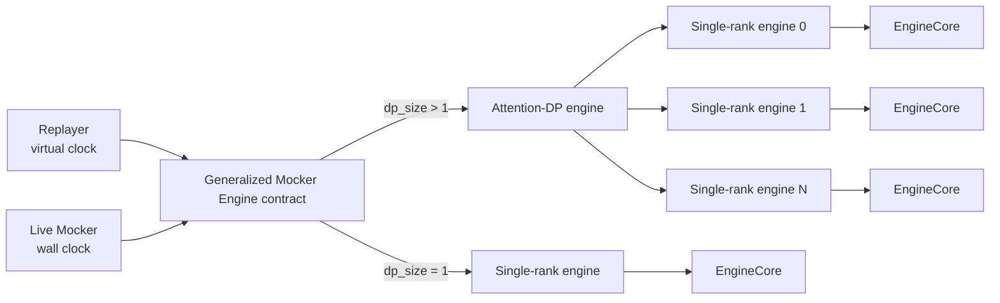

<!--
SPDX-FileCopyrightText: Copyright (c) 2026 NVIDIA CORPORATION & AFFILIATES. All rights reserved.
SPDX-License-Identifier: Apache-2.0
-->

# AISim/Dynamo API Boundaries

Status: Draft for review

## Boundary map

Only the following contracts cross component boundaries:

| Components | Contract |
| --- | --- |
| `Replayer` ↔ `Generalized Mocker Engine` | `GeneralizedMockerEngine`, `EnginePassResult`, and `EngineEffects` |
| `Live Mocker` ↔ `Generalized Mocker Engine` | `GeneralizedMockerEngine`, `EnginePassResult`, and `EngineEffects` |
| `Replayer` ↔ `Router Adapter` | `PlacementPolicy<Request>` |
| `Replayer` ↔ `Planner Adapter` | TODO |

The contracts are owned by AISim. Dynamo implements the adapters and converts
between Dynamo-specific and AISim-neutral types.

## Generalized Mocker Engine API

### Summary

A `Generalized Mocker Engine` models one logical inference worker. It has two
layers:

1. A **single-rank engine** models one rank.
2. An **attention-DP engine** composes multiple single-rank engines into one
   logical worker.

Both layers expose the same request, control, execution, and effect contract.
`Replayer` drives that contract with a virtual clock. `Live Mocker` drives the
same contract with Tokio and a wall clock.



### Engine composition

#### Single-rank engine

The single-rank engine owns exactly one `EngineCore`, backed by `VllmCore` or
`SglangCore`. It owns all state whose behavior belongs to that rank:

- local request queues and scheduling policy;
- native G1 KV allocation and eviction;
- framework-native G2 offload;
- preemption and request lifecycle state;
- local forward-pass timing and metrics;
- pending destination and scheduler-command state.

It does not own worker startup, draining, removal, Planner scaling, a global
clock, or a replay report.

#### Attention-DP engine

The attention-DP engine owns a fixed group of single-rank engines. It is the
logical worker visible to `Replayer` and `Live Mocker`, and owns:

- DP-rank membership and rank-core construction;
- request and control dispatch to the correct rank;
- sibling-rank readiness;
- barrier and lockstep pass execution;
- aggregation of rank-local effects into one logical-engine result;
- group completion time, defined as `max(rank end_ms)`;
- group-level empty, drained, and next-deadline state.

An empty rank still participates in the barrier when a sibling executes a pass.
The attention-DP engine aligns all participating ranks to the group completion
time before it exposes pass-completion effects.

For `dp_size == 1`, the same contract is implemented by the single-rank engine
without an additional behavioral distinction for callers.

#### Ownership split

| Component | Owns |
| --- | --- |
| Single-rank engine | One `EngineCore`; rank-local scheduler, KV, preemption, timing, and metrics |
| Attention-DP engine | Rank group, rank construction, readiness, barriers, lockstep execution, and group result aggregation |
| `Replayer` | Fleet of logical workers, startup/draining/removal, Planner scaling, virtual clock, global event queue, completion visibility, `TraceCollector`, and adapter observations |
| `Live Mocker` | Dynamo runtime integration, Tokio tasks, wall-clock waiting, channels, responses, handoff transport, event publication, and production metrics |

`Replayer` scales logical workers, not individual DP ranks. Creating or removing
an attention-DP worker creates or removes its full rank group.

### Generalized Mocker Engine contract

Both engine implementations satisfy the same source-level Rust contract.
`Replayer` and `Live Mocker` call it directly; it does not require a plugin,
dynamic dispatch, or an ABI.

```rust
trait GeneralizedMockerEngine {
    type ObservationBatch: EngineEventBatch;

    fn new(config: GeneralizedEngineConfig) -> Result<Self>
    where
        Self: Sized;

    fn receive(&mut self, request: DirectRequest) -> Uuid;

    fn apply_command_effects(
        &mut self,
        command: SchedulerCommand,
        allow_destination_admission: bool,
        now_ms: f64,
    ) -> Result<SchedulerCommandEffects<Self::ObservationBatch>>;

    fn retry_pending_destinations(
        &mut self,
        now_ms: f64,
    ) -> Vec<SchedulerLifecycleEvent>;

    fn is_ready(&self) -> bool;
    fn execute_pass(
        &mut self,
        now_ms: f64,
    ) -> Result<Option<EnginePassResult<Self::ObservationBatch>>>;
    fn complete_pass(
        &mut self,
        pass_id: EnginePassId,
        now_ms: f64,
    ) -> Result<EngineEffects<Self::ObservationBatch>>;

    fn next_internal_deadline_ms(&self) -> Option<f64>;
    fn process_internal_work(
        &mut self,
        now_ms: f64,
    ) -> Result<EngineEffects<Self::ObservationBatch>>;

    fn is_empty(&self) -> bool;
    fn is_drained(&self) -> bool;
    fn num_requests(&self) -> usize;
}
```

`GeneralizedEngineConfig` contains only engine behavior: backend engine type,
DP size, scheduler configuration, native G1 configuration, framework-native G2
configuration, and timing data. Worker startup delay, Planner policy, Dynamo
transport, and output configuration stay with the caller.

`DirectRequest.dp_rank` selects the target rank. Commands containing only a
request or handoff ID use rank ownership already recorded by the engine. A
single-rank implementation accepts only its own rank identity.

#### Pass lifecycle

`execute_pass(now_ms)` starts at most one logical-worker pass. It marks the
engine busy and returns:

```rust
struct EnginePassResult<E: EngineEventBatch> {
    pass_id: EnginePassId,
    end_ms: f64,
    start_effects: EngineEffects<E>,
}
```

For an attention-DP engine, `end_ms` is `max(rank end_ms)`. The engine retains
all pass-completion state behind `pass_id`, including pending outputs and
rank-local completion effects. This lets commands received during a pass update
the pending result without exposing it to the caller.

`EnginePassId` is opaque and unique within one engine. `is_ready()` remains
false until the active pass is completed.

At `end_ms`, the caller passes `pass_id` back to
`complete_pass(pass_id, now_ms)`. The engine then:

- releases all ranks from the barrier;
- commits request-completion and rank-local accounting;
- retries destinations made eligible by the completion;
- returns the effects that become visible at pass completion.

A zero-duration pass is completed immediately at the same `now_ms`. The caller
does not call `execute_pass` again while a pass is in flight, and
`complete_pass` rejects a stale ID or a timestamp earlier than `end_ms`.

#### Effects

The same neutral effect envelope is used for pass start, pass completion,
commands, and framework-native G2 work:

```rust
struct EngineEffects<E: EngineEventBatch> {
    ranks: Vec<RankEngineEffects<E>>,
}

struct RankEngineEffects<E: EngineEventBatch> {
    dp_rank: u32,
    admissions: Vec<AdmissionEvent>,
    completed_requests: usize,
    output_signals: Vec<OutputSignal>,
    lifecycle_events: Vec<SchedulerLifecycleEvent>,
    observations: E,
    fpm: Option<ForwardPassSnapshot>,
    metrics: MockerMetrics,
}
```

For a single-rank engine, `ranks` contains one entry. For an attention-DP
engine, it preserves the rank identity of every effect while returning one
group result.

`SchedulerCommandEffects` contains its current `SchedulerCommandResult` plus
the same neutral `EngineEffects`. `EngineEventBatch` carries engine
observations such as native KV allocation, eviction, and G2 residency changes
without exposing Dynamo `RouterEvent`; the `Router Adapter` performs that
conversion when needed.

#### Internal timed work

`next_internal_deadline_ms()` reports the next time at which engine-owned work
can make progress. For an attention-DP engine, it is the minimum deadline
across all ranks.

At that time, the caller invokes `process_internal_work(now_ms)`. Native G1 and
framework-native G2 update their internal state and return effects through the
same `EngineEffects` envelope. The engine never sleeps or advances a clock.

#### Replayer and Live Mocker use

| Contract step | `Replayer` | `Live Mocker` |
| --- | --- | --- |
| Supply time | Passes virtual `now_ms` | Passes wall-clock elapsed milliseconds |
| Start pass | Applies `start_effects` and enqueues `(end_ms, pass_id)` | Applies `start_effects` and waits until `end_ms` with Tokio |
| Complete pass | Calls `complete_pass` from the virtual event queue | Calls `complete_pass` after the wall-clock wait |
| Internal deadline | Adds it to the virtual event queue | Arms or updates a Tokio timer |
| Consume effects | Updates `TraceCollector` and adapter observations | Produces responses, publishes observations, FPM, and metrics |

Neither caller implements rank grouping or pass barriers. Both construct one
generalized engine per logical worker and use the same methods and effect
types.

#### Boundary constraints

The engine does not depend on `TraceCollector`, replay-report types, Dynamo
runtime, NATS, ZMQ, event publishers, Router, or Planner. Those dependencies
remain in `Replayer`, `Live Mocker`, and their adapters.

Native G1 and framework-native G2 are engine internals. KVBM types and a KVBM
Adapter do not cross this boundary, and the design does not preserve the
KVBM-based G1-G4 paths.

## Replayer API

There are two replay compositions:

| Replay | Composition |
| --- | --- |
| **AISim Replay** | The standalone replay implementation in the AISim repo. It owns `Replayer`, uses the `Generalized Mocker Engine`, and includes built-in round-robin placement. It has no Dynamo dependency. |
| **Dynamo Replay** | The Dynamo-side composition. It depends on AISim Replay and adds Dynamo adapters such as `KvRouterPlacement` and the Planner adapter. |

Unless explicitly qualified, `Replayer` and `replay` in this document refer to
**AISim Replay**. Dynamo Replay reuses this Replayer rather than implementing a
second replay event loop.

The dependency direction is:

```text
Dynamo Replay -> AISim Replay -> Generalized Mocker Engine
       |
       +------> Dynamo Router and Planner adapters
```

Every replay has a `PlacementPolicy`; AISim Replay uses its built-in
round-robin policy by default. Dynamo Replay may keep that default or select
`KvRouterPlacement`.

One Spica candidate produces one `ReplaySpec`; the selected replay composition
invokes `Replayer` and returns one report:

```rust
pub fn replay(spec: ReplaySpec) -> Result<TraceSimulationReport>;
```

`ReplaySpec` is serializable and contains:

- the resolved workload or synthetic workload specification;
- aggregated or disaggregated worker-pool topology;
- one `GeneralizedEngineConfig` per worker role;
- resolved Router and Planner adapter configuration;
- replay limits, SLA thresholds, and report options.

Trace-file parsing, candidate generation, and adapter search-space generation
happen before this call. Their configuration is materialized through the
corresponding adapter boundaries; Spica does not construct Rust engine or
placement-policy objects.

Router and Planner fields in `ReplaySpec` are serializable policy
configuration, not Rust or Python policy objects. AISim Replay constructs its
built-in policies from this configuration. Dynamo Replay constructs the
selected Dynamo adapters before driving the same Replayer.

This is static source-level composition; it does not require a dynamic plugin,
shared-object ABI, or RPC boundary. After repo extraction, the AISim Replay
manifest has no direct Dynamo workspace dependencies. `dynamo-kv-router` and
other Dynamo integration dependencies remain in Dynamo Replay, while
`kvbm-logical` is removed rather than added back.

Inside the call, `Replayer` owns the virtual clock, event queue, logical-worker
fleet, worker lifecycle, `TraceCollector`, and adapter observations. It creates
one `GeneralizedMockerEngine` per logical worker and scales complete logical
workers rather than individual DP ranks.

The interaction with each generalized engine is:

| Replay action | `GeneralizedMockerEngine` call |
| --- | --- |
| Create or scale up a logical worker | `new` |
| Dispatch a placed request to its worker and DP rank | `receive` |
| Apply cancellation or handoff control | `apply_command_effects` |
| Start ready model work at virtual `now_ms` | `execute_pass` |
| Reach the pass's scheduled `end_ms` | `complete_pass` |
| Arm and process native G1/G2 timed work | `next_internal_deadline_ms` and `process_internal_work` |
| Evaluate scale-down or replay completion | `is_drained` and `num_requests` |

`Replayer` consumes `EngineEffects` at their returned virtual timestamps:
admissions and outputs update `TraceCollector`, observations go to the Router
adapter, and FPM/metrics go to the report and Planner adapter.

Replay ends when the workload and adapter queues are empty, all generalized
engines are drained, and no engine or lifecycle events remain. If the
configured time limit is reached first, remaining requests are reported as
incomplete.

## Live Mocker API

`Live Mocker` is the Dynamo serving wrapper around the same
`GeneralizedMockerEngine` used by `Replayer`. Its external API remains the
existing live component surface:

```rust
pub fn new(args: MockEngineArgs) -> MockEngine
pub async fn start(&self, endpoint: Endpoint) -> Result<()>

async fn generate(
    &self,
    input: SingleIn<PreprocessedRequest>,
) -> Result<ManyOut<LLMEngineOutput>, Error>
```

`start` creates one grouped generalized engine for the live logical worker.
`MockEngineArgs` fields that control scheduler, timing, native G1, and
framework-native G2 behavior are passed into `GeneralizedEngineConfig`.
Dynamo endpoint, startup, transport, handoff, and publication configuration
remain in `Live Mocker`.

For each request, `generate` resolves its DP rank, converts
`PreprocessedRequest` to `DirectRequest`, and calls `receive`. Disaggregated
handoff and cancellation use `apply_command_effects`.

The remaining engine calls differ from `Replayer` only in how time is supplied:

| Live action | `GeneralizedMockerEngine` call |
| --- | --- |
| Start the logical worker | `new` |
| Submit a request or control command | `receive` or `apply_command_effects` |
| Start ready model work using wall-clock elapsed `now_ms` | `execute_pass` |
| Reach the returned `end_ms` after a Tokio wait | `complete_pass` |
| Arm and process native G1/G2 work | `next_internal_deadline_ms` and `process_internal_work` |

`Live Mocker` publishes `EngineEffects` through Dynamo facilities:

- output signals become the request's `LLMEngineOutput` stream;
- lifecycle effects drive handoff sessions and cancellation;
- neutral engine observations are converted and sent to live event publishers;
- FPM and engine metrics are sent to production metrics publishers.

`Live Mocker` owns `DistributedRuntime` and `AsyncEngine` integration, Tokio
tasks and wall-clock waiting, request channels, response streams, bootstrap and
handoff transport, cancellation, event publication, and production metrics.
The generalized engine owns DP-rank grouping, barriers, scheduler/KV state, and
pending pass effects.

The dependency is one-way:

```text
Dynamo Live Mocker -> AISim Generalized Mocker Engine
```

`Live Mocker` does not create unrelated generalized engines for individual DP
ranks. The generalized engine does not depend on Dynamo runtime, NATS, ZMQ,
publishers, or the offline `Replayer`. `ReplaySpec`, the virtual event queue,
and `TraceCollector` do not cross the live boundary.

## Router Adapter API

This is an internal boundary between `Replayer` and a placement policy. Spica
selects and configures the Router adapter through `ReplaySpec`; it does not call
this Rust trait directly.

```rust
trait PlacementPolicy<Request> {
    type Metadata;
    type Observation;

    fn place(
        &mut self,
        request: &Request,
        metadata: Self::Metadata,
        session_id: Option<String>,
        now_ms: f64,
    ) -> Result<PlacementEffects>;
    fn observe(&mut self, observation: Self::Observation, now_ms: f64)
        -> Result<Vec<Placement>>;
    fn cancel_pending(&mut self, request_id: Uuid) -> bool;
    fn request_terminal(&mut self, request_id: Uuid, now_ms: f64)
        -> Result<Vec<Placement>>;
    fn prefill_completed(&mut self, request_id: Uuid, now_ms: f64)
        -> Result<Vec<Placement>>;
    fn pending_count(&self) -> usize;

    fn worker_ready(&mut self, worker: WorkerTopology, now_ms: f64)
        -> Result<Vec<Placement>>;
    fn worker_draining(&mut self, worker: WorkerTopology, now_ms: f64)
        -> Result<Vec<Placement>>;
    fn worker_removed(&mut self, worker: WorkerTopology, now_ms: f64)
        -> Result<Vec<Placement>>;
    fn topology_settled(&mut self, now_ms: f64)
        -> Result<Vec<Placement>>;
}
```

`Metadata` is request-scoped data prepared for the selected policy. Round-robin
uses `()`; the KV Router adapter uses replay hashes and other KV-routing input.

`Observation` is the neutral `EngineEventBatch` taken from
`EngineEffects.observations`. Round-robin ignores it. The KV Router adapter
converts it to the production Router event representation inside the adapter.
Dynamo `RouterEvent` does not cross into `Replayer`.

The contract returns only neutral `Placement`, `PlacementDecision`,
`PlacementEffects`, and `WorkerTopology` values. `PlacementEffects` contains
an immediate-or-queued decision for the current request plus any placements
released from a stateful policy queue. Observation, terminal, and topology
methods may also release queued placements.

`WorkerTopology` identifies one logical worker and the stable scheduler IDs of
its DP ranks. The policy selects a `scheduler_id`; `Replayer` resolves it to the
logical worker and `dp_rank`. The Router adapter does not construct or drive
workers.

`AggregatedRoundRobinPlacement`, `PoolRoundRobinPlacement`, and
`KvRouterPlacement` implement this same contract. The round-robin policies are
AISim-owned. `KvRouterPlacement` is the Dynamo Router adapter: it translates
neutral requests and observations into production Router calls, then converts
Router admissions into neutral `PlacementEffects`.

Before crate extraction, the current `RouterEventBatch` observation must be
neutralized so it no longer wraps Dynamo `RouterEvent`. The
`PlannerCacheSample` field currently carried by `Placement` must also be
renamed or reshaped as neutral cache-admission data rather than a Planner-owned
type.

## Planner Adapter API

TODO: Hongkuan will add this section.
