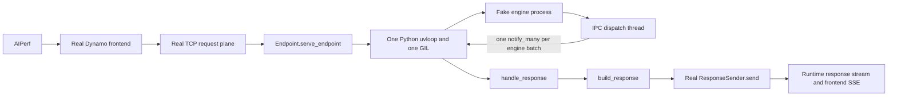

# egress_experiments — an executable model of the dynamo asyncio/GIL path

A runnable simulation of the **dynamo column** of
`~/dynamo/endpoints-launch/NVIDIA/src/configs/GR100-NVL72_GR100-288GB_aarch64x72_TRT/deepseek-r1/ASYNCIO_GIL_PATH.md`
(si=40, job 355778, decode rank 0, `num_postprocess_workers: 0`).

The TRT-LLM engine is stubbed at the **worker/engine boundary**: the worker calls
`llm.generate_async(...)`, a child process eats it, and responses come back over an
IPC lane into `proxy_dispatch_result_thread`, through `handle_response`, onto the
one asyncio loop. Everything *around* the engine is ported from the real sources,
because that is what the loop actually pays for.

The standalone simulation runs on a bare interpreter — stdlib + pytest, no torch, no `tensorrt_llm`, no `dynamo._core`. The real-runtime reproduction below additionally requires the Dynamo Python package and bindings from this branch.

**[`SIMULATED_PATH.md`](SIMULATED_PATH.md)** draws what this builds, in the same
form as the original diagram — pull vs push where that one had serve vs dynamo.

```bash
python3 -m egress_experiments.run_experiment                  # pull vs push
python3 -m egress_experiments.run_experiment --gil-noise 42   # 45-thread regime
python3 -m pytest egress_experiments/tests -m unit
```

## Real Dynamo runtime reproduction

`e2e_worker.py` keeps the synthetic engine in a separate process but serves its responses through a real `DistributedRuntime`, real TCP request plane, real frontend, and the branch's real push-egress `ResponseSender`. The worker intentionally uses one Python event loop and one GIL. Do not launch multiple workers for this reproduction because that would shard the bottleneck across processes.



The push-egress bindings must be built from this checkout. Activate the Dynamo virtual environment, start etcd on `localhost:2379`, then build the bindings once:

```bash
(cd lib/bindings/python && maturin develop --uv --release)
export PYTHONPATH="$PWD/components/src:$PWD/lib/bindings/python/src:$PWD"
```

Start the calibrated worker in terminal 1. Use a new namespace for every arm and trial so an etcd lease from a stopped endpoint cannot contaminate the next run:

```bash
export GIL_E2E_NAMESPACE=gil-e2e-cost1-001
export PYTHONPATH="$PWD/components/src:$PWD/lib/bindings/python/src:$PWD"
DYN_SYSTEM_PORT=18081 \
python -m egress_experiments.e2e_worker \
  --endpoint "${GIL_E2E_NAMESPACE}.backend.generate" \
  --batch-total 200 --iteration-ms 20 --max-tokens 64 \
  --stream-interval 1 --response-cost-scale 1 &
export GIL_E2E_WORKER_PID=$!
echo "worker pid: $GIL_E2E_WORKER_PID"
wait "$GIL_E2E_WORKER_PID"
```

Use `--response-path rust --response-shards 4 --response-queue-depth 2` for the native arm. It preserves the same request admission, engine process, IPC batches, calibrated `handle_response` plus `build_response` work, bounded runtime response channel, frontend, and AIPerf workload. The difference is that the dispatch thread depythonizes one complete engine batch, releases the GIL, shards events by client ID across bounded Rust workers, updates native per-request state, builds `Annotated<serde_json::Value>` frames, and sends them directly through the existing Rust response sink. Each request remains FIFO on one shard while independent requests run concurrently, and the event loop is woken only for batched terminal completion.

Start the real frontend in terminal 2 with the same namespace:

```bash
export GIL_E2E_NAMESPACE=gil-e2e-cost1-001
export PYTHONPATH="$PWD/components/src:$PWD/lib/bindings/python/src:$PWD"
DYN_SYSTEM_PORT=18080 python -m dynamo.frontend \
  --namespace "$GIL_E2E_NAMESPACE" \
  --http-port 18000 --router-mode round-robin
```

Run a separate warmup in terminal 3, copy the worker PID printed by terminal 1, reset the loop probe, then run the measured workload:

```bash
aiperf profile gil-path-mocker \
  --url http://127.0.0.1:18000 --endpoint-type completions --streaming \
  --concurrency 200 --request-count 200 \
  --isl 8 --isl-stddev 0 --osl 64 --osl-stddev 0 --random-seed 42 \
  --tokenizer Qwen/Qwen3-0.6B \
  --use-legacy-max-tokens --output-artifact-dir /tmp/gil-e2e-warmup \
  --export-level summary

export GIL_E2E_WORKER_PID=12345  # replace with the PID from terminal 1
kill -USR1 "$GIL_E2E_WORKER_PID"

aiperf profile gil-path-mocker \
  --url http://127.0.0.1:18000 --endpoint-type completions --streaming \
  --concurrency 200 --request-count 1000 \
  --isl 8 --isl-stddev 0 --osl 64 --osl-stddev 0 --random-seed 42 \
  --tokenizer Qwen/Qwen3-0.6B \
  --use-legacy-max-tokens --output-artifact-dir /tmp/gil-e2e-measured \
  --export-level records
```

Stop both processes, choose another namespace, and repeat with `--response-cost-scale 0` for the control. That control removes only the synthetic calibration padding for `handle_response` and `build_response`; their real code still executes, and the push-egress bridge and all request admission/setup work remain identical in both arms. At 10,000 responses/s, the modeled response-loop load is 10.7% for the control and 85.3% for the calibrated GIL path.

The following results are medians from three independent process restarts per arm on 2026-08-20. Trial order was rotated, every arm completed a separate 200-request warmup followed by 1,000 measured requests with zero errors, and request shape and random seed were fixed across arms. The loop probe was reset after each warmup, but its sample also includes the approximately four-second idle gap before measured traffic begins; loop lag is therefore diagnostic rather than an exact traffic-window percentile. AIPerf decoded the synthetic numeric token stream with a consistent 3.023% output-length mismatch, so the table reports the exact server token-frame rate (`request throughput × 64`) instead of the inflated client token count:

| Metric | Response control | Calibrated Python GIL path | Calibrated Rust path | Rust versus Python |
| --- | ---: | ---: | ---: | ---: |
| Request throughput | 144.24 req/s | 142.78 req/s | 144.99 req/s | +1.55% |
| Server token-frame throughput | 9,231 frame/s | 9,138 frame/s | 9,279 frame/s | +1.55% |
| Average TTFT | 53.68 ms | 72.40 ms | 53.01 ms | -19.40 ms / -26.8% |
| p99 TTFT | 96.30 ms | 104.96 ms | 90.36 ms | -14.60 ms / -13.9% |
| Average request latency | 1,373.78 ms | 1,379.56 ms | 1,364.21 ms | -15.35 ms / -1.11% |
| Inter-token latency | 20.35 ms | 20.14 ms | 20.20 ms | effectively unchanged |
| Post-warmup event-loop lag p99 | 4.56 ms | 17.17 ms | 2.48 ms | large qualitative reduction |

Every measured run delivered all 76,800 warmup-plus-measurement response events. The calibrated Python path issued a median 405 response-batch notifications and reached 17.17 ms median post-warmup p99 loop lag. The native path issued no Python response-batch notifications, processed and sent all 76,800 events with zero drops and zero active requests at shutdown, and reached 2.48 ms median post-warmup p99 loop lag. Because idle samples dilute each arm differently, the loop-lag values establish the qualitative gap but not a precise percentage reduction. The native arm differed from response control by only +0.52% request throughput, -1.25% average TTFT, and -0.70% average request latency. With three unisolated runs, these small effects support practical control parity but do not establish statistical equivalence or improvement over control. This is direct evidence that sharding the same 74.62 microsecond response-work budget outside the GIL restores control-level performance rather than deleting the modeled work.

This reproduces the original failure mode end to end and validates the bounded, client-sharded Rust execution model, but it is not yet a production backend integration. The mock still creates Python response dictionaries and depythonizes one batch while the dispatch thread holds the GIL; production should decode each engine transport into native Rust records directly. The new processor is a backend-neutral primitive, but TensorRT-LLM, vLLM, and SGLang still need adapters and parity tests for their response metadata, logprobs, cancellation, error, and shutdown semantics before they can select it in production.

## Reproducing the capture

Every parameter is measurable in the nsys sqlite export, so none of it has to be
taken on trust from the prose:

```bash
python3 -m egress_experiments.capture_params \
  /tmp/p355778/355778-*/decode_worker_0/nsys_355778_disagg_gen-rank0.sqlite
```

which prints the measured parameters and emits the run command:

```bash
python3 -m egress_experiments.run_experiment \
  --egress push --qps 42.4 --arrival poisson \
  --batch-total 200 --engine constant --iteration-ms 52.1 \
  --max-tokens 89 --requests 646
```

~20 s. Side by side:

| | capture 355778 | simulated |
| --- | ---: | ---: |
| per-response cost on the loop | 85.35 µs | 85.34 µs *(input)* |
| vs `trtllm-serve`'s 1.94 µs | 44.0× | 44.0× *(input)* |
| loop capacity | 11,717/s | 11,718/s |
| response demand | 3,841/s | 3,618/s |
| **loop load** | **32.8 %** | **30.9 %** |
| batch = responses/deque entry | 200.1 | 191.5 |
| engine iteration | 52.10 ms | 52.92 ms |
| achieved qps | 42.4 | 41 |
| admission wait p99 / max | 21.78 / 26.60 ms | 17.35 / 18.25 ms |

The three stage costs are *inputs*, not predictions — they are what the
simulation is calibrated on. What is being checked is that everything
downstream of them (demand, capacity, load, batch, iteration, TTFT, admission
wait) falls out at the right value from an independent ingress and engine
model.

Three things the extraction settled that the prose left open:

1. **The diagram's stage figures are p50, not mean**, and the distributions are
   skewed enough that it matters: mean gives 112.64 µs for the three-stage
   total against the p50's 85.35 µs. The `Costs` defaults are the p50s.
2. **The 4.9× gap between "decode batch 986" and the 200.1 responses/iteration
   reaching Python is `stream_interval`.** The executor's range text says
   `986 gen reqs` per forward step — that is the **per-rank** batch — and
   `server-gen-si40.yaml:62` sets `stream_interval: 40` with
   `enable_attention_dp: true`, `tensor_parallel_size: 8`. So

   ```
   986 per-rank × 8 ADP ranks / si 40 = 197.2 responses/iteration   (measured 200.1)
   ```

   and the rest of the geometry closes with it: demand 3,785/s vs 3,841
   measured, loop load 32.3 % vs 32.8 %, and `BatchDependentIteration`
   evaluated at the *per-rank* 986 gives 51.69 ms against 52.10 measured. An
   earlier version of this file guessed ADP dummy padding; that was wrong.
3. **The diagram's "build request → generate_async p50 0.55 ms" is wall, not
   cost.** The stages inside it sum to 213 µs of p50. The rest is the loop
   being busy elsewhere, so the simulation spins 213 µs and lets the gap
   emerge — the same treatment as the iteration time.

Measurement window: the capture is a 5.169 s slice **at max batch**, so the
simulation reports a steady-state window too — from one full request residency
(the batch has filled) to the last arrival (the drain begins). A whole-run
average includes ramp-up and drain at roughly half batch and understates
everything by ~25 %. The report says when no valid window existed.

Not reproducible, and the report says so: the GIL totals (451,642 acquisitions,
7.26 s hold, 2.52 s wait, ~99 % occupancy) are properties of a real CPython
process with **50** GIL-capable threads under nsys. `--gil-noise 47` approximates
the regime, not the numbers.

### Closing the loop: profile the simulation with nsys

The simulation emits the **same NVTX range names** as the real worker, through
the repo's own `nvtx_utils` (`nvtx_shim.py`), so it can be profiled and fed back
through the *unmodified* extractor. `trtllm:push_send` isn't ours at all — it
comes from the shipped `push_egress.py` the sim loads.

```bash
pip install nvtx     # only needed for this; DYN_NVTX gates it off otherwise

# Profile a 5.2 s window at max batch — the same shape as the reference capture,
# which was itself a 5.169 s slice, not a whole run.
DYN_NVTX=1 nsys profile --trace=nvtx --sample=none --cpuctxsw=none \
  --delay=8 --duration=5.2 -o /tmp/simwin \
  python -m egress_experiments.run_experiment \
    --egress push --qps 42.4 --arrival poisson \
    --batch-total 200 --engine constant --iteration-ms 52.1 \
    --max-tokens 89 --requests 646

nsys export --type sqlite -o /tmp/simwin.sqlite /tmp/simwin.nsys-rep
python -m egress_experiments.capture_params /tmp/simwin.sqlite
```

The extractor cannot tell the two traces apart. What it reports:

| | configured | capture 355778 | sim under nsys | sim vs capture |
|---|---:|---:|---:|---:|
| window span (s) | – | 5.31 | 5.17 | −2.7 % |
| iterations | – | 100 | 99 | −1.0 % |
| ingress qps | 42.4 | 42.38 | 41.43 | −2.2 % |
| tokens per request | 89 | 88.93 | 84.72 | −4.7 % |
| iteration (ms) | 52.1 | 52.10 | 52.80 | +1.3 % |
| responses/iteration | 200 | 200.10 | 183.14 | −8.5 % |
| `handle_response` p50 | 23.97 | 23.97 | 24.77 | +3.3 % |
| `build_response` p50 | 50.65 | 50.65 | 51.19 | +1.1 % |
| `push_send` p50 | 10.72 | 10.72 | 11.33 | +5.7 % |
| **3-stage total p50** | **85.34** | **85.35** | **87.29** | **+2.3 %** |
| `engine_submit` p50 | 154.64 | 154.64 | 162.23 | +4.9 % |
| response demand (/s) | – | 3,841 | 3,469 | −9.7 % |
| loop load (%) | – | 32.78 | 30.28 | −7.6 % |

Every stage cost comes back 1–6 % high, consistently — profiler overhead plus
the spin's own granularity, in the direction you would expect. Two entries are
not agreement and shouldn't be read as such:

- **arrival CV 0.92 vs 1.81.** `--arrival poisson` is CV 1 by construction; the
  real traffic was burstier than any process on offer. This is a known gap, not
  a match.
- **responses/iteration 183 vs 200.** The 5.2 s window still clips some ramp.
  The harness's own steady-state window reports 190.9.

What this does and does not establish. It shows the simulation *emits* what it
claims to and that the extractor reads it correctly — the stage costs are
inputs, so their agreement is a consistency check, not a prediction. What is
genuinely tested is everything downstream: iteration time, qps, tokens per
request, demand and loop load all fall out within ~10 % of the capture from an
independently configured ingress and engine.

Two caveats specific to this run: `GIL-capable threads` reads **0** because
`--trace=nvtx` collects no GIL data, and `--duration` kills the process
mid-range, so the run's own summary never prints and one unclosed range is
dropped from the mean column (the report says which). The real capture has the
same artifact on `trtllm:generate_locally` and `trtllm:push_egress`.

`tests/test_nvtx_round_trip.py` pins the range names statically — rename one and
the extractor would silently report zero for that stage rather than fail.

## Toggles

### Ingress — requests coming in off the wire

| flag | meaning |
| --- | --- |
| `--qps N` | offered load. Default: the **steady-state QPS**, `batch / (max_tokens × iteration_s)` — exactly the rate that keeps the engine's batch full. Offering more only fills the engine's waiting queue and measures the engine instead of the loop. |
| `--arrival constant` | evenly spaced arrivals (default; reproducible) |
| `--arrival poisson` | exponential inter-arrivals — the memoryless process a real front end sees. Seeded via `--arrival-seed`. |
| `--arrival closed` | no schedule; hold `--concurrency` in flight (defaults to the batch). Admits its first *N* simultaneously, so its admission percentiles are a thundering herd, not loop contention. |

No context phase is modelled: the capture is decode rank 0 of a *disaggregated*
deployment, so a request arrives with its KV already transferred.

### Engine — responses coming back

| flag | meaning |
| --- | --- |
| `--batch-total N` | decode batch — requests in flight (default 132) |
| `--batch-per-rank N --ranks R` | the same batch as attention-DP geometry, total `N×R` |
| `--stream-interval S` | one response per S iterations, carrying S tokens |
| `--engine constant` | fixed `--iteration-ms` (default 34 ms), whatever the batch |
| `--engine batch-dependent` | `--engine-base-ms + --engine-per-request-us × per-rank batch` |
| `--max-backlog N` | abort once the loop is N responses behind the engine |

### `stream_interval` — the dominant control on loop load

```
responses/iteration = batch / stream_interval
```

TRT-LLM's own docs give the reason for it: *"set this to a larger value when
the resource bottleneck is on the CPU side"* — precisely the bottleneck this
whole simulation is about. It divides the **response** rate without touching
the **token** rate, so residency and the steady-state QPS are unchanged; only
how often the loop is interrupted changes.

At the capture's geometry (batch 7,888 = 986/rank × 8 ranks, iteration 51.7 ms),
changing nothing else:

| | responses/iter | offered | loop capacity | offered load | backlog |
| --- | ---: | ---: | ---: | ---: | --- |
| `--stream-interval 40` | 197.2 | 3,815/s | 11,718/s | **32.6 %** | flat, +1/s |
| `--stream-interval 1` | 7,888 | 152,603/s | 11,718/s | **1302 %** | **+17,963/s, aborted** |

The si=40 column is the capture (32.8 % measured). The si=1 column is a loop
that cannot keep up: achieved QPS collapses from 382 to 28, and the backlog —
responses `put_nowait`-ed into per-request queues but not yet delivered — climbs
until `--max-backlog` stops the run. That backlog *is* the asyncio queue
growing.

```bash
# reproduces the capture
python3 -m egress_experiments.run_experiment --egress push \
  --batch-per-rank 986 --ranks 8 --stream-interval 40 \
  --engine batch-dependent --arrival poisson --max-tokens 400 --requests 13000

# same geometry, si=1 -> overload
python3 -m egress_experiments.run_experiment --egress push \
  --batch-per-rank 986 --ranks 8 --stream-interval 1 \
  --engine batch-dependent --arrival poisson --max-tokens 400 --requests 13000 \
  --max-backlog 200000
```

Two honesty notes on the si=1 column. The stage costs are p50s measured **at
si=40**, where each response carries 40 tokens; at si=1 a response carries one,
so the real per-response cost would be lower and the overload is overstated.
Use `--cost-scale` to test how much that matters — the loop would need to get
below 6.6 µs/response to keep up, against 85.34 measured and 1.94 for
`trtllm-serve`'s pure bookkeeping. And `--max-tokens 400` is scaled down from
the capture's implied ~3,600: at full scale the batch takes 189 s to fill. The
QPS is rescaled to hold the same batch, and batch, `stream_interval` and
iteration time — everything that sets loop load — stay exact.

`ranks` changes two things and not a third: it divides the **per-rank** batch
(so a batch-dependent iteration gets faster) and multiplies the response count.
It does *not* change the IPC structure — rank 0 owns the executor loop that
talks to the proxy, so the whole iteration still arrives as one message.
Per-rank result lanes are a modelling assumption, not something simulated.

Same total batch, different geometry, batch-dependent engine:

```
132 total              full-batch iteration 26.23 ms   315 qps   loop load 30.0 %
132 = 33/rank x 4      full-batch iteration 23.28 ms   354 qps   loop load 35.6 %
```

**The batch-dependent coefficients are fitted to the capture, not invented.**
Two `(batch, iteration)` points are recoverable from `ASYNCIO_GIL_PATH.md`:

```
dynamo         5.169 s / 100 iters = 51.69 ms   at batch 986
trtllm-serve   4.853 s / 100 iters = 48.53 ms   at batch 880
```

These reproduce the document's own `52.42` and `55.15 µs/req/iter` row exactly,
so the window and batch figures are self-consistent. The line through them is
`iteration_ms = 22.296 + 0.029811 × batch` — the right shape for decode: a fixed
cost that does not scale with the batch (weight streaming, collectives, launch
overhead) plus a per-sequence cost (KV reads). A test asserts both points come
back out.

Two assumptions carry it, and both can be wrong:

- The points come from **different systems**. Treating them as two points on one
  curve relies on the document's own claim that the GPU work is comparable
  ("identical C++/CUDA core · GPU work comparable"). If that is wrong, so is the
  slope.
- The fit is anchored at batch 880–986 and both points are single-rank geometry.
  Applying it per-rank under attention DP is extrapolation, and so is evaluating
  it at small batches — at batch 132 it predicts 26.2 ms against
  `ConstantIteration`'s separately calibrated 34 ms.

The report prints the **observed** batch and iteration next to the configured
ones, and warns when the batch never filled, so an under-offered run cannot
quietly understate loop load.

## What is modelled, and against what

| this package | real source |
| --- | --- |
| `fake_trtllm/aqueue.py` | `tensorrt_llm/llmapi/utils.py:388` (`AsyncQueue`), `:475` (`_SyncQueue`, `notify_many`) |
| `fake_trtllm/result.py` | `tensorrt_llm/executor/result.py:949` (`GenerationResult`), `:454` (`_handle_response`), `:1035` (`_aresult_step`) |
| `fake_trtllm/ipc.py` | `tensorrt_llm/executor/ipc.py:497` (`FusedIpcQueue`) |
| `fake_trtllm/engine.py` | `executor/base_worker.py:1117` (`_AwaitResponseHelper.__call__`), `:1252` (`handle_for_ipc_batched`) |
| `fake_trtllm/llm.py` | `tensorrt_llm/executor/proxy.py:532` (`dispatch_result_task`), `:457` (`_setup_queues`) |
| `dynamo_sim/worker.py` | `components/src/dynamo/trtllm/request_handlers/handler_base.py` (`_generate_locally_impl`) |
| `dynamo_sim/rust_bridge.py` | `lib/bindings/python/rust/engine.rs:121` (`demand_driven_python_stream`), `rust/push_egress.rs` |
| `dynamo_sim/probes.py` | `endpoints-launch/.../nvtx_patch/queue_probe.py` (LAG + call_soon_threadsafe buckets) |
| **the push-egress driver itself** | **not modelled — the real file is loaded and run** |

`dynamo_sim/realcode.py` path-loads
`components/src/dynamo/trtllm/request_handlers/push_egress.py` and its only
dependency, `dynamo/common/utils/nvtx_utils.py`. Both are import-light enough to
run without the compiled extensions, so `push_egress_capable`,
`drive_push_egress` and `drive_push_egress_stream` under test are the ones that
ship. Inside the container the installed package is imported instead and nothing
is stubbed.

## Topology

```
┌─ engine process ─────────────┐        ┌─ app process ───────────────────┐
│ trtllm_executor_worker       │        │ MainThread = the ONE asyncio    │
│  · one token per in-flight   │  IPC   │              loop (worker)      │
│    request per iteration     │◀──────▶│ proxy_dispatch_result_thread    │
│  · ONE message per iteration │  PAIR  │ tokio-runtime-worker (ingress   │
│    (handle_for_ipc_batched)  │        │              + egress drivers)  │
└──────────────────────────────┘        └─────────────────────────────────┘
```

The engine is a **process**, not a thread, on purpose. The whole argument is
about the app interpreter's GIL; running the engine in-process would invent
contention the real worker does not have and would flatter the push path.

The IPC lane is **PAIR**, not PULL. `proxy.py:_setup_queues` picks
`zmq.PULL if enable_postprocess_parallel else zmq.PAIR`, and dynamo ships
`num_postprocess_workers: 0`. PULL-with-multiple-senders is the `trtllm-serve`
column (4 `PostprocWorker` processes), which is out of scope here. pyzmq is used
when importable; otherwise a `socket.socketpair` with length-prefixed pickle
frames, same semantics. Force with `DYN_SIM_IPC=socket`.

## Cost model

Every default in `costs.py` is a measured number from the capture:

| stage | µs | where it runs |
| --- | ---: | --- |
| `handle_response` | 23.97 | the loop (via `_aresult_step`) |
| `trtllm:build_response` | 50.65 | the loop (inline — npw=0) |
| `trtllm:push_send` | 10.72 | the loop (push path only) |
| **total per response** | **85.34** | vs `trtllm-serve`'s 1.94 → **44.0×** |
| Rust egress (chunk+encode+publish) | 11.56 | tokio, no GIL |
| build request → `generate_async` | 550 | the loop (230 of it `RpcWorker.submit`) |

Stages do their real bookkeeping and then `pad_to()` the measured cost with a
**GIL-holding busy wait**. Not `time.sleep`: sleeping releases the GIL and yields
the loop, which would erase the exact effect under study.

`--cost-scale` multiplies every stage; a test asserts that no count changes when
it does, so the conclusions are structural rather than artefacts of calibration.

## What the simulation reproduces

Asserted in `tests/test_asyncio_gil_path.py`:

1. **N responses cost ONE ready-deque entry.** `put_nowait` is a deque append the
   loop never sees; one `notify_many` per IPC batch is the only thing that
   reaches it. 132 responses → 1 entry, exactly.
2. **Ingress lands on that same deque**, so egress cost converts directly into
   admission latency.
3. **Pull adds one entry per RESPONSE, push one per REQUEST.** Measured:
   `1.062` vs `0.062` hand-offs per response.
4. **Push never takes the yield fallback**, which would put the per-response GIL
   acquisition straight back.
5. The aggregates arithmetic: capacity `1e6/cost`, load `demand × cost`.

A default run at concurrency 132 lands close to the capture:

| | simulated | capture (355778) |
| --- | ---: | ---: |
| per-response cost on the loop | 85.34 µs | 85.34 µs |
| loop capacity | 11,718/s | 11,718/s |
| response demand | ~2,700/s | 3,871/s |
| loop load | ~23 % | 33.0 % |
| responses per deque entry | ~92–130 | ~132 |
| TPOT p50 | ~34.5 ms | 46.4 ms |

TPOT is fed a 34 ms engine iteration deliberately, *below* the observed 46.4 ms,
so that loop queueing has to make up the difference on its own rather than being
configured in.

## How the Rust ingress is modelled

Every request crosses into Python the same way on both paths
(`engine.rs:85-114`):

```rust
let stream = tokio::task::spawn_blocking(move || {
    let _nvtx = dynamo_nvtx_range!("pybridge.invoke_generator");
    Python::with_gil(|py| { ... generator.call(py, (python_input,), Some(&kwarg)) ... })
}).await
```

so the GIL is acquired on a **blocking-pool thread**, not on the tokio worker
and not on the loop. `push_egress.rs:475` calls the same helper, so push pays it
too — once per request. `Driver.spawn_blocking` reproduces this on a real
`ThreadPoolExecutor`; the GIL is genuinely taken cross-thread, not counted.

Then `demand_driven_python_stream` (`engine.rs:122-149`) does
`generator.getattr("__anext__")` and, per item,
`Python::with_gil(|py| into_future_with_locals(&locals, anext.bind(py).call0()?))`.
`push_egress.rs:8-16` enumerates what that costs **per response** on the pull
path — two independent GIL acquisitions on tokio threads:

1. `pybridge.anext_call` — a tokio worker takes the GIL only to call `__anext__`
   and hand the work to the loop via `call_soon_threadsafe`, then drops it and
   parks.
2. `pybridge.decode_response` — a `spawn_blocking` thread takes the GIL again to
   depythonize the yielded object.

Both are modelled: (1) as the `run_coroutine_threadsafe` issued from the tokio
thread, (2) as a `spawn_blocking` call. Measured:

| | `spawn_blocking` GIL acq / response | ready-deque entries / response |
| --- | ---: | ---: |
| pull | 1.062 | 1.062 |
| push | 0.062 | 0.062 |

Three things it still gets wrong, in the direction of *understating* the pull
path's cost:

- **One tokio worker, not eight.** `push_egress.rs:18-19`: *"which tokio worker
  polls the stream is arbitrary, so over a run essentially every worker thread
  becomes a GIL contender."* The per-response acquisition count is exact; the
  number of distinct contenders is not.
- **The GIL is far less contended.** The capture holds it 7.263 s of a 7.357 s
  span — **98.7 %** — while the three instrumented stages account for only
  32.8 %. The other two thirds is Python the simulation does not model at all.
  That gap is why `--gil-noise` exists.
- **`invoke_generator` is charged no intrinsic cost.** The capture has no
  `pybridge.*` ranges at all — the Rust bridge NVTX was not armed — so there is
  nothing to calibrate against, and the diagram's `p50 1.05 ms` for that box is
  *latency* waiting on a GIL the loop holds 98.7 % of the time, not work.
  Modelling it as work would double-count queueing the simulation is meant to
  produce on its own. `Costs.invoke_generator_us` exposes it, defaulting to 0.

One further caveat on the reference itself: the 355778 capture is the **push**
configuration, so its GIL series cannot show the pull path's tokio traffic.
96.3 % of its 451,642 acquisitions are on the event-loop thread and the
`tokio-runtime-w` threads account for ~339 — exactly as `push_egress.rs:29-30`
predicts (*"the tokio side ... never acquires the GIL"*). The 45-threads /
23.4-wait-hold figure quoted in that module refers to the pre-push state, which
this capture does not contain.

## What it does NOT reproduce

- **The engine.** Opaque by construction: a child process that sleeps for an
  iteration and emits one token per in-flight request. No GPU time, no batching
  policy, no KV behaviour, no prefill/decode split, no disagg.
- **Absolute GIL wait/hold.** The capture's 2.52 s wait / 7.26 s hold and the
  wait/hold ratio of 0.347 come from nsys + `sys.setprofile`-class
  instrumentation on 45 GIL-capable threads. This process has three.
- **The pull→push latency win, by default.** Its mechanism is cross-thread GIL
  acquisition under contention, and at three threads that is nearly free. With
  `--gil-noise 42` the effect appears — push finished the same work in 1.42 s
  against pull's 2.97 s in one run — but that knob is a *regime*, not part of the
  baseline model, and the report says so whenever it is off.
- **The `trtllm-serve` column.** Only `SERVE_LOOP_US_PER_RESPONSE = 1.94` is
  carried, as a reference constant. The 4 `PostprocWorker` processes are not
  modelled.
- **uvloop.** The real worker runs `uvloop.run(worker())`; this uses the
  pure-Python loop, so `call_soon_threadsafe` is patchable at instance level.
  `queue_probe.py` documents the uvloop fork and its LAG fallback.

One deviation biases the results, and only in one direction: the "tokio" side
here is Python and holds the GIL where real tokio does not, charging the push
path for work that is free on the real worker. Any push win reported is a lower
bound.

## Regression value

`tests/test_real_push_egress.py` runs against the shipped `push_egress.py`, and
both of its headline invariants have been negative-controlled — reintroducing
each bug does make the test fail:

- returning a **coroutine** instead of an async generator (the 0fb02c2ea6 fix;
  runs 339221/339222 died with `AttributeError: 'coroutine' object has no
  attribute '__anext__'`),
- a **reachable `yield`** in `drive_push_egress_stream`, which silently reverts
  every response to the pull path via `pybridge.push_forward_yield`.

It also pins the `__wrapped__` deletion that keeps `response_sender` visible to
Rust's `inspect.signature` opt-in sniff, and the
`send`×N → `close()` / `close_with_error()` termination contract.

`tests/test_real_handler_base.py` goes one step further and plugs the mock into
the real `AggregatedHandler` (`config.engine.llm = FakeLLM`), so
`handler_base._generate_locally_impl` runs unmodified. It needs the container
(`torch`, `tensorrt_llm`, `dynamo._core`) and skips elsewhere.

## Layout

```
egress_experiments/
├── costs.py                 per-stage cost model + GIL-holding spin
├── harness.py               topology, load generation, aggregates
├── run_experiment.py        CLI
├── fake_trtllm/             the stubbed engine side
│   ├── aqueue.py            AsyncQueue / _SyncQueue.notify_many
│   ├── ipc.py               PAIR lane (zmq or socketpair)
│   ├── result.py            GenerationResult / _handle_response
│   ├── engine.py            the opaque engine + batch geometry + iteration models
│   └── llm.py               generate_async + proxy_dispatch_result_thread
├── dynamo_sim/              the dynamo side
│   ├── worker.py            the handler's response loop
│   ├── rust_bridge.py       pull vs push drivers, ResponseSender, tokio stand-in
│   ├── probes.py            LAG + per-callback wait (queue_probe methodology)
│   ├── gil_noise.py         the other ~42 GIL-capable threads
│   └── realcode.py          loads the shipped push_egress.py
└── tests/
    ├── test_engine_boundary.py     the mocked boundary
    ├── test_asyncio_gil_path.py    the diagram's structural claims
    ├── test_toggles.py             ingress qps/arrival + engine batch/iteration
    ├── test_real_push_egress.py    regression vs shipped code
    └── test_real_handler_base.py   real handler + mock engine (container only)
```
