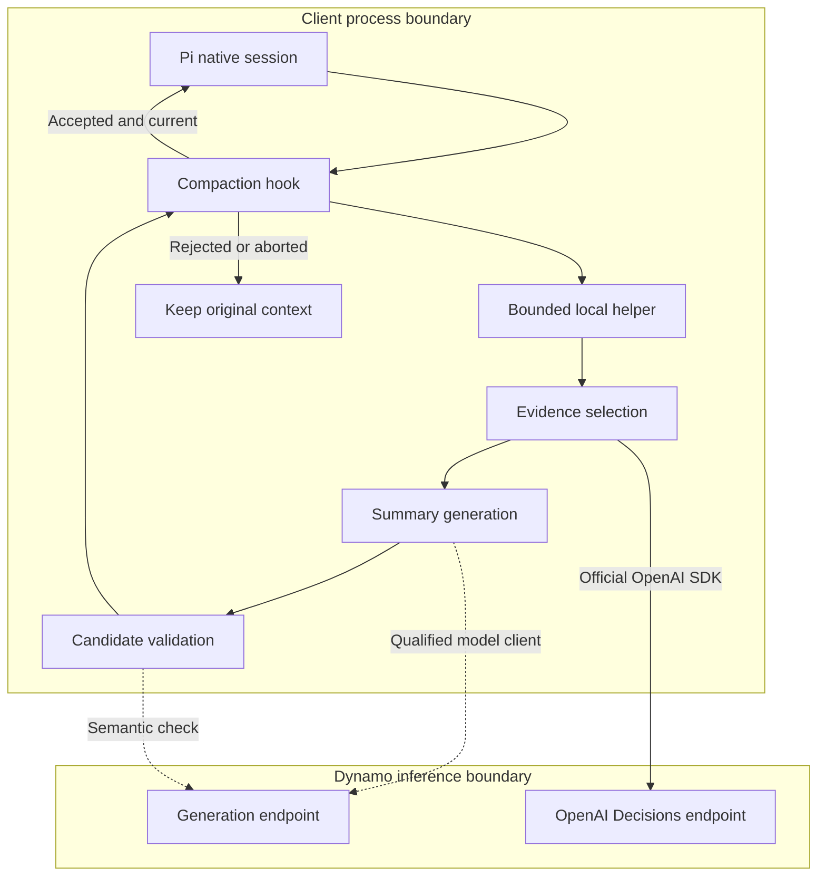
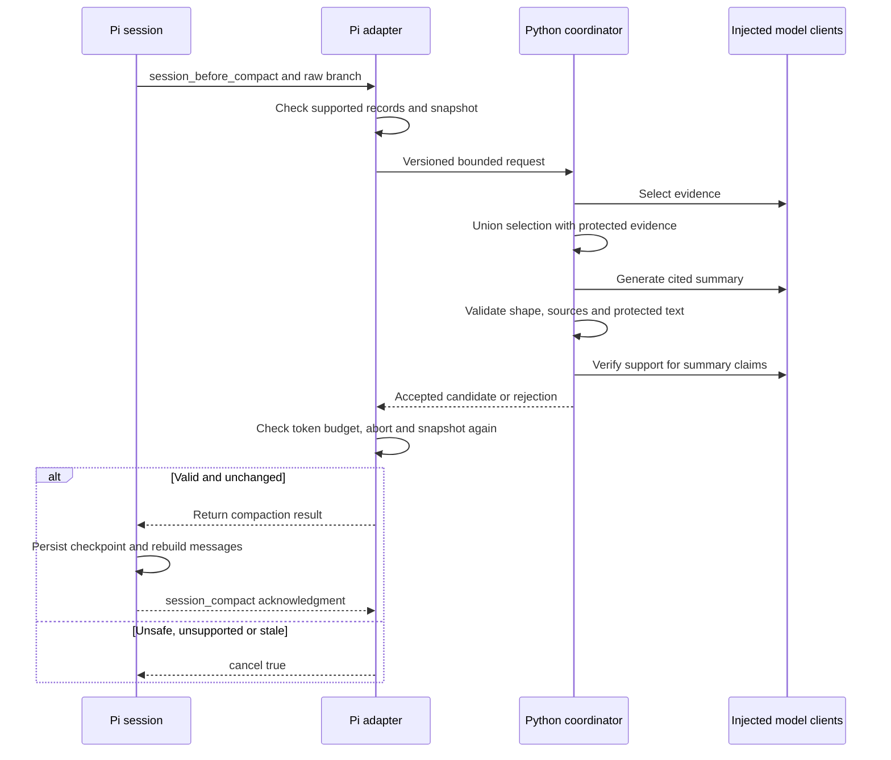

<!--
SPDX-FileCopyrightText: Copyright (c) 2025-2026 NVIDIA CORPORATION & AFFILIATES. All rights reserved.
SPDX-License-Identifier: Apache-2.0
-->

# Decision-guided compaction with Pi

This experimental, opt-in proof of concept exercises evidence selection through Dynamo's OpenAI-compatible `POST /v1/decisions`, summary generation, validation, and native Pi checkpoint adoption. It is a client of the Decision APIs, not another server endpoint. Pi owns the transcript, retained tail, active projection, and persistence. The implementation builds on the Decision API qualification stack; it adds no `nvext.format` selector or SGLang-native wire protocol.

> [!IMPORTANT]
> The CPU fixture demonstrates pipeline and harness correctness with deterministic model responses. It does not run a learned decision model, establish model quality or savings, qualify a real tokenizer, or enable unattended compaction of an existing user's session. Native Strands pointer-head execution and live Dynamo model qualification remain follow-up work.

## Run the offline POC

Use Node.js 24, Python 3.12 and `uv`. From the repository root, create an isolated client environment instead of changing the serving environment's OpenAI SDK version:

```bash
COMPACTION_ENV=$(mktemp -d /tmp/dynamo-pi-compaction.XXXXXX)
uv venv --python 3.12 "$COMPACTION_ENV"
source "$COMPACTION_ENV/bin/activate"
uv pip install -r components/src/dynamo/compaction/requirements-sdk.txt \
  pytest==9.1.1 pytest-asyncio==1.4.0 pytest-timeout==2.4.0 pytest-cov==7.1.0
export PYTHONPATH="$PWD/components/src"
export DYNAMO_COMPACTION_PYTHON="$COMPACTION_ENV/bin/python"
python -m pytest tests/unit/compaction --confcutdir=tests/unit/compaction \
  -o addopts= -o filterwarnings= \
  --cov=dynamo.compaction --cov-report=term-missing --cov-fail-under=80
cd examples/agents/decision_compaction/pi
npm ci --ignore-scripts
npm run typecheck
npm test
npm run demo
npm audit --audit-level=high
```

The demo creates its own temporary synthetic Pi session, invokes the bounded Python helper in `fixture-sdk` mode, and removes that session afterward. The helper uses the real pinned OpenAI SDK with an in-memory HTTP transport: Decisions selection followed by generation-shaped compaction and verification replies. It never sends transcript data to a remote service or downloads model weights. The final record identifies fixture mode and reports persistence, restart, and the next actor payload separately from model-quality qualification. The isolated Python environment remains available for reruns.

The helper accepts a versioned request on stdin and writes one bounded JSON result on stdout. `--mode fixture` is a simpler deterministic fixture; `--mode fixture-sdk` also exercises SDK serialization. `--mode model` deliberately rejects until a real model profile and exact counters are qualified. Do not install either fixture mode into a real user's session. The SDK client classes are integration building blocks, not an already-qualified live compaction deployment.

## Architecture and boundaries



The Python core computes a candidate without writing a transcript. Its selector uses the official OpenAI Decisions client, with bounded keep-versus-summarize questions and conservative handling of refusals and uncertainty. Summarization and semantic verification use generation rather than classification. The thin TypeScript adapter owns the host-specific cut point, checks abort and snapshot identity, and returns the candidate only through Pi's supported hook. The server does not replace history, approve tools, authorize evidence access, or alter KV state. Running a causal model through Decisions does not implement Strands Decider's pointer head.

## Existing Dynamo harness integrations

Dynamo's [agent-harness guide](https://docs.nvidia.com/dynamo/agents/agent-harnesses) configures Pi through the separate [Dynamo provider plugin](https://github.com/ai-dynamo/agent-plugins/tree/main/pi-plugin). That plugin handles model-provider requests; this POC adds compaction orchestration and does not replace it. The isolated SDK fixture disables ambient extensions and credentials so it can prove adoption without depending on a user's installed plugin configuration. Compatibility with the provider plugin needs its own pinned integration run.

OpenCode uses a project-local provider configuration, not just an endpoint environment variable. Dynamo normalizes its native `x-session-id` and `x-parent-session-id` headers. That provider setup is not a candidate-replacement seam; the Pi POC does not claim OpenCode compaction support. Preserve logical session identity for selector and compactor requests, use application correlation for phases, and never spoof Codex-specific compaction headers.



## Safety contract

Preserve user instructions verbatim and keep original source roles and citations. A selector cannot authorize dropping protected evidence. Evidence IDs resolve only to the captured branch; model-generated paths or URLs never authorize a read. Keep complete tool interactions and reject unsupported record shapes, opaque reasoning, unsafe cuts, or incomplete groups. Do not serialize tool output through a truncating convenience renderer.

All failures must explicitly veto compaction. Pi catches extension exceptions, so throwing is not sufficient to prevent native fallback. Qualify this POC only as the sole compaction extension in a caller-owned serialized session: Pi does not provide a native revision compare-and-swap at this hook, and another extension can replace the returned result. Abort, changed leaf/branch identity, malformed output, or exceeded limits must never append a checkpoint.

The initial adapter rejects branches containing an earlier compaction, split-turn cuts, and custom compaction instructions. It protects complete tool-call/result groups verbatim rather than asking the model to compress them. These deliberate limits make the first adoption proof narrower than general long-running session compaction; repeated compaction and selective tool-output compression require additional tests and policy. The helper receives the system prompt and retained tail as read-only context, not as additional material it may replace.

An independent semantic verifier can reject unsupported claims but is not infallible. Exact preservation and provenance checks do not prove continuation quality. Original evidence remains in Pi's native session store; the helper creates no second transcript and never edits native session files. No successful checkpoint should emit a session-final eviction hint or impersonate Codex compaction headers.

## Qualification boundaries

The initial CPU run passed 80 Python tests with 96.06% package coverage and 27 Pi tests with 100% adapter/helper line coverage and 91.85% branch coverage. The offline demo verified native persistence, restart and the subsequent actor payload. Python and npm dependency audits reported no known vulnerabilities at validation. These are local results, not a claim that remote CI or live inference has passed.

| Component | Pinned or recorded version |
|---|---|
| Pi SDK and model library | `1.1.0`, source `abe508e1b89912adde45528136c3221eb69acdd7` |
| OpenAI Python SDK | `3.26.0` |
| HTTPX transport | `0.28.1` |
| Node.js / Python validation | `24.15.0` / `3.12.3` |
| Selector, compactor and verifier | Deterministic transport fixtures; no model weights |
| Token counter | Explicitly unqualified fixture byte counter; not a tokenizer |

Pi `0.79.8` was considered initially but rejected because bundled dependencies could not be remediated through root overrides. The lockfile records the replacement dependency set. Do not infer older/newer Pi compatibility from this pin.

| Layer | What the POC can establish | What remains separate |
|---|---|---|
| Pipeline | Bounded helper exchange, OpenAI Decisions selection contract, protected evidence and rejection paths | Learned-selector calibration and native Strands execution |
| Pi | Real SDK adoption, original evidence retention, restart and actor projection | Other Pi versions, competing extensions and arbitrary concurrent session mutation |
| Budgets | Explicit defensive byte limits and injected counter checks | Exact tokenizer/template and full rendered actor-context qualification for each model profile |
| Models | Injectable generation clients and deterministic transport fixtures | Live Dynamo/SGLang inference and pinned model numerical parity |
| Quality | Safety regression fixtures | Paired continuation accuracy, repeated-compaction drift, latency and total session cost |
| Other harnesses | Reusable transport-independent core | Codex, Claude Code, Hermes and OpenCode adoption semantics |
| Cache | No change to cache policy | Lossy KV compression, suffix KV reuse and physical GPU settlement |

The eventual model-backed campaign must record actor, selector, compactor, verifier, tokenizer/template, engine and SDK versions separately. Budget the complete rendered context, including system instructions, tools, retained tail and checkpoint. Byte bounds and Pi's token estimates are not a substitute. Unknown usage stays unknown; a timeout does not prove GPU work has stopped.

## Selector model choice

Favor the existing causal scoring path for the first POC. OpenJev is not a single checkpoint: the [lookski implementation](https://github.com/lookski/openjev/blob/49eb1382c88024e0f2550005264c13847d6ec167/openjev/core.py) uses ordinary causal language models and candidate-token logits. That execution approach is closest to the SGLang-backed Decision API stack. Reuse Dynamo's endpoint rather than inserting the OpenJev server into the measured path. A small causal model is a qualification target, not evidence that preservation decisions will be reliable.

| Candidate | Additional execution work | POC priority |
|---|---|---|
| Small causal model, OpenJev-style scoring | Qualify checkpoint, tokenizer/template, labels and thresholds on the existing SGLang executor | First: lowest new-runtime complexity |
| Strands Decider 2B | Native pointer-head executor, adapter artifacts, calibration and model-specific accounting | Follow-up trained decision-model comparison |
| DiffusionGemma through razorback16/OpenJev | Diffusion canvas and readout integration, backend qualification and numerical parity | Deferred; not a causal executor substitution |

[Strands replaces the language-model head with a pointer head](https://github.com/strands-labs/strands-decider/blob/468e653e76ad2a84af5755e074942b71176ceb10/docs/architecture.md); pointing the current causal endpoint at that checkpoint would not preserve its execution semantics. Its [reference serving documentation](https://github.com/strands-labs/strands-decider/blob/468e653e76ad2a84af5755e074942b71176ceb10/docs/inference.md) requires strict-window mode to reject rather than truncate oversized input. A future integration must preserve that property. The [other OpenJev implementation](https://github.com/razorback16/openjev/blob/75f22b6dad8c360fdba0e0ebd3dc0a1187628f60/openjev/engine.py) uses DiffusionGemma-specific readout for its default backend and also has other model adapters; selecting its API does not select a universally supported executor.

This priority is an engineering-complexity judgment, not a quality ranking. Standalone Strands may be straightforward to run, but integrating its native outputs behind this Decision API stack is additional work. Raw softmax probabilities and wire-compatible responses do not establish calibration, factual correctness, or safe compaction. A dedicated generation model is still required to write summaries.

## Next qualification steps

1. Freeze a supported local model profile and exact token-counting implementation. Keep the actor and compactor fixed across comparisons.
2. Qualify the chosen registered model through Dynamo's OpenAI Decisions endpoint. Adding Strands later requires its actual torso, adapter and pointer-head artifacts plus an appropriate executor; do not substitute a model merely because its family name matches.
3. Run live selection, summarization, validation, adoption and continuation on approved synthetic or sanitized history. Retain requests, validation results and model revision records without credentials.
4. Compare direct summarization, deterministic protection/masking and learned selection using matched continuations. Count all selector, compactor, verifier and subsequent actor work. Report inconclusive results honestly.
5. Qualify repeated compaction and broader harness support independently. Keep KV compression in a separate workstream.

## References

- [Pi pinned extension contract](https://github.com/earendil-works/pi/blob/abe508e1b89912adde45528136c3221eb69acdd7/packages/coding-agent/src/core/extensions/types.ts)
- [Pi pinned checkpoint adoption](https://github.com/earendil-works/pi/blob/abe508e1b89912adde45528136c3221eb69acdd7/packages/coding-agent/src/core/agent-session.ts)
- [OpenAI Decisions contract](https://developers.openai.com/api/reference/python/resources/decisions/methods/create)
- [Dynamo harness setup and compaction signals](https://docs.nvidia.com/dynamo/agents/agent-harnesses#compaction-signals)
- [Strands Decider reference runtime](https://github.com/strands-labs/strands-decider)
