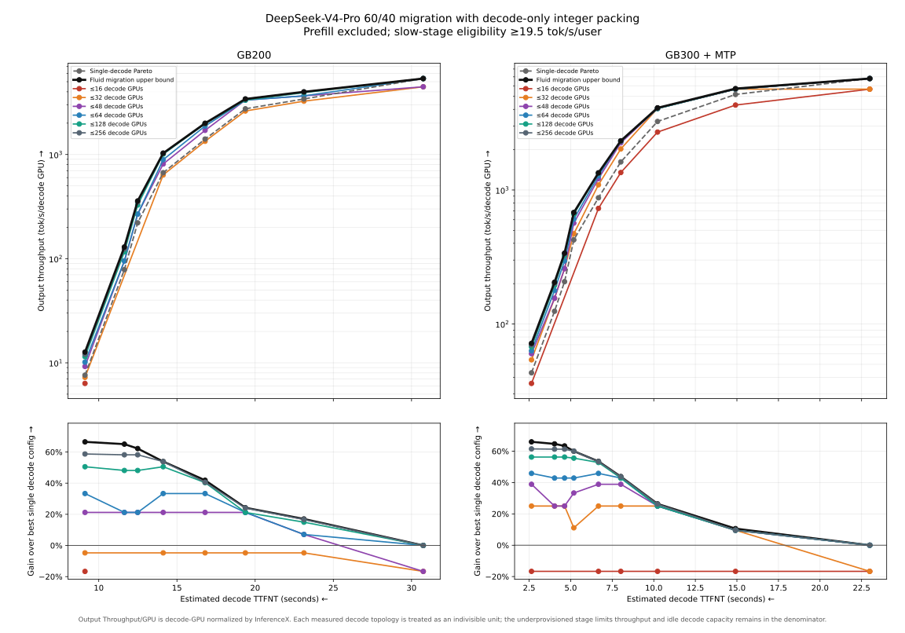

<!--
SPDX-FileCopyrightText: Copyright (c) 2025-2026 NVIDIA CORPORATION & AFFILIATES. All rights reserved.
SPDX-License-Identifier: Apache-2.0
-->

# Decode Migration Sizing

This note estimates whether a fast reasoning tier and a throughput-oriented
visible-token tier can be rate matched within a decode-GPU budget. It is a
capacity-planning method, not a substitute for an end-to-end benchmark.

## Metrics

For a workload with output sequence length `L` and reasoning fraction `f`, use:

- `I_fast`: fast-tier interactivity in output tokens/second/user;
- `T_fast`: fast-tier output throughput per decode GPU;
- `T_slow`: slow-tier output throughput per decode GPU; and
- `f`: fraction generated on the fast tier.

Estimate time to first non-thinking token (TTFNT) as:

```text
TTFNT = f * L / I_fast
```

The continuously divisible, perfectly rate-matched throughput bound is:

```text
T_fluid = 1 / (f / T_fast + (1 - f) / T_slow)
```

InferenceX divides `Output Throughput/GPU` by the number of decode GPUs for a
disaggregated deployment. Do not include prefill GPUs in this calculation. See
the [InferenceX result processor](https://github.com/SemiAnalysisAI/InferenceX/blob/main/utils/process_result.py).

## Integer Decode-Worker Packing

Real deployments allocate complete decode workers. For a fast worker with
`g_fast` GPUs and a slow worker with `g_slow` GPUs, define their aggregate
capacities:

```text
C_fast = g_fast * T_fast
C_slow = g_slow * T_slow
```

For `n_fast` fast workers and `n_slow` slow workers, calculate the full-sequence
output rate as:

```text
R = min(
  n_fast * C_fast / f,
  n_slow * C_slow / (1 - f)
)
```

Then account for idle capacity in the overprovisioned tier:

```text
T_packed = R / (n_fast * g_fast + n_slow * g_slow)
```

Enumerate integer worker counts under the decode-GPU budget. At each TTFNT,
compare `T_packed` with the highest-throughput single decode configuration with
equal or lower TTFNT. This exposes losses hidden by the fluid bound.

## GB300 Example

The example below uses DeepSeek-V4-Pro measurements from InferenceX:

- ISL: 8,192 tokens;
- OSL: 1,024 tokens;
- reasoning/visible split: 60%/40%;
- minimum slow-tier interactivity: 19.5 tokens/second/user; and
- budget: 64 decode GPUs, excluding prefill.

The selected integer placement is:

| Tier | Workers | Parallelism | Decode GPUs |
|---|---:|---:|---:|
| Fast reasoning | 14 | TP4 | 56 |
| Slow visible-token | 1 | DEP8 | 8 |
| **Total** | **15** | | **64** |

The fast measurement provides `232.52 tokens/second/user` and `43.20 output
tokens/second/decode GPU`. The slow measurement provides `875.12 output
tokens/second/decode GPU`.

```text
TTFNT = 0.60 * 1024 / 232.52
      = 2.64 seconds

R_fast = 14 * 4 * 43.20 / 0.60
       = 4,032 output tokens/second

R_slow = 1 * 8 * 875.12 / 0.40
       = 17,502 output tokens/second

T_packed = min(R_fast, R_slow) / 64
         = 63.00 output tokens/second/decode GPU
```

The single-tier baseline at the same TTFNT is `43.20 output
tokens/second/decode GPU`. The packed deployment improves throughput by 45.8%,
reaches 87.9% of the fluid bound, and uses 23.0% of the slow worker's capacity.
The fast tier is the bottleneck.

For a static trigger, migrate after approximately 614 generated tokens. For a
reasoning model with an explicit end-of-thinking token, prefer the token trigger
because reasoning length varies by request.



## Experimental Checks

Validate the estimate before using it for capacity planning:

1. Measure fast and slow configurations with the same model, quantization, MTP
   settings, ISL/OSL distribution, and sampling policy.
2. Confirm that the fast pool, slow pool, and migration coordinator sustain the
   predicted arrival rate without queue growth.
3. Measure TTFNT from token events rather than deriving it only from mean
   interactivity.
4. Include NIXL transfer time, destination reservation, and migration failures.
5. Record requests that finish before the trigger and the observed reasoning
   fraction distribution.
6. Size and benchmark prefill independently; this method deliberately excludes
   prefill GPUs.

The method assumes linear replication of measured decode workers and stable
per-worker capacity when the slow tier is underfilled. Those assumptions are
most likely to fail near memory limits, communication boundaries, and scheduler
batch-size transitions.
