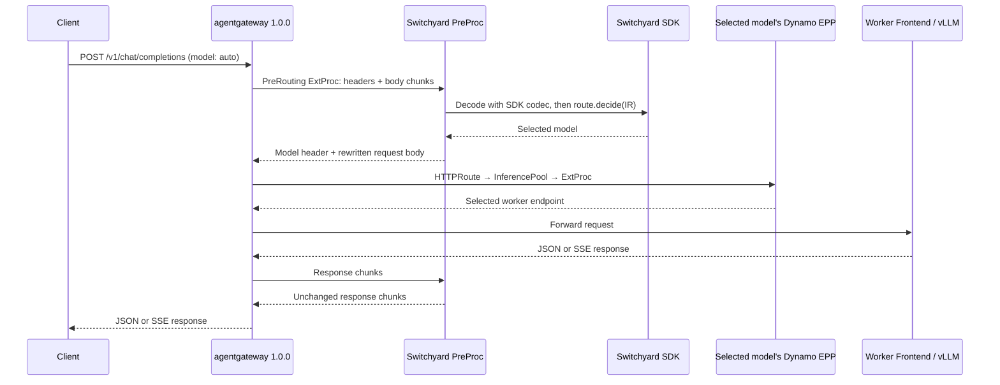

<!--
SPDX-FileCopyrightText: Copyright (c) 2025-2026 NVIDIA CORPORATION & AFFILIATES. All rights reserved.
SPDX-License-Identifier: Apache-2.0
-->

# Switchyard model routing with Dynamo GAIE

Run Switchyard's published Rust SDK in a separate, single-replica PreProc. It chooses between
`Qwen/Qwen3-0.6B` and `Qwen/Qwen3-1.7B`; Dynamo's native EPP then selects a worker within that
model's pool. The example adds PreProc and gateway routing to an existing GAIE deployment.



These are two distinct ExtProc calls: PreProc chooses the model before route matching; the EPP
selects the worker after pool selection. The SDK runs inside PreProc and makes no generation calls
for the supplied StageRouter policy. PreProc receives no Dynamo load or cache signals.

## Prerequisites

Use an existing Kubernetes deployment with the Dynamo operator, Gateway API, GAIE, and the
**agentgateway 1.0.0 controller and CRDs** installed. Cluster, operator, GPU, and worker setup are
outside this example.

The namespace must already contain ready model workers, native Dynamo EPPs, and two
`InferencePool` resources named `qwen-small-pool` and `qwen-large-pool`, serving `Qwen/Qwen3-0.6B`
and `Qwen/Qwen3-1.7B`. Start from Dynamo's existing
[aggregated GAIE deployment](../agg.yaml) or [disaggregated GAIE deployment](../disagg.yaml)
when preparing those pools. The [standard HTTPRoute example](../http-route.yaml) shows the
native pool attachment.

The Kustomization assumes the existing namespace is `switchyard`. Change `namespace` in
[kustomization.yaml](kustomization.yaml) to your workload namespace, and adjust the target model IDs
in [routes.toml](preproc/config/routes.toml) and pool references in
[http-routes.yaml](http-routes.yaml) if they differ. PreProc and the example's dedicated Gateway run
in that same namespace. Do not downgrade newer controller CRDs to run this example.

You also need Docker, `kubectl` with Kustomize support, and a registry the cluster can pull from.

## Build and deploy

From the Dynamo repository root, build the PreProc image. The build reuses Dynamo's committed
ExtProc protos, so the repository root is the required build context:

```bash
export PREPROC_IMAGE=registry.example.com/your-project/switchyard-preproc:example
export EXAMPLE=examples/backends/vllm/deploy/gaie/switchyard

docker build -f "$EXAMPLE/preproc/Dockerfile" -t "$PREPROC_IMAGE" .
docker push "$PREPROC_IMAGE"
```

Set the PreProc registry image in [kustomization.yaml](kustomization.yaml). Then apply the add-on
to the prepared namespace:

```bash
export NAMESPACE=switchyard
kubectl get -n "$NAMESPACE" inferencepool qwen-small-pool qwen-large-pool
kubectl apply -k "$EXAMPLE"
kubectl rollout status -n "$NAMESPACE" deployment/switchyard-preproc --timeout=180s
kubectl wait -n "$NAMESPACE" gateway/switchyard-gateway \
  --for=condition=Programmed --timeout=180s
kubectl get -n "$NAMESPACE" httproute
kubectl port-forward -n "$NAMESPACE" service/switchyard-gateway 8000:80
```

The HTTPRoutes must report `Accepted=True` and `ResolvedRefs=True`. PreProc does not replace the
existing Dynamo worker Frontends or EPPs. There is one separate Switchyard process for both models.

## Verify both model choices

In a second terminal, send a neutral request. The supplied `efficient_first` policy selects
`Qwen/Qwen3-0.6B`:

```bash
curl --fail-with-body -sS http://localhost:8000/v1/chat/completions \
  -H 'Content-Type: application/json' \
  -d '{"model":"auto","messages":[{"role":"user","content":"Say hello."}],"max_tokens":16}'
```

A critical tool failure selects `Qwen/Qwen3-1.7B`:

```bash
curl --fail-with-body -sS http://localhost:8000/v1/chat/completions \
  -H 'Content-Type: application/json' \
  -d '{"model":"auto","messages":[{"role":"user","content":"Fix the failure."},{"role":"assistant","content":null,"tool_calls":[{"id":"call-1","type":"function","function":{"name":"Bash","arguments":"{\"command\":\"pytest\"}"}}]},{"role":"tool","tool_call_id":"call-1","content":"MemoryError: out of memory"}],"max_tokens":16}'
```

Check the response's `model` field. Add `"stream":true` and use `curl --no-buffer` to verify SSE.
Set `X-Switchyard-Session-Id` to retain StageRouter state across requests in one session.

## Configure routing

Edit [routes.toml](preproc/config/routes.toml) using the native Switchyard runner schema, then
reapply the Kustomization. `Runner::from_toml` constructs the SDK directly; there is no adapter
configuration schema. The request's `model` is a **route ID**, such as `auto`, rather than a served
model alias. Named routes can select other configured policies.

To route to another existing model pool, add its target and policy in the TOML and a matching model
header rule in `http-routes.yaml`. HTTPRoute owns the model-to-pool mapping. PreProc changes only
the top-level `model` field and overwrites incoming gateway/worker routing controls; other raw JSON
field values remain intact. Use decision-only policies: request-rewriting or generation-producing
policies do not fit this forwarding contract.

The example supports text and function-tool history on `/v1/chat/completions`. It limits requests
to 2 MiB, concurrent routing to eight requests, total ExtProc streams to sixteen, and session
identities to 4096. SDK decisions time out after one second, request preprocessing after five
seconds, and response passthrough after 120 seconds. Agentgateway 1.0.0 keeps PreProc on the
response path. State lives in one process and resets on restart; `Recreate` updates briefly stop
routing. This example does not provide high availability or production throughput guarantees.

## Validate and remove

With Rust 1.96.1, CMake, and `protoc` installed, run the focused service checks from the repository root:

```bash
cargo fmt --manifest-path "$EXAMPLE/preproc/Cargo.toml" --check
cargo clippy --manifest-path "$EXAMPLE/preproc/Cargo.toml" --locked --all-targets -- -D warnings
cargo test --manifest-path "$EXAMPLE/preproc/Cargo.toml" --locked
kubectl kustomize "$EXAMPLE"
```

Remove the add-on's resources; the existing model deployments and pools remain:

```bash
kubectl delete -k "$EXAMPLE"
```
