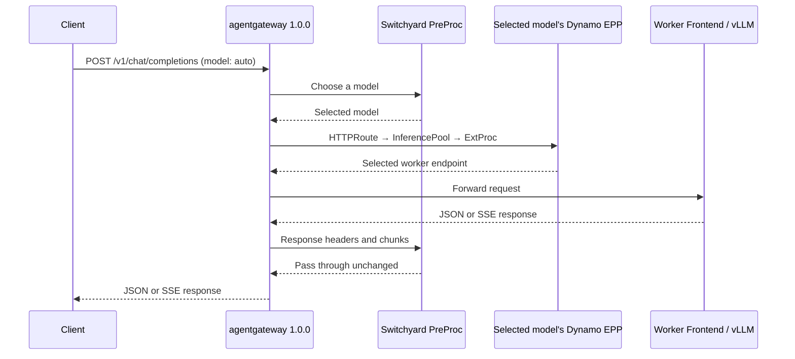

<!--
SPDX-FileCopyrightText: Copyright (c) 2025-2026 NVIDIA CORPORATION & AFFILIATES. All rights reserved.
SPDX-License-Identifier: Apache-2.0
-->

# Switchyard model routing with Dynamo GAIE

Run Switchyard in a separate, single-replica PreProc. It chooses between
`Qwen/Qwen3-0.6B` and `Qwen/Qwen3-1.7B`; Dynamo's native EPP then selects a worker within that
model's pool. The example adds PreProc and gateway routing to an existing GAIE deployment.
The [PreProc implementation and image build](https://github.com/NVIDIA-NeMo/Switchyard/tree/main/examples/dynamo-preproc)
live in Switchyard; this directory contains the Dynamo deployment manifests and routing policy.



PreProc chooses the model before gateway route matching. The selected model's EPP then chooses
the worker. This example uses StageRouter without Dynamo load or cache signals.

## Prerequisites

Use an existing Kubernetes deployment with the Dynamo operator, Gateway API, GAIE, and the
**agentgateway 1.0.0 controller and CRDs** installed. Cluster, operator, GPU, and worker setup are
outside this example.

The namespace must already contain ready model workers, native Dynamo EPPs, and two
`InferencePool` resources named `qwen-small-pool` and `qwen-large-pool`, serving `Qwen/Qwen3-0.6B`
and `Qwen/Qwen3-1.7B`. Start from Dynamo's existing
[aggregated GAIE deployment](../agg.yaml) or [disaggregated GAIE deployment](../disagg.yaml)
when preparing those pools. The [standard HTTPRoute example](../http-route.yaml) shows the
native pool attachment.

The Kustomization assumes the existing namespace is `switchyard`. Change `namespace` in
[kustomization.yaml](kustomization.yaml) to your workload namespace, and adjust the target model IDs
in [routes.toml](routes.toml) and pool references in
[http-routes.yaml](http-routes.yaml) if they differ. PreProc and the example's dedicated Gateway run
in that same namespace. Do not downgrade newer controller CRDs to run this example.

You also need Docker, `kubectl` with Kustomize support, and a registry the cluster can pull from.

## Build and deploy

Build and publish the image from the
[Switchyard PreProc example](https://github.com/NVIDIA-NeMo/Switchyard/tree/main/examples/dynamo-preproc#build-the-image).
Then, from the Dynamo repository root:

```bash
export EXAMPLE=examples/backends/vllm/deploy/gaie/switchyard
```

Set the PreProc registry image in [kustomization.yaml](kustomization.yaml). Then apply the add-on
to the prepared namespace:

```bash
export NAMESPACE=switchyard
kubectl get -n "$NAMESPACE" inferencepool qwen-small-pool qwen-large-pool
kubectl apply -k "$EXAMPLE"
kubectl rollout status -n "$NAMESPACE" deployment/switchyard-preproc --timeout=180s
kubectl wait -n "$NAMESPACE" gateway/switchyard-gateway \
  --for=condition=Programmed --timeout=180s
kubectl get -n "$NAMESPACE" httproute
kubectl port-forward -n "$NAMESPACE" service/switchyard-gateway 8000:80
```

The HTTPRoutes must report `Accepted=True` and `ResolvedRefs=True`.

## Verify both model choices

In a second terminal, send a neutral request. The supplied `efficient_first` policy selects
`Qwen/Qwen3-0.6B`:

```bash
curl --fail-with-body -sS http://localhost:8000/v1/chat/completions \
  -H 'Content-Type: application/json' \
  -d '{"model":"auto","messages":[{"role":"user","content":"Say hello."}],"max_tokens":16}'
```

A critical tool failure selects `Qwen/Qwen3-1.7B`:

```bash
curl --fail-with-body -sS http://localhost:8000/v1/chat/completions \
  -H 'Content-Type: application/json' \
  -d '{"model":"auto","messages":[{"role":"user","content":"Fix the failure."},{"role":"assistant","content":null,"tool_calls":[{"id":"call-1","type":"function","function":{"name":"Bash","arguments":"{\"command\":\"pytest\"}"}}]},{"role":"tool","tool_call_id":"call-1","content":"MemoryError: out of memory"}],"max_tokens":16}'
```

Check the response's `model` field. Add `"stream":true` and use `curl --no-buffer` to verify SSE.
Set `X-Switchyard-Session-Id` to retain StageRouter state across requests in one session.
Send `X-Switchyard-Session-Final: true` on the final request to release its session admission
slot after a successful routing decision.

## Configure routing

Edit [routes.toml](routes.toml) to choose the routing policy, then reapply the
Kustomization. Set the request's `model` to a configured route ID, such as `auto`.

To route to another existing model pool, add its target and policy in the TOML and a matching
rule in [http-routes.yaml](http-routes.yaml). Use policies that select a model without generating
a response or rewriting the request.

The example supports text and function-tool history on `/v1/chat/completions`, with requests up
to 2 MiB. PreProc admits up to 4,096 session identities
active within the past hour; idle admission slots are reused. The SDK reclaims idle state on
its own hourly sweep. Session state resets when PreProc restarts, and updates briefly interrupt
routing. This single-replica example does not provide high availability.

agentgateway 1.0.0 sends responses through PreProc and cannot disable those phases. Each
request holds a stream slot until its response finishes. Set `MAX_ACTIVE_STREAMS` in
[preproc.yaml](preproc.yaml) to change the default of 16. Preprocessing also has a separate
limit of eight concurrent requests; reaching either limit returns HTTP 503. Increasing the
stream limit increases memory and response-forwarding work. Reapply the Kustomization after
changing the setting.

PreProc's 120-second response timeout measures inactivity and resets on each message.
It also releases stream slots if output forwarding stalls for 120 seconds.
The `timeouts.request: 120s` setting in [http-routes.yaml](http-routes.yaml) is separate:
in agentgateway 1.0.0 it bounds the wait for upstream response headers, measured from request
start. It does not limit the duration of an active response stream.

## Remove

Remove the add-on's resources; the existing model deployments and pools remain:

```bash
kubectl delete -k "$EXAMPLE"
```
