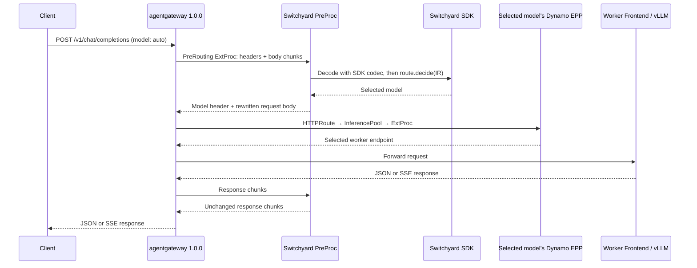

<!--
SPDX-FileCopyrightText: Copyright (c) 2025-2026 NVIDIA CORPORATION & AFFILIATES. All rights reserved.
SPDX-License-Identifier: Apache-2.0
-->

# Switchyard model routing with Dynamo GAIE

Run Switchyard's published Rust SDK in a separate, single-replica PreProc. It chooses between
`Qwen/Qwen3-0.6B` and `Qwen/Qwen3-1.7B`; Dynamo's native EPP then selects a worker within that
model's pool. The example adds application manifests to an existing Kubernetes deployment.



These are two distinct ExtProc calls: PreProc chooses the model before route matching; the EPP
selects the worker after pool selection. The SDK runs inside PreProc and makes no generation calls
for the supplied StageRouter policy. PreProc receives no Dynamo load or cache signals.

## Prerequisites

- A Kubernetes cluster with the Dynamo platform/operator installed and two available NVIDIA GPUs.
  Use the [Kubernetes installation guide](https://github.com/ai-dynamo/dynamo/blob/main/docs/fern/pages/kubernetes/installation/install-dynamo.md).
- Gateway API v1.5.1, GAIE v1.2.1, and the **agentgateway 1.0.0 controller and CRDs**. Use
  [Dynamo's gateway installer](../../../../../../deploy/inference-gateway/scripts/install_gaie_crd_agentgateway.sh)
  on a compatible cluster. Do not downgrade newer installed CRDs to run this example.
- Frontend and vLLM images built from the same Dynamo revision as the installed operator.
- Docker, `kubectl` with Kustomize support, and a registry that the cluster can pull from.
  The public Qwen models must be downloadable by the EPP and worker pods.

## Build and deploy

From the Dynamo repository root, build the PreProc image. The build reuses Dynamo's committed
ExtProc protos, so the repository root is the required build context:

```bash
export PREPROC_IMAGE=registry.example.com/your-project/switchyard-preproc:example
export EXAMPLE=examples/backends/vllm/deploy/gaie/switchyard

docker build -f "$EXAMPLE/preproc/Dockerfile" -t "$PREPROC_IMAGE" .
docker push "$PREPROC_IMAGE"
```

Set the two Dynamo image tags and the PreProc registry image in
[kustomization.yaml](kustomization.yaml). Then apply the example to the intended cluster:

```bash
kubectl create namespace switchyard --dry-run=client -o yaml | kubectl apply -f -
kubectl apply -k "$EXAMPLE"
kubectl rollout status -n switchyard deployment/switchyard-preproc --timeout=180s
kubectl wait -n switchyard dynamographdeployment/qwen-small dynamographdeployment/qwen-large   --for=condition=Ready --timeout=1800s
kubectl wait -n switchyard gateway/switchyard-gateway --for=condition=Programmed --timeout=180s
kubectl get -n switchyard httproute,inferencepool
kubectl port-forward -n switchyard service/switchyard-gateway 8000:80
```

The HTTPRoutes must report `Accepted=True` and `ResolvedRefs=True`. The operator creates the
`qwen-small-pool` and `qwen-large-pool` resources from the two DGDs. Each worker uses Dynamo's
normal direct-mode Frontend sidecar. There is one separate Switchyard process for both models.

## Verify both model choices

In a second terminal, send a neutral request. The supplied `efficient_first` policy selects
`Qwen/Qwen3-0.6B`:

```bash
curl --fail-with-body -sS http://localhost:8000/v1/chat/completions   -H 'Content-Type: application/json'   -d '{"model":"auto","messages":[{"role":"user","content":"Say hello."}],"max_tokens":16}'
```

A critical tool failure selects `Qwen/Qwen3-1.7B`:

```bash
curl --fail-with-body -sS http://localhost:8000/v1/chat/completions   -H 'Content-Type: application/json'   -d '{"model":"auto","messages":[{"role":"user","content":"Fix the failure."},{"role":"assistant","content":null,"tool_calls":[{"id":"call-1","type":"function","function":{"name":"Bash","arguments":"{\"command\":\"pytest\"}"}}]},{"role":"tool","tool_call_id":"call-1","content":"MemoryError: out of memory"}],"max_tokens":16}'
```

Check the response's `model` field. Add `"stream":true` and use `curl --no-buffer` to verify SSE.
Set `X-Switchyard-Session-Id` to retain StageRouter state across requests in one session.

## Configure routing

Edit [routes.toml](preproc/config/routes.toml) using the native Switchyard runner schema, then
reapply the Kustomization. `Runner::from_toml` constructs the SDK directly; there is no adapter
configuration schema. The request's `model` is a **route ID**, such as `auto`, rather than a served
model alias. Named routes can select other configured policies.

To add a model, add a target and policy in the TOML, a DGD in `models.yaml`, and a matching model
header rule in `http-routes.yaml`. HTTPRoute owns the model-to-pool mapping. PreProc changes only
the top-level `model` field and overwrites incoming gateway/worker routing controls; other raw JSON
field values remain intact. Use decision-only policies: request-rewriting or generation-producing
policies do not fit this forwarding contract.

The example supports text and function-tool history on `/v1/chat/completions`. It limits requests
to 2 MiB, concurrent routing to eight requests, total ExtProc streams to sixteen, and session
identities to 4096. SDK decisions time out after one second, request preprocessing after five
seconds, and response passthrough after 120 seconds. Agentgateway 1.0.0 keeps PreProc on the
response path. State lives in one process and resets on restart; `Recreate` updates briefly stop
routing. Worker updates also use `Recreate`, so a replacement can start on the same GPU without
requiring spare GPU capacity. This example does not provide high availability or production throughput
guarantees.

## Validate and remove

With Rust 1.96.1, CMake, and `protoc` installed, run the focused service checks from the repository root:

```bash
cargo fmt --manifest-path "$EXAMPLE/preproc/Cargo.toml" --check
cargo clippy --manifest-path "$EXAMPLE/preproc/Cargo.toml" --locked --all-targets -- -D warnings
cargo test --manifest-path "$EXAMPLE/preproc/Cargo.toml" --locked
kubectl kustomize "$EXAMPLE"
```

Remove only the example's namespaced resources:

```bash
kubectl delete -k "$EXAMPLE"
```
