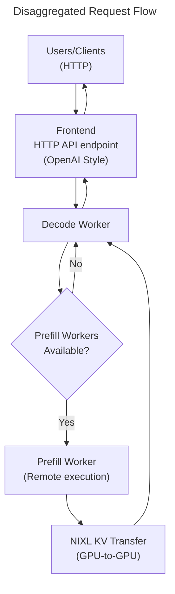
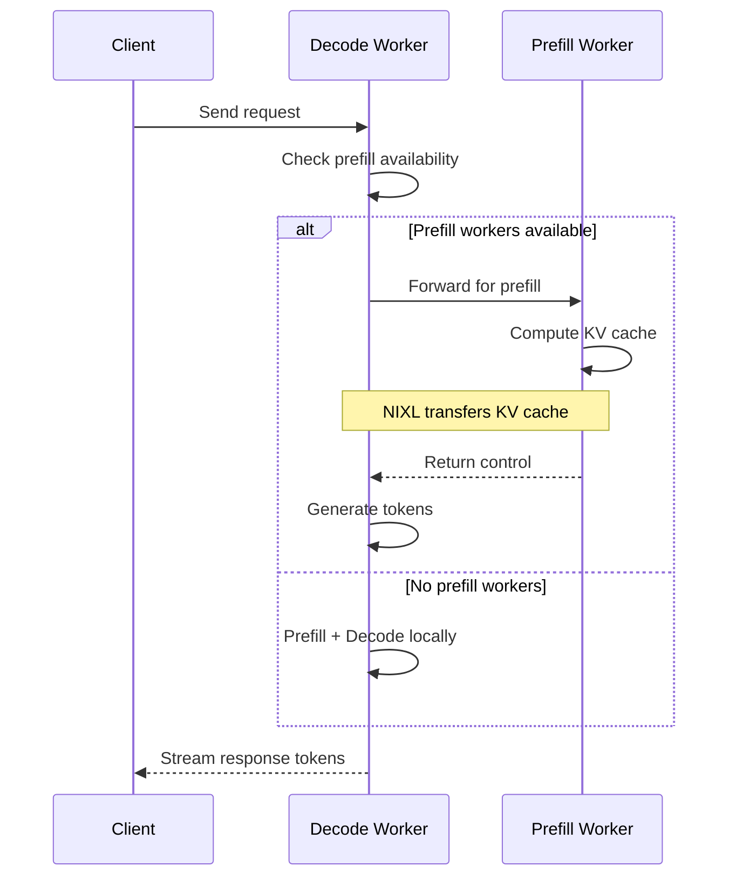

# P/D Disaggregated Serving Example

This example demonstrates Dynamo's **Prefill/Decode Disaggregated Serving** architecture, where the prefill and decode phases of LLM inference are separated into specialized workers for enhanced performance, improved resource utilization, and better scalability. It is intended to be the easiest way to deploy a single-node, non-production Dynamo deployment in its entirety (including supporting services) with either TensorRT-LLM or vLLM backends using a single `docker compose` command.

## What is P/D Disaggregated Serving?

Traditional LLM inference combines two distinct phases with different computational characteristics:

- **Prefill Phase**: Processes the entire input prompt to generate the KV cache (compute-bound)
- **Decode Phase**: Generates output tokens one by one using the KV cache (memory-bound)

Dynamo's disaggregated architecture separates these phases into specialized workers:
- **Prefill Workers**: Optimized for high-throughput parallel processing of input tokens
- **Decode Workers**: Optimized for low-latency sequential token generation

This separation allows for:
- **Better Hardware Utilization**: Use different parallelism configurations optimized for each phase
- **Improved Scalability**: Scale prefill and decode workers independently based on workload
- **Enhanced Performance**: Eliminate head-of-line blocking where long prefills delay ongoing decodes

## Prerequisites

> [NOTE] This example requires having at least 2 GPUs -- one for Prefill and one for Decode

Before running this example, ensure you: 
- Have docker and docker compose installed on your system
- Have cloned this repository to your system (`git clone https://github.com/ai-dynamo/dynamo.git`) and you are in the same working directory as this README and the docker-compose.yml (`cd examples/basics/disaggregated_serving/`) 

## Components

etcd and NATS are used by Dynamo for discovery and communication. They will be started automatically alongside the Dynamo components

- **etcd**: A distributed key-value store used for service discovery and metadata storage
- **NATS**: A high-performance message broker for inter-component communication

Dynamo itself is composed of the three services below:
- [Dynamo Frontend](/components/src/dynamo/frontend/README.md) - HTTP API endpoint that receives requests and forwards them to the decode worker. The frontend will automatically discover the prefill and decode workers through etcd service registry.
- [Dynamo TRTLLM Decode Worker](/docs/backends/trtllm/README.md) - Specialized worker that handles requests and decides between local prefill for short inputs and and remote prefill for longer inputs
- [Dynamo TRTLLM Prefill Worker](/docs/backends/trtllm/README.md) - Specialized worker for prefill phase execution, which 1) pulls prefill requests from the NATS queue, 2) executes prefill computation efficiently, and 3) transfers computed KV cache to decode workers via NIXL

> [NOTE] This quickstart uses the TensorRT-LLM (TRTLLM) backend for the prefill and decode workers, but the configuration can be easily adapted for other backends like vLLM by using the appropriate Dynamo base docker image and modifying the startup command for your backend of choice. A working example for vllm is included in the `docker-compose-vllm.yml`.



## Instructions

In order to run Dynamo, we must:
1. Launch our supporting services, etcd and NATS
2. Launch our Dynamo Frontend, Prefill, and Decode workers once the supporting services are up and running

We will launch all five services with a single command.

### Launch Steps

> [NOTE] this will use the TensorRT-LLM backend by default. If you want to use the vLLM backend, either rename the `docker-compose-vllm.yml` to `docker-compose.yml` before running `docker compose up -d` or replace all `docker compose...` commands with `docker compose -f docker-compose-vllm.yml...`

- Run `docker compose up -d`, which will pull all the necessary docker images and start all services in the appropriate order

### Post-Launch Steps

You can run `docker compose logs -f` to follow log outputs in your terminal (to follow logs for a specific worker, for example the decode worker, you can run `docker compose logs -f dynamo-decode`)

Once dynamo is running and has loaded your model (in this example, Qwen/Qwen3-0.6b), you can send requests to test the disaggregated serving setup. To do so, open a new terminal and run the curl command below:
  ```bash
  curl -X POST http://localhost:8000/v1/chat/completions \
    -H 'Content-Type: application/json' \
    -d '{
      "model": "Qwen/Qwen3-0.6B",
      "messages": [
        { "role": "user", "content": "Tell me a story about a cowardly cat" }
      ],
      "stream": false,
      "max_tokens": 1028
    }'
  ```

> [NOTE] If the curl command above returns a `503 - Service Unavailable`, Dynamo is likely still starting up. Wait until you see the log output from the Dynamo services has slowed down (you will still see periodic stats_responses sent to the NATS server in the logs after the Dynamo services have started up)

### Notes 
- We set `DYN_LOG=debug` to increase log verbosity so we can see disaggregation
- We set CUDA_VISIBLE_DEVICES=0 or CUDA_VISIBLE_DEVICES=1 to ensure that each worker has a specific, dedicated GPU for their portion of disaggregated prefill/decode serving.

## Cleanup

To stop all services when you're done with the disaggregated serving example, simply run:
- `docker compose down`

## Understand

### What's Happening Under the Hood

Dynamo's disaggregated serving architecture separates prefill and decode operations for optimal performance:

### 1. Worker Specialization

The system employs two types of specialized workers:

- **Decode Workers**: Handle incoming requests and manage token generation
  - Receive all incoming requests
  - Make routing decisions based on system state
  - Execute the decode phase to generate output tokens

- **Prefill Workers**: Focus exclusively on prefill computation
  - Process input prompts to generate KV cache
  - Transfer computed KV cache to decode workers
  - Return control immediately after prefill completion

### 2. Dynamic Request Routing

The system uses a simple yet effective routing strategy:

- **Availability-Based Routing**: Decode workers monitor prefill worker availability
- **Automatic Fallback**: When no prefill workers are available, decode workers handle everything locally
- **Transparent Operation**: Clients are unaware of whether requests are processed locally or disaggregated

This approach ensures the system remains operational regardless of configuration changes, automatically adapting to the available resources.

### 3. High-Performance KV Cache Transfer

The architecture relies on NVIDIA's NIXL (NVIDIA Inference Transfer Library) for efficient KV cache movement:

- **Direct GPU-to-GPU Transfer**: KV cache data moves directly between GPU memory without CPU involvement
- **Zero-Copy Operations**: Eliminates redundant memory copies for maximum efficiency
- **Automatic Transport Selection**: NIXL chooses the optimal transport (NVLink, InfiniBand, etc.) based on hardware topology

### 4. Request Flow



### 5. Key Benefits

This disaggregated architecture provides several advantages:

1. **Resource Optimization**: Each worker type can be optimized for its specific workload
2. **Independent Scaling**: Add prefill or decode workers based on workload characteristics
3. **Improved Latency**: Ongoing decode operations aren't blocked by new prefill requests
4. **Seamless Degradation**: System continues operating even without prefill workers

### 6. Operational Flexibility

The architecture supports various deployment patterns:

- **Single Node**: Prefill and decode workers on different GPUs of the same machine
- **Multi-Node**: Workers distributed across multiple machines for larger scale
- **Dynamic Scaling**: Add or remove workers without disrupting ongoing operations

By separating concerns and using efficient communication mechanisms, Dynamo achieves the performance benefits of disaggregation without the complexity typically associated with distributed systems.
