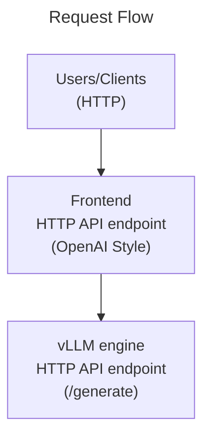

# Quickstart

This is a simple Dynamo example showing how you can quickly get started deploying Large Language Models with Dynamo.

## Components

- [Frontend](../../../components/frontend/README) - A built-in component that launches an OpenAI compliant HTTP server, a pre-processor, and a router in a single process
- [vLLM Engine](../../vllm/components/main.py) - A custom component that runs vLLM within the dynamo runtime

```text
Request Flow
==================================================

Users/Clients (HTTP)
      │
      ▼
┌─────────────┐
│  Frontend   │  HTTP API endpoint (Open-AI Style)
└─────────────┘
      │
      ▼
┌─────────────┐
│ vLLM engine │  HTTP API endpoint (/generate)
└─────────────┘
```



## Instructions

There are three steps to deploy an llm with dynamo.

### 1. Launch Engine

```bash
python3 dynamo/examples/vllm/components/main.py --model Qwen/Qwen3-0.6B
```

### 2. Launch Frontend

To interact with the deployed engine using the built-in frontend component, you have two options:

A) Interactive Command Line Interface

```bash
python -m dynamo.frontend --interactive
```

B) HTTP Server

```bash
python -m dynamo.frontend --http-port 8080
```

## Understand

### What's Happening Under the Hood

When you run the two commands above, here's what Dynamo does to connect your HTTP requests to the vLLM engine:

#### 1. Service Registration and Discovery

**DistributedRuntime Setup**: Each Dynamo component (vLLM engine, Frontend) creates a `DistributedRuntime` that maintains connections to two critical infrastructure services:

- **etcd**: A distributed key-value store used for service discovery and metadata storage
- **NATS**: A high-performance message broker for inter-component communication

**Component Registration**: When the vLLM engine starts up, it registers itself in etcd using a hierarchical naming structure:
```
/instances/{namespace}/{component}/{endpoint}:{lease_id_hex}
```

For our quickstart example, this becomes something like:
```
/instances/dynamo/VllmWorker/generate:694d967da694ea1e
```

This registration includes the component's NATS subject for communication and is tied to a lease that automatically expires if the component goes offline.

**Frontend Discovery**: When the Frontend starts, it doesn't need to know where the vLLM engine is running. Instead, it creates an etcd watcher that automatically discovers the registered vLLM worker.

#### 2. Request Flow and NATS Messaging

When you send an HTTP request to the Frontend:

1. **Request Packaging**: The Frontend wraps your HTTP request in a standardized internal format with routing metadata
2. **NATS Subject Resolution**: Using the discovered endpoints, it determines the appropriate NATS endpoint (e.g., `dynamo_vllmworker_3f6fafd3.generate-694d967da694ea1e`)
3. **Message Dispatch**: The request is sent over NATS to the target vLLM worker using the discovered NATS subject
4. **Response Streaming**: The vLLM worker streams responses back through NATS, which the Frontend converts back to HTTP

#### 3. Network-Transparent Operation

One of Dynamo's key strengths is that this entire system works seamlessly whether components are:
- Running on the same machine (like in this quickstart)
- Distributed across multiple nodes in a cluster
- Deployed in different availability zones

The same two commands work in all scenarios - Dynamo handles the networking complexity automatically.

