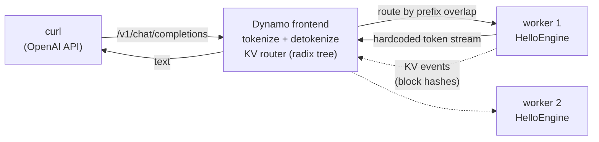

<!--
SPDX-FileCopyrightText: Copyright (c) 2025-2026 NVIDIA CORPORATION & AFFILIATES. All rights reserved.
SPDX-License-Identifier: Apache-2.0
-->

# hello-dynamo-engine

> Stage 2 of the [Hello World](../README.md) ladder — start with
> [`basic/`](../basic/README.md) if you are new to the Dynamo runtime.

A hello-world **custom engine** for NVIDIA Dynamo, built on the
[unified backend](https://github.com/ai-dynamo/dynamo/blob/main/docs/fern/pages/developer-guide/advanced-customizations/writing-custom-backends/writing-unified-backends.md)
contract (`dynamo.common.backend.LLMEngine`).

It runs **no model, needs no GPU, and downloads nothing**. Every
response streams the same hardcoded sentence, token by token. Even the
tokenizer is bundled: a ~6 KB byte-level mock tokenizer (256 tokens, one
per byte, plus an EOS token) committed under
`src/hello_engine/tokenizer/` — enough for the frontend to tokenize
requests, apply a chat template, and detokenize our reply. Pass
`--tokenizer-repo <hf-repo>` to swap in a real tokenizer.

What it demonstrates:

- **The unified backend contract** — `from_args` → `start` → `generate`
  → `cleanup`, with cancellation via `context.is_stopped()`. The
  framework owns registration, discovery, serving, and shutdown; the
  engine is ~250 lines.
- **KV-aware routing with synthetic events** — on every request the
  engine publishes the prompt's full run of 16-token blocks as
  `BlockStored` KV events. The router recomputes each block's **match
  key from the token content itself**, so identical prefixes genuinely
  match in its radix tree; the `block_hashes` we send are just node IDs
  (a plain counter). Send a prompt that shares a prefix (or an exact
  repeat) and the router scores real overlap:

  ```text
  request 1:  [ROUTING] Best: worker_…  0/11 blocks overlap   ← cold
  engine:     published 10 KV block(s) for prompt
  request 2:  [ROUTING] Best: worker_…  10/11 blocks overlap  ← exact repeat pins
  request 3:  [ROUTING] Best: worker_…  9/12 blocks overlap   ← shared prefix + new tail
  ```

## How it works



On every request the engine publishes the prompt's full run of
16-token blocks. The router recomputes each block's match key from the
token content, so its radix tree learns which worker "holds" which
prefix: a repeat prompt routes back to the same worker
(`0/11 → 10/11 blocks overlap`) — and a prompt sharing only the
beginning (same system prompt, new question) still scores partial
overlap. With no cache knowledge, requests would round-robin instead.

## Run without Docker

Same shape as `basic/`: install, then two terminals. Needs Linux and
Python 3.10+ — the `ai-dynamo` wheels are Linux-only, so on macOS use
the [Container](#container) path instead.

```bash
pip install ai-dynamo tokenizers
cd examples/custom_backend/hello_world/engine
pip install --no-deps .
```

Terminal 1 — the engine worker:

```bash
python3 -m hello_engine.main --discovery-backend file --event-plane zmq
```

Terminal 2 — the standard frontend with KV routing:

```bash
DYN_LOG=info,dynamo_llm::kv_router=debug \
  python3 -m dynamo.frontend --http-port 8000 --discovery-backend file --router-mode kv
```

Then send a request:

```bash
curl -s localhost:8000/v1/chat/completions -H 'Content-Type: application/json' \
  -d '{"model":"hello-engine","messages":[{"role":"user","content":"hi"}],"max_tokens":250}'
```

## Walkthrough: how this engine works

### The contract — four required methods, and the framework calls YOU

An engine is a class that subclasses `LLMEngine`. You never call your
own methods: `main.py` hands the class to `run()` and from that moment
the Dynamo worker (Rust) drives everything, invoking your methods by
name at the right moments. Like Flask calling your route handlers.

```python
# main.py — our ENTIRE program
from dynamo.common.backend.run import run
from .engine import HelloEngine

def main() -> None:
    run(HelloEngine)          # hand over the class; we get called from here on
```

What the framework calls, and when:

| Method | Required? | When the framework calls it | Ours does |
|---|---|---|---|
| `from_args()` | yes | first — parse CLI, return `(engine, WorkerConfig)` | flags for model name, namespace, discovery |
| `start()` | yes | once at boot — load your model, return `EngineConfig` | load bundled tokenizer, encode the hardcoded sentence |
| `generate()` | yes | once **per request** — yield token chunks | stream the sentence one token at a time |
| `cleanup()` | yes | at shutdown — must be idempotent + null-safe | drop references |
| `abort()` | no (no-op default) | on client cancel | not overridden |
| `is_quiescent()` | no (default `None`) | during shutdown — "safe to stop yet?" | not overridden |
| `kv_event_sources()` | no | once after `start()` — opt into KV routing | see below |

(Draining itself is the Worker's job, not the engine's — the engine
only answers `is_quiescent()` when asked.)

The rules that matter inside `generate()`: every chunk carries
`token_ids` and `index`; the final chunk adds `finish_reason` and
`completion_usage`; poll `context.is_stopped()` between yields and exit
with a `"cancelled"` terminal if the client went away.

```python
async def generate(self, request, context):
    for i, token_id in enumerate(reply):
        await asyncio.sleep(self.delay)
        if context.is_stopped():                       # re-check after the await
            yield {"token_ids": [], "index": 0,
                   "finish_reason": "cancelled", "completion_usage": usage(i)}
            return
        yield {"token_ids": [token_id], "index": 0}
    # always emit a terminal chunk carrying finish_reason (handles empty reply too)
    yield {"token_ids": [], "index": 0,
           "finish_reason": "stop", "completion_usage": usage(len(reply))}
```

Full contract: [unified-backends guide](https://github.com/ai-dynamo/dynamo/blob/main/docs/fern/pages/developer-guide/advanced-customizations/writing-custom-backends/writing-unified-backends.md)
and the `LLMEngine` docstrings in
[`engine.py`](https://github.com/ai-dynamo/dynamo/blob/main/components/src/dynamo/common/backend/engine.py).

### KV events, in plain English

The goal: tell the router *what this worker has cached*, so the router
sends matching prompts back to it instead of a cold worker.

**Step 1 — ask for a phone.** At boot, right after `start()`, the
framework calls `kv_event_sources()`. Returning a `PushSource` means
"build me a publisher and hand it to this callback":

```python
async def kv_event_sources(self):
    return [PushSource(on_ready=self._on_publisher_ready, dp_rank=0)]
```

**Step 2 — the phone arrives.** The framework builds a
`KvEventPublisher` (wired underneath to ZMQ or NATS — deployment's
choice, the engine never knows which) and calls us back with it:

```python
def _on_publisher_ready(self, publisher):   # `publisher` IS the phone
    self._publisher = publisher             # keep it; that's all
```

**Step 3 — call the router whenever we cache something.** From here the
direction flips: nobody calls us about events again — *we* dial out.
One line sends one event:

```python
publisher.publish_stored(
    token_ids=[...],            # the tokens — the router matches on THESE
    num_block_tokens=[16, 16],  # block sizes
    block_hashes=[7, 8],        # our node IDs (any per-worker-unique ints)
    parent_hash=None,           # what the run's first block chains under
)
```

In this engine, `generate()` calls that directly for each prompt's new
full 16-token blocks (`_publish_prompt_blocks`). Production engines
usually publish from a dedicated event thread instead so socket I/O
never touches the token-streaming path — see `sample_engine.py` for
that queue-and-thread pattern.

> **Which artifact is canonical?** The
> [unified-backends guide](https://github.com/ai-dynamo/dynamo/blob/main/docs/fern/pages/developer-guide/advanced-customizations/writing-custom-backends/writing-unified-backends.md)
> defines the contract; `sample_engine.py` (in `dynamo.common.backend`)
> is the in-tree reference implementation; this example is the
> deployable end-to-end walkthrough. When they disagree, the guide and
> the ABC docstrings win.

**Step 4 — the router listens and remembers.** The router subscribed to
our event channel when the worker registered. Each event lands in its
radix tree: "worker X holds blocks h1, h2." No polling anywhere —
publish is push, delivery is push.

**Step 5 — the payoff on the next request.** Scoring a repeat prompt,
the router finds our blocks in its tree:

```text
request 1:  [ROUTING] Best: worker_…  0/11 blocks overlap   ← cold
engine:     published 10 KV block(s) for prompt
request 2:  [ROUTING] Best: worker_…  10/11 blocks overlap  ← pinned to us
request 3:  [ROUTING] Best: worker_…  9/12 blocks overlap   ← shared prefix + new tail
```

The part that surprises most newcomers: **matching keys on the tokens,
not on our hashes.** The router recomputes each block's match key from
the `token_ids` in the event, so identical prefixes match no matter
what IDs the engine picked — `block_hashes` are only node identities
(for parent links and `publish_removed`), which is why a plain counter
is enough. We republish the full run on every request; re-stores are
idempotent in the router's tree. A real engine tracks its cache and
publishes deltas, plus `publish_removed` when blocks are evicted.

Not implemented here (deliberately): the sibling **KV metrics** channel
(`ComponentSnapshot` gauges — "how full is my cache"). See
`component_metrics_dp_ranks()` / `attach_snapshot_publisher()` in
[`sample_engine.py`](https://github.com/ai-dynamo/dynamo/blob/main/components/src/dynamo/common/backend/sample_engine.py)
for that pattern.

## Container

```bash
docker build -t hello-dynamo-engine:0.1.0 .
```

The image layers this package onto the published
`nvcr.io/nvidia/ai-dynamo/dynamo-frontend` base (which carries the full
`ai-dynamo` package including the unified backend — no source build of a
base image needed). The base manages its venv with `uv`, not pip.

### Test with plain Docker (no Kubernetes)

Two containers on a bridge network; a shared `/tmp` volume carries the
file-based discovery store. No network access needed — the tokenizer is
in the image.

```bash
docker network create hello-net; docker volume create hello-store

docker run -d --name hello-worker --network hello-net -v hello-store:/tmp \
  -e DYN_LOG=info \
  --entrypoint python3 hello-dynamo-engine:0.1.0 \
  -m hello_engine.main --discovery-backend file --event-plane zmq

docker run -d --name hello-frontend --network hello-net -v hello-store:/tmp \
  -e DYN_LOG=info,dynamo_llm::kv_router=debug -p 8899:8000 \
  --entrypoint python3 hello-dynamo-engine:0.1.0 \
  -m dynamo.frontend --http-port 8000 --discovery-backend file --router-mode kv

# wait ~10s for registration (watch: docker logs -f hello-worker), then:
curl -s localhost:8899/v1/chat/completions -H 'Content-Type: application/json' \
  -d '{"model":"hello-engine","messages":[{"role":"user","content":"hi"}],"max_tokens":250}'

# cleanup
docker rm -f hello-frontend hello-worker
```

### Deploy as a DynamoGraphDeployment

Assumes a cluster with the Dynamo operator installed (CRDs +
`dynamo-platform`). The manifest uses the **v1beta1 `components[]`
schema**. Everything is CPU-only — no GPU nodes required.

```bash
# 1. push the image somewhere your cluster can pull from
docker tag hello-dynamo-engine:0.1.0 <registry>/hello-dynamo-engine:0.1.0
docker push <registry>/hello-dynamo-engine:0.1.0
#    ...and set that image on both components in deploy/dgd.yaml

# 2. deploy (1 frontend + 2 workers, so KV routing has a choice to make)
kubectl apply -f deploy/dgd.yaml -n <namespace>
kubectl get pods -n <namespace> -l nvidia.com/dynamo-graph-deployment-name=hello-engine -w
# workers go Ready in ~30-60s (readiness probe cadence; nothing downloads)

# 3. smoke test through the frontend service
kubectl port-forward svc/hello-engine-frontend 8898:8000 -n <namespace> &
curl -s localhost:8898/v1/models
curl -s localhost:8898/v1/chat/completions -H 'Content-Type: application/json' \
  -d '{"model":"hello-engine","messages":[{"role":"user","content":"hi"}],"max_tokens":250}'
```

> [!TIP]
> **Testing locally on a [kind](https://kind.sigs.k8s.io/) cluster?**
> Skip the registry: load your local image straight into the node with
> `kind load docker-image hello-dynamo-engine:0.1.0 --name <cluster>`,
> keep `image: hello-dynamo-engine:0.1.0` in `deploy/dgd.yaml`, and make
> sure `imagePullPolicy: IfNotPresent` so Kubernetes uses the loaded copy.

### Verify KV-aware routing (the actual demo)

Requires the port-forward from step 3 to still be running (they die
with the terminal or on pod restarts — re-run it if the curls hang):

```bash
kubectl port-forward svc/hello-engine-frontend 8898:8000 -n <namespace> &
```

Send the same multi-block prompt several times, then compare the two
workers' logs:

```bash
LONG="Explain in detail the architecture of a datacenter scale inference \
system including routing caching memory tiering disaggregation and \
autoscaling so this prompt spans several KV blocks"

for i in 1 2 3; do
  curl -s localhost:8898/v1/chat/completions -H 'Content-Type: application/json' \
    -d "{\"model\":\"hello-engine\",\"messages\":[{\"role\":\"user\",\"content\":\"$LONG\"}],\"max_tokens\":8}"
  echo; sleep 2
done

for p in $(kubectl get pods -n <namespace> -o name | grep hello-engine-worker); do
  echo "$p: $(kubectl logs -n <namespace> $p | grep -c 'request received') requests, \
$(kubectl logs -n <namespace> $p | grep -c 'published') KV publishes"
done
```

Expected: **all requests on one worker, zero on the other** — the router
learned which worker holds the prefix from the engine's KV events and
pinned every repeat prompt to it. One `published` line despite several
requests is the engine's dedup (identical blocks are published once).
To see the router's scoring itself, add `DYN_LOG=debug` on the frontend
component and grep its logs for `blocks overlap` (`0/N` on the first
request, near-full overlap on repeats).

### Cleanup

```bash
kubectl delete dgd hello-engine -n <namespace>
```

## The bundled mock tokenizer

`src/hello_engine/tokenizer/` contains a hand-made ~6 KB tokenizer
instead of a real model's:

- **What**: byte-level — 256 tokens, one per byte, plus one EOS token.
  Implemented as BPE with an empty merges list, so nothing ever combines.
  Any text tokenizes, distinct texts stay distinct, decode is byte-exact.
- **Why**: the frontend needs *a* tokenizer to turn requests into token
  IDs (and our IDs back into text), and Dynamo's model registration
  otherwise downloads the entire repo you name — 1.2 GB per worker start
  for a fake engine that loads no weights. Bundling a trivial tokenizer
  makes the example fully offline and boot in seconds.
- **Trade-off**: 1 token = 1 byte, so token counts read like byte
  counts — ASCII is 1 token/char, non-ASCII is several (`max_tokens: 250`
  ≈ the full ASCII reply).
- **Swap it**: `--tokenizer-repo Qwen/Qwen3-0.6B` (or any HF repo) uses a
  real tokenizer instead.

The two sidecar files are the minimum paperwork Dynamo's model card
requires: `tokenizer_config.json` carries the chat template that renders
`messages` into a prompt; `config.json` provides `model_type` /
`eos_token_id` / context-length fields.

## Layout

```text
src/hello_engine/engine.py    the LLMEngine subclass (all the logic)
src/hello_engine/main.py      entry point: hand HelloEngine to run()
src/hello_engine/tokenizer/   bundled byte-level mock tokenizer (~6 KB)
Dockerfile                    engine layered on the Dynamo base image
deploy/dgd.yaml               DynamoGraphDeployment (frontend + workers)
```

## What to change when you copy this

| Where | Change |
|---|---|
| `pyproject.toml` | package `name` and the `[tool.hatch.build.targets.wheel]` packages path |
| `Dockerfile` | base image tag — pin to the Dynamo release you build against |
| `from_args()` | the `--component`, `--endpoint`, and `--served-model-name` defaults |
| `model_name=` | point at your real model/tokenizer repo — leave it and the frontend tokenizes with the mock vocab |
| `LlmRegistration` | real values for your engine — **`kv_cache_block_size` must match your engine's actual block size, or the router silently drops your KV events on the first mismatched block** |
| `generate()` | replace the hardcoded stream with your inference; keep the chunk contract (`token_ids`/`index`, terminal `finish_reason` + `completion_usage`, `is_stopped()` checks) |
| `deploy/dgd.yaml` | both `image:` references and `metadata.name` |
