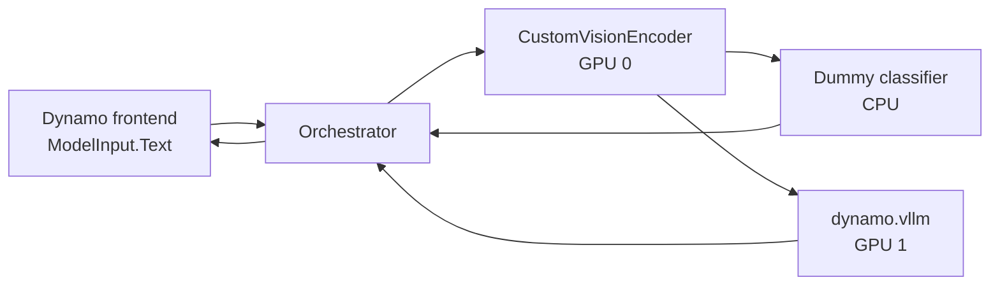

<!--
SPDX-FileCopyrightText: Copyright (c) 2025-2026 NVIDIA CORPORATION & AFFILIATES. All rights reserved.
SPDX-License-Identifier: Apache-2.0
-->

# Custom Vision DAG

This experimental example composes three custom Python workers with the standard
`dynamo.vllm` worker. The frontend exposes only `multimodal-dag` and forwards the
original OpenAI chat request as `ModelInput.Text`; image loading and tokenization
happen in the custom encoder.



The orchestrator first calls the encoder. After it receives the projected Qwen
image rows, it starts the classifier and vLLM requests concurrently. A failure in
either branch cancels its sibling, so the client never receives a partial result.

## Prerequisites

- A source build of current Dynamo with the vLLM extra installed
- vLLM 0.25.1
- Two CUDA GPUs with enough memory for
  `Qwen/Qwen2.5-VL-3B-Instruct`
- Model access through the Hugging Face cache or network

The encoder and decoder GPU indices default to 0 and 1. Override them with
`DYN_ENCODER_GPU` and `DYN_VLLM_GPU`.

## Run the example

From this directory:

```bash
./launch.sh
```

The launcher uses file discovery, the TCP request plane, and the ZMQ event plane.
It writes component logs to a temporary directory printed at startup and waits
until `multimodal-dag` appears in `/v1/models`. The vLLM worker uses the
`internal` endpoint type, which registers its model card without publishing an
OpenAI surface.

In another terminal, run:

```bash
python -m examples.custom_backend.multimodal_dag.client
```

The client creates a small PNG data URI, submits one non-streaming text-plus-image
request, and checks both the generated text and classifier envelope.

## Request contract

The public endpoint supports `stream: false`, `n: 1`, text content, and exactly one
`image_url`. It forwards `max_tokens` or `max_completion_tokens`, `temperature`,
`top_p`, `stop`, and `seed`. It rejects tools, log probabilities, video, multiple
images, streaming, and other non-null unsupported fields.

The encoder renders the canonical unexpanded Qwen vision placeholder and returns a
JSON-safe artifact:

```json
{
  "format": "qwen2_vl_projected_grid.v1",
  "model": "Qwen/Qwen2.5-VL-3B-Instruct",
  "prompt_token_ids": [151652, 151655, 151653],
  "image_embeds": "<base64 safetensors payload>",
  "image_grid_thw": [[1, 32, 32]]
}
```

The safetensors payload contains one contiguous CPU BF16 tensor named
`image_embeds`, shaped `[visual_tokens, decoder_hidden_size]`. The private vLLM
adapter validates and converts it to vLLM's native `TokensPrompt` external
multimodal form. The decoded artifact limit is 32 MiB; the launcher raises the
Dynamo TCP message limit to 200 MiB for base64 and request-envelope overhead.

The non-streaming HTTP result is a normal OpenAI `ChatCompletion` with the dummy
classifier attached:

```json
{
  "choices": [
    {
      "message": {
        "role": "assistant",
        "content": "The image has a red region and a blue region."
      },
      "finish_reason": "stop"
    }
  ],
  "usage": {},
  "nvext": {
    "classifier": {
      "label": "class_0",
      "score": 0.73,
      "embedding_shape": [256, 2048]
    }
  }
}
```

## Limitations

This is a correctness PoC, not a production transport. It supports one request at a
time per vLLM worker, one image, one host, and non-streaming responses. Base64
safetensors duplicates the projected tensor in memory. Batching, NIXL or shared
memory, multi-node operation, disaggregated prefill/decode, tools, videos, and
multiple images are out of scope. Prefix caching, chunked prefill, tensor
parallelism, pipeline parallelism, data parallelism, and CUDA graphs are disabled
for the validated adapter path.
