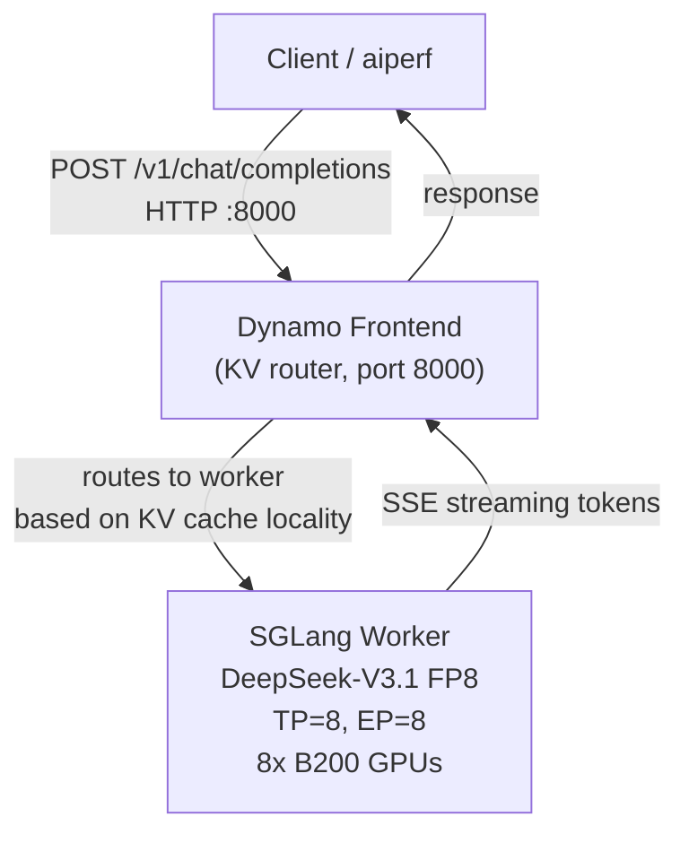
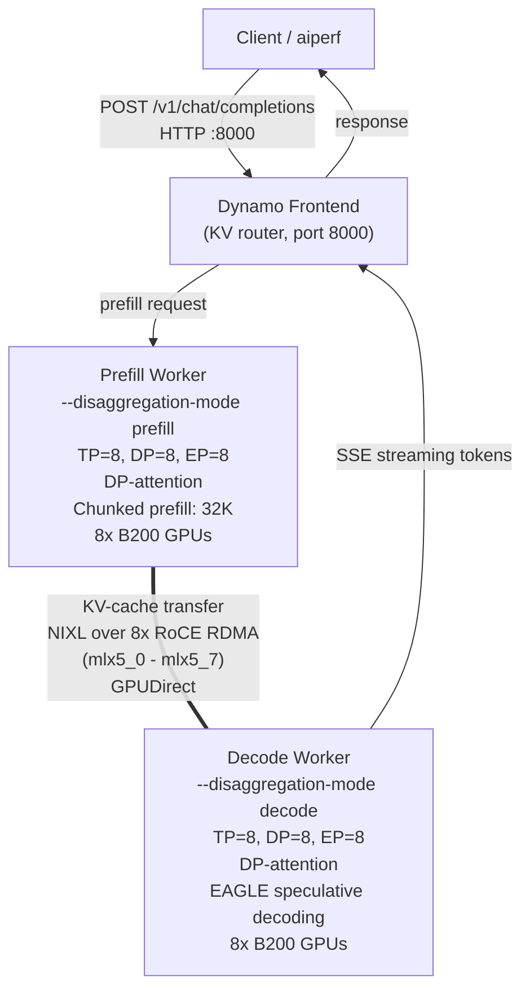

# Dynamo + SGLang DeepSeek-V3.1 on GKE B200

Aggregated and disaggregated DeepSeek-V3.1 (FP8 and [NVFP4](https://huggingface.co/nvidia/DeepSeek-V3.1-NVFP4)) on B200 GPUs. Includes both **Dynamo-native** (direct Frontend) and **GAIE** (GKE Inference Gateway + EPP) deployment variants.

| Variant | Dynamo Platform | SGLang Runtime |
|---|---|---|
| FP8 (Dynamo-native) | 0.9.1 | `sglang-runtime:0.9.1` |
| NVFP4 (GAIE) | 1.0.0 | `sglang-runtime:1.0.0` |

**Stack**: GKE with RDMA/RoCE · NIXL KV Transfer

---

## Architecture

### Aggregated (single-node, 8 GPUs)

Prefill and decode run on the same 8-GPU worker. A standalone Frontend service routes requests using KV-cache-aware routing.



### Disaggregated 1P1D (two nodes, 16 GPUs)

Prefill and decode are separated onto different GPU pools. KV cache transfers between them over NIXL/RoCE RDMA.



---

## Files

### FP8 — Dynamo-native (no Gateway)

| File | Resource | Purpose |
|---|---|---|
| `dsv31-fp8/dgd-agg.yaml` | DynamoGraphDeployment | Aggregated: Frontend (KV router) + Worker (TP=8, EP=8, 8 GPUs) |
| `dsv31-fp8/dgd-disagg-1p1d.yaml` | DynamoGraphDeployment | Disaggregated 1P1D: Frontend + Prefill + Decode, NIXL/RoCE, EAGLE spec decode |

### NVFP4 — GAIE (GKE Inference Gateway + EPP)

| File | Purpose |
|---|---|
| [`dsv31-nvfp4-gaie/`](dsv31-nvfp4-gaie/README.md) | **Full GAIE deployment package** — [own README](dsv31-nvfp4-gaie/README.md) |
| `dsv31-nvfp4-gaie/dgd-agg-gaie.yaml` | Aggregated DGD with EPP |
| `dsv31-nvfp4-gaie/dgd-agg-native.yaml` | Aggregated DGD native (no Gateway) |
| `dsv31-nvfp4-gaie/dgd-disagg-gaie-nvfp4.yaml` | Disaggregated 1P1D DGD with EPP |
| `dsv31-nvfp4-gaie/httproute.yaml` | HTTPRoute (agg/disagg pool routing) |
| `dsv31-nvfp4-gaie/health-check-policy.yaml` | HealthCheckPolicy for both pools |
| `dsv31-nvfp4-gaie/backend-policy.yaml` | GCPBackendPolicy (600s timeout) |
| `dsv31-nvfp4-gaie/benchmark-aiperf.sh` | Parameterized aiperf benchmark script |

---

## Prerequisites

### 1. GKE Cluster

- Nodes with **NVIDIA B200** GPUs (`nvidia.com/gpu.product: NVIDIA-B200`)
- **RDMA multi-networking** configured: 8x RoCE NICs per node (`networking.gke.io.networks/rdma-0` through `rdma-7`)
- Node pool with sufficient capacity: 1 node for aggregated, 2 nodes for 1P1D disagg

### 2. Dynamo Platform (Operator, Grove, KAI Scheduler)

Install the Dynamo platform via Helm. Grove provides gang scheduling for disagg topologies; KAI scheduler handles RDMA resource awareness.

```bash
kubectl create namespace dynamo-system --dry-run=client -o yaml | kubectl apply -f -

# For FP8 deployments (dsv31-fp8/):
helm upgrade --install dynamo-platform \
  oci://helm.ngc.nvidia.com/nvidia/ai-dynamo/charts/dynamo-platform \
  --version 0.9.1 \
  -n dynamo-system \
  --set global.kai-scheduler.enabled=true \
  --set global.grove.enabled=true

# For NVFP4 GAIE deployments (dsv31-nvfp4-gaie/):
helm upgrade --install dynamo-platform \
  oci://helm.ngc.nvidia.com/nvidia/ai-dynamo/charts/dynamo-platform \
  --version 1.0.0 \
  -n dynamo-system \
  --set global.kai-scheduler.enabled=true \
  --set global.grove.enabled=true
```

Verify the operator is running:

```bash
kubectl get pods -n dynamo-system | grep dynamo-operator
```

> **Note**: If Grove/KAI causes scheduling issues, use `--set global.grove.enabled=false` and the default Kubernetes scheduler.

### 3. Model Storage (PVC + HF Token)

```bash
kubectl create secret generic hf-token-secret \
  --from-literal=HF_TOKEN=<your-token> \
  -n dynamo-system --dry-run=client -o yaml | kubectl apply -f -
```

The PVC `deepseek-v31-model-rwx` (ReadWriteMany) must exist in `dynamo-system` with the DeepSeek-V3.1 model pre-downloaded. The worker will download the model on first boot if it's not already cached, but this adds ~15 min to startup.

---

## Aggregated Deployment

### Deploy

```bash
kubectl apply -f dsv31-fp8/dgd-agg.yaml -n dynamo-system
```

### Verify

```bash
# Watch pods (model loading + DeepGEMM warmup takes ~10 min)
kubectl get pods -n dynamo-system -w

# Expected: 1 Frontend pod + 1 Worker pod (both Running/Ready)
kubectl get pods -n dynamo-system -l nvidia.com/dynamo-graph-deployment-name=sglang-dsv31-aggregated

# Check DGD status
kubectl get dynamographdeployment sglang-dsv31-aggregated -n dynamo-system
```

### Test

```bash
# Find the Frontend service
kubectl get svc -n dynamo-system | grep aggregated-frontend

# Send a test request
kubectl run curl-test --rm -it --restart=Never --image=curlimages/curl -- \
  curl -s http://sglang-dsv31-aggregated-frontend.dynamo-system.svc.cluster.local:8000/v1/chat/completions \
  -H "Content-Type: application/json" \
  -d '{"model":"deepseek-ai/DeepSeek-V3.1","messages":[{"role":"user","content":"Hello"}],"max_tokens":50}'
```

### Tear Down

```bash
kubectl delete dynamographdeployment sglang-dsv31-aggregated -n dynamo-system
```

---

## Disaggregated 1P1D Deployment

### Deploy

```bash
kubectl apply -f dsv31-fp8/dgd-disagg-1p1d.yaml -n dynamo-system
```

### Verify

```bash
# Watch all pods (~10 min for model loading per worker)
kubectl get pods -n dynamo-system -w

# Expected: 1 Frontend + 1 Prefill worker + 1 Decode worker (all Running/Ready)
kubectl get pods -n dynamo-system -l nvidia.com/dynamo-graph-deployment-name=sglang-disagg-1p1d-roce

# Verify NIXL bootstrap (prefill readiness uses TCP port 30001)
kubectl logs -f deployment/sglang-disagg-1p1d-roce-prefill -n dynamo-system | grep -i "nixl\|bootstrap\|disagg"
```

### Test

```bash
kubectl run curl-test --rm -it --restart=Never --image=curlimages/curl -- \
  curl -s http://sglang-disagg-1p1d-roce-frontend.dynamo-system.svc.cluster.local:8000/v1/chat/completions \
  -H "Content-Type: application/json" \
  -d '{"model":"deepseek-ai/DeepSeek-V3.1","messages":[{"role":"user","content":"Hello"}],"max_tokens":50}'
```

### Tear Down

```bash
kubectl delete dynamographdeployment sglang-disagg-1p1d-roce -n dynamo-system
```

---

## DeepSeek-V3.1-NVFP4 Deployment (FP4 Quantized)

NVIDIA provides a pre-quantized FP4 checkpoint of DeepSeek-V3.1 at [nvidia/DeepSeek-V3.1-NVFP4](https://huggingface.co/nvidia/DeepSeek-V3.1-NVFP4). This reduces the per-parameter precision from 8 bits to 4 bits, cutting disk size and GPU memory requirements by ~1.6x while maintaining competitive accuracy.

All NVFP4 configs (native + GAIE) live under [`dsv31-nvfp4-gaie/`](dsv31-nvfp4-gaie/README.md). See its [README](dsv31-nvfp4-gaie/README.md) for full deployment steps, Gateway setup, and benchmarking.

Key differences from the FP8 configs:
- Model path: `nvidia/DeepSeek-V3.1-NVFP4` (instead of `deepseek-ai/DeepSeek-V3.1`)
- Quantization flags: `--quantization modelopt_fp4`, `--moe-runner-backend flashinfer_trtllm`, `--attention-backend trtllm_mla`
- Environment variable: `SGLANG_MOE_NVFP4_DISPATCH=1`

> **Note**: NVFP4 requires **Blackwell GPUs** (B200) and a TensorRT-LLM-compatible runtime. The same PVC (`deepseek-v31-model-rwx`) is used; the runtime will download the NVFP4 checkpoint on first boot if not already cached.


---

## Key NCCL / RoCE Environment Variables

These are set in the disagg DGD and tuned for GKE B200 nodes with RoCE networking.

| Variable | Value | Purpose |
|---|---|---|
| `NCCL_NET` | `IB` | Use IB verbs transport (covers RoCE v2) |
| `NCCL_IB_HCA` | `mlx5_0,...,mlx5_7` | Pin to 8x ConnectX NICs |
| `NCCL_IB_GID_INDEX` | `3` | RoCE v2 GID for IPv4 addressing |
| `NCCL_IB_TC` | `41` | DSCP traffic class for RoCE PFC |
| `NCCL_IB_TIMEOUT` | `22` | IB completion timeout (increase if seeing vendor errors) |
| `NCCL_IB_RETRY_CNT` | `7` | IB retry count on completion errors |
| `NCCL_MNNVL_ENABLE` | `1` | Enable multi-node NVLink (Blackwell) |
| `NCCL_NVLS_ENABLE` | `0` | Disable NVLink SHARP (not available cross-node on GKE) |
| `NCCL_CUMEM_ENABLE` | `0` | Disable CUDA managed memory for NCCL (RoCE path) |
| `NCCL_SOCKET_IFNAME` | `eth0` | Control plane traffic on default interface |
| `GLOO_SOCKET_IFNAME` | `eth0` | Gloo (PyTorch distributed) on default interface |

---

## Images

| Component | Image | Dynamo Platform |
|---|---|---|
| Frontend + Worker (FP8) | `nvcr.io/nvidia/ai-dynamo/sglang-runtime:0.9.1` | 0.9.1 |
| Frontend + Worker (NVFP4) | `nvcr.io/nvidia/ai-dynamo/sglang-runtime:1.0.0` | 1.0.0 |
| Model (FP8) | `deepseek-ai/DeepSeek-V3.1` (from HuggingFace) | — |
| Model (NVFP4) | `nvidia/DeepSeek-V3.1-NVFP4` ([from HuggingFace](https://huggingface.co/nvidia/DeepSeek-V3.1-NVFP4)) | — |

---

## References

- [Dynamo](https://github.com/ai-dynamo/dynamo)
- [NVFP4 + GAIE Deployment Guide](dsv31-nvfp4-gaie/README.md)
- [GPU Recipes - Dynamo Disaggregated Serving](https://github.com/AI-Hypercomputer/gpu-recipes/blob/main/inference/a4x/disaggregated-serving/dynamo/README.md)
- [nvidia/DeepSeek-V3.1-NVFP4 on HuggingFace](https://huggingface.co/nvidia/DeepSeek-V3.1-NVFP4)

