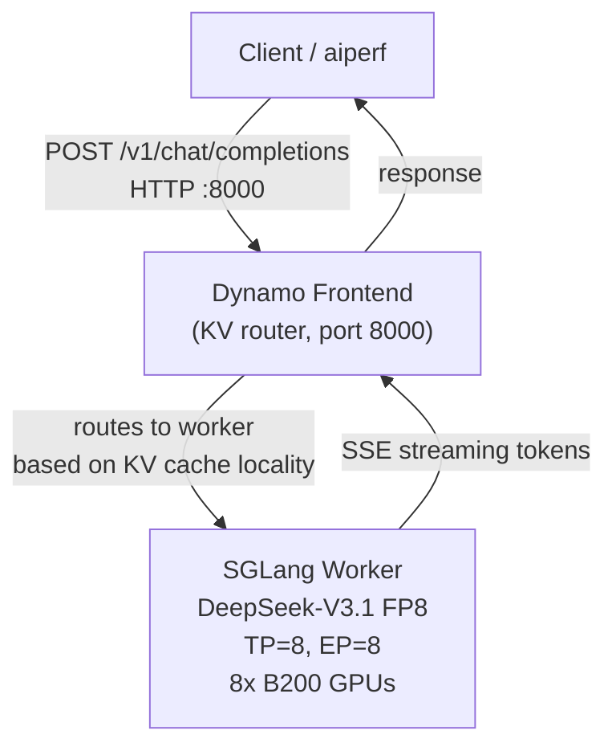
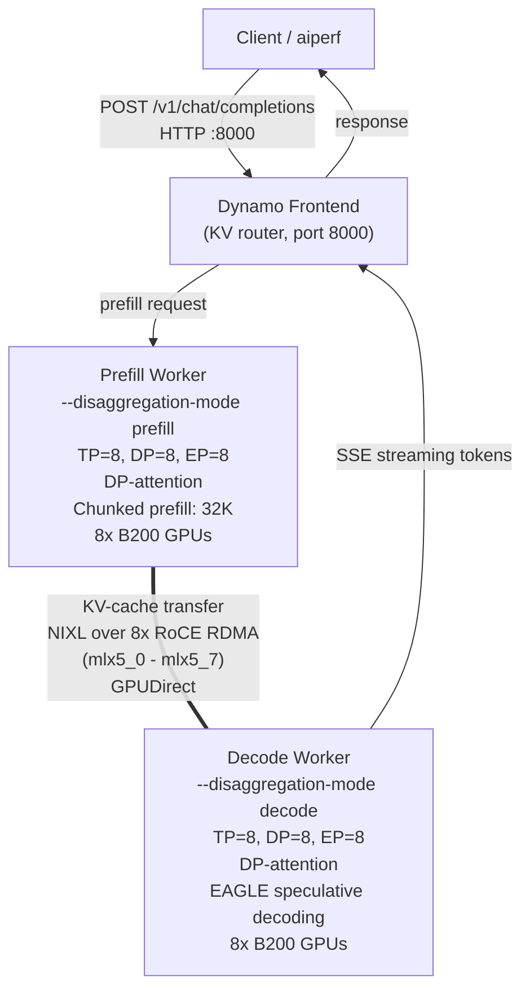

# Dynamo + SGLang DeepSeek-V3.1 on GKE B200

Aggregated and disaggregated DeepSeek-V3.1 (FP8 and [NVFP4](https://huggingface.co/nvidia/DeepSeek-V3.1-NVFP4)) on B200 GPUs, using **Dynamo-native KV routing** (no Inference Gateway).

**Stack**: Dynamo Operator 1.0.0 · SGLang Runtime 0.9.1 · GKE with RDMA/RoCE · NIXL KV Transfer

---

## Architecture

### Aggregated (single-node, 8 GPUs)

Prefill and decode run on the same 8-GPU worker. A standalone Frontend service routes requests using KV-cache-aware routing.



### Disaggregated 1P1D (two nodes, 16 GPUs)

Prefill and decode are separated onto different GPU pools. KV cache transfers between them over NIXL/RoCE RDMA.



---

## Files

| File | Resource | Purpose |
|---|---|---|
| `dgd-agg.yaml` | DynamoGraphDeployment | Aggregated: Frontend (KV router) + Worker (TP=8, EP=8, 8 GPUs) — FP8 |
| `dgd-disagg-1p1d.yaml` | DynamoGraphDeployment | Disaggregated 1P1D: Frontend + Prefill + Decode, NIXL/RoCE, EAGLE spec decode — FP8 |
| `nvfp4/sglang-dsv31-aggregated-nvfp4.yaml` | DynamoGraphDeployment | Aggregated with [DeepSeek-V3.1-NVFP4](https://huggingface.co/nvidia/DeepSeek-V3.1-NVFP4) (FP4 quantized) |
| `nvfp4/sglang-disagg-dsv31-nvfp4-1p1d-roce.yaml` | DynamoGraphDeployment | Disaggregated 1P1D with DeepSeek-V3.1-NVFP4 (FP4), NIXL/RoCE, EAGLE spec decode |
| `perf-pod.yaml` | Pod | Long-lived pod with aiperf for benchmarking |
| `roce-test/nccl-test-2node.yaml` | MPIJob | *(Optional)* 2-node NCCL all_reduce test to validate RDMA/RoCE |
| `roce-test/install-mpi-operator.sh` | Script | *(Optional)* Installs Kubeflow training-operator for MPIJob support |

---

## Prerequisites

### 1. GKE Cluster

- Nodes with **NVIDIA B200** GPUs (`nvidia.com/gpu.product: NVIDIA-B200`)
- **RDMA multi-networking** configured: 8x RoCE NICs per node (`networking.gke.io.networks/rdma-0` through `rdma-7`)
- Node pool with sufficient capacity: 1 node for aggregated, 2 nodes for 1P1D disagg

### 2. Dynamo Platform (Operator, Grove, KAI Scheduler)

Install the Dynamo platform via Helm. Grove provides gang scheduling for disagg topologies; KAI scheduler handles RDMA resource awareness.

```bash
kubectl create namespace dynamo-system --dry-run=client -o yaml | kubectl apply -f -

helm upgrade --install dynamo-platform \
  oci://helm.ngc.nvidia.com/nvidia/ai-dynamo/charts/dynamo-platform \
  --version 1.0.0 \
  -n dynamo-system \
  --set global.kai-scheduler.enabled=true \
  --set global.grove.enabled=true
```

Verify the operator is running:

```bash
kubectl get pods -n dynamo-system | grep dynamo-operator
```

> **Note**: If Grove/KAI causes scheduling issues (see [NOTES-multinode-kai-scheduler.md](../NOTES-multinode-kai-scheduler.md)), use `--set global.grove.enabled=false` and the default Kubernetes scheduler.

### 3. Model Storage (PVC + HF Token)

```bash
kubectl create secret generic hf-token-secret \
  --from-literal=HF_TOKEN=<your-token> \
  -n dynamo-system --dry-run=client -o yaml | kubectl apply -f -
```

The PVC `deepseek-v31-model-rwx` (ReadWriteMany) must exist in `dynamo-system` with the DeepSeek-V3.1 model pre-downloaded. The worker will download the model on first boot if it's not already cached, but this adds ~15 min to startup.

---

## Aggregated Deployment

### Deploy

```bash
kubectl apply -f dgd-agg.yaml -n dynamo-system
```

### Verify

```bash
# Watch pods (model loading + DeepGEMM warmup takes ~10 min)
kubectl get pods -n dynamo-system -w

# Expected: 1 Frontend pod + 1 Worker pod (both Running/Ready)
kubectl get pods -n dynamo-system -l nvidia.com/dynamo-graph-deployment-name=sglang-dsv31-aggregated

# Check DGD status
kubectl get dynamographdeployment sglang-dsv31-aggregated -n dynamo-system
```

### Test

```bash
# Find the Frontend service
kubectl get svc -n dynamo-system | grep aggregated-frontend

# Send a test request
kubectl run curl-test --rm -it --restart=Never --image=curlimages/curl -- \
  curl -s http://sglang-dsv31-aggregated-frontend.dynamo-system.svc.cluster.local:8000/v1/chat/completions \
  -H "Content-Type: application/json" \
  -d '{"model":"deepseek-ai/DeepSeek-V3.1","messages":[{"role":"user","content":"Hello"}],"max_tokens":50}'
```

### Tear Down

```bash
kubectl delete dynamographdeployment sglang-dsv31-aggregated -n dynamo-system
```

---

## Disaggregated 1P1D Deployment

### Deploy

```bash
kubectl apply -f dgd-disagg-1p1d.yaml -n dynamo-system
```

### Verify

```bash
# Watch all pods (~10 min for model loading per worker)
kubectl get pods -n dynamo-system -w

# Expected: 1 Frontend + 1 Prefill worker + 1 Decode worker (all Running/Ready)
kubectl get pods -n dynamo-system -l nvidia.com/dynamo-graph-deployment-name=sglang-disagg-1p1d-roce

# Verify NIXL bootstrap (prefill readiness uses TCP port 30001)
kubectl logs -f deployment/sglang-disagg-1p1d-roce-prefill -n dynamo-system | grep -i "nixl\|bootstrap\|disagg"
```

### Test

```bash
kubectl run curl-test --rm -it --restart=Never --image=curlimages/curl -- \
  curl -s http://sglang-disagg-1p1d-roce-frontend.dynamo-system.svc.cluster.local:8000/v1/chat/completions \
  -H "Content-Type: application/json" \
  -d '{"model":"deepseek-ai/DeepSeek-V3.1","messages":[{"role":"user","content":"Hello"}],"max_tokens":50}'
```

### Tear Down

```bash
kubectl delete dynamographdeployment sglang-disagg-1p1d-roce -n dynamo-system
```

---

## DeepSeek-V3.1-NVFP4 Deployment (FP4 Quantized)

NVIDIA provides a pre-quantized FP4 checkpoint of DeepSeek-V3.1 at [nvidia/DeepSeek-V3.1-NVFP4](https://huggingface.co/nvidia/DeepSeek-V3.1-NVFP4). This reduces the per-parameter precision from 8 bits to 4 bits, cutting disk size and GPU memory requirements by ~1.6x while maintaining competitive accuracy. The configs for this variant live under the `nvfp4/` folder.

Key differences from the FP8 configs:
- Model path: `nvidia/DeepSeek-V3.1-NVFP4` (instead of `deepseek-ai/DeepSeek-V3.1`)
- Quantization flags: `--quantization modelopt_fp4`, `--moe-runner-backend flashinfer_trtllm`, `--attention-backend trtllm_mla`
- Environment variable: `SGLANG_MOE_NVFP4_DISPATCH=1`

> **Note**: NVFP4 requires **Blackwell GPUs** (B200) and a TensorRT-LLM-compatible runtime. The same PVC (`deepseek-v31-model-rwx`) is used; the runtime will download the NVFP4 checkpoint on first boot if not already cached.

### Aggregated (NVFP4)

```bash
kubectl apply -f nvfp4/sglang-dsv31-aggregated-nvfp4.yaml -n dynamo-system

# Watch pods
kubectl get pods -n dynamo-system -l nvidia.com/dynamo-graph-deployment-name=sglang-dsv31-aggregated-nvfp4 -w

# Test
kubectl run curl-test --rm -it --restart=Never --image=curlimages/curl -- \
  curl -s http://sglang-dsv31-aggregated-nvfp4-frontend.dynamo-system.svc.cluster.local:8000/v1/chat/completions \
  -H "Content-Type: application/json" \
  -d '{"model":"nvidia/DeepSeek-V3.1-NVFP4","messages":[{"role":"user","content":"Hello"}],"max_tokens":50}'

# Tear down
kubectl delete dynamographdeployment sglang-dsv31-aggregated-nvfp4 -n dynamo-system
```

### Disaggregated 1P1D (NVFP4)

```bash
kubectl apply -f nvfp4/sglang-disagg-dsv31-nvfp4-1p1d-roce.yaml -n dynamo-system

# Watch pods
kubectl get pods -n dynamo-system -l nvidia.com/dynamo-graph-deployment-name=sglang-disagg-dsv31-nvfp4-1p1d-roce -w

# Test
kubectl run curl-test --rm -it --restart=Never --image=curlimages/curl -- \
  curl -s http://sglang-disagg-dsv31-nvfp4-1p1d-roce-frontend.dynamo-system.svc.cluster.local:8000/v1/chat/completions \
  -H "Content-Type: application/json" \
  -d '{"model":"nvidia/DeepSeek-V3.1-NVFP4","messages":[{"role":"user","content":"Hello"}],"max_tokens":50}'

# Tear down
kubectl delete dynamographdeployment sglang-disagg-dsv31-nvfp4-1p1d-roce -n dynamo-system
```

---

## Benchmarking with aiperf

### Deploy the Perf Pod

```bash
kubectl apply -f perf-pod.yaml -n dynamo-system

# Wait for it to be ready (installs aiperf on startup)
kubectl wait --for=condition=Ready pod/perf-agg-disagg-fp8 -n dynamo-system --timeout=300s
kubectl exec -it perf-agg-disagg-fp8 -n dynamo-system -- bash
```

### Run aiperf at C=10

Inside the perf pod, the following env vars are pre-set: `ENDPOINT_AGG`, `ENDPOINT_DISAGG`, `TARGET_MODEL`, `TOKENIZER_PATH`, `ISL=1000`, `OSL=250`.

**Aggregated:**

```bash
aiperf profile \
  --url "http://$ENDPOINT_AGG" \
  --artifact-dir "$ROOT_ARTIFACT_DIR/perf-agg-fp8/concurrency_10" \
  --model "$TARGET_MODEL" \
  --tokenizer "$TOKENIZER_PATH" \
  --endpoint-type chat \
  --endpoint /v1/chat/completions \
  --streaming \
  --synthetic-input-tokens-mean $ISL --synthetic-input-tokens-stddev 0 \
  --output-tokens-mean $OSL --output-tokens-stddev 0 \
  --extra-inputs "max_tokens:$OSL" \
  --extra-inputs "min_tokens:$OSL" \
  --extra-inputs "ignore_eos:true" \
  --extra-inputs "repetition_penalty:1.0" \
  --extra-inputs "temperature:0.0" \
  --concurrency 10 \
  --request-count 100 \
  --warmup-request-count 10 \
  --num-dataset-entries 12800 \
  --random-seed 100 \
  --workers-max 10 \
  --record-processors 32 \
  --request-timeout-seconds 21600 \
  --no-server-metrics \
  --ui simple
```

**Disaggregated:**

```bash
aiperf profile \
  --url "http://$ENDPOINT_DISAGG" \
  --artifact-dir "$ROOT_ARTIFACT_DIR/perf-disagg-fp8-roce/concurrency_10" \
  ... # same flags as above
```

### Changing Concurrency

To run at higher concurrency, change `--concurrency` and scale `--request-count` and `--warmup-request-count` proportionally:

| Concurrency | `--concurrency` | `--request-count` | `--warmup-request-count` | `--workers-max` |
|---|---|---|---|---|
| C=10 | 10 | 100 | 10 | 10 |
| C=50 | 50 | 500 | 50 | 50 |
| C=100 | 100 | 1000 | 100 | 100 |

Update the `--artifact-dir` to reflect the concurrency level (e.g., `concurrency_50`).

### Baseline Results (C=10, ISL=1000, OSL=250, SGLang 0.9.1 FP8)

| Mode | GPUs | TTFT (ms) | ITL (ms) | TPS/user | TPS total | TPS/GPU |
|---|---|---|---|---|---|---|
| Aggregated | 8 | 306 | 12.0 | 67.9 | 765 | 96 |
| Disagg 1P1D | 16 | 452 | 10.8 | -- | 788 | 49 |

---

## Key NCCL / RoCE Environment Variables

These are set in the disagg DGD and tuned for GKE B200 nodes with RoCE networking.

| Variable | Value | Purpose |
|---|---|---|
| `NCCL_NET` | `IB` | Use IB verbs transport (covers RoCE v2) |
| `NCCL_IB_HCA` | `mlx5_0,...,mlx5_7` | Pin to 8x ConnectX NICs |
| `NCCL_IB_GID_INDEX` | `3` | RoCE v2 GID for IPv4 addressing |
| `NCCL_IB_TC` | `41` | DSCP traffic class for RoCE PFC |
| `NCCL_IB_TIMEOUT` | `22` | IB completion timeout (increase if seeing vendor errors) |
| `NCCL_IB_RETRY_CNT` | `7` | IB retry count on completion errors |
| `NCCL_MNNVL_ENABLE` | `1` | Enable multi-node NVLink (Blackwell) |
| `NCCL_NVLS_ENABLE` | `0` | Disable NVLink SHARP (not available cross-node on GKE) |
| `NCCL_CUMEM_ENABLE` | `0` | Disable CUDA managed memory for NCCL (RoCE path) |
| `NCCL_SOCKET_IFNAME` | `eth0` | Control plane traffic on default interface |
| `GLOO_SOCKET_IFNAME` | `eth0` | Gloo (PyTorch distributed) on default interface |

---

## Images

| Component | Image |
|---|---|
| Frontend + Worker (FP8) | `nvcr.io/nvidia/ai-dynamo/sglang-runtime:0.9.1` |
| Frontend + Worker (NVFP4) | `nvcr.io/nvidia/ai-dynamo/sglang-runtime:0.8.1` |
| Model (FP8) | `deepseek-ai/DeepSeek-V3.1` (from HuggingFace) |
| Model (NVFP4) | `nvidia/DeepSeek-V3.1-NVFP4` ([from HuggingFace](https://huggingface.co/nvidia/DeepSeek-V3.1-NVFP4)) |

---

## References

- [Dynamo](https://github.com/ai-dynamo/dynamo)
- [GAIE variant (with Inference Gateway)](../gaie/README.md)
- [NCCL Test Run Steps](../NCCL-TEST-RUN-STEPS.md)
- [KAI Scheduler + RDMA Notes](../NOTES-multinode-kai-scheduler.md)
- [GPU Recipes - Dynamo Disaggregated Serving](https://github.com/AI-Hypercomputer/gpu-recipes/blob/main/inference/a4x/disaggregated-serving/dynamo/README.md)
- [nvidia/DeepSeek-V3.1-NVFP4 on HuggingFace](https://huggingface.co/nvidia/DeepSeek-V3.1-NVFP4)

---

## Appendix: Networking Checkpoint (Optional)

> This section is **optional**. Use it to validate multi-node RDMA/RoCE before deploying disaggregated workloads. It is not needed for aggregated (single-node) deployments.

### Install MPI Operator (once per cluster)

```bash
kubectl apply -k "github.com/kubeflow/training-operator/manifests/overlays/standalone?ref=v1.7.0"
kubectl get crd mpijobs.kubeflow.org   # verify CRD exists
```

### Run the 2-node NCCL Test

```bash
kubectl apply -f roce-test/nccl-test-2node.yaml -n dynamo-system

# Watch pods
kubectl get pods -n dynamo-system -l training.kubeflow.org/job-name=nccltest-b200-2node -w

# Check results (wait for launcher to complete)
kubectl logs job/nccltest-b200-2node-launcher -n dynamo-system
```

**What to look for in the logs:**

- `NCCL INFO Using network IB` -- confirms IB/RoCE transport (not TCP fallback)
- `NCCL INFO Channel ... connected to peer` -- nodes found each other via RDMA
- `all_reduce_perf` results with bus bandwidth >100 GB/s across 16 GPUs

**If it fails** (completion errors, timeout):

- Verify RDMA network profile is attached to the node pool
- Check `NCCL_IB_TIMEOUT` / `NCCL_IB_RETRY_CNT` values (increase if seeing vendor errors)
- See [NCCL-TEST-RUN-STEPS.md](../NCCL-TEST-RUN-STEPS.md) for detailed troubleshooting

```bash
# Clean up
kubectl delete mpijob nccltest-b200-2node -n dynamo-system
```
