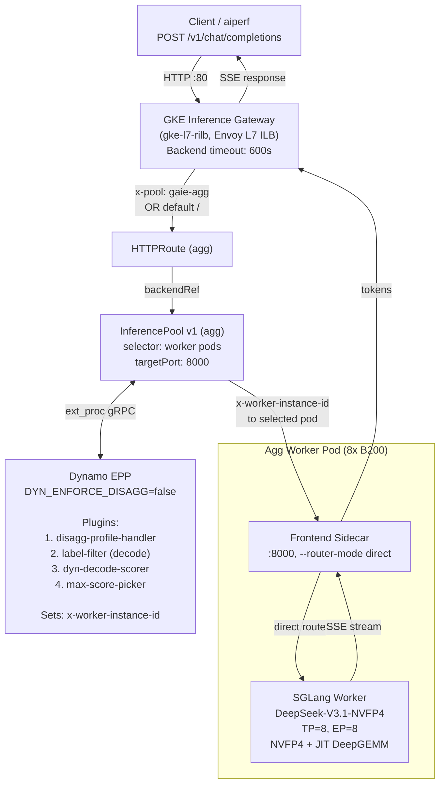
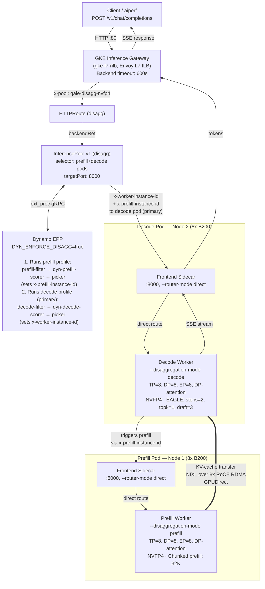

# DeepSeek-V3.1-NVFP4 GAIE deployment (v1 bundle)

Config directory: `deployments/nvfp4-gaie-v1/` (aggregated + disaggregated GAIE, Gateway routes, policies, benchmarks).

Disaggregated (1 Prefill + 1 Decode) deployment of **nvidia/DeepSeek-V3.1-NVFP4** using the
NVIDIA AI Dynamo platform with GAIE EPP scheduling, routed through the GKE Inference Gateway.

## Architecture

### Aggregated GAIE (single node, 8 GPUs)

All prefill and decode on the same 8-GPU worker. The GKE Inference Gateway routes requests through the Dynamo EPP for KV-cache-aware endpoint selection.



### Disaggregated GAIE (1P1D, 2 nodes, 16 GPUs)

Prefill and decode on separate GPU pools. The EPP selects both a prefill and a decode worker, but the **decode pod is the primary target** — the Gateway sends the request to decode, and the decode sidecar coordinates with prefill internally. KV cache transfers between nodes over NIXL/RoCE RDMA.



### Component Summary

| Component | Nodes | GPUs    | Role                                                             |
| --------- | ----- | ------- | ---------------------------------------------------------------- |
| Prefill   | 1     | 8x B200 | Prompt processing (DP=8, EP=8, TP=8)                             |
| Decode    | 1     | 8x B200 | Token generation (DP=8, EP=8, TP=8) + EAGLE speculative decoding |
| EPP       | 1     | —       | Endpoint Picker (disagg-aware prefill/decode scoring)            |

**Disagg total: 16 GPUs across 2 nodes**, interconnected via 8x RoCE RDMA interfaces (mlx5_0..mlx5_7)
for KV cache transfer using NIXL. **Agg total: 8 GPUs on 1 node.**

### Key Optimizations

- **NVFP4 quantization** (`--quantization modelopt_fp4`) — 4-bit floating-point weights
- **JIT DeepGEMM** — dynamically compiled GEMM kernels for varying batch sizes
- **EAGLE speculative decoding** — `num-steps=2, eagle-topk=1, num-draft-tokens=3`
- **CUDA graphs** on decode — `--cuda-graph-max-bs 512` for reduced kernel launch overhead
- **FlashInfer allreduce fusion** — fused communication for expert parallelism
- **Disaggregated KV transfer** via NIXL over UCX/RDMA (RoCE)

## Files


| File                         | Description                                                                 |
| ---------------------------- | --------------------------------------------------------------------------- |
| `dgd-disagg-gaie-nvfp4.yaml` | DynamoGraphDeployment — NVFP4 disagg (prefill, decode, EPP)                   |
| `dgd-agg-gaie.yaml`          | DynamoGraphDeployment — NVFP4 aggregated GAIE (EPP + worker sidecar)         |
| `dgd-agg-native.yaml`        | DynamoGraphDeployment — NVFP4 aggregated native (no Gateway / no EPP)        |
| `httproute.yaml`             | HTTPRoute — `x-pool: gaie-agg`, `gaie-disagg-nvfp4`, default → agg pool     |
| `health-check-policy.yaml`   | HealthCheckPolicy — `:8000/health` for **agg** and **disagg** pool Services |
| `backend-policy.yaml`        | GCPBackendPolicy — 600s timeout for **agg** and **disagg** pool Services    |
| `benchmark-aiperf.sh`        | Parameterized `aiperf profile` (edit `CONCURRENCY`, `X_POOL`, `GATEWAY_IP`) |


## Prerequisites

### 1. GKE Cluster

- Nodes with **NVIDIA B200** GPUs (`nvidia.com/gpu.product: NVIDIA-B200`)
- **RDMA multi-networking** configured: 8x RoCE NICs per node (`networking.gke.io.networks/rdma-0` through `rdma-7`)
- **GKE Inference Gateway** enabled (`gke-l7-rilb` GatewayClass)
- Node pool capacity: 1 node for aggregated, 2 nodes for disaggregated 1P1D

### 2. Dynamo Platform 1.0.0 (Operator, Grove, KAI Scheduler)

```bash
kubectl create namespace dynamo-system --dry-run=client -o yaml | kubectl apply -f -

helm upgrade --install dynamo-platform \
  oci://helm.ngc.nvidia.com/nvidia/ai-dynamo/charts/dynamo-platform \
  --version 1.0.0 \
  -n dynamo-system \
  --set global.kai-scheduler.enabled=true \
  --set global.grove.enabled=true
```

> **Note**: If Grove/KAI causes scheduling issues, use `--set global.grove.enabled=false` and the default Kubernetes scheduler.

### 3. GKE Inference Gateway

Create the Inference Gateway resource before deploying the HTTPRoute and policies. The `gke-l7-rilb` GatewayClass must already be available on your cluster (enabled by default on GKE clusters with the Gateway API).

```bash
kubectl apply -f - <<'EOF'
apiVersion: gateway.networking.k8s.io/v1
kind: Gateway
metadata:
  name: inference-gateway
  namespace: dynamo-system
spec:
  gatewayClassName: gke-l7-rilb
  listeners:
    - name: http
      protocol: HTTP
      port: 80
EOF
```

Verify the Gateway has an IP assigned:

```bash
kubectl get gateway inference-gateway -n dynamo-system -o jsonpath='{.status.addresses[0].value}'
```

### 4. Model Storage (PVC + HF Token)

```bash
kubectl create secret generic hf-token-secret \
  --from-literal=HF_TOKEN=<your-token> \
  -n dynamo-system --dry-run=client -o yaml | kubectl apply -f -
```

The PVC `deepseek-v31-model-rwx` (ReadWriteMany) must exist in `dynamo-system` with the NVFP4 model pre-downloaded. The worker will download from [nvidia/DeepSeek-V3.1-NVFP4](https://huggingface.co/nvidia/DeepSeek-V3.1-NVFP4) on first boot if not cached, but this adds significant time to startup.

### 5. Custom EPP Image

The GAIE DGDs reference a custom Dynamo EPP image at `REGION-docker.pkg.dev/PROJECT_ID/REPO_NAME/dynamo-epp:latest`. You must build and push this image to your own Artifact Registry before deploying.

- The EPP Dockerfile and Makefile live at [`deploy/inference-gateway/epp/`](https://github.com/ai-dynamo/dynamo/tree/main/deploy/inference-gateway/epp) in the Dynamo repo. Follow the build instructions there to produce the `dynamo-epp` image, then tag and push it to your Artifact Registry.

### 6. Images

| Component | Image |
|---|---|
| SGLang Runtime (NVFP4) | `nvcr.io/nvidia/ai-dynamo/sglang-runtime:1.0.0` |
| Dynamo EPP | `REGION-docker.pkg.dev/PROJECT_ID/REPO_NAME/dynamo-epp:latest` (custom build) |
| Model | `nvidia/DeepSeek-V3.1-NVFP4` ([HuggingFace](https://huggingface.co/nvidia/DeepSeek-V3.1-NVFP4)) |

---

## Deployment Steps

### Aggregated GAIE (single node, 8 GPUs)

#### 1. Deploy the DynamoGraphDeployment

> **Before applying**: Update the EPP image in `dgd-agg-gaie.yaml` — replace `REGION-docker.pkg.dev/PROJECT_ID/REPO_NAME/dynamo-epp:latest` with your actual Artifact Registry path (see [prerequisite 5](#5-custom-epp-image)).

```bash
kubectl apply -f dgd-agg-gaie.yaml -n dynamo-system
```

Wait for all pods to become ready (~35-45 min for model loading):

```bash
kubectl get pods -n dynamo-system -l nvidia.com/dynamo-graph-deployment-name=sglang-dsv31-nvfp4-agg-gaie -w
```

Expected: 1 EPP pod + 1 Worker pod (both Running/Ready).

#### 2. Test (before Gateway)

```bash
kubectl run curl-test --rm -it --restart=Never --image=curlimages/curl -- \
  curl -s http://sglang-dsv31-nvfp4-agg-gaie-frontend.dynamo-system.svc.cluster.local:8000/v1/chat/completions \
  -H "Content-Type: application/json" \
  -d '{"model":"nvidia/DeepSeek-V3.1-NVFP4","messages":[{"role":"user","content":"Hello"}],"max_tokens":50}'
```

---

### Disaggregated GAIE 1P1D (2 nodes, 16 GPUs)

#### 1. Deploy the DynamoGraphDeployment

> **Before applying**: Update the EPP image in `dgd-disagg-gaie-nvfp4.yaml` — replace `REGION-docker.pkg.dev/PROJECT_ID/REPO_NAME/dynamo-epp:latest` with your actual Artifact Registry path (see [prerequisite 5](#5-custom-epp-image)).

```bash
kubectl apply -f dgd-disagg-gaie-nvfp4.yaml -n dynamo-system
```

Wait for all pods to become ready (~35-45 min for model loading):

```bash
kubectl get pods -n dynamo-system -l nvidia.com/dynamo-graph-deployment-name=sglang-dsv31-nvfp4-disagg-gaie -w
```

Expected: 1 EPP pod + 1 Prefill worker + 1 Decode worker (all Running/Ready).

#### 2. Test (before Gateway)

```bash
kubectl run curl-test --rm -it --restart=Never --image=curlimages/curl -- \
  curl -s http://sglang-dsv31-nvfp4-disagg-gaie-frontend.dynamo-system.svc.cluster.local:8000/v1/chat/completions \
  -H "Content-Type: application/json" \
  -d '{"model":"nvidia/DeepSeek-V3.1-NVFP4","messages":[{"role":"user","content":"Hello"}],"max_tokens":50}'
```


---

### Gateway Setup (applies to both Agg and Disagg)

After deploying either Option A or B above, apply the Gateway resources:

#### 1. Identify the auto-generated pool-ips Service names

Each InferencePool gets a headless `*-pool-ips-<hash>` Service. Both
`health-check-policy.yaml` and `backend-policy.yaml` must reference the **current**
names:

```bash
kubectl get svc -n dynamo-system | grep -E 'nvfp4-agg-gaie-pool-ips|nvfp4-disagg-gaie-pool-ips'
```

Example:

```
sglang-dsv31-nvfp4-agg-gaie-pool-ips-e00ef715      ClusterIP   None   <none>   54321/TCP   2h
sglang-dsv31-nvfp4-disagg-gaie-pool-ips-c01ab801   ClusterIP   None   <none>   54321/TCP   2h
```

If a hash differs from the YAML, update **both** `targetRef.name` entries for that pool
in `health-check-policy.yaml` and `backend-policy.yaml` before applying.

#### 2. Apply the HTTPRoute

```bash
kubectl apply -f httproute.yaml -n dynamo-system
```

#### 3. Apply the HealthCheckPolicy

```bash
kubectl apply -f health-check-policy.yaml -n dynamo-system
```

#### 4. Apply the GCPBackendPolicy (timeout fix)

```bash
kubectl apply -f backend-policy.yaml -n dynamo-system
```

Verify both policies attached:

```bash
kubectl get gcpbackendpolicy -n dynamo-system
for p in nvfp4-agg-gaie-backend-policy nvfp4-disagg-gaie-backend-policy; do
  kubectl get gcpbackendpolicy "$p" -n dynamo-system -o jsonpath='{.metadata.name}: {.status.conditions[0].reason} {.status.conditions[0].status}{"\n"}'
done
```

You should see `Attached` / `True` for each.

## Fixing the 504 Gateway Timeout (Backend Service Timeout)

### The Problem

By default, GKE's backend service timeout is **30 seconds**. LLM inference requests —
especially at high concurrency or with long output sequences — regularly exceed this.
When they do, the GKE load balancer terminates the connection and returns a
**504 Gateway Timeout**, even though the backend is still processing normally.

Symptoms:

- `aiperf` or `curl` requests fail with HTTP 504 after exactly 30s
- Backend pod logs show the request was still being processed (no errors)
- The issue is more pronounced at higher concurrency or with streaming responses

### The Fix

The `GCPBackendPolicy` resource lets you override the backend service timeout at the
Kubernetes level, without going through the GCP Console.

The repo ships **two** `GCPBackendPolicy` objects (one per pool); see `backend-policy.yaml`.
Example `targetRef` for the disaggregated pool:

```yaml
apiVersion: networking.gke.io/v1
kind: GCPBackendPolicy
metadata:
  name: nvfp4-disagg-gaie-backend-policy
  namespace: dynamo-system
spec:
  default:
    timeoutSec: 600          # 10 minutes (up from default 30s)
    connectionDraining:
      drainingTimeoutSec: 600  # graceful drain on pod termination
  targetRef:
    group: ""
    kind: Service
    name: sglang-dsv31-nvfp4-disagg-gaie-pool-ips-c01ab801  # <-- auto-generated pool-ips Service
```

**Key details:**

- The `targetRef` must point to the **headless pool-ips Service** created by the InferencePool
controller, not the EPP service or the worker services
- `timeoutSec: 600` sets the backend service timeout to 10 minutes
- `connectionDraining.drainingTimeoutSec: 600` allows in-flight requests to finish during
rolling updates or pod eviction
- After applying, it takes ~1-2 min for the GKE load balancer to reconcile the change
- Verify with: `kubectl get gcpbackendpolicy -n dynamo-system` — status should show `Attached`

### How to find the right Service name

The pool-ips Service name includes a hash suffix that changes if the InferencePool is
recreated. Always verify before applying:

```bash
kubectl get svc -n dynamo-system | grep -E 'nvfp4-.*-pool-ips'
```

## Benchmarking

The repo includes **`benchmark-aiperf.sh`** — same flags as below, with **`CONCURRENCY`**, **`X_POOL`**, and **`GATEWAY_IP`** called out at the top of the script so you can sweep load without editing long command lines.

From the `perf-gaie-fp8` pod (or any pod with `aiperf`):

```bash
GATEWAY_IP=""  # kubectl get gateway inference-gateway -n dynamo-system -o jsonpath='{.status.addresses[0].value}'

aiperf profile \
  --url "http://${GATEWAY_IP}" \
  --header 'x-pool:gaie-disagg-nvfp4' \
  --artifact-dir '/workspace/results/nvfp4/gaie-disagg-nvfp4-c500' \
  --model 'nvidia/DeepSeek-V3.1-NVFP4' \
  --tokenizer '/opt/model-cache/hub/models--nvidia--DeepSeek-V3.1-NVFP4/snapshots/68b4a17cce1482e94030ca00dacda3dec4c6359d' \
  --endpoint-type 'chat' --endpoint '/v1/chat/completions' --streaming \
  --synthetic-input-tokens-mean 1000 --synthetic-input-tokens-stddev 0 \
  --output-tokens-mean 250 --output-tokens-stddev 0 \
  --extra-inputs 'max_tokens:250' --extra-inputs 'min_tokens:250' \
  --extra-inputs 'ignore_eos:true' --extra-inputs 'repetition_penalty:1.0' \
  --extra-inputs 'temperature:0.0' \
  --use-server-token-count \
  --concurrency 500 --request-count 500 --warmup-request-count 20 \
  --num-dataset-entries 12800 --random-seed 100 --workers-max 50 \
  --record-processors 16
```


